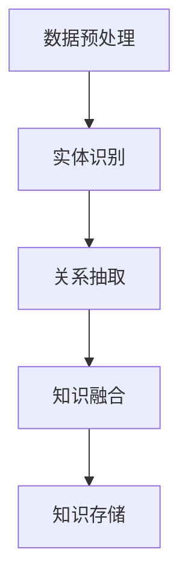
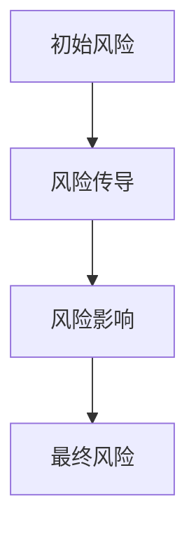
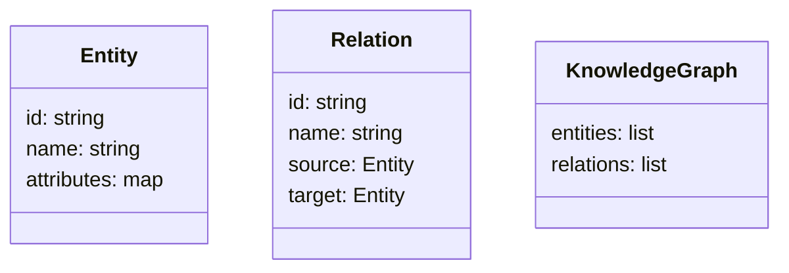
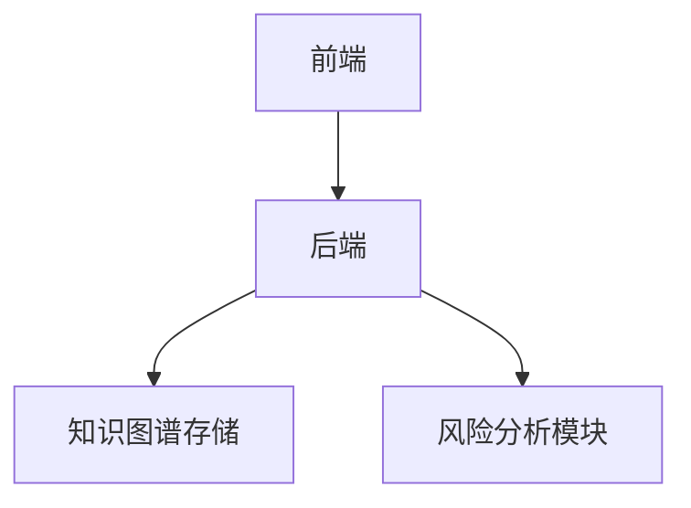
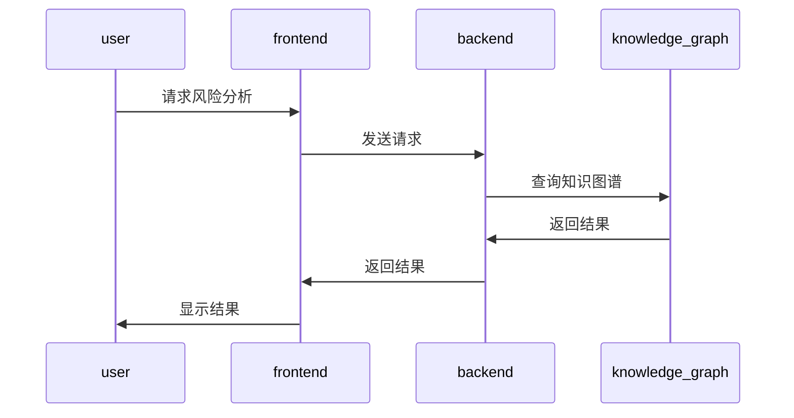

                 


# 构建基于知识图谱的金融风险传导模拟器

> 关键词：知识图谱、金融风险、风险传导、模拟器、风险管理

> 摘要：本文详细介绍了如何利用知识图谱构建金融风险传导模拟器，从背景介绍到系统实现，全面解析了金融风险传导机制及其模拟器的设计与实现。通过构建知识图谱，结合算法推理，实现金融风险的预测和传播模拟，为金融风险管理提供有力工具。

---

# 第一章: 背景介绍

## 1.1 问题背景

### 1.1.1 金融风险传导的定义与重要性

金融风险传导是指金融系统中的某一风险因素通过市场、机构或产品传递到其他相关主体的过程。这种传导机制是金融系统复杂性的重要体现，也是金融危机发生和扩散的主要途径。

金融风险传导的重要性体现在以下几个方面：
- **风险管理**：通过识别和分析风险传导路径，金融机构可以更好地管理和规避潜在风险。
- **政策制定**：政府和监管机构可以通过模拟风险传导机制，制定更有效的金融监管政策。
- **市场稳定性**：了解风险传导机制有助于维护金融市场的稳定性和抗风险能力。

### 1.1.2 知识图谱在金融领域的应用潜力

知识图谱是一种以图结构形式表示知识的工具，能够有效地表达实体之间的关系和语义信息。在金融领域，知识图谱可以用于以下方面：
- **风险识别**：通过分析实体之间的关系，识别潜在的风险点。
- **风险传播路径分析**：通过知识图谱的推理能力，分析风险在金融系统中的传播路径。
- **智能决策支持**：基于知识图谱构建的分析模型，为金融决策提供支持。

### 1.1.3 当前金融风险管理的痛点与挑战

当前金融风险管理面临以下痛点：
- **数据孤岛**：金融机构之间的数据分散，难以形成全局性的风险分析。
- **复杂性高**：金融系统的复杂性使得风险传导路径难以预测。
- **实时性要求高**：金融市场变化迅速，需要实时分析和应对。

## 1.2 问题描述

### 1.2.1 金融风险传导的复杂性

金融系统中的风险传导涉及多个层面，包括市场风险、信用风险、操作风险等。不同类型的金融风险之间存在相互影响，增加了风险传导的复杂性。

### 1.2.2 知识图谱在金融风险分析中的优势

知识图谱具有以下优势：
- **语义理解**：能够理解实体之间的语义关系，提高风险分析的准确性。
- **可扩展性**：知识图谱可以随着数据的增加而不断扩展，适应金融市场的变化。
- **推理能力**：通过知识图谱的推理能力，可以发现潜在的风险传导路径。

### 1.2.3 构建金融风险传导模拟器的目标与意义

构建金融风险传导模拟器的目标是：
- 提供一种可视化工具，帮助用户理解风险传导机制。
- 提供风险预测和传播模拟的功能，支持金融机构进行风险管理。

模拟器的意义在于：
- 通过模拟风险传导过程，帮助金融机构制定应对策略。
- 通过知识图谱的可扩展性，适应金融市场变化。

## 1.3 问题解决思路

### 1.3.1 知识图谱的核心作用

知识图谱在金融风险传导模拟器中的核心作用体现在：
- 提供数据整合和分析的工具。
- 提供风险传导路径的推理能力。
- 提供可视化界面，帮助用户理解风险传导机制。

### 1.3.2 金融风险传导模拟器的设计理念

模拟器的设计理念包括：
- **模块化设计**：将模拟器划分为数据采集、知识构建、风险分析和可视化展示等模块。
- **实时更新**：能够实时更新数据和风险分析结果。
- **用户友好**：提供直观的用户界面，方便用户操作。

### 1.3.3 技术实现路径与方法论

技术实现路径包括：
1. 数据采集与预处理。
2. 知识图谱构建。
3. 风险传导路径分析算法设计。
4. 模拟器界面设计与实现。

方法论包括：
- **数据驱动**：基于数据进行知识图谱构建和风险分析。
- **模型驱动**：利用知识图谱的推理能力进行风险传导路径分析。

## 1.4 问题的边界与外延

### 1.4.1 金融风险传导的边界条件

金融风险传导的边界条件包括：
- **时间范围**：模拟器的时间范围通常为短期和中期。
- **空间范围**：模拟的范围可以是局部市场或整个金融系统。

### 1.4.2 知识图谱构建的范围与限制

知识图谱构建的范围包括：
- 金融机构、市场、产品等实体的识别和关系抽取。

限制包括：
- 数据质量影响知识图谱的准确性。
- 知识图谱构建需要大量的人力和计算资源。

### 1.4.3 模拟器的适用场景与局限性

模拟器适用于：
- 金融机构的风险管理。
- 政府的金融监管政策制定。

局限性：
- 模拟结果依赖于数据质量和模型准确性。
- 模拟器的实时性可能受到计算资源的限制。

## 1.5 概念结构与核心要素组成

### 1.5.1 知识图谱的核心要素

知识图谱的核心要素包括：
- **实体**：金融系统中的各种实体，如金融机构、市场、产品等。
- **关系**：实体之间的关系，如控股、交易、依赖等。
- **属性**：实体的属性，如市场规模、信用评级等。

### 1.5.2 金融风险传导的关键因素

金融风险传导的关键因素包括：
- **连锁反应**：某一风险事件引发连锁反应，导致系统性风险。
- **传染路径**：风险在不同实体之间的传播路径。

### 1.5.3 模拟器的系统架构与模块划分

模拟器的系统架构包括：
1. 数据采集模块：负责数据的采集和预处理。
2. 知识图谱构建模块：负责构建金融知识图谱。
3. 风险分析模块：负责风险传导路径的分析和模拟。
4. 可视化模块：负责模拟结果的展示。

---

# 第二章: 核心概念与联系

## 2.1 知识图谱的定义与特点

### 2.1.1 知识图谱的定义

知识图谱是一种以图结构形式表示知识的工具，能够表达实体之间的关系和语义信息。

### 2.1.2 知识图谱的核心特点

知识图谱具有以下特点：
- **结构化**：以图结构形式表示知识，便于计算机理解和推理。
- **语义化**：能够表达实体之间的语义关系。
- **可扩展性**：能够随着数据的增加而不断扩展。

### 2.1.3 知识图谱与传统数据库的区别

传统数据库主要是存储数据，而知识图谱不仅存储数据，还表达数据之间的语义关系。知识图谱更注重数据的关联性和可推理性。

## 2.2 知识图谱的构建过程

### 2.2.1 数据收集与预处理

数据收集包括从多种来源获取数据，如新闻、报告、交易数据等。预处理包括数据清洗、去重和格式统一。

### 2.2.2 实体识别与关系抽取

实体识别是通过自然语言处理技术从文本中提取实体。关系抽取是通过模式匹配或机器学习方法从文本中抽取实体之间的关系。

### 2.2.3 知识图谱的存储与管理

知识图谱通常存储在图数据库中，如Neo4j。存储结构包括节点和边，节点表示实体，边表示实体之间的关系。

## 2.3 知识图谱的表示与推理

### 2.3.1 知识图谱的表示方法

知识图谱的表示方法包括：
- **三元组表示**：(主语，谓词，宾语)。
- **图结构表示**：通过节点和边表示实体和关系。

### 2.3.2 知识推理的基本原理

知识推理是基于知识图谱中的已有知识，推导出新的知识。推理方法包括：
- **单步推理**：基于已有的关系进行直接推理。
- **多步推理**：通过多次推理得到最终结论。

### 2.3.3 知识图谱的可扩展性与可解释性

知识图谱的可扩展性体现在能够随着数据的增加而不断扩展。可解释性体现在推理过程清晰，结果易于解释。

## 2.4 知识图谱在金融领域的应用

### 2.4.1 金融知识图谱的构建案例

案例：构建一个包含金融机构、市场和产品的金融知识图谱。例如，某银行控股某公司，某公司发行某种金融产品。

### 2.4.2 知识图谱在风险评估中的应用

通过知识图谱可以分析某金融机构的风险传导路径，评估其对整个金融系统的影响。

### 2.4.3 知识图谱在金融决策中的作用

知识图谱可以为金融机构的决策提供支持，如投资决策、风险管理等。

---

# 第三章: 算法原理讲解

## 3.1 知识图谱构建算法

### 3.1.1 实体识别算法

常用的实体识别算法包括：
- **基于规则的算法**：通过预定义的规则进行实体识别。
- **基于机器学习的算法**：如CRF、LSTM等。

### 3.1.2 关系抽取算法

关系抽取算法包括：
- **基于模式匹配的算法**：通过预定义的模式进行关系抽取。
- **基于机器学习的算法**：如SVM、CRF等。

### 3.1.3 知识融合算法

知识融合算法包括：
- **冲突检测与解决**：检测知识图谱中的冲突，并进行解决。
- **实体对齐**：将不同来源的实体进行对齐。

### 3.1.4 算法流程图



### 3.1.5 算法实现代码

```python
def entity_recognition(text):
    # 实体识别算法实现
    pass

def relation_extraction(text):
    # 关系抽取算法实现
    pass
```

## 3.2 风险传导路径分析算法

### 3.2.1 风险传导路径分析的数学模型

风险传导路径分析的数学模型可以表示为图结构，其中节点表示金融机构，边表示风险传导关系。

### 3.2.2 风险传导路径分析的算法流程



### 3.2.3 算法实现代码

```python
def risk_transmission_analysis(risk_graph):
    # 风险传导路径分析算法实现
    pass
```

## 3.3 算法的数学模型和公式

### 3.3.1 知识图谱的表示模型

知识图谱的表示模型可以用以下公式表示：
$$
E = \{ (e_i, r_j, e_k) | e_i, e_k \in Entities, r_j \in Relations \}
$$

### 3.3.2 风险传导路径分析的公式

风险传导路径分析的公式可以用以下方式表示：
$$
R_i \rightarrow R_j \rightarrow R_k
$$

---

# 第四章: 系统分析与架构设计方案

## 4.1 问题场景介绍

### 4.1.1 系统目标

系统目标是构建一个基于知识图谱的金融风险传导模拟器，能够模拟金融风险的传播路径，并提供风险分析和决策支持。

### 4.1.2 系统功能需求

系统功能需求包括：
- 数据采集与预处理。
- 知识图谱构建。
- 风险传导路径分析。
- 模拟结果可视化。

## 4.2 项目介绍

### 4.2.1 项目目标

项目目标是开发一个金融风险传导模拟器，帮助金融机构进行风险管理。

### 4.2.2 项目范围

项目范围包括：
- 数据采集与预处理。
- 知识图谱构建。
- 风险传导路径分析。
- 模拟结果可视化。

## 4.3 系统功能设计

### 4.3.1 领域模型

领域模型可以用以下Mermaid类图表示：



### 4.3.2 系统架构设计

系统架构可以用以下Mermaid架构图表示：



### 4.3.3 系统接口设计

系统接口设计包括：
- 数据接口：负责数据的导入和导出。
- API接口：提供给其他系统调用的接口。

### 4.3.4 系统交互设计

系统交互可以用以下Mermaid序列图表示：



---

# 第五章: 项目实战

## 5.1 环境安装

### 5.1.1 系统环境

推荐使用Python 3.8及以上版本。

### 5.1.2 工具安装

安装必要的工具和库，如：
- `neo4j`：图数据库。
- `networkx`：图网络库。
- `py2neo`：Neo4j的Python驱动。

## 5.2 系统核心实现

### 5.2.1 知识图谱构建

```python
from py2neo import Graph, Node, Relationship

# 连接知识图谱数据库
graph = Graph("http://localhost:7474", auth=("neo4j", "password"))

# 创建节点
node1 = Node("Entity", name="Bank A")
node2 = Node("Entity", name="Customer B")
# 创建关系
relation = Relationship(node1, "loans_to", node2)

# 将节点和关系添加到图数据库
graph.create(node1)
graph.create(node2)
graph.create(relation)
```

### 5.2.2 风险传导路径分析

```python
def find_transmission_paths(source, target):
    # 查找从source到target的风险传导路径
    pass

# 示例使用
source = "Bank A"
target = "Customer B"
paths = find_transmission_paths(source, target)
print(paths)
```

## 5.3 代码应用解读与分析

### 5.3.1 知识图谱构建代码解读

上述代码展示了如何使用`py2neo`库连接Neo4j数据库，并创建节点和关系。节点表示实体，关系表示实体之间的关系。

### 5.3.2 风险传导路径分析代码解读

上述代码展示了如何查找从源节点到目标节点的风险传导路径。具体实现需要根据实际需求进行扩展。

## 5.4 实际案例分析

### 5.4.1 案例背景

假设某银行（Bank A）向某客户（Customer B）发放了一笔贷款，但由于客户B的财务状况恶化，这笔贷款可能无法偿还，进而影响银行的资产质量。

### 5.4.2 案例分析

通过知识图谱可以分析这笔贷款对银行和其他相关机构的影响，模拟风险传导路径。

### 5.4.3 案例结果

模拟结果可能显示，银行A的资产质量下降，可能影响其信用评级，进而影响其融资成本。

## 5.5 项目小结

通过本项目，我们成功构建了一个基于知识图谱的金融风险传导模拟器，能够模拟金融风险的传播路径，并提供风险分析和决策支持。

---

# 第六章: 总结与展望

## 6.1 总结

### 6.1.1 核心成果

本文构建了一个基于知识图谱的金融风险传导模拟器，能够模拟金融风险的传播路径，并提供风险分析和决策支持。

### 6.1.2 经验与教训

通过本项目，我们积累了以下经验：
- 数据质量对知识图谱的准确性至关重要。
- 知识图谱的构建需要大量的人力和计算资源。

### 6.1.3 项目价值

本项目为金融机构提供了一种新的风险管理工具，能够帮助金融机构更好地应对金融风险。

## 6.2 未来展望

### 6.2.1 知识图谱的优化与扩展

未来可以在以下方面进行优化和扩展：
- 提高知识图谱的构建效率。
- 增强知识图谱的推理能力。

### 6.2.2 模拟器的改进方向

模拟器的改进方向包括：
- 提高模拟的实时性。
- 增强模拟器的可解释性。

### 6.2.3 研究的扩展与延伸

未来可以在以下方面进行研究：
- 研究知识图谱在其他金融领域的应用。
- 探索新的风险传导分析方法。

---

# 作者：AI天才研究院/AI Genius Institute & 禅与计算机程序设计艺术 /Zen And The Art of Computer Programming

