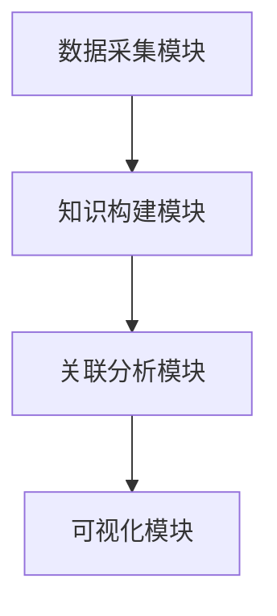

                 


# 构建基于知识图谱的金融风险关联分析系统

> **关键词**：知识图谱，金融风险，关联分析，系统架构，算法原理

> **摘要**：本文详细介绍了如何构建基于知识图谱的金融风险关联分析系统。首先，我们探讨了知识图谱的基本概念及其在金融领域的应用潜力。接着，我们分析了构建知识图谱的核心算法与实现方法，包括实体识别与关系抽取的算法原理。然后，我们详细设计了系统的架构，并通过具体的项目实战展示了系统的实现过程。最后，我们总结了系统的构建过程，并展望了未来的发展方向。

---

# 第一部分: 知识图谱与金融风险关联分析的背景介绍

## 第1章: 知识图谱的基本概念与构建方法

### 1.1 知识图谱的定义与特点

知识图谱是一种以图结构形式表示知识的语义网络，由节点（实体）和边（关系）组成。其核心特点包括：

- **语义性**：节点和边具有明确的语义含义。
- **结构化**：数据以结构化的形式存储，便于计算机理解和推理。
- **动态性**：能够实时更新和扩展。

### 1.2 金融风险关联分析的背景与需求

金融市场的复杂性使得传统的单点风险管理难以应对系统性风险。知识图谱能够通过关联分析，发现隐藏的风险传播路径，帮助机构更好地识别和管理风险。

---

## 第2章: 知识图谱构建的理论基础

### 2.1 知识图谱的构建流程

知识图谱的构建流程可以分为以下步骤：

1. **数据采集与预处理**：从多种数据源（如新闻、财报、公告等）中获取数据，并进行清洗和标注。
2. **实体识别与抽取**：使用自然语言处理技术从文本中提取实体。
3. **关系抽取与构建**：识别实体之间的关系，并构建图结构。
4. **知识图谱存储与管理**：将构建的知识图谱存储在数据库中，并进行版本控制。

---

### 2.2 知识图谱的表示方法

知识图谱的表示方法包括：

- **实体表示**：使用节点表示实体，如公司、行业、金融产品等。
- **关系表示**：使用边表示实体之间的关系，如“投资”、“关联”等。
- **知识图谱的表示模型**：常用的模型包括基于图嵌入的方法（如Word2Vec）和基于概率图模型的方法。

---

## 第3章: 知识图谱在金融领域的应用

### 3.1 金融领域的知识图谱构建

在金融领域，知识图谱的构建需要考虑以下方面：

- **金融实体识别**：识别公司、行业、金融产品等实体。
- **金融关系抽取**：识别公司之间的投资关系、关联交易等。
- **金融知识图谱的构建流程**：从数据采集到知识图谱构建的完整流程。

---

### 3.2 知识图谱在金融风险中的应用

知识图谱在金融风险中的应用包括：

- **风险传播分析**：通过图结构分析风险在不同实体之间的传播路径。
- **风险因子关联分析**：识别影响金融市场的关键风险因子及其关联关系。
- **风险预警与预测**：基于知识图谱的关联分析，预测潜在风险。

---

# 第二部分: 知识图谱关联分析的核心算法与实现

## 第4章: 知识图谱关联分析的算法原理

### 4.1 实体识别与关系抽取算法

常用算法包括：

- **实体识别**：正则表达式、条件随机场（CRF）。
- **关系抽取**：基于规则的抽取、基于模式的抽取、基于深度学习的抽取（如RNN、LSTM）。

### 4.2 知识图谱关联分析的算法实现

常用算法包括：

- **基于图的关联分析算法**：广度优先搜索（BFS）、深度优先搜索（DFS）。
- **基于机器学习的关联分析算法**：聚类分析、关联规则挖掘。

---

## 第5章: 知识图谱关联分析的数学模型

### 5.1 知识图谱关联分析的基本模型

- **图论模型**：将知识图谱表示为图，使用图论方法分析关联性。
- **语义向量模型**：将实体表示为向量，计算向量之间的相似性。

---

### 5.2 知识图谱关联分析的数学公式

#### 5.2.1 基于余弦相似性的关联分析公式

$$
\text{similarity}(u, v) = \frac{\sum_{i=1}^{n} u_i v_i}{\sqrt{\sum_{i=1}^{n} u_i^2} \sqrt{\sum_{i=1}^{n} v_i^2}}
$$

#### 5.2.2 基于概率图模型的关联分析公式

$$
P(e_1, e_2) = \frac{N(e_1, e_2)}{N(e_1) + N(e_2) - N(e_1, e_2)}
$$

其中，$N(e_1, e_2)$ 表示 $e_1$ 和 $e_2$ 同时出现的次数，$N(e_1)$ 和 $N(e_2)$ 分别表示 $e_1$ 和 $e_2$ 的出现次数。

---

# 第三部分: 系统架构与实现

## 第6章: 系统架构设计

### 6.1 系统功能设计

- **数据采集模块**：从多种数据源获取金融数据。
- **知识构建模块**：构建金融知识图谱。
- **关联分析模块**：分析风险关联关系。
- **可视化模块**：展示分析结果。

### 6.2 系统架构图



---

## 第7章: 项目实战

### 7.1 环境安装

- **Python 3.8+**
- **必要的库**：networkx、numpy、pandas、spaCy、pytorch。

### 7.2 核心代码实现

```python
import networkx as nx
from spacy.lang.zh import Chinese
import spacy

# 实体识别示例代码
nlp = spacy.load("zh_core_web_sm")
doc = nlp("某公司投资另一家公司。")
entities = [ent.text for ent in doc.ents]
print(entities)

# 关系抽取示例代码
def extract_relations(doc):
    relations = []
    for token in doc:
        if token.dep_ == "ROOT":
            relations.append(token.text)
    return relations

relations = extract_relations(doc)
print(relations)
```

---

## 第8章: 总结与展望

### 8.1 总结

本文详细介绍了基于知识图谱的金融风险关联分析系统的构建过程，包括知识图谱的基本概念、构建方法、关联分析算法以及系统架构设计。

### 8.2 展望

未来的研究方向包括：

- **动态知识图谱**：实时更新知识图谱，以应对金融市场变化。
- **多模态数据融合**：结合文本、图像等多种数据源，提升关联分析的准确性。

---

# 作者

**作者：AI天才研究院 & 禅与计算机程序设计艺术**

---

**感谢您的阅读！如果对内容有任何疑问或建议，请随时与我们联系。**

