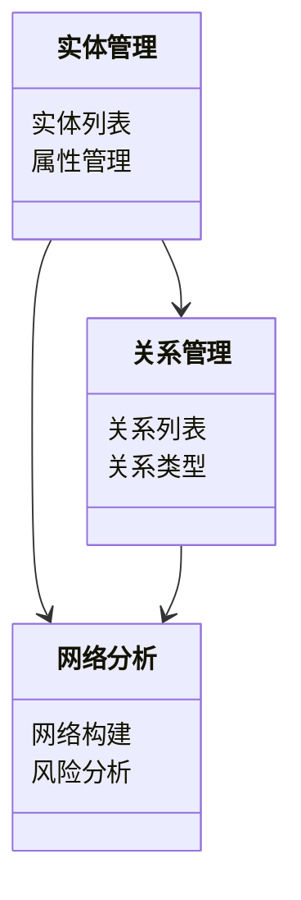

                 


# 构建基于知识图谱的金融风险关联网络

> 关键词：知识图谱、金融风险、关联网络、图嵌入、社会网络分析、风险评估

> 摘要：本文详细探讨了如何基于知识图谱构建金融风险关联网络，从理论基础到实际应用，系统性地分析了构建过程中的关键问题，包括知识图谱的核心概念、构建算法、系统架构设计以及实际案例分析。通过本文，读者可以全面理解如何利用知识图谱技术来提升金融风险分析的深度和广度。

---

# 第一部分: 知识图谱与金融风险关联网络概述

# 第1章: 知识图谱与金融风险关联网络的背景介绍

## 1.1 知识图谱的基本概念

### 1.1.1 知识图谱的定义

知识图谱是一种以图结构形式表示知识的语义网络，由节点（实体）和边（关系）组成，用于描述真实世界中的概念及其关系。例如，节点可以代表公司、人物、机构等，边可以表示“属于”、“影响”、“关联”等关系。

**知识图谱的特点：**
- **语义性**：通过关系描述实体之间的语义关联。
- **可扩展性**：支持大规模数据的构建和扩展。
- **动态性**：能够实时更新以反映最新信息。

### 1.1.2 知识图谱的核心要素

- **实体**：知识图谱的基本单元，可以是人、组织、事件等。
- **关系**：描述实体之间的关联，例如“公司A收购了公司B”。
- **属性**：描述实体的特征，例如“公司A的成立时间是1990年”。

### 1.1.3 知识图谱的构建流程

1. **数据采集**：从多种来源（如文本、数据库）获取数据。
2. **数据清洗**：去除重复和不一致的数据。
3. **实体识别与链接**：识别实体并建立关联。
4. **关系抽取**：从数据中提取实体间的关系。
5. **知识融合**：整合多源数据，消除冲突。
6. **知识存储**：将知识图谱存储在数据库中。

## 1.2 金融风险关联网络的概念

### 1.2.1 金融风险的基本定义

金融风险是指由于经济环境的变化或市场参与者的错误决策，导致金融机构或投资者蒙受损失的可能性。常见的金融风险包括市场风险、信用风险、操作风险等。

### 1.2.2 风险关联网络的定义

风险关联网络是一种通过图结构描述金融风险及其相互关系的模型。节点代表风险事件或实体，边表示风险之间的关联程度。

### 1.2.3 知识图谱在金融风险中的应用

知识图谱可以用于构建金融风险关联网络，通过分析实体之间的关系，发现潜在的风险传导路径，从而提前预警和应对风险。

## 1.3 问题背景与问题描述

### 1.3.1 传统金融风险分析的局限性

传统金融风险分析通常基于统计模型，难以捕捉复杂的关联关系，尤其是非线性关系。此外，数据孤岛问题严重，难以整合多源数据。

### 1.3.2 知识图谱在金融风险分析中的优势

知识图谱能够整合多源异构数据，构建全局性的关联网络，帮助发现潜在的风险链条和关键风险节点。

### 1.3.3 问题解决的思路与目标

通过构建金融风险关联网络，利用知识图谱的语义信息和关联关系，实现对金融风险的早期预警、风险传导路径分析以及风险影响评估。

---

# 第2章: 知识图谱的核心概念与原理

## 2.1 知识图谱的核心概念

### 2.1.1 实体与关系的定义

- **实体**：知识图谱中的基本单元，可以是人、组织、事件等。
- **关系**：描述实体之间的关联，例如“公司A收购了公司B”。

### 2.1.2 知识图谱的结构特征

知识图谱通常以图结构形式表示，节点代表实体，边代表关系，属性提供额外的信息描述。

### 2.1.3 知识图谱的存储与表示

知识图谱可以存储在图数据库（如Neo4j）中，使用RDF（资源描述框架）或JSON-LD等格式表示。

## 2.2 风险关联网络的构建原理

### 2.2.1 风险关联网络的构建流程

1. 数据采集：收集金融市场的相关数据，包括新闻、财报、交易数据等。
2. 实体识别：识别出相关的实体，如公司、投资者、行业等。
3. 关系抽取：提取实体之间的关系，如“公司A投资了公司B”。
4. 网络构建：将实体和关系构建为图结构，形成风险关联网络。

### 2.2.2 关联关系的表示方法

- **直接关系**：如“公司A收购了公司B”。
- **间接关系**：如“公司A的投资影响了公司C的股价”。

### 2.2.3 网络的特征提取与分析

通过图算法（如PageRank、Louvain算法）对网络进行分析，识别关键节点和风险传导路径。

---

# 第3章: 知识图谱构建算法原理

## 3.1 知识图谱构建算法

### 3.1.1 基于规则的构建算法

通过预定义的规则从文本中提取实体和关系，适用于领域知识明确的场景。

### 3.1.2 基于统计的构建算法

利用统计方法（如条件随机场）从文本中提取实体和关系，适用于领域知识不明确的场景。

### 3.1.3 基于深度学习的构建算法

使用神经网络（如BERT）进行实体识别和关系抽取，效果更准确。

---

# 第4章: 系统分析与架构设计

## 4.1 问题场景介绍

### 4.1.1 金融风险关联网络的应用场景

- **风险预警**：通过分析网络中的异常节点，提前发现潜在风险。
- **风险传播分析**：识别风险传导路径，评估风险影响范围。

## 4.2 系统功能设计

### 4.2.1 领域模型 Mermaid 类图



### 4.2.2 系统功能模块划分

- **数据采集模块**：负责从多种数据源采集数据。
- **知识构建模块**：负责实体识别、关系抽取和知识融合。
- **网络分析模块**：负责构建网络并进行风险分析。

---

# 第5章: 项目实战与案例分析

## 5.1 环境安装

- **Python版本**：3.8+
- **依赖库**：networkx、neo4j、py2neo

## 5.2 系统核心实现源代码

```python
from py2neo import Graph, Node, Relationship

# 连接知识图谱数据库
graph = Graph("http://localhost:7474", auth=("neo4j", "password"))

# 创建实体节点
company_a = Node("Company", name="Company A")
company_b = Node("Company", name="Company B")

# 创建关系
relationship = Relationship(company_a, "INVESTED_IN", company_b)

# 将关系添加到图中
graph.create(relationship)
```

---

# 第6章: 总结与展望

## 6.1 总结

通过构建基于知识图谱的金融风险关联网络，可以更全面地分析金融风险，发现潜在的风险链条和关键风险节点。

## 6.2 展望

未来，随着人工智能技术的不断发展，知识图谱在金融领域的应用将更加广泛，金融风险关联网络的构建也将更加智能化和自动化。

---

作者：AI天才研究院 & 禅与计算机程序设计艺术

