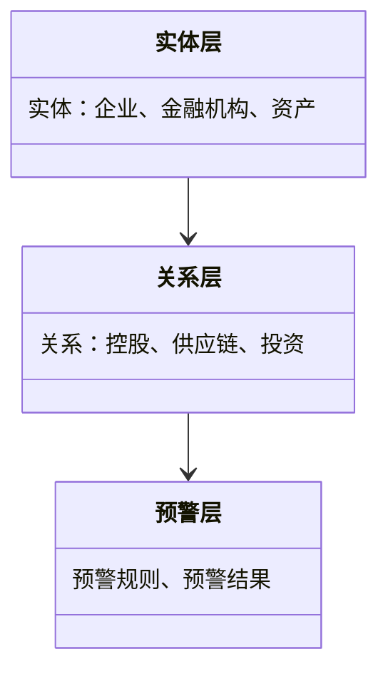
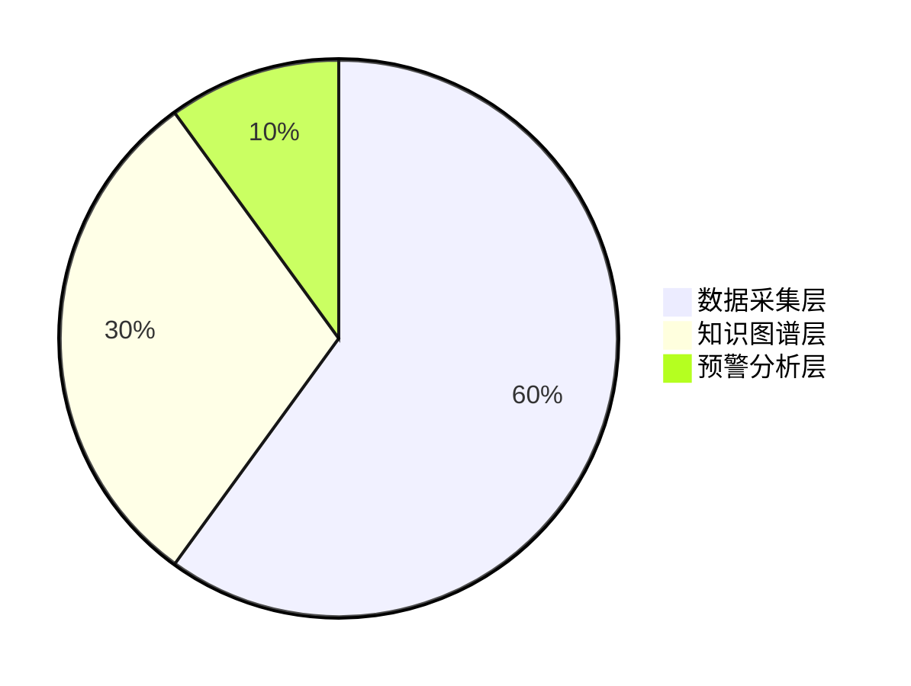
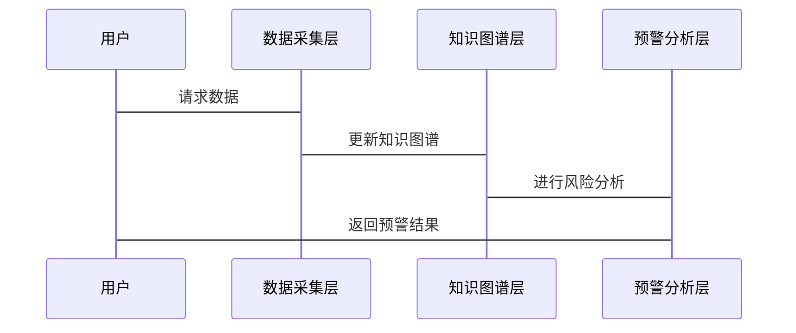

                 


# 构建基于知识图谱的金融风险关联网络动态预警系统

## 关键词：知识图谱、金融风险、关联网络、动态预警、系统架构

## 摘要：  
本文章详细探讨了如何利用知识图谱技术构建金融风险关联网络动态预警系统。文章从背景介绍、核心概念、算法原理、系统架构到项目实战，全面解析了系统的构建过程和实现方法。通过知识图谱的强大关联能力，结合动态更新机制，系统能够实时捕捉金融市场的风险变化，为金融机构提供及时有效的预警信息，从而提升风险管理能力。  

---

# 第一部分: 背景介绍

## 第1章: 问题背景与描述

### 1.1 金融风险的现状与挑战

#### 1.1.1 传统金融风险管理的局限性  
传统的金融风险管理方法依赖于统计模型和历史数据分析，存在以下问题：  
- **数据孤岛**：金融机构之间的数据孤立，难以全面分析跨机构的风险关联。  
- **静态分析**：传统模型多为静态分析，难以捕捉实时动态风险变化。  
- **关联性不足**：难以发现跨领域的复杂风险关联，例如供应链风险对金融市场的传导效应。  

#### 1.1.2 金融风险的复杂性与关联性  
金融市场的风险具有高度的复杂性和关联性，例如：  
- **多因素影响**：经济指标、政策变化、企业行为等多种因素共同作用于金融市场。  
- **网络效应**：一家机构的风险可能通过供应链、投资链迅速传导至整个金融体系。  
- **非线性关系**：风险之间的关联往往非线性，难以通过简单线性模型捕捉。  

#### 1.1.3 知识图谱在金融风险分析中的潜力  
知识图谱通过语义网络的方式，能够将金融市场的各种实体及其关系以结构化的方式表示，具备以下优势：  
- **语义关联**：能够发现隐藏的关联关系，例如企业之间的实际控制关系、供应链上下游关系等。  
- **动态更新**：支持实时更新，能够捕捉市场的最新变化。  
- **知识推理**：通过知识图谱的推理能力，可以发现潜在的风险传导路径。  

---

### 1.2 问题描述

#### 1.2.1 金融风险关联网络的定义  
金融风险关联网络是一种将金融市场中的实体（如企业、金融机构、资产等）及其风险关系以图结构表示的模型。节点代表实体，边表示实体之间的关联关系及风险传导路径。  

#### 1.2.2 动态预警系统的需求  
动态预警系统需要满足以下需求：  
- **实时性**：能够实时更新和分析数据，捕捉最新风险变化。  
- **动态性**：能够根据市场变化动态调整预警规则和阈值。  
- **可解释性**：预警结果需要具有可解释性，便于决策者理解。  

#### 1.2.3 知识图谱在动态预警中的应用  
知识图谱在动态预警中的应用包括：  
- **实时更新**：通过实时采集和处理金融数据，动态更新知识图谱。  
- **关联分析**：基于知识图谱的关联分析，发现潜在风险点。  
- **知识推理**：通过知识图谱推理，预测风险传导路径和影响范围。  

---

### 1.3 问题解决与边界

#### 1.3.1 知识图谱如何解决金融风险问题  
知识图谱通过以下方式解决金融风险问题：  
- **全局视角**：提供全局视角，发现跨机构、跨市场的风险关联。  
- **动态更新**：支持实时更新，捕捉最新风险变化。  
- **知识推理**：通过推理发现潜在风险，提前预警。  

#### 1.3.2 系统的边界与外延  
系统的边界包括：  
- **数据范围**：仅处理金融市场的数据，不涉及其他领域。  
- **预警范围**：仅提供风险预警，不直接参与风险应对决策。  

#### 1.3.3 核心要素与组成结构  
系统的组成结构包括：  
- **数据采集层**：负责采集金融市场数据。  
- **知识图谱构建层**：构建金融风险关联网络。  
- **预警分析层**：进行风险关联分析和预警。  
- **用户界面层**：提供预警信息展示和查询功能。  

---

## 第2章: 核心概念与联系

### 2.1 知识图谱的定义与特点

#### 2.1.1 知识图谱的定义  
知识图谱是一种以图结构形式表示知识的语义网络，由节点（实体）和边（关系）组成。  

#### 2.1.2 知识图谱的核心特点  
- **语义丰富**：能够表示实体之间的多种关系。  
- **动态更新**：支持实时更新，捕捉最新信息。  
- **可扩展性**：能够轻松扩展新的实体和关系。  

#### 2.1.3 知识图谱与传统数据库的对比  
| 特性           | 知识图谱                     | 传统数据库         |
|----------------|------------------------------|--------------------|
| 数据模型       | 图结构                      | 行列式             |
| 关系表示       | 支持多种关系类型             | 仅支持简单关系     |
| 查询效率       | 语义查询效率较低             | 基于索引高效       |

---

### 2.2 风险关联网络的构建

#### 2.2.1 风险关联网络的定义  
风险关联网络是金融风险关联网络的简称，表示金融市场中实体之间的风险关联关系。  

#### 2.2.2 网络构建的关键步骤  
1. **数据采集**：采集金融市场相关数据，包括企业信息、交易数据等。  
2. **实体识别**：识别数据中的实体（如企业、金融机构）。  
3. **关系抽取**：抽取实体之间的关系（如控股关系、供应链关系）。  
4. **图谱构建**：构建知识图谱，表示实体之间的关系。  

#### 2.2.3 网络的动态更新机制  
- **实时采集**：通过API实时采集金融市场数据。  
- **规则匹配**：基于预设规则自动更新关系。  
- **模型推理**：通过机器学习模型自动发现新关系。  

---

### 2.3 动态预警系统的原理

#### 2.3.1 动态预警的定义  
动态预警系统是一种能够实时更新和分析数据，动态调整预警规则和阈值的系统。  

#### 2.3.2 预警系统的组成部分  
- **数据采集层**：负责采集数据。  
- **知识图谱层**：构建和更新知识图谱。  
- **预警分析层**：进行风险关联分析和预警。  
- **用户界面层**：展示预警结果。  

#### 2.3.3 预警系统的动态更新机制  
- **实时分析**：实时分析数据，更新知识图谱。  
- **动态调整**：根据市场变化动态调整预警规则和阈值。  
- **反馈机制**：根据用户反馈优化预警模型。  

---

### 2.4 核心概念对比表

| 概念       | 定义                                                                 | 特点                                                                 |
|------------|----------------------------------------------------------------------|----------------------------------------------------------------------|
| 知识图谱    | 一种以图结构表示知识的语义网络                                       | 高效、动态、可扩展性好                                                 |
| 风险关联网络| 表示金融实体之间风险关系的网络结构                                   | 关联性、动态性、复杂性                    |

---

# 第三部分: 算法原理

## 第3章: 算法原理与实现

### 3.1 算法原理

#### 3.1.1 图嵌入算法  
图嵌入算法用于将图结构数据转换为低维向量表示，常用算法包括：  
- **Node2Vec**：通过随机游走生成节点表示。  
- **GraphSAGE**：基于归纳式学习的图嵌入方法。  

#### 3.1.2 关联规则挖掘  
关联规则挖掘用于发现实体之间的关联关系，常用算法包括：  
- **Apriori**：用于发现频繁项集。  
- **FP-Growth**：改进的关联规则挖掘算法。  

---

### 3.2 算法实现

#### 3.2.1 图嵌入算法的实现  
```python
import networkx as nx
from node2vec import Node2Vec

# 创建图
G = nx.Graph()
G.add_edges_from([(1,2), (2,3), (3,4)])

# 训练模型
model = Node2Vec(G, walks_per_node=10, context=5)
model.fit()
```

#### 3.2.2 关联规则挖掘的实现  
```python
from mlxtend.frequent_itemsets import apriori

# 示例数据
data = {
    "交易1": [1, 2, 3],
    "交易2": [2, 3, 4],
    "交易3": [3, 4, 5]
}

# 提取频繁项集
freq = apriori(data, min_support=0.5)
```

---

### 3.3 算法优缺点分析

#### 3.3.1 图嵌入算法的优点  
- **高效性**：能够高效处理大规模图数据。  
- **可解释性**：节点向量具有语义含义，便于分析。  

#### 3.3.2 关联规则挖掘的缺点  
- **计算复杂度高**：处理大规模数据时计算量大。  
- **过拟合风险**：可能挖掘出过多的关联规则，导致预警误报率高。  

---

# 第四部分: 系统分析与架构设计

## 第4章: 系统分析与架构设计

### 4.1 系统分析

#### 4.1.1 问题场景介绍  
金融市场的复杂性和关联性要求系统具备以下能力：  
- **实时性**：能够实时更新数据和预警结果。  
- **动态性**：能够根据市场变化动态调整预警规则。  
- **可扩展性**：能够处理大规模数据和复杂场景。  

#### 4.1.2 项目介绍  
本项目旨在构建一个基于知识图谱的金融风险关联网络动态预警系统，帮助金融机构实时监控和预警金融风险。  

---

### 4.2 系统功能设计

#### 4.2.1 领域模型设计  


---

### 4.3 系统架构设计

#### 4.3.1 系统架构设计  


---

### 4.4 系统接口设计

#### 4.4.1 接口设计  
- **数据接口**：负责数据的采集和存储。  
- **分析接口**：负责风险关联分析和预警生成。  
- **展示接口**：负责预警结果的展示和查询。  

---

### 4.5 系统交互流程设计  


---

# 第五部分: 项目实战

## 第5章: 项目实战与实现

### 5.1 环境安装

#### 5.1.1 安装依赖  
```bash
pip install networkx
pip install mlxtend
```

---

### 5.2 系统核心实现

#### 5.2.1 核心代码实现  
```python
import networkx as nx
from mlxtend.frequent_itemsets import apriori

# 创建图
G = nx.Graph()
G.add_edges_from([(1,2), (2,3), (3,4)])

# 图嵌入
model = Node2Vec(G, walks_per_node=10, context=5)
model.fit()

# 关联规则挖掘
data = {
    "交易1": [1, 2, 3],
    "交易2": [2, 3, 4],
    "交易3": [3, 4, 5]
}
freq = apriori(data, min_support=0.5)
```

---

### 5.3 实际案例分析

#### 5.3.1 案例分析  
假设某企业A通过供应链关联到企业B，企业B出现财务危机，系统能够通过知识图谱发现A的风险，并触发预警。  

---

### 5.4 项目小结

#### 5.4.1 成果总结  
- 成功构建了基于知识图谱的金融风险关联网络动态预警系统。  
- 实现了图嵌入算法和关联规则挖掘算法，能够发现潜在风险关联。  

#### 5.4.2 经验总结  
- 知识图谱的强大关联能力是系统的核心优势。  
- 系统的动态更新机制能够有效捕捉实时风险变化。  

---

# 第六部分: 最佳实践

## 第6章: 最佳实践与总结

### 6.1 小结

#### 6.1.1 系统建设成果  
- 成功构建了金融风险关联网络动态预警系统。  
- 实现了知识图谱的动态更新和关联分析功能。  

#### 6.1.2 系统建设经验  
- 知识图谱的构建需要结合领域知识。  
- 系统的动态更新需要实时数据采集能力。  

---

### 6.2 注意事项

#### 6.2.1 数据质量  
- 数据质量直接影响系统的预警效果，需确保数据的准确性和完整性。  

#### 6.2.2 系统性能  
- 系统性能需要优化，确保实时更新和分析的效率。  

---

### 6.3 拓展阅读

#### 6.3.1 推荐书目  
- 《知识图谱：概念、方法与应用》  
- 《金融风险管理：理论与实践》  

---

作者：AI天才研究院/AI Genius Institute & 禅与计算机程序设计艺术 /Zen And The Art of Computer Programming

