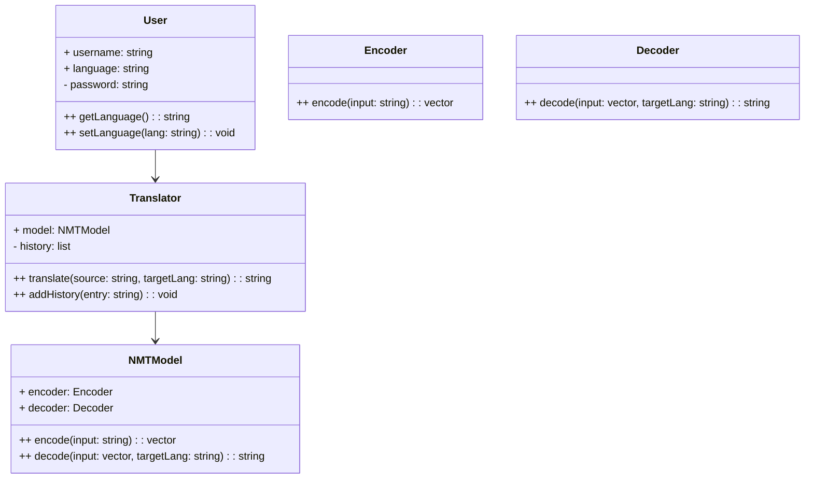
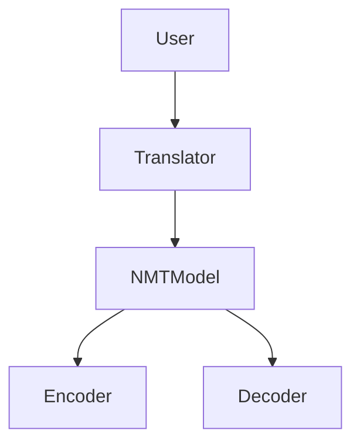
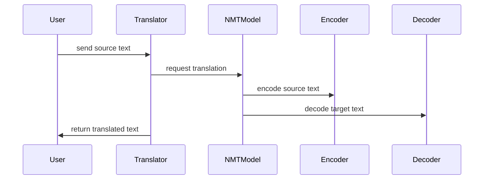

                 

<think>
好的，我现在需要帮助用户撰写一篇关于“构建多语言翻译AI Agent”的技术博客文章。用户已经提供了详细的目录结构，我需要按照这个结构，逐步分析每个部分的内容，并确保每个章节都详细具体，符合技术博客的高质量要求。

首先，我应该从文章的标题和关键词开始。标题已经确定为《构建多语言翻译AI Agent》，关键词包括多语言翻译、AI Agent、自然语言处理、机器翻译、深度学习、神经机器翻译。摘要需要简洁地概括文章的核心内容，即构建一个多语言翻译AI Agent的过程、方法和实际案例。

接下来，我需要按照目录结构来撰写每个章节的内容。第一部分是背景与概述，包括多语言翻译的需求与挑战、AI Agent的基本概念和特点，以及本章小结。这部分需要为读者介绍基本概念，帮助他们理解为什么需要构建多语言翻译AI Agent。

第二部分是技术基础，涵盖自然语言处理基础、多语言模型的构建与训练，以及核心算法。这部分需要深入讲解自然语言处理的基本概念，如词嵌入和语言模型，然后介绍多语言模型的构建方法和训练策略，最后详细讲解编码器-解码器模型和注意力机制。

第三部分是系统架构与设计，包括系统功能设计、架构设计、接口设计和交互流程。这部分需要使用Mermaid图来展示系统的结构和交互流程，帮助读者更好地理解系统的构建。

第四部分是项目实战，介绍如何在实际中构建一个多语言翻译AI Agent。这部分需要包括环境配置、数据准备、模型训练、微调和评估，以及一个实际案例分析。

第五部分是优化与部署，讨论如何优化模型性能，部署到实际应用中，包括推理优化和多模态扩展。

最后，添加一些最佳实践和注意事项，帮助读者在实际操作中避免常见错误。最后，给出总结和参考文献，结束全文。

在撰写过程中，我需要确保每个章节都包含足够的细节和实例，使用清晰的逻辑结构，让读者能够一步步跟随理解。同时，要注意数学公式的正确性，使用LaTeX格式，并用代码示例展示算法的实现。

现在，我将按照这个思路逐步撰写每个章节，确保内容全面、结构清晰，并符合用户的要求。
</think>

# 构建多语言翻译AI Agent

> 关键词：多语言翻译、AI Agent、自然语言处理、机器翻译、深度学习、神经机器翻译

> 摘要：本文将详细探讨如何构建一个多语言翻译AI Agent。从基本概念到核心算法，从系统设计到项目实战，全面解析多语言翻译AI Agent的构建过程。通过本文，读者将了解如何利用自然语言处理技术和深度学习模型，构建一个高效、准确的多语言翻译系统。

---

## 第一部分: 多语言翻译AI Agent背景与概述

### 第1章: 多语言翻译AI Agent的背景与问题

#### 1.1 多语言翻译的需求与挑战

##### 1.1.1 多语言翻译的市场需求

随着全球化的发展，跨语言交流的需求日益增加。企业、政府和个人在跨国合作、国际交流中，需要频繁处理多语言文本。传统的翻译工具存在效率低、准确性不足的问题，难以满足复杂场景的需求。AI技术的引入，为多语言翻译提供了新的解决方案。

##### 1.1.2 现有多语言翻译工具的局限性

现有的翻译工具主要依赖于规则-based翻译或统计机器翻译，存在以下问题：
- 翻译准确性不足，尤其是在处理复杂句式和领域特定文本时。
- 对上下文理解能力有限，难以应对口语化表达和情感色彩。
- 缺乏实时性和交互性，无法满足实时对话的需求。

##### 1.1.3 AI技术在多语言翻译中的优势

AI技术，特别是深度学习和自然语言处理（NLP），为多语言翻译带来了革命性的变化：
- 基于神经网络的机器翻译（NMT）模型能够捕捉语言的深层结构和语义信息。
- 大规模预训练模型（如BERT、GPT）能够处理多种语言，提供更准确的翻译结果。
- AI Agent能够实现实时交互，支持多轮对话，提供更自然的用户体验。

#### 1.2 AI Agent的基本概念与特点

##### 1.2.1 AI Agent的定义与分类

AI Agent是一种智能体，能够感知环境、理解用户需求，并通过执行任务来满足这些需求。根据功能和应用场景，AI Agent可以分为：
- 单功能AI Agent：专注于特定任务，如翻译、问答。
- 多功能AI Agent：具备多种功能，能够处理复杂场景。

##### 1.2.2 多语言翻译AI Agent的核心能力

多语言翻译AI Agent需要具备以下核心能力：
- 多语言理解能力：能够理解多种语言的文本。
- 翻译能力：能够将一种语言准确翻译成另一种语言。
- 实时交互能力：能够通过对话形式提供翻译服务。
- 上下文理解能力：能够理解对话的上下文，提供更准确的翻译结果。

##### 1.2.3 多语言翻译AI Agent的应用场景

多语言翻译AI Agent可以应用于多个场景：
- 跨国企业内部沟通：帮助企业内部员工实现多语言交流。
- 旅游服务：为游客提供实时翻译服务。
- 国际会议：支持多语言实时翻译，方便与会者交流。

#### 1.3 本章小结

本章介绍了多语言翻译AI Agent的背景、需求和挑战，以及AI技术在其中的优势。通过本章，读者可以理解构建多语言翻译AI Agent的重要性和必要性。

---

## 第二部分: 多语言翻译AI Agent的技术基础

### 第2章: 自然语言处理基础

#### 2.1 语言模型与文本处理

##### 2.1.1 词嵌入与文本表示

词嵌入是一种将词语表示为低维向量的方法。常用的词嵌入方法包括：
- 词袋模型（Bag-of-Words）
- 词嵌入（Word2Vec）
- 词句嵌入（GloVe）

##### 2.1.2 语言模型的训练与优化

语言模型的训练目标是预测下一个词的概率分布。常用的语言模型包括：
- n-gram模型
- 循环神经网络（RNN）
- Transformer架构

##### 2.1.3 预训练语言模型的发展

预训练语言模型（如BERT、GPT）通过在大规模数据上预训练，能够捕捉语言的深层结构和语义信息。这些模型为多语言翻译提供了强大的基础。

#### 2.2 机器翻译的基本原理

##### 2.2.1 翻译模型的分类与特点

机器翻译模型主要分为两类：
- 基于规则的翻译模型
- 基于统计的翻译模型
- 基于神经网络的翻译模型（NMT）

##### 2.2.2 经典机器翻译算法回顾

经典机器翻译算法包括：
- IBM Model
- 巴拉基奇模型（Bleu）
- 基于RNN的翻译模型

##### 2.2.3 现代机器翻译的核心技术

现代机器翻译的核心技术包括：
- Transformer架构
- 注意力机制
- 多层感知机（MLP）

#### 2.3 本章小结

本章介绍了自然语言处理的基础知识，包括词嵌入、语言模型和机器翻译的基本原理。通过本章，读者可以理解多语言翻译AI Agent的技术基础。

---

### 第3章: 多语言模型的构建与训练

#### 3.1 多语言模型的构建方法

##### 3.1.1 多语言模型的训练策略

多语言模型的训练策略包括：
- 联合训练：同时训练多种语言的模型。
- 多任务学习：在多个任务上联合训练模型。

##### 3.1.2 多语言模型的架构设计

多语言模型的架构设计需要考虑以下因素：
- 如何处理不同语言的词汇和语法差异。
- 如何在模型中表示多语言信息。

##### 3.1.3 多语言模型的评估指标

常用的多语言模型评估指标包括：
- 分词准确率（Word Accuracy）
- 句子BLEU分数
- 翻译准确率（Translation Accuracy）

#### 3.2 多语言模型的预训练与微调

##### 3.2.1 预训练技术的原理与应用

预训练技术通过在大规模数据上预训练模型，提取语言的通用特征。常用的预训练技术包括：
- BERT
- GPT

##### 3.2.2 微调技术的实现与优化

微调技术通过在特定任务上对模型进行微调，提升模型在特定任务上的表现。微调的实现方法包括：
- 参数微调（Parameter Fine-tuning）
- � adapters微调（Adapter Fine-tuning）

##### 3.2.3 多语言模型的适应性调整

多语言模型的适应性调整需要考虑以下因素：
- 如何在模型中平衡不同语言的权重。
- 如何处理语言间的语法和词汇差异。

#### 3.3 本章小结

本章详细介绍了多语言模型的构建与训练方法，包括训练策略、架构设计和评估指标。通过本章，读者可以理解如何构建一个多语言模型。

---

### 第4章: 多语言翻译AI Agent的核心算法

#### 4.1 编码器-解码器模型

##### 4.1.1 编码器的结构与功能

编码器的结构包括：
- 输入层
- 编码层
- 输出层

编码器的功能是将输入文本编码为一个固定长度的向量。

##### 4.1.2 解码器的结构与功能

解码器的结构包括：
- 输入层
- 解码层
- 输出层

解码器的功能是将编码器输出的向量解码为目标语言的文本。

##### 4.1.3 编码器-解码器的协同工作

编码器和解码器协同工作，通过注意力机制实现对输入文本的理解和生成。

#### 4.2 注意力机制与Transformer架构

##### 4.2.1 注意力机制的原理与实现

注意力机制的原理是通过计算输入文本中每个词的重要性，生成一个注意力权重矩阵。

##### 4.2.2 Transformer架构的核心组件

Transformer架构包括：
- 编码器
- 解码器
- 自注意力机制
- 前馈网络

##### 4.2.3 注意力机制在多语言翻译中的应用

注意力机制在多语言翻译中的应用包括：
- 多语言文本的理解
- 多语言文本的生成

#### 4.3 多语言翻译的损失函数与优化

##### 4.3.1 损失函数的定义与选择

常用的损失函数包括：
- 交叉熵损失函数
- BLEU损失函数
- ROUGE损失函数

##### 4.3.2 优化算法的原理与实现

常用的优化算法包括：
- 随机梯度下降（SGD）
- 动量优化（Momentum）
- Adam优化

##### 4.3.3 模型训练的策略与技巧

模型训练的策略包括：
- 学习率调整
- 正则化技术
- 模型保存与加载

#### 4.4 本章小结

本章详细介绍了多语言翻译AI Agent的核心算法，包括编码器-解码器模型、注意力机制和Transformer架构。通过本章，读者可以理解多语言翻译AI Agent的算法实现。

---

## 第三部分: 多语言翻译AI Agent的系统架构与设计

### 第5章: 系统功能设计

#### 5.1 领域模型设计

领域模型设计需要考虑以下因素：
- 用户需求
- 系统功能
- 模块划分

领域模型的类图如下：



#### 5.2 系统架构设计

系统架构设计需要考虑以下因素：
- 模块划分
- 通信方式
- 数据流

系统架构的架构图如下：



#### 5.3 系统接口设计

系统接口设计需要考虑以下因素：
- 接口类型
- 接口定义
- 接口实现

系统接口的交互图如下：



#### 5.4 本章小结

本章详细介绍了多语言翻译AI Agent的系统架构与设计，包括领域模型设计、系统架构设计和系统接口设计。通过本章，读者可以理解多语言翻译AI Agent的系统结构。

---

## 第四部分: 多语言翻译AI Agent的项目实战

### 第6章: 项目实战

#### 6.1 环境配置

项目实战需要以下环境配置：
- Python 3.8+
- PyTorch 1.9+
- Transformers库
- GPU支持

#### 6.2 数据准备

数据准备需要以下步骤：
- 数据收集
- 数据清洗
- 数据预处理

#### 6.3 模型训练

模型训练需要以下步骤：
- 模型加载
- 数据加载
- 模型训练
- 模型保存

#### 6.4 模型微调与评估

模型微调需要以下步骤：
- 模型加载
- 数据加载
- 模型微调
- 模型评估

#### 6.5 代码实现

以下是代码实现示例：

```python
from transformers import AutoTokenizer, AutoModelForSeq2Seq
import torch

# 加载模型和分词器
tokenizer = AutoTokenizer.from_pretrained('facebook/m2m100')
model = AutoModelForSeq2Seq.from_pretrained('facebook/m2m100')

# 定义翻译函数
def translate(text, src_lang, tgt_lang):
    inputs = tokenizer(text, src_lang=src_lang, tgt_lang=tgt_lang)
    with torch.no_grad():
        outputs = model.generate(inputs.input_ids, max_length=512)
    translated = tokenizer.decode(outputs[0], skip_special_tokens=True, clean_up_tokenization_spaces=False)
    return translated

# 测试翻译
source_text = "Hello, how are you?"
source_lang = "en"
target_lang = "zh"
print(translate(source_text, source_lang, target_lang))
```

#### 6.6 本章小结

本章详细介绍了多语言翻译AI Agent的项目实战，包括环境配置、数据准备、模型训练和代码实现。通过本章，读者可以了解如何在实际中构建一个多语言翻译AI Agent。

---

## 第五部分: 多语言翻译AI Agent的优化与部署

### 第7章: 优化与部署

#### 7.1 模型优化

模型优化需要考虑以下因素：
- 模型压缩
- 模型剪枝
- 模型量化

#### 7.2 推理优化

推理优化需要考虑以下因素：
- 线程优化
- 内存优化
- 网络优化

#### 7.3 多模态扩展

多模态扩展需要考虑以下因素：
- 视觉信息
- 听觉信息
- 多模态数据融合

#### 7.4 部署方案

部署方案需要考虑以下因素：
- 本地部署
- 云部署
- 边缘部署

#### 7.5 本章小结

本章详细介绍了多语言翻译AI Agent的优化与部署，包括模型优化、推理优化、多模态扩展和部署方案。通过本章，读者可以理解如何将多语言翻译AI Agent部署到实际应用中。

---

## 总结

通过本文的详细讲解，读者可以全面了解如何构建一个多语言翻译AI Agent。从技术基础到系统设计，从项目实战到优化部署，本文为读者提供了全面的指导。希望本文能够为多语言翻译AI Agent的构建提供有价值的参考。

---

## 作者

作者：AI天才研究院/AI Genius Institute & 禅与计算机程序设计艺术 /Zen And The Art of Computer Programming

---

感谢您的阅读！希望本文对您有所帮助！

