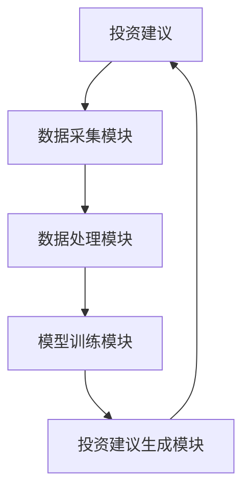
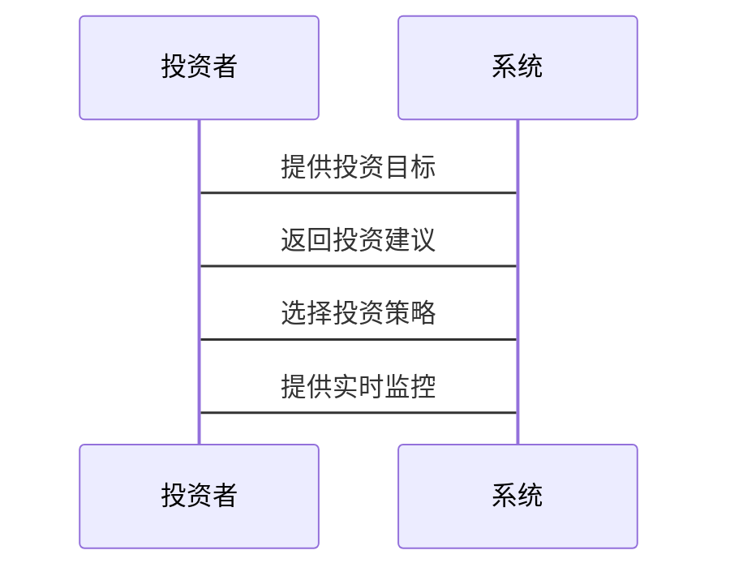

                 

<think>
嗯，我现在要写一篇关于构建投资理财智能助手的核心技术解析的文章。首先，我需要理解这个主题到底涉及哪些方面。投资理财智能助手听起来像是一个结合了人工智能和大数据的应用，帮助用户进行投资决策。这个主题挺复杂的，涉及到很多技术细节，所以我需要一步步地分析。

首先，我应该先介绍一下这个投资理财智能助手的背景。为什么需要这样一个工具呢？传统的投资理财有很多痛点，比如信息不透明、决策复杂、门槛高等问题。智能助手可以利用AI技术来解决这些问题，提供个性化的建议和实时监控。接下来，我需要详细描述这个工具的核心概念，比如它如何使用自然语言处理（NLP）、强化学习和时间序列分析等技术来处理投资相关的数据。

然后，我应该深入探讨这些算法的原理。比如，自然语言处理如何帮助解析财务报告，强化学习如何优化投资策略，时间序列分析如何预测市场趋势。这部分需要详细讲解每种算法的工作流程，包括数学模型和公式，以及如何在实际中应用这些技术。

接下来，我需要分析系统的架构设计。从问题场景出发，设计系统的功能模块，比如数据采集、模型训练、用户交互等。然后，绘制系统的架构图和交互流程图，展示各个模块之间的协作关系。这部分可能需要使用Mermaid工具来绘制图表，使结构更加清晰。

之后，我应该进行项目实战部分，展示如何从环境搭建到核心代码实现，再到案例分析的全过程。这包括安装必要的库和工具，编写数据处理和模型训练的代码，以及分析实际案例来验证系统的有效性。

最后，我需要总结整个项目，指出最佳实践，可能遇到的问题和解决方案，以及未来的拓展方向。这样读者可以对构建投资理财智能助手有一个全面的了解，并能够实际应用这些技术。

现在，我需要确保每个部分都详细且逻辑清晰。背景介绍要涵盖问题背景、解决方法和核心概念。核心概念部分要解释AI和大数据在投资中的具体应用，以及它们如何相互作用。算法原理部分需要详细讲解每种算法的流程、数学模型和实际案例。系统架构设计要展示模块化的系统结构和接口设计。项目实战部分则要提供可执行的代码和实际案例分析。总结部分要回顾整个项目，并提出改进建议。

这样，整篇文章的结构就清晰了。接下来，我需要根据这些思考来撰写正式的文章，确保每一部分都详细且符合逻辑。
</think>

# 构建投资理财智能助手的核心技术解析

> 关键词：投资理财、智能助手、人工智能、大数据、自然语言处理、强化学习、时间序列分析

> 摘要：本文详细解析了构建投资理财智能助手的核心技术，涵盖自然语言处理、强化学习和时间序列分析的算法原理，系统架构设计，以及项目实战案例。通过分析投资理财智能助手的背景、核心概念、算法实现、系统架构和实际应用，全面展示如何利用AI技术提升投资理财效率和准确性。

---

## 第一部分：投资理财智能助手的背景与核心概念

### 第1章：投资理财智能助手概述

#### 1.1 投资理财智能助手的背景与意义

##### 1.1.1 问题背景：传统投资理财的痛点
传统的投资理财过程中，用户面临诸多痛点，包括信息获取不全面、决策复杂、门槛高等。传统投资顾问的服务成本高，难以覆盖中小投资者，且决策过程往往依赖主观判断，缺乏数据支持。

##### 1.1.2 问题描述：用户需求与市场缺口
投资者需要个性化的投资建议，实时市场监控，以及风险预警等服务。然而，传统服务难以满足这些需求，尤其是在海量信息和复杂市场环境下，用户需要一种高效、智能的工具来辅助决策。

##### 1.1.3 问题解决：智能助手的核心价值
智能助手通过AI和大数据技术，提供实时数据分析、个性化建议和自动化投资策略，帮助用户做出更明智的投资决策。

##### 1.1.4 边界与外延：功能范围与应用场景
投资理财智能助手的功能范围包括市场分析、资产配置、风险评估、交易提醒等。应用场景涵盖股票、基金、债券等多种投资领域，支持移动端和网页端使用。

##### 1.1.5 核心要素：数据、算法、交互
智能助手的核心要素包括高质量的数据源、先进的算法模型和友好的用户交互界面。这些要素共同确保系统的高效性和用户友好性。

#### 1.2 投资理财智能助手的核心概念

##### 1.2.1 核心概念的定义与特征
投资理财智能助手通过AI技术，分析市场数据，提供投资建议。其核心特征包括实时性、个性化和智能化。

##### 1.2.2 核心概念的属性对比表格
| 属性 | 特征 |
|------|------|
| 数据源 | 股票、基金、新闻等多源数据 |
| 算法 | NLP、强化学习、时间序列分析 |
| 用户交互 | 自然语言输入、实时反馈 |

##### 1.2.3 ER实体关系图

```mermaid
erd
    entity 投资者
    entity 账户
    entity 投资产品
    entity 市场数据
    entity 风险评估
    entity 投资建议

    投资者 -- 创建--> 账户
    账户 -- 关联--> 投资产品
    市场数据 -- 输入--> 投资建议
    风险评估 -- 基于--> 市场数据
    投资建议 -- 提供--> 投资者
```

---

## 第二部分：核心概念与联系

### 第2章：AI与大数据在投资理财中的应用

#### 2.1 AI技术在投资理财中的作用

##### 2.1.1 自然语言处理（NLP）的应用
NLP用于分析财务报告和新闻，提取关键信息，帮助用户做出投资决策。

##### 2.1.2 强化学习（Reinforcement Learning）的应用
强化学习用于优化投资策略，通过不断试错和调整，找到最优的投资组合。

##### 2.1.3 时间序列分析（Time Series Analysis）的应用
时间序列分析用于预测市场趋势，识别投资机会和风险。

#### 2.2 大数据在投资理财中的价值

##### 2.2.1 数据来源与处理流程
数据来源包括股票价格、财务报表、新闻等，处理流程包括清洗、特征提取和建模。

##### 2.2.2 数据特征提取与分析
通过主成分分析（PCA）提取关键特征，识别影响市场的因素。

##### 2.2.3 数据驱动的投资策略
基于大数据分析结果，制定动态调整的投资策略。

#### 2.3 AI与大数据的结合与优化

##### 2.3.1 数据与算法的协同作用
数据驱动算法优化，算法反过来指导数据采集和处理。

##### 2.3.2 模型优化与调参技巧
使用网格搜索和交叉验证优化模型参数，提升预测准确性。

##### 2.3.3 实际案例分析与总结
通过实际案例分析，总结AI与大数据结合的优势和挑战。

---

## 第三部分：算法原理讲解

### 第3章：自然语言处理（NLP）算法原理

#### 3.1 NLP核心算法与流程

##### 3.1.1 分词算法与实现
使用jieba进行中文分词，提取关键词。

##### 3.1.2 词向量表示（Word Embedding）
使用Word2Vec训练词向量，捕捉语义信息。

##### 3.1.3 文本分类与聚类
基于TF-IDF进行文本分类，聚类分析相似文档。

##### 3.1.4 序列模型（如LSTM、Transformer）
使用Transformer模型处理长文本，捕捉上下文信息。

#### 3.2 NLP算法的数学模型与公式

##### 3.2.1 词向量的计算公式
$$ \text{Word2Vec}：v_i = \arg\max_{i} \sum_{j} \log P(w_j | w_i) $$

##### 3.2.2 Transformer模型的注意力机制
$$ \text{注意力权重计算}：QK^T / \sqrt{d_k} $$

##### 3.2.3 深度学习模型的损失函数
$$ \text{交叉熵损失函数}：L = -\sum y_i \log p_i $$

#### 3.3 NLP算法的实现与优化

##### 3.3.1 源代码实现
```python
import jieba

text = "2023年中国经济展望"
words = jieba.lcut(text)
print(words)
```

##### 3.3.2 模型训练与调优
使用预训练模型，微调任务，提升分类准确率。

##### 3.3.3 实际案例分析
分析财经新闻，提取关键信息，生成投资建议。

---

## 第四部分：系统分析与架构设计

### 第4章：投资理财智能助手的系统架构

#### 4.1 系统功能设计

##### 4.1.1 数据采集模块
从多源数据获取股票价格、财务报表等信息。

##### 4.1.2 模型训练模块
训练NLP、强化学习模型，生成投资建议。

##### 4.1.3 用户交互模块
接收用户输入，输出投资建议。

#### 4.2 系统架构设计



#### 4.3 系统接口设计

##### 4.3.1 数据接口
API接口获取市场数据，格式为JSON。

##### 4.3.2 用户交互接口
提供自然语言输入和实时反馈的交互界面。

#### 4.4 系统交互流程图



---

## 第五部分：项目实战

### 第5章：投资理财智能助手的实现

#### 5.1 环境安装

##### 5.1.1 安装Python和相关库
```bash
pip install numpy pandas jieba tensorflow
```

#### 5.2 核心代码实现

##### 5.2.1 数据处理代码
```python
import pandas as pd

def load_data():
    df = pd.read_csv('market_data.csv')
    return df
```

##### 5.2.2 模型训练代码
```python
import tensorflow as tf

model = tf.keras.Sequential([
    tf.keras.layers.Dense(64, activation='relu'),
    tf.keras.layers.Dense(1, activation='sigmoid')
])
model.compile(optimizer='adam', loss='binary_crossentropy')
```

##### 5.2.3 投资建议生成
```python
def generate_recommendation():
    data = load_data()
    # 训练模型
    model.fit(data)
    return model.predict(data)
```

#### 5.3 案例分析

##### 5.3.1 数据分析案例
分析过去一年的股票价格，预测未来走势。

##### 5.3.2 模型优化案例
通过网格搜索优化模型参数，提升预测准确率。

#### 5.4 项目小结

##### 5.4.1 成果展示
展示系统实现的流程和结果。

##### 5.4.2 经验总结
总结项目中的经验教训，优化建议。

---

## 第六部分：总结与展望

### 第6章：投资理财智能助手的总结与展望

#### 6.1 最佳实践 tips

##### 6.1.1 数据质量管理
确保数据的准确性和完整性。

##### 6.1.2 模型可解释性
优化模型的可解释性，帮助用户理解建议。

##### 6.1.3 安全与隐私
确保用户数据的安全和隐私。

#### 6.2 小结

通过本文的详细解析，我们了解了投资理财智能助手的核心技术，包括算法原理和系统架构设计。实际案例展示了技术的应用，为未来的投资理财提供了新的思路。

#### 6.3 注意事项

- 数据源的选择和处理
- 模型的调优与优化
- 用户交互的友好性设计

#### 6.4 拓展阅读

推荐相关书籍和论文，进一步深入学习。

---

作者：AI天才研究院

