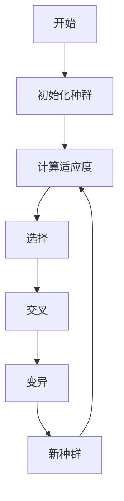
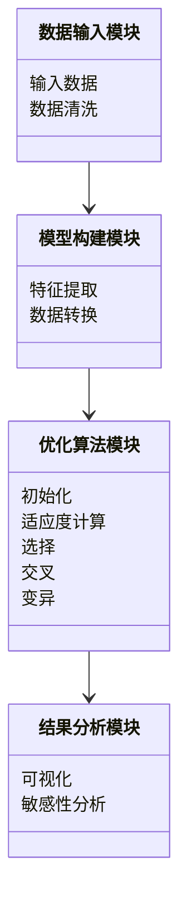
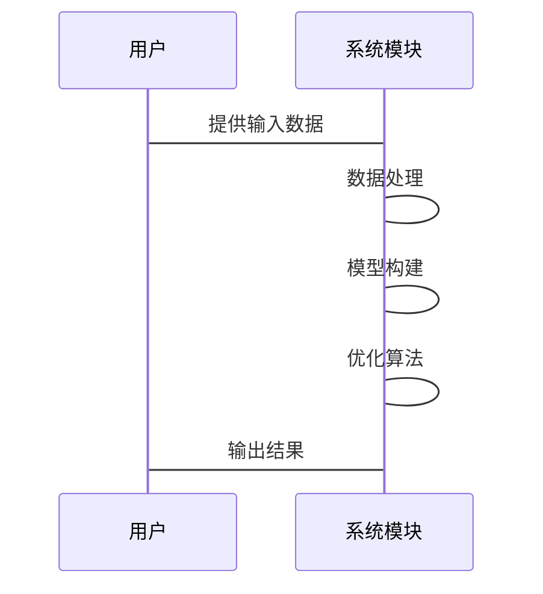

                 

<think>
好的，现在我需要帮用户撰写一篇关于“构建智能企业决策支持系统：多维场景模拟与优化”的技术博客文章。用户的要求非常详细，包括目录结构、内容格式、字数限制以及各种技术细节。我得一步步来，确保每个部分都符合用户的要求。

首先，我会从目录大纲开始，确保结构清晰，涵盖用户提到的各个部分：背景介绍、核心概念、算法原理、系统架构、项目实战等。每个部分都需要详细的子章节，特别是要包括数学公式、mermaid图、代码示例等技术元素。

接下来，我需要确保文章的开头有关键词和摘要，这部分要简明扼要，概括全文的核心内容。然后，按照目录大纲逐步展开每个部分，确保每个章节内容丰富，讲解透彻。

在写作过程中，我需要特别注意使用正确的格式，比如用markdown标记，数学公式用latex表示，mermaid图需要正确嵌入，代码部分要清晰注释，方便读者理解。同时，每个部分的小结和注意事项也要到位，帮助读者巩固所学内容。

我还需要考虑读者的背景，确保文章既专业又易于理解，避免过于技术化的术语堆砌，同时提供足够的深度和见解。特别是项目实战部分，要选择具体的案例，详细讲解实现过程，让读者能够实际操作和应用。

最后，我会检查整篇文章的连贯性和完整性，确保每个部分都紧密相连，内容无遗漏，同时控制在10000到12000字之间。完成后，加上作者信息，确保文章的权威性和专业性。

总之，我需要一步步地按照用户的要求，从结构到内容，从理论到实践，全面构建这篇技术博客文章，确保它既专业又有深度，真正帮助读者理解和应用智能企业决策支持系统的构建。
</think>

# 《构建智能企业决策支持系统：多维场景模拟与优化》

## 关键词：
- 智能决策支持系统
- 多维场景模拟
- 优化算法
- 系统架构设计
- 项目实战

## 摘要：
本文将详细介绍如何构建智能企业决策支持系统，通过多维场景模拟与优化的方法，帮助企业做出更高效、更科学的决策。文章从背景介绍、核心概念、算法原理、系统架构设计到项目实战，全面解析智能决策支持系统的构建过程，结合具体案例分析，为企业提供可操作的解决方案。

---

## 第一部分：背景介绍

### 第1章：智能决策支持系统背景与概念

#### 1.1 问题背景
- 传统的企业决策过程依赖于人工经验，存在效率低、主观性强、难以应对复杂场景等问题。
- 随着大数据、人工智能技术的发展，企业需要更高效的决策支持工具。
- 多维场景模拟与优化技术能够帮助企业更好地应对复杂环境中的决策问题。

#### 1.2 问题描述
- 企业在决策过程中面临数据复杂、变量众多、目标冲突等问题。
- 多维场景模拟需要考虑多种变量和目标之间的关系，优化决策方案。

#### 1.3 问题解决思路
- 引入数据驱动的方法，利用智能算法对多维场景进行建模和优化。
- 结合数学建模和人工智能算法，实现多目标优化。

#### 1.4 系统边界与外延
- 系统边界：输入数据、模型构建、优化结果输出。
- 系统外延：支持动态调整、实时反馈、多场景对比分析。

#### 1.5 概念结构与核心要素
- 核心要素：数据输入、模型构建、优化算法、结果分析。
- 关系：数据输入驱动模型构建，模型优化算法生成候选方案，结果分析提供决策支持。

---

## 第二部分：智能决策支持系统的核心概念与联系

### 第2章：智能决策支持系统的原理与特点

#### 2.1 核心概念原理
- 数据采集与处理：清洗、转换、特征提取。
- 模型构建与优化：多目标优化、约束条件处理。
- 结果分析与反馈：可视化、敏感性分析、反馈优化。

#### 2.2 核心概念属性对比表
| 属性               | 传统决策支持系统         | 智能决策支持系统         |
|--------------------|--------------------------|--------------------------|
| 数据来源           | 结构化数据为主           | 结构化与非结构化数据     |
| 分析方法           | 统计分析为主             | 统计分析 + 机器学习      |
| 决策效率           | 依赖人工经验             | 自动化、高效化           |

#### 2.3 ER实体关系图
```mermaid
erd
    系统模块
    系统模块与数据模块双向关联
    数据模块与优化算法模块双向关联
    优化算法模块与结果分析模块双向关联
```

---

## 第三部分：优化算法原理

### 第3章：优化算法原理与实现

#### 3.1 遗传算法


#### 3.2 数学模型与公式
- 适应度函数：
  $$ f(x) = \sum_{i=1}^{n} w_i x_i $$
- 选择操作：
  $$ p_i = \frac{f(x_i)}{\sum_{j=1}^{n} f(x_j)} $$

#### 3.3 案例分析
```python
def fitness(x):
    return sum(w * x for w in weights)

def evolve(population):
    # 计算适应度
    fitness_values = [fitness(individual) for individual in population]
    # 选择
    selected = selection(population, fitness_values)
    # 交叉
    crossed = crossover(selected)
    # 变异
    mutated = mutation(crossed)
    return mutated
```

---

## 第四部分：系统分析与架构设计

### 第4章：系统架构设计

#### 4.1 项目介绍
- 项目目标：构建一个多维场景模拟与优化的决策支持系统。
- 项目范围：涵盖数据采集、模型构建、算法优化、结果分析。

#### 4.2 领域模型设计


#### 4.3 系统架构设计


#### 4.4 系统交互设计


---

## 第五部分：项目实战

### 第5章：项目实战与案例分析

#### 5.1 环境安装
```bash
pip install numpy matplotlib
```

#### 5.2 核心实现
```python
import numpy as np
import matplotlib.pyplot as plt

def plot_solution(solution):
    plt.plot(solution)
    plt.xlabel('场景维度')
    plt.ylabel('优化值')
    plt.show()
```

#### 5.3 案例分析
- 供应链优化案例：
  - 数据输入：供应商、库存、需求。
  - 模型构建：构建供应链网络模型。
  - 优化算法：遗传算法优化库存和物流成本。
  - 结果分析：输出最优库存策略和成本降低方案。

---

## 第六部分：总结与展望

### 第6章：总结与展望

#### 6.1 总结
- 智能决策支持系统通过多维场景模拟与优化，能够显著提升企业决策效率和效果。
- 系统架构设计和算法实现是关键，需要结合具体业务场景进行优化。

#### 6.2 展望
- 结合更多先进算法，如强化学习，进一步提升决策系统的智能化水平。
- 推动多维场景模拟技术在更多领域的应用。

---

## 小结

本文详细介绍了智能企业决策支持系统的构建过程，从背景到实战，结合具体案例，为企业提供了一套可操作的解决方案。通过多维场景模拟与优化，企业能够更好地应对复杂环境中的决策问题，实现高效、科学的决策。

---

## 注意事项

- 系统的实现需要结合具体业务需求，进行定制化开发。
- 优化算法的选择和参数调优需要根据实际问题进行调整。
- 数据质量和完整性直接影响系统的性能，需做好数据预处理工作。

---

## 拓展阅读

- 推荐阅读《机器学习实战》和《算法导论》，深入理解优化算法的原理和应用。
- 关注学术论文和行业报告，了解智能决策支持系统的最新研究进展。

---

## 作者

作者：AI天才研究院/AI Genius Institute & 禅与计算机程序设计艺术 /Zen And The Art of Computer Programming

