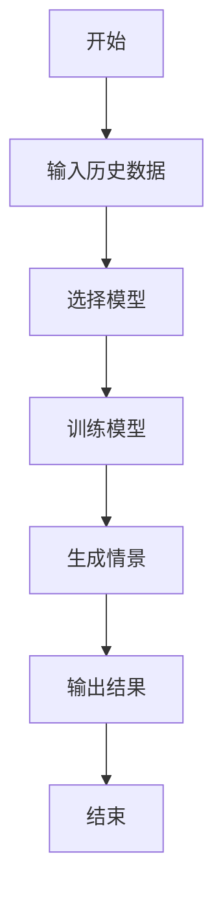
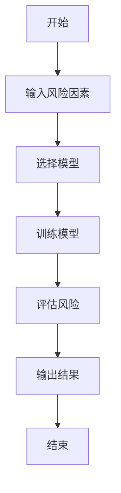
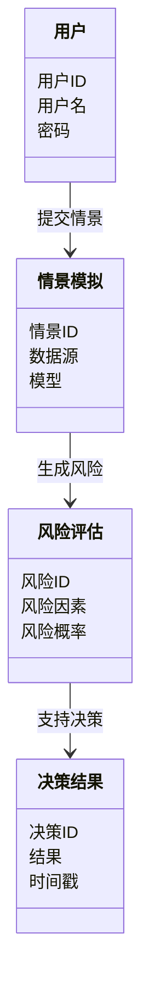

                 


# 构建智能企业决策支持系统：多维度情景模拟与风险评估

> 关键词：智能决策支持系统、情景模拟、风险评估、企业决策、数据分析、机器学习、系统架构

> 摘要：本文旨在探讨如何构建智能企业决策支持系统，通过多维度情景模拟与风险评估来优化企业决策过程。结合理论分析和实际案例，深入探讨系统的构建方法，为企业提供科学的决策支持。

---

## 第一部分: 智能企业决策支持系统概述

### 第1章: 智能企业决策支持系统概述

#### 1.1 问题背景与目标
##### 1.1.1 传统企业决策的局限性
传统的决策方式依赖于经验丰富的管理者和简单的数据分析工具。这种方法在数据量较小、业务相对单一的情况下能够发挥作用，但在当今复杂多变的商业环境中，往往显得力不从心。企业面临的问题日益复杂，涉及市场变化、竞争对手动态、政策调整等多个维度，仅靠人工分析难以全面覆盖。

##### 1.1.2 智能决策支持系统的提出
随着人工智能技术的快速发展，尤其是机器学习、自然语言处理和大数据分析技术的进步，智能决策支持系统应运而生。这种系统能够实时处理海量数据，提供多维度的情景模拟和风险评估，帮助企业做出更科学、更准确的决策。

##### 1.1.3 系统目标与核心问题
智能企业决策支持系统的目标是通过整合企业内外部数据，构建多维度的情景模拟模型，并对可能的风险进行评估，最终为企业提供最优的决策支持。核心问题在于如何高效地处理数据、构建准确的模型以及确保系统的可扩展性和可维护性。

---

#### 1.2 多维度情景模拟与风险评估
##### 1.2.1 情景模拟的定义与作用
情景模拟是指通过构建数学模型，模拟企业在不同条件下的经营状况，预测可能的结果。其作用在于帮助企业提前识别潜在风险，制定应对策略。

##### 1.2.2 风险评估的核心概念
风险评估是对可能影响企业决策的各种风险因素进行量化分析，评估其影响程度，并提出应对措施。它是智能决策支持系统的重要组成部分。

##### 1.2.3 多维度分析的必要性
在复杂的企业环境中，决策需要考虑多个维度，如市场、财务、运营等。多维度分析能够帮助企业全面评估问题，避免单一维度分析的局限性。

---

### 1.3 本章小结
本章介绍了智能企业决策支持系统的背景、目标以及多维度情景模拟和风险评估的核心概念。通过对比传统决策方式与智能决策支持系统，强调了后者在现代企业中的重要性。

---

## 第二部分: 核心概念与联系

### 第2章: 核心概念与联系

#### 2.1 情景模拟与风险评估的关联
##### 2.1.1 情景模拟的数学模型
情景模拟通常基于时间序列模型或回归模型。例如，使用ARIMA模型预测市场趋势。

##### 2.1.2 风险评估的数学模型
风险评估可以使用蒙特卡洛模拟，通过多次模拟计算风险的期望值和标准差。

##### 2.1.3 两者的关联性分析
情景模拟为风险评估提供基础数据，而风险评估则为情景模拟的结果提供校验和优化依据。

#### 2.2 核心概念的属性对比
| 比较维度 | 情景模拟 | 风险评估 |
|----------|----------|----------|
| 输入数据 | 历史数据 | 风险因素 |
| 输出结果 | 预测结果 | 风险概率 |
| 应用场景 | 战略规划 | 风险管理 |

#### 2.3 系统架构的ER实体关系图
```mermaid
er
    actor: 用户
    system: 智能决策支持系统
    scenario: 情景模拟
    risk_assessment: 风险评估
    decision: 决策结果
    actor --> scenario: 提交情景
    scenario --> risk_assessment: 生成风险
    risk_assessment --> decision: 支持决策
    system --> actor: 提供结果
```

### 2.4 本章小结
本章通过对比分析，明确了情景模拟与风险评估的关联性及其在系统中的作用，为后续的算法设计和系统构建奠定了基础。

---

## 第三部分: 算法原理讲解

### 第3章: 算法原理与数学模型

#### 3.1 情景生成算法
##### 3.1.1 算法流程


##### 3.1.2 算法实现
以下是一个基于ARIMA模型的情景生成算法的Python代码示例：
```python
from statsmodels.tsa.arima_model import ARIMA

def generate_scenario(data, order=(1, 1, 1)):
    model = ARIMA(data, order=order)
    model_fit = model.fit()
    forecast = model_fit.forecast(steps=10)
    return forecast
```

#### 3.2 风险评估模型
##### 3.2.1 算法流程


##### 3.2.2 风险评估公式
风险概率计算公式：
$$ P = \frac{\sum_{i=1}^{n} w_i r_i}{\sum_{i=1}^{n} w_i} $$
其中，$w_i$ 是权重，$r_i$ 是风险值。

---

## 第四部分: 系统分析与架构设计

### 第4章: 系统分析与架构设计

#### 4.1 系统功能设计
##### 4.1.1 领域模型


#### 4.2 系统架构设计


#### 4.3 系统接口设计
- 用户接口：API接口，用于提交情景和获取结果。
- 数据接口：与企业数据库对接，获取历史数据。

#### 4.4 系统交互设计
```mermaid
sequenceDiagram
    actor --> 数据采集模块: 提交情景
    数据采集模块 --> 数据处理模块: 传递数据
    数据处理模块 --> 模型训练模块: 训练模型
    模型训练模块 --> 结果展示模块: 返回结果
    结果展示模块 --> actor: 显示结果
```

---

## 第五部分: 项目实战

### 第5章: 项目实战

#### 5.1 环境安装
- 安装Python和相关库：`pip install numpy pandas scikit-learn statsmodels`

#### 5.2 核心代码实现
##### 5.2.1 情景生成代码
```python
import numpy as np
import pandas as pd
from statsmodels.tsa.arima_model import ARIMA

def generate_scenario(data, order=(1, 1, 1)):
    model = ARIMA(data, order=order)
    model_fit = model.fit()
    forecast = model_fit.forecast(steps=10)
    return forecast
```

##### 5.2.2 风险评估代码
```python
import numpy as np
import pandas as pd

def calculateRisk(factors, weights):
    weighted_factors = [factors[i] * weights[i] for i in range(len(factors))]
    total_weight = sum(weights)
    risk_prob = sum(weighted_factors) / total_weight
    return risk_prob
```

#### 5.3 案例分析
以某制造企业为例，分析市场需求变化对企业利润的影响。通过情景模拟生成未来10个月的销售预测，并评估市场需求波动带来的风险。

---

## 第六部分: 最佳实践与总结

### 第6章: 最佳实践与总结

#### 6.1 项目小结
本项目展示了如何通过智能决策支持系统优化企业决策过程，从数据采集到模型训练再到结果展示，每个环节都至关重要。

#### 6.2 注意事项
- 数据质量是关键，确保数据的准确性和完整性。
- 模型选择需结合实际业务需求，避免过度复杂化。
- 系统需具备可扩展性，以便后续功能的添加。

#### 6.3 拓展阅读
建议深入学习时间序列分析、机器学习算法以及系统架构设计的相关知识。

---

## 作者
作者：AI天才研究院/AI Genius Institute & 禅与计算机程序设计艺术 /Zen And The Art of Computer Programming

---

以上是《构建智能企业决策支持系统：多维度情景模拟与风险评估》的技术博客文章，内容涵盖背景介绍、核心概念、算法原理、系统设计、项目实战和最佳实践。通过理论与实践相结合，为企业构建智能决策支持系统提供了全面的指导。

