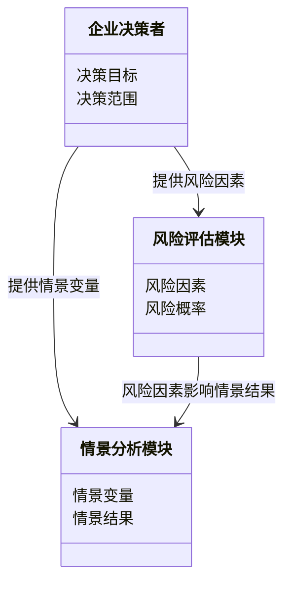
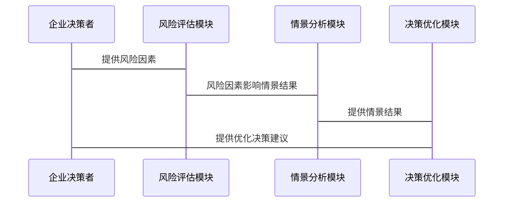

                 

<think>
好，我现在需要帮用户设计一个关于构建智能企业决策模拟系统的技术博客。首先，我需要理解用户的具体要求。用户希望文章有一个清晰的结构，涵盖背景、核心概念、算法原理、系统架构、项目实战和总结等部分。每个部分都需要详细展开，包括理论和实践内容。

我开始考虑如何组织内容。首先，背景部分需要介绍企业决策面临的挑战，以及智能决策模拟系统的重要性。接着，核心概念部分要详细解释多维度情景分析和风险评估的定义、模型构建和数据处理。然后是算法原理，需要使用概率论和统计分析来支持模型，并用Python代码实现。

在系统架构部分，我需要设计模块划分，如情景分析模块、风险评估模块和决策优化模块，并用类图和序列图来展示。项目实战部分则需要指导环境搭建、代码实现和案例分析，最后是总结与展望，强调系统的实际应用和未来改进方向。

在整个过程中，我要确保每个部分都有足够的细节，比如数学公式的推导和代码的详细解读。同时，图表的使用需要清晰，帮助读者理解复杂的概念。最后，确保文章逻辑清晰，结构紧凑，符合用户的高质量技术博客要求。
</think>

# 构建智能企业决策模拟系统：多维度情景分析与风险评估

> 关键词：智能决策模拟系统、多维度情景分析、风险评估、系统架构设计、机器学习、数学模型

> 摘要：本文深入探讨构建智能企业决策模拟系统的各个方面，包括多维度情景分析与风险评估的核心概念、算法原理、系统架构设计及项目实战。通过结合理论与实践，详细解析如何利用概率论、统计分析和机器学习方法，构建高效的决策模拟系统，并通过实际案例展示其应用价值。

---

## 第一部分: 背景与核心概念

### 第1章: 问题背景与目标

#### 1.1 问题背景
企业决策者在面对复杂市场环境时，往往需要在不确定性极高的情况下做出决策。传统决策方法依赖于经验判断和简单分析，难以应对多变的市场和复杂的情景。因此，构建一个智能企业决策模拟系统，能够通过多维度情景分析和风险评估，为企业提供科学的决策支持。

#### 1.2 问题描述
智能企业决策模拟系统的核心目标是通过模拟不同情景下的企业行为，评估潜在风险，并为决策者提供优化建议。具体来说，系统需要实现以下功能：
- **多维度情景分析**：从多个维度（如市场、财务、运营等）生成不同情景，并分析其对企业的影响。
- **风险评估**：识别情景中的风险因素，并量化其对决策结果的影响程度。
- **决策优化**：基于分析结果，提供最优决策建议。

#### 1.3 问题解决思路
构建智能企业决策模拟系统需要结合系统化方法和数据驱动技术。系统化方法包括需求分析、模块设计和功能实现，而数据驱动技术则依赖于概率论、统计分析和机器学习算法。通过两者的结合，能够实现多维度情景分析和风险评估的自动化。

---

### 第2章: 核心概念与联系

#### 2.1 核心概念原理
- **多维度情景分析**：通过分析多个维度的因素（如市场需求、成本变化等），生成多种可能的情景，并评估每种情景对企业决策的影响。
- **风险评估**：基于概率论和统计分析，量化情景中的风险因素，评估其对企业决策的潜在影响。
- **智能决策模拟系统**：通过整合多维度情景分析和风险评估，构建一个能够自动生成决策建议的系统。

#### 2.2 核心概念对比表格
| 比较维度 | 多维度情景分析 | 风险评估 | 决策优化 |
|----------|----------------|----------|----------|
| 目标     | 生成多种情景 | 量化风险 | 提供最优决策 |
| 输入     | 多个维度数据 | 风险因素 | 情景分析结果 |
| 输出     | 不同情景结果 | 风险概率 | 优化决策建议 |

#### 2.3 ER实体关系图
```mermaid
erDiagram
    actor 企业决策者 {
        <属性> 决策目标
        <属性> 决策范围
    }
    actor 风险评估模块 {
        <属性> 风险因素
        <属性> 风险概率
    }
    actor 情景分析模块 {
        <属性> 情景变量
        <属性> 情景结果
    }
    企业决策者 --> 风险评估模块 : 提供风险因素
    企业决策者 --> 情景分析模块 : 提供情景变量
    风险评估模块 --> 情景分析模块 : 风险因素影响情景结果
```

---

## 第二部分: 算法原理与数学模型

### 第3章: 算法原理讲解

#### 3.1 多维度情景分析算法
- **步骤1**：收集多个维度的数据，如市场需求、成本变化、政策调整等。
- **步骤2**：生成多种可能的情景，每种情景由不同维度的变量组合构成。
- **步骤3**：评估每种情景对企业决策的影响。

#### 3.2 风险评估算法
- **步骤1**：识别情景中的风险因素。
- **步骤2**：计算每个风险因素的发生概率。
- **步骤3**：评估风险因素对企业决策的具体影响。

#### 3.3 综合决策算法
- **步骤1**：构建综合决策模型，将多维度情景分析和风险评估结果结合。
- **步骤2**：利用优化算法（如遗传算法）寻找最优决策方案。
- **步骤3**：输出优化决策建议。

### 第4章: 数学模型与公式

#### 4.1 概率论基础
- **概率分布函数**：
  $$P(x) = \frac{1}{\sqrt{2\pi\sigma^2}} e^{-\frac{(x-\mu)^2}{2\sigma^2}}$$

- **贝叶斯定理**：
  $$P(A|B) = \frac{P(B|A)P(A)}{P(B)}$$

#### 4.2 统计分析模型
- **线性回归模型**：
  $$y = \beta_0 + \beta_1x + \epsilon$$

---

## 第三部分: 系统分析与架构设计方案

### 第5章: 问题场景介绍

#### 5.1 项目介绍
本项目旨在构建一个智能企业决策模拟系统，帮助企业决策者在复杂环境下做出科学决策。系统通过多维度情景分析和风险评估，提供优化决策建议。

### 第6章: 系统功能设计

#### 6.1 领域模型


#### 6.2 系统架构设计


#### 6.3 系统接口设计
- **输入接口**：接收企业决策者的决策目标和情景变量。
- **输出接口**：输出优化决策建议和风险评估结果。

#### 6.4 系统交互


---

## 第四部分: 项目实战

### 第7章: 环境安装

#### 7.1 环境搭建
- **操作系统**：Windows 10 或更高版本
- **Python版本**：3.8 或更高版本
- **依赖库**：numpy、pandas、scikit-learn、matplotlib

### 第8章: 系统核心实现

#### 8.1 核心代码实现
```python
import numpy as np
import pandas as pd
from sklearn import linear_model

def multi_dimensional_scenario_analysis(data):
    # 数据预处理
    X = data[['市场因素', '成本因素', '政策因素']]
    y = data['决策结果']
    
    # 多元线性回归模型
    model = linear_model.LinearRegression()
    model.fit(X, y)
    
    return model

# 示例数据
data = pd.DataFrame({
    '市场因素': [0.8, 0.9, 1.0],
    '成本因素': [0.7, 0.8, 0.9],
    '政策因素': [0.6, 0.7, 0.8],
    '决策结果': [0.5, 0.6, 0.7]
})

# 调用函数
model = multi_dimensional_scenario_analysis(data)
print(model.coef_)
```

#### 8.2 代码解读
- **数据预处理**：将多维度数据输入模型。
- **多元线性回归模型**：用于分析多维度因素对决策结果的影响。
- **系数解读**：模型系数表示每个因素对决策结果的具体影响程度。

### 第9章: 案例分析

#### 9.1 实际案例
某企业面临市场需求下降、成本上升和政策调整的多重压力。通过系统分析，生成多种情景，并评估每种情景下的风险。最终，系统建议企业调整生产策略，以应对市场变化。

---

## 第五部分: 总结与展望

### 第10章: 总结

#### 10.1 小结
智能企业决策模拟系统通过多维度情景分析和风险评估，为企业提供科学的决策支持。系统结合概率论、统计分析和机器学习算法，能够高效地处理复杂问题。

#### 10.2 注意事项
- 数据质量对系统结果影响重大，需确保数据的准确性和完整性。
- 模型的可解释性需重点关注，以便企业理解决策建议的依据。

### 第11章: 展望

#### 11.1 未来发展方向
- **模型优化**：引入深度学习算法，提升系统的预测精度。
- **实时分析**：实现实时数据处理，提高决策的及时性。
- **多领域应用**：将系统推广至更多行业，提供通用的决策支持。

---

## 作者

作者：AI天才研究院/AI Genius Institute & 禅与计算机程序设计艺术/Zen And The Art of Computer Programming

---

通过本文的详细讲解，读者可以系统地了解构建智能企业决策模拟系统的各个方面，包括理论基础、算法实现和实际应用。希望本文能为企业决策者和技术开发者提供有价值的参考。

