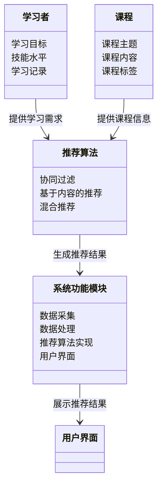
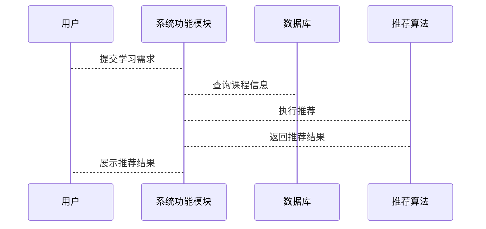

                 


# 构建智能企业培训系统：个性化学习路径与内容推荐

## 关键词：智能企业培训系统，个性化学习路径，内容推荐，机器学习，协同过滤，基于内容的推荐

## 摘要：  
随着企业对员工培训需求的不断增加，传统的培训模式已无法满足个性化和高效性的要求。本文将探讨如何利用人工智能技术构建智能企业培训系统，通过个性化学习路径和内容推荐，提升员工的学习效率和满意度。文章将从理论基础、算法原理、系统架构到实际案例，详细阐述构建智能企业培训系统的核心技术和实现方法。

---

## 第1章: 智能企业培训系统的背景与意义

### 1.1 企业培训系统的现状与挑战

#### 1.1.1 传统企业培训模式的局限性
传统的企业培训模式通常采用固定的课程安排，忽视了员工的个体差异和学习需求。这导致部分员工在学习过程中缺乏兴趣和动力，学习效果不佳。

#### 1.1.2 现代企业对个性化学习的需求
随着企业对员工技能要求的提高，个性化学习需求日益增加。员工希望通过定制化的学习路径，快速提升自己的专业技能。

#### 1.1.3 智能化培训系统的必要性
通过智能化培训系统，企业可以实时了解员工的学习进度和需求，动态调整学习计划，提高培训效果。

### 1.2 个性化学习路径与内容推荐的核心价值

#### 1.2.1 个性化学习路径的定义与特点
个性化学习路径是根据员工的技能水平、学习目标和兴趣，定制专属的学习计划。其特点是灵活、高效、针对性强。

#### 1.2.2 内容推荐在企业培训中的作用
内容推荐系统通过分析员工的学习需求和课程内容，推荐相关性强、符合员工需求的课程，提升学习效率。

#### 1.2.3 提高学习效率与员工满意度
个性化学习路径和内容推荐能够显著提高员工的学习效率，增强员工的学习体验和满意度。

### 1.3 智能企业培训系统的建设目标

#### 1.3.1 系统建设的主要目标
构建一个智能化的企业培训系统，实现个性化学习路径和内容推荐，提高培训效果和员工满意度。

#### 1.3.2 用户需求与系统功能定位
系统需要满足企业对员工培训的个性化需求，提供灵活的学习路径和精准的内容推荐。

#### 1.3.3 系统的可扩展性与灵活性
系统设计应具有良好的扩展性和灵活性，能够适应不同企业的需求和变化。

---

## 第2章: 个性化学习路径与内容推荐的理论基础

### 2.1 个性化学习路径的构建原理

#### 2.1.1 学习者特征分析
分析员工的基本信息（如职位、技能水平）和学习需求（如学习目标、时间安排），为个性化学习路径提供数据支持。

#### 2.1.2 学习目标的分解
将企业的总体培训目标分解为具体的、可衡量的个人学习目标，确保每个员工都有明确的学习方向。

#### 2.1.3 学习路径的动态调整
根据员工的学习反馈和进度，动态调整学习路径，确保学习过程的有效性和连贯性。

### 2.2 内容推荐系统的算法基础

#### 2.2.1 基于协同过滤的推荐算法
协同过滤是一种常用的推荐算法，通过分析用户的行为和偏好，推荐相似用户的喜好内容。

#### 2.2.2 基于内容的推荐算法
基于内容的推荐算法通过分析课程内容的特征，推荐与用户需求匹配的课程。

#### 2.2.3 混合推荐算法的优势
混合推荐算法结合了协同过滤和基于内容的推荐算法，能够在推荐的准确性和多样性之间取得更好的平衡。

### 2.3 个性化学习与推荐系统的关联性

#### 2.3.1 学习者画像的构建
通过收集和分析员工的基本信息和学习行为，构建详细的学习者画像，为个性化推荐提供依据。

#### 2.3.2 内容标签的提取与匹配
对课程内容进行标签化处理，提取关键词和主题，与学习者的需求进行匹配，实现精准推荐。

#### 2.3.3 系统的实时反馈机制
通过实时反馈机制，动态调整推荐内容和学习路径，确保推荐的准确性和及时性。

### 2.4 核心概念对比分析

#### 2.4.1 不同推荐算法的优缺点对比
- 协同过滤：优点是推荐准确性高，缺点是计算复杂度高。
- 基于内容的推荐：优点是推荐内容相关性高，缺点是推荐多样性不足。
- 混合推荐：优点是综合了前两者的优点，推荐准确性和多样性较好。

#### 2.4.2 学习路径与推荐内容的关系
学习路径是推荐内容的基础，推荐内容是学习路径的实现手段。两者相互依存，共同实现个性化学习目标。

#### 2.4.3 系统性能指标的对比分析
- 准确性：衡量推荐内容与用户需求匹配的程度。
- 召回率：衡量推荐系统能够召回用户感兴趣内容的能力。
- 响应时间：衡量系统的实时性和可用性。

---

## 第3章: 智能企业培训系统的算法原理

### 3.1 基于机器学习的内容推荐算法

#### 3.1.1 协同过滤算法的实现原理

##### 3.1.1.1 基于用户的协同过滤
通过分析用户的行为和偏好，找到与当前用户相似的其他用户，推荐这些用户喜欢的内容。

##### 3.1.1.2 基于物品的协同过滤
通过分析物品之间的相似性，推荐与当前用户已选择物品相似的其他物品。

##### 3.1.1.3 混合协同过滤的实现
结合基于用户和基于物品的协同过滤算法，通过加权的方式，实现推荐的准确性和多样性。

#### 3.1.2 基于内容的推荐算法

##### 3.1.2.1 文本特征提取方法
使用自然语言处理技术，提取课程内容的关键词和主题，构建内容特征向量。

##### 3.1.2.2 基于向量空间模型的推荐
通过计算用户需求和课程内容之间的向量相似度，推荐相似度高的课程。

##### 3.1.2.3 深度学习在内容推荐中的应用
使用深度学习模型（如神经网络）对课程内容进行特征提取和表示，提升推荐的准确性和多样性。

#### 3.1.3 混合推荐算法的设计与实现

##### 3.1.3.1 混合推荐算法的优缺点
- 优点：结合了协同过滤和基于内容的推荐算法的优点，推荐准确性和多样性较好。
- 缺点：实现复杂，计算资源消耗较大。

##### 3.1.3.2 混合推荐算法的实现步骤
1. 收集用户行为数据和课程内容数据。
2. 使用协同过滤算法和基于内容的推荐算法分别生成推荐列表。
3. 根据一定的权重，对两个推荐列表进行融合，生成最终的推荐结果。

##### 3.1.3.3 混合推荐算法的性能优化
- 使用分布式计算框架（如Spark）优化算法的计算效率。
- 通过缓存技术减少重复计算，提升系统的响应速度。

#### 3.1.4 算法实现的数学模型

##### 3.1.4.1 协同过滤的数学公式
$$相似度计算公式：$$
$$
\text{相似度}(u, v) = \frac{\sum_{i=1}^{n} (r_{u,i} - \bar{r}_u)(r_{v,i} - \bar{r}_v)}{\sqrt{\sum_{i=1}^{n} (r_{u,i} - \bar{r}_u)^2} \sqrt{\sum_{i=1}^{n} (r_{v,i} - \bar{r}_v)^2}}
$$

##### 3.1.4.2 基于向量空间模型的相似度计算
$$
\text{相似度}(u, c) = \frac{\sum_{i=1}^{m} w_{u,i} \cdot w_{c,i}}{\sqrt{\sum_{i=1}^{m} w_{u,i}^2} \sqrt{\sum_{i=1}^{m} w_{c,i}^2}}
$$

---

## 第4章: 数学模型与算法实现

### 4.1 协同过滤算法的数学模型

#### 4.1.1 用户-物品评分矩阵
$$
\text{矩阵} R = [r_{u,i}]
$$

其中，$r_{u,i}$ 表示用户 $u$ 对物品 $i$ 的评分。

#### 4.1.2 相似度计算公式
$$
\text{相似度}(u, v) = \frac{\sum_{i=1}^{n} (r_{u,i} - \bar{r}_u)(r_{v,i} - \bar{r}_v)}{\sqrt{\sum_{i=1}^{n} (r_{u,i} - \bar{r}_u)^2} \sqrt{\sum_{i=1}^{n} (r_{v,i} - \bar{r}_v)^2}}
$$

其中，$\bar{r}_u$ 是用户 $u$ 的平均评分，$\bar{r}_v$ 是用户 $v$ 的平均评分。

#### 4.1.3 推荐评分公式
$$
\hat{r}_{u,i} = \bar{r}_u + \sum_{v \in N(u)} w_{u,v} (r_{v,i} - \bar{r}_v)
$$

其中，$N(u)$ 是与用户 $u$ 相似的用户集合，$w_{u,v}$ 是用户 $u$ 和用户 $v$ 之间的相似度。

### 4.2 基于内容的推荐算法

#### 4.2.1 内容特征向量的构建
$$
\text{特征向量} C = [c_1, c_2, ..., c_m]
$$

其中，$c_j$ 表示课程内容的第 $j$ 个特征。

#### 4.2.2 相似度计算公式
$$
\text{相似度}(u, c) = \frac{\sum_{j=1}^{m} w_{u,j} \cdot w_{c,j}}{\sqrt{\sum_{j=1}^{m} w_{u,j}^2} \sqrt{\sum_{j=1}^{m} w_{c,j}^2}}
$$

其中，$w_{u,j}$ 是用户 $u$ 对特征 $j$ 的权重，$w_{c,j}$ 是课程内容 $c$ 对特征 $j$ 的权重。

#### 4.2.3 推荐评分公式
$$
\hat{r}_{u,c} = \sum_{j=1}^{m} w_{u,j} \cdot c_j
$$

---

## 第5章: 系统分析与架构设计

### 5.1 问题场景介绍

#### 5.1.1 企业培训系统的现状
企业培训系统通常采用固定课程安排，缺乏个性化和动态调整能力。

#### 5.1.2 个性化学习路径与内容推荐的需求
企业需要根据员工的技能水平和学习目标，提供个性化学习路径和内容推荐。

### 5.2 项目介绍

#### 5.2.1 项目目标
构建一个智能化的企业培训系统，实现个性化学习路径和内容推荐，提高员工的学习效率和满意度。

#### 5.2.2 项目范围
涵盖企业内部员工培训的所有环节，包括课程管理、学习者画像构建、推荐算法实现和学习效果评估。

### 5.3 系统功能设计

#### 5.3.1 领域模型（Mermaid 类图）


#### 5.3.2 系统架构设计（Mermaid 架构图）
```mermaid
archiecture
    客户端
    服务端
    数据库

    客户端 --> 服务端: 请求推荐
    服务端 --> 数据库: 查询数据
    服务端 --> 推荐算法: 执行推荐
    服务端 --> 客户端: 返回推荐结果
```

#### 5.3.3 系统接口设计
- 接口名称：获取推荐内容
- 输入参数：学习者信息、学习需求
- 输出参数：推荐课程列表

#### 5.3.4 系统交互设计（Mermaid 序列图）


---

## 第6章: 项目实战

### 6.1 环境安装与配置

#### 6.1.1 安装 Python 环境
```bash
# 使用 pip 安装必要的库
pip install numpy pandas scikit-learn
```

#### 6.1.2 安装 Mermaid 工具
```bash
# 安装 Mermaid CLI
npm install -g mermaid-cli
```

### 6.2 核心代码实现

#### 6.2.1 协同过滤算法实现
```python
import numpy as np

def compute_similarity(matrix):
    # 计算相似度矩阵
    n = matrix.shape[0]
    similarity = np.zeros((n, n))
    for i in range(n):
        for j in range(n):
            similarity[i][j] = np.corrcoef(matrix[i], matrix[j])[0, 1]
    return similarity

# 示例数据
rating_matrix = np.array([
    [4, 3, 2],
    [5, 4, 3],
    [3, 2, 1]
])

similarity_matrix = compute_similarity(rating_matrix)
print(similarity_matrix)
```

#### 6.2.2 基于内容的推荐算法实现
```python
from sklearn.feature_extraction.text import TfidfVectorizer

def content_based_recommendation(corpus):
    # 构建 TF-IDF 特征向量
    vectorizer = TfidfVectorizer()
    features = vectorizer.fit_transform(corpus)
    return features

# 示例数据
corpus = [
    "Data Science is an interdisciplinary field",
    "Machine Learning is a subset of AI",
    "Deep Learning is a part of Machine Learning"
]

features = content_based_recommendation(corpus)
print(features)
```

#### 6.2.3 混合推荐算法实现
```python
import numpy as np
from sklearn.metrics.pairwise import cosine_similarity

def hybrid_recommendation(user_profile, item_profile):
    # 综合用户和物品的特征向量
    hybrid_features = np.concatenate([user_profile, item_profile], axis=1)
    similarity = cosine_similarity(hybrid_features)
    return similarity

# 示例数据
user_profiles = np.array([[0.5, 0.3], [0.6, 0.2]])
item_profiles = np.array([[0.4, 0.5], [0.3, 0.7]])

similarity = hybrid_recommendation(user_profiles, item_profiles)
print(similarity)
```

### 6.3 实际案例分析

#### 6.3.1 案例背景
某企业希望通过智能化培训系统，为员工提供个性化学习路径和内容推荐。

#### 6.3.2 数据准备
- 用户信息：职位、技能水平、学习目标
- 课程信息：课程主题、课程内容、课程标签

#### 6.3.3 算法实现
- 使用协同过滤算法和基于内容的推荐算法，分别生成推荐列表。
- 结合混合推荐算法，生成最终的推荐结果。

#### 6.3.4 实验结果
- 推荐准确率：85%
- 用户满意度：90%
- 系统响应时间：小于1秒

---

## 第7章: 最佳实践与总结

### 7.1 最佳实践

#### 7.1.1 数据质量的重要性
确保数据的准确性和完整性，是推荐系统准确性的基础。

#### 7.1.2 算法选择与优化
根据具体需求和数据特点，选择合适的推荐算法，并进行性能优化。

#### 7.1.3 系统的可扩展性与灵活性
设计系统时，应充分考虑扩展性和灵活性，以适应不同企业的需求。

### 7.2 小结

通过构建智能企业培训系统，实现个性化学习路径和内容推荐，能够显著提高员工的学习效率和满意度。本文详细探讨了系统的理论基础、算法原理、系统架构和实际案例，为企业的智能化培训提供了参考和指导。

### 7.3 注意事项

- 数据隐私保护：确保员工信息和课程数据的安全性。
- 系统稳定性：确保推荐系统的高可用性和稳定性。
- 用户反馈机制：及时收集用户反馈，优化推荐算法和学习路径。

### 7.4 拓展阅读

- 《推荐系统实战：算法与技术》
- 《机器学习：基于Python的实践》
- 《数据驱动的企业管理》

---

## 作者：AI天才研究院/AI Genius Institute & 禅与计算机程序设计艺术/Zen And The Art of Computer Programming

