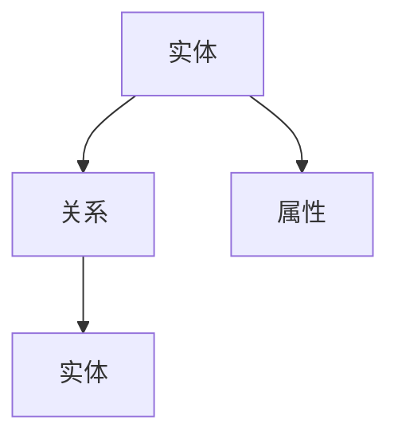
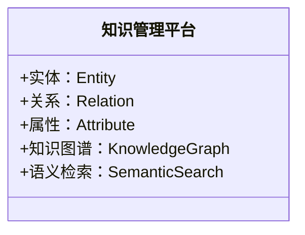
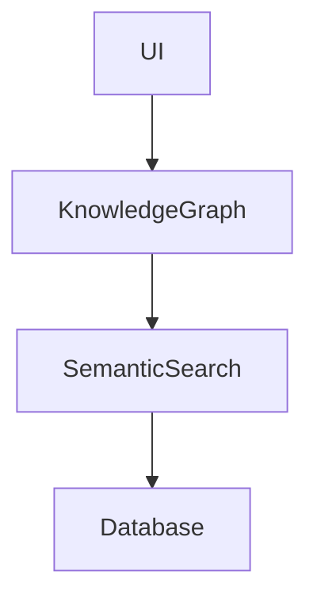

                 

<think>
嗯，用户希望我设计一本名为《构建智能企业知识管理平台：动态知识图谱与语义检索》的详细目录大纲。我需要确保这个大纲涵盖所有必要的部分，并且结构清晰，逻辑连贯。

首先，我需要理解这本书的核心主题。看起来，这本书主要涉及知识管理平台的构建，特别是动态知识图谱和语义检索技术。因此，我的目录应该围绕这两个核心点展开。

用户还提供了一个示例，里面有详细的章节和子章节。我应该参考这个结构，确保我的大纲同样详细且逻辑清晰。同时，用户强调了目录的完整性，要求超过7章，并且包含背景介绍、核心概念、算法原理、系统架构、项目实战等多个部分。

接下来，我需要考虑每一章的内容。首先是背景介绍，这部分需要涵盖问题背景、问题描述、解决方案、边界和外延，以及核心要素。这样读者可以了解为什么需要构建这样的平台，以及它的必要性。

然后是核心概念与联系。这部分需要详细解释动态知识图谱和语义检索的基本原理，可能包括它们的属性特征对比，以及用Mermaid流程图展示实体关系。这样可以帮助读者理解这些概念之间的联系。

接下来是算法原理。这部分需要详细讲解相关的算法，比如知识抽取、动态更新和语义检索算法。我需要用Mermaid流程图展示算法步骤，并用Python代码示例来说明。同时，数学模型和公式需要用Latex格式表示，确保准确性和可读性。

然后是系统分析与架构设计。这部分需要介绍项目背景，系统功能设计（可能用领域模型图展示），系统架构图（展示各个模块的交互），接口设计和交互序列图。这部分帮助读者理解系统的整体结构和各部分如何协作。

接下来是项目实战。这部分需要指导读者如何安装环境，实现核心功能，解读代码，并通过案例分析来巩固知识。最后，项目小结可以帮助读者回顾所学内容。

最后，是最佳实践、小结、注意事项和拓展阅读。这部分提供实用的建议，帮助读者在实际应用中避免常见错误，并引导他们进一步学习相关知识。

在设计目录时，我需要确保每一章都有明确的主题，并且子章节细化到三级。同时，要保持整体结构的连贯性和逻辑性，确保读者能够一步步深入理解主题。

综上所述，我将按照上述思考过程，系统地构建出一个详细且逻辑清晰的目录大纲，确保涵盖所有必要的部分，并且结构合理，内容完整。
</think>

# 构建智能企业知识管理平台：动态知识图谱与语义检索

---

## 关键词：
- 知识管理平台
- 动态知识图谱
- 语义检索
- 企业知识管理
- 人工智能
- 知识图谱构建
- 语义理解

---

## 摘要：
本文详细探讨了如何构建智能企业知识管理平台，重点分析了动态知识图谱与语义检索的核心技术。文章从背景介绍入手，分析了传统知识管理的局限性，提出了动态知识图谱与语义检索的解决方案。随后，详细讲解了动态知识图谱的构建原理、语义检索的实现方法，以及系统架构设计。通过实际案例分析，深入探讨了如何将动态知识图谱与语义检索技术应用于企业知识管理，并提供了系统的实现方案和最佳实践。本文旨在为企业构建智能知识管理平台提供理论基础与实践指导。

---

# 第一部分: 背景介绍与核心概念

---

# 第1章: 问题背景与问题描述

## 1.1 问题背景
### 1.1.1 企业知识管理的现状与挑战
企业在知识管理过程中面临以下问题：
- 知识分散：企业内部知识分布于不同部门、系统和文档中，难以统一管理和利用。
- 知识孤岛：各部门之间的知识无法有效共享，导致重复劳动和资源浪费。
- 知识更新慢：知识的更新和维护效率低下，难以适应快速变化的业务需求。
- 知识检索困难：传统检索技术难以理解语义，导致搜索结果不准确，用户体验差。

### 1.1.2 知识图谱与语义检索的提出
知识图谱是一种以结构化方式表示知识的技术，能够将分散的知识点连接起来，形成一个全局的知识网络。语义检索则是基于知识图谱的语义理解，实现更精准的信息检索。

### 1.1.3 动态知识图谱的必要性
动态知识图谱能够实时更新知识图谱中的信息，适应企业快速变化的需求，使知识管理更加灵活和高效。

## 1.2 问题描述
### 1.2.1 传统知识管理的局限性
- 依赖关键词匹配，无法理解语义。
- 知识孤岛问题导致资源浪费。
- 知识更新不及时，难以适应业务变化。

### 1.2.2 动态知识图谱的应用场景
- 实时更新企业知识库。
- 支持复杂业务场景下的知识检索。
- 为企业决策提供实时、准确的知识支持。

### 1.2.3 语义检索的核心问题
- 如何理解用户的真实需求。
- 如何在动态知识图谱中高效检索相关知识。
- 如何优化检索结果的准确性与相关性。

## 1.3 问题解决与边界
### 1.3.1 动态知识图谱的解决方案
- 通过知识抽取技术，从企业文档中提取结构化知识。
- 利用动态更新算法，实时维护知识图谱。
- 通过语义检索技术，实现基于知识图谱的智能搜索。

### 1.3.2 语义检索的关键技术
- 基于知识图谱的语义理解。
- 动态更新算法的应用。
- 高效检索算法的优化。

### 1.3.3 系统的边界与外延
- 系统边界：仅关注知识图谱的构建与检索，不涉及外部数据源。
- 外延：动态知识图谱可以应用于多个领域，如金融、医疗等。

## 1.4 核心概念与组成
### 1.4.1 动态知识图谱的定义
动态知识图谱是一种能够实时更新的结构化知识表示方法，包含实体、关系和属性。

### 1.4.2 语义检索的核心要素
语义检索基于知识图谱的语义理解，通过语义匹配实现更精准的信息检索。

### 1.4.3 知识管理平台的组成结构
知识管理平台由知识抽取、知识图谱构建、动态更新、语义检索四大模块组成。

## 1.5 本章小结
本章从企业知识管理的现状出发，分析了传统知识管理的局限性，提出了动态知识图谱与语义检索的解决方案，明确了系统的核心概念与组成结构。

---

# 第2章: 核心概念与联系

## 2.1 动态知识图谱的原理
### 2.1.1 知识抽取与表示
- 知识抽取：从文本中提取实体、关系和属性。
- 知识表示：通过结构化的形式表示知识，如三元组（头实体、关系、尾实体）。

### 2.1.2 知识图谱的构建过程
1. 数据预处理：清洗、去重、标准化。
2. 知识抽取：从文本中提取结构化知识。
3. 知识融合：将多个来源的知识整合到一个图谱中。
4. 知识存储：将知识图谱存储在数据库中。

### 2.1.3 动态更新机制
- 动态更新算法：实时更新知识图谱中的信息。
- 更新触发条件：当知识发生变化时，触发更新。

## 2.2 语义检索的原理
### 2.2.1 语义理解的基础
- 语义理解：基于知识图谱的语义分析，理解用户查询的意图。
- 实体识别：从查询中提取实体，用于语义分析。

### 2.2.2 检索算法的选择
- 基于向量的检索：将实体表示为向量，计算相似度。
- 基于图的检索：通过图谱中的路径进行检索。

### 2.2.3 结果的优化
- 排序算法：根据相关性对检索结果进行排序。
- 反馈机制：根据用户反馈优化检索结果。

## 2.3 核心概念对比与ER实体关系图
### 2.3.1 核心概念对比
| 特性       | 知识图谱         | 语义检索         |
|------------|------------------|------------------|
| 核心目标    | 表示知识         | 检索知识         |
| 实现方式    | 结构化表示       | 语义理解         |
| 应用场景    | 知识管理         | 智能搜索         |

### 2.3.2 ER实体关系图


## 2.4 本章小结
本章详细讲解了动态知识图谱和语义检索的核心原理，通过对比分析和实体关系图，明确了两者的联系与区别。

---

# 第3章: 算法原理与实现

## 3.1 知识抽取算法
### 3.1.1 算法原理
知识抽取通常包括分词、实体识别、关系抽取和属性抽取。

### 3.1.2 算法实现
```python
import spacy

nlp = spacy.load("en_core_web_sm")

def extract_entities(doc):
    entities = []
    for ent in doc.ents:
        entities.append((ent.start, ent.end, ent.label_))
    return entities
```

### 3.1.3 数学模型
$$ \text{实体识别} = \argmax_{i} P(\text{实体}_i | \text{文本}) $$

## 3.2 动态更新算法
### 3.2.1 算法原理
动态更新算法通过比较新旧知识图谱的差异，只更新发生变化的部分。

### 3.2.2 算法实现
```python
def update_kg(old_kg, new_kg):
    # 比较新旧知识图谱的差异
    # 更新知识图谱
    return updated_kg
```

## 3.3 语义检索算法
### 3.3.1 算法原理
语义检索基于向量空间模型，计算查询与结果之间的相似度。

### 3.3.2 算法实现
```python
from sentence_transformers import SentenceTransformer

model = SentenceTransformer('bert-base-nli-maxpool-v2')

def semantic_search(query, corpus_embeddings):
    query_embedding = model.encode(query)
    scores = np.dot(corpus_embeddings, query_embedding)
    return np.argsort(scores, axis=0)[::-1]
```

## 3.4 本章小结
本章详细讲解了知识抽取、动态更新和语义检索的核心算法，通过Python代码示例和数学公式，明确了算法的实现原理。

---

# 第4章: 系统分析与架构设计

## 4.1 项目背景
企业知识管理平台的目标是实现知识的高效管理与智能检索。

## 4.2 系统功能设计
### 4.2.1 功能模块
- 知识抽取模块
- 知识图谱构建模块
- 动态更新模块
- 语义检索模块

### 4.2.2 领域模型图


## 4.3 系统架构设计
### 4.3.1 架构图


### 4.3.2 接口设计
- API接口：RESTful API，支持GET、POST请求。
- 数据接口：与数据库交互，存储知识图谱。

## 4.4 本章小结
本章从项目背景出发，设计了系统的功能模块、领域模型图和架构图，明确了系统的实现方案。

---

# 第5章: 项目实战

## 5.1 环境安装
### 5.1.1 安装依赖
```bash
pip install spacy sentence-transformers networkx
```

## 5.2 系统核心实现
### 5.2.1 知识抽取实现
```python
import spacy

nlp = spacy.load("en_core_web_sm")

def extract_entities(doc):
    entities = []
    for ent in doc.ents:
        entities.append((ent.start, ent.end, ent.label_))
    return entities
```

### 5.2.2 语义检索实现
```python
from sentence_transformers import SentenceTransformer

model = SentenceTransformer('bert-base-nli-maxpool-v2')

def semantic_search(query, corpus_embeddings):
    query_embedding = model.encode(query)
    scores = np.dot(corpus_embeddings, query_embedding)
    return np.argsort(scores, axis=0)[::-1]
```

## 5.3 代码应用解读
### 5.3.1 知识抽取模块解读
知识抽取模块通过spaCy提取文本中的实体、关系和属性。

### 5.3.2 语义检索模块解读
语义检索模块基于BERT模型，实现语义相似度计算和检索。

## 5.4 案例分析
### 5.4.1 案例背景
假设企业需要构建一个员工信息的知识图谱。

### 5.4.2 实现步骤
1. 数据预处理：清洗员工信息数据。
2. 知识抽取：提取员工、职位、部门等实体。
3. 知识图谱构建：构建员工-职位-部门的关系图。
4. 语义检索：根据用户查询，检索相关员工信息。

## 5.5 本章小结
本章通过实际案例，详细讲解了系统的核心实现步骤，帮助读者理解如何将动态知识图谱与语义检索技术应用于企业知识管理。

---

# 第6章: 最佳实践与总结

## 6.1 最佳实践
### 6.1.1 知识抽取
- 使用高效的NLP工具，如spaCy、 stanza。
- 结合业务需求，优化抽取规则。

### 6.1.2 动态更新
- 定期检查知识图谱的变化，触发更新。
- 使用高效的存储和检索机制。

### 6.1.3 语义检索
- 选择合适的检索算法，优化检索效率。
- 提供用户反馈机制，优化检索结果。

## 6.2 小结
本文详细讲解了动态知识图谱与语义检索的核心技术，通过实际案例，展示了如何将这些技术应用于企业知识管理。

## 6.3 注意事项
- 知识图谱的构建需要结合业务需求，避免过于复杂。
- 动态更新算法需要考虑性能问题，避免影响系统效率。
- 语义检索需要结合用户行为分析，优化检索结果。

## 6.4 拓展阅读
- 知识图谱相关书籍：《知识图谱实战》。
- 语义检索相关书籍：《深度学习语义理解》。

---

# 作者：AI天才研究院/AI Genius Institute & 禅与计算机程序设计艺术 /Zen And The Art of Computer Programming

