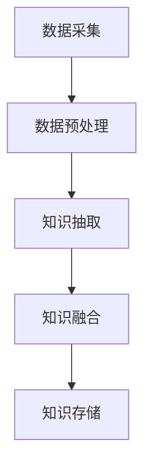
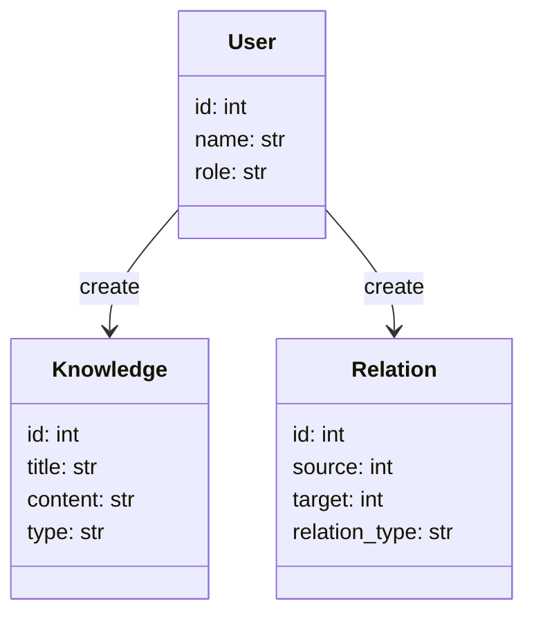

                 

<think>
嗯，我现在需要帮用户撰写一篇关于构建智能企业知识管理系统的技术博客文章。用户已经提供了一个详细的目录大纲，现在需要我根据这个大纲来完成整篇文章的撰写。用户的要求非常具体，包括每个章节的详细内容、技术术语的解释、算法的数学模型、系统架构图等等。我必须确保每个部分都涵盖到，并且内容详尽，结构清晰。

首先，我需要理解每个章节的内容。例如，第一章是背景介绍，需要涵盖问题背景、需求分析、核心概念和联系。我需要解释知识管理系统的重要性，个性化推荐和知识图谱的必要性，以及它们的定义和特点。这部分需要让读者明白为什么需要构建这样的系统，以及它与其他系统相比的优势。

接下来，第二章是核心概念与联系，需要详细解释知识图谱和个性化推荐，包括它们的构建方法、应用场景，以及如何将两者结合起来。这部分可能需要使用图表，比如ER图或流程图，来帮助读者理解。

第三章是知识图谱的构建，这部分需要详细的技术步骤，比如数据采集、预处理、构建本体和可视化。可能需要展示一些代码示例和流程图，以帮助读者理解实现过程。

第四章是个性化推荐算法，需要介绍协同过滤、基于内容的推荐和混合推荐。每种算法都需要详细解释，可能包括数学模型和公式，比如余弦相似度或矩阵分解。这部分需要确保读者能够理解这些算法的原理和实现方式。

第五章是系统分析与架构设计，需要讨论系统的需求分析、功能设计、架构设计和接口设计。可能需要使用Mermaid图来展示系统架构和交互流程。

第六章是项目实战，包括环境配置、核心代码实现、案例分析和系统优化。这部分需要实际操作，展示如何将理论应用到实践中，可能需要提供详细的代码和配置步骤。

最后，总结与展望部分，需要回顾全书内容，讨论当前技术的局限性和未来的发展方向，同时给出最佳实践的建议。

在撰写过程中，我需要确保每个部分都符合用户的格式要求，比如使用markdown格式，包含数学公式、图表和代码示例。同时，要保持文章的连贯性和逻辑性，确保读者能够轻松理解每个概念和步骤。

可能遇到的挑战包括解释复杂的算法和系统架构，确保内容通俗易懂，同时保持技术深度。为了克服这些挑战，我需要使用清晰的语言，提供详细的解释和例子，必要时使用图表来辅助说明。

总的来说，我需要一步步按照用户提供的目录大纲，逐步完成每个章节的内容，确保每个部分都详尽且符合要求。这需要耐心和细致的工作，但通过系统的分析和逐步推理，我相信能够完成一篇高质量的技术博客文章。
</think>

# 构建智能企业知识管理系统：个性化推荐与知识图谱集成

## 关键词：知识管理系统，个性化推荐，知识图谱，企业知识管理，智能推荐系统

## 摘要：  
本文详细探讨了构建智能企业知识管理系统的各个方面，重点介绍了个性化推荐与知识图谱的集成。文章首先分析了传统知识管理系统的局限性，阐述了智能化知识管理的需求与重要性。接着，深入探讨了知识图谱的构建方法及其在企业中的应用场景，分析了个性化推荐算法的原理与实现。随后，结合实际项目，展示了如何通过系统架构设计与核心代码实现，构建一个高效智能的知识管理系统。最后，总结了当前技术的局限性与未来发展方向，并给出了最佳实践建议。

---

# 第一部分：构建智能企业知识管理系统概述

## 第1章：问题背景与需求分析

### 1.1 问题背景

#### 1.1.1 传统知识管理系统的局限性  
传统的知识管理系统（KMS）通常依赖于简单的文件存储和检索功能，难以应对企业日益增长的复杂知识管理需求。例如，员工难以快速找到所需信息，知识的关联性与语义理解能力有限，导致知识利用率低下。

#### 1.1.2 智能化知识管理的需求驱动  
随着人工智能（AI）与大数据技术的快速发展，企业对知识管理的智能化需求日益增长。智能化知识管理系统需要具备以下特点：  
1. **语义理解**：能够理解知识的语义，支持自然语言查询。  
2. **知识关联**：能够发现知识之间的关联，支持知识网络的构建。  
3. **个性化推荐**：根据用户需求，个性化地推荐相关知识。  

#### 1.1.3 企业知识管理的重要性  
企业知识管理是提升企业竞争力的核心能力之一。通过有效的知识管理，企业可以：  
1. 提高知识利用率，加速决策过程。  
2. 促进知识共享，避免知识孤岛。  
3. 提升员工工作效率，降低学习成本。  

---

## 第2章：核心概念与联系

### 2.1 知识图谱的构建与应用

#### 2.1.1 知识图谱的构建方法  
知识图谱的构建通常包括以下步骤：  
1. **数据采集**：从多种来源（如文档、数据库、网页）采集数据。  
2. **数据预处理**：清洗、去重、标准化数据。  
3. **知识抽取**：从数据中提取实体、关系与属性。  
4. **知识表示**：将知识表示为图结构（如节点表示实体，边表示关系）。  
5. **知识融合**：将多个来源的知识进行融合，消除冲突。  

#### 2.1.2 知识图谱的存储与查询  
知识图谱的存储通常使用图数据库（如Neo4j），支持高效的图遍历查询。例如，使用SPARQL查询语言可以快速检索关联知识。

#### 2.1.3 知识图谱在企业中的应用场景  
1. **智能搜索**：基于知识图谱提供语义搜索。  
2. **知识关联**：发现知识之间的隐含关系。  
3. **智能推荐**：结合个性化推荐算法，提供更精准的知识推荐。  

### 2.2 个性化推荐算法

#### 2.2.1 协同过滤推荐  
协同过滤推荐基于用户行为相似性或物品相似性进行推荐。例如，基于用户的协同过滤（UserCF）推荐公式如下：  
$$ sim(u, v) = \frac{\sum_{i \in u \& v} r_i}{|u \& v|} $$  
其中，$sim(u, v)$ 表示用户 $u$ 和 $v$ 的相似度，$r_i$ 表示共同行为的评分。

#### 2.2.2 基于内容的推荐  
基于内容的推荐算法基于物品本身的属性进行推荐。例如，文本相似度计算可以使用余弦相似度：  
$$ sim(text_1, text_2) = \frac{\sum_{i=1}^n text_1[i] \cdot text_2[i]}{\sqrt{\sum_{i=1}^n text_1[i]^2} \cdot \sqrt{\sum_{i=1}^n text_2[i]^2}} $$  

#### 2.2.3 混合推荐算法  
混合推荐算法结合协同过滤和基于内容的推荐方法，通过加权融合两种方法的结果来提高推荐准确率。例如，使用线性回归模型：  
$$ r_{u,i} = \alpha r_{CF}(u,i) + \beta r_{CB}(u,i) $$  
其中，$\alpha$ 和 $\beta$ 是权重系数。

### 2.3 知识管理系统与推荐系统的集成

#### 2.3.1 系统集成的必要性  
通过集成知识图谱与推荐系统，可以实现知识的语义理解与个性化推荐，显著提升知识管理的效率与用户体验。

#### 2.3.2 系统集成的实现方式  
1. **数据共享**：知识图谱中的实体与关系作为推荐系统的输入数据。  
2. **协同优化**：推荐系统优化知识图谱的构建与完善。  
3. **服务集成**：通过API接口实现知识图谱与推荐系统的交互。  

#### 2.3.3 集成后的优势与挑战  
优势：  
1. 提高推荐的准确性与相关性。  
2. 支持复杂的语义查询与关联推荐。  
挑战：  
1. 知识图谱的构建与维护成本较高。  
2. 推荐算法的计算复杂度增加。  

---

# 第二部分：知识图谱构建与应用

## 第3章：知识图谱的构建方法

### 3.1 数据采集与预处理

#### 3.1.1 数据来源与采集方式  
数据来源包括企业文档、数据库、外部知识库等。数据采集方式包括爬虫、API接口调用等。

#### 3.1.2 数据清洗与标准化  
数据清洗包括去重、格式统一、错误修正等。例如，使用Python的`pandas`库进行数据清洗：  
```python
import pandas as pd
df = pd.read_csv('data.csv')
df.drop_duplicates(inplace=True)
df['year'] = df['year'].astype(int)
```

#### 3.1.3 数据标注与结构化  
数据标注需要将非结构化数据（如文本）转化为结构化数据。例如，使用自然语言处理（NLP）技术提取实体与关系。

### 3.2 知识抽取与表示

#### 3.2.1 实体识别与关系抽取  
实体识别可以使用NLP工具（如spaCy）实现。关系抽取可以通过规则匹配或深度学习模型（如BERT）实现。

#### 3.2.2 知识表示的向量化  
知识表示的向量化可以使用Word2Vec或GloVe模型。例如，实体向量表示为：  
$$ e_i = (w_1, w_2, ..., w_n) $$  
其中，$w_i$ 表示第 $i$ 个维度的权重。

#### 3.2.3 知识图谱的构建流程  
知识图谱的构建流程包括数据采集、预处理、知识抽取、知识融合与存储。流程图如下：  


### 3.3 知识图谱的可视化

#### 3.3.1 知识图谱的图形化展示  
知识图谱的可视化可以使用图数据库（如Neo4j）的内置工具，或使用Python的`networkx`库绘制图表。例如：  
```python
import networkx as nx
G = nx.DiGraph()
G.add_node('A')
G.add_node('B')
G.add_edge('A', 'B')
nx.draw(G, with_labels=True)
```

#### 3.3.2 可视化工具的选择与使用  
常用的可视化工具包括Neo4j的Cypher查询工具、Gephi、Cytoscape等。

#### 3.3.3 可视化在知识管理中的作用  
可视化帮助用户更好地理解知识之间的关联，支持知识的快速检索与学习。

---

## 第4章：个性化推荐算法与实现

### 4.1 个性化推荐算法原理

#### 4.1.1 协同过滤推荐  
协同过滤推荐基于用户行为相似性进行推荐。例如，基于用户的协同过滤（UserCF）公式：  
$$ sim(u, v) = \frac{\sum_{i \in u \& v} r_i}{|u \& v|} $$  

#### 4.1.2 基于内容的推荐  
基于内容的推荐基于物品本身的属性进行推荐。例如，文本相似度计算可以使用余弦相似度：  
$$ sim(text_1, text_2) = \frac{\sum_{i=1}^n text_1[i] \cdot text_2[i]}{\sqrt{\sum_{i=1}^n text_1[i]^2} \cdot \sqrt{\sum_{i=1}^n text_2[i]^2}} $$  

#### 4.1.3 混合推荐算法  
混合推荐算法结合协同过滤和基于内容的推荐方法，通过加权融合两种方法的结果来提高推荐准确率。例如，使用线性回归模型：  
$$ r_{u,i} = \alpha r_{CF}(u,i) + \beta r_{CB}(u,i) $$  

### 4.2 推荐系统的实现

#### 4.2.1 环境配置  
推荐系统的实现需要以下环境：  
1. Python编程语言  
2. 推荐算法库（如Surprise、LightFM）  
3. 数据库（如MySQL、MongoDB）  

#### 4.2.2 核心代码实现  
以下是协同过滤推荐的Python实现示例：  
```python
from surprise import SVD, Dataset, accuracy
from surprise.reader import Reader

# 加载数据集
data = Dataset.load_from_file('ratings.csv', format='csv', sep=',', header=None)
reader = Reader(rating_scale=(1, 5))

# 训练模型
algo = SVD()
algo.fit(data.build_full_train_set())

# 测试模型
test_set = data.build_test_set()
predictions = algo.test(test_set)

# 评估模型
accuracy.rmse(predictions)
```

#### 4.2.3 算法优化  
算法优化包括参数调整、模型调优等。例如，使用网格搜索优化协同过滤模型的参数：  
```python
from surprise.model_selection import GridSearchCV

# 定义参数范围
param_grid = {'n_factors': [50, 100], 'n_iter': [10, 20]}

# 网格搜索优化
grid_search = GridSearchCV(SVD, param_grid, cv=5)
grid_search.fit(data.build_full_train_set())

# 输出最优参数
print(grid_search.best_params_)
```

---

## 第5章：系统分析与架构设计

### 5.1 系统需求分析

#### 5.1.1 功能需求  
1. 知识录入与管理  
2. 知识检索与查询  
3. 个性化推荐  
4. 知识图谱可视化  

#### 5.1.2 性能需求  
1. 响应时间：秒级响应  
2. 并发能力：支持数百个并发用户  

#### 5.1.3 接口需求  
1. RESTful API接口  
2. 数据库接口  

### 5.2 系统功能设计

#### 5.2.1 领域模型设计  
领域模型设计使用Mermaid类图表示：  


#### 5.2.2 系统架构设计  
系统架构设计使用Mermaid架构图表示：  
```mermaid
graph TD
    User --> API Gateway
    API Gateway --> Knowledge Service
    Knowledge Service --> Knowledge Repository
    Knowledge Service --> Recommendation Service
    Recommendation Service --> User Profile
```

---

## 第6章：项目实战

### 6.1 环境配置

#### 6.1.1 技术选型  
1. 前端：React、Vue  
2. 后端：Python、Django  
3. 数据库：MySQL、Neo4j  
4. 推荐算法库：Surprise、LightFM  

#### 6.1.2 安装依赖  
安装Python环境并安装以下库：  
```bash
pip install surprise numpy pandas matplotlib
```

### 6.2 核心代码实现

#### 6.2.1 知识图谱构建  
以下是使用Python的`networkx`库构建知识图谱的代码示例：  
```python
import networkx as nx
G = nx.DiGraph()
G.add_node('A')
G.add_node('B')
G.add_edge('A', 'B', label='related_to')
nx.draw(G, with_labels=True)
```

#### 6.2.2 个性化推荐实现  
以下是协同过滤推荐的代码示例：  
```python
from surprise import SVD, Dataset, accuracy

# 加载数据集
data = Dataset.load_from_file('ratings.csv', format='csv', sep=',', header=None)

# 训练模型
algo = SVD()
algo.fit(data.build_full_train_set())

# 测试模型
test_set = data.build_test_set()
predictions = algo.test(test_set)

# 评估模型
print(accuracy.rmse(predictions))
```

### 6.3 案例分析与系统优化

#### 6.3.1 案例分析  
以某企业内部文档管理系统为例，通过知识图谱与推荐系统的集成，显著提高了文档的查找效率与相关性。

#### 6.3.2 系统优化  
1. **性能优化**：使用缓存技术（如Redis）优化查询速度。  
2. **算法优化**：采用分布式计算框架（如Spark）提升推荐效率。  

---

## 第7章：总结与展望

### 7.1 全文总结  
本文详细探讨了构建智能企业知识管理系统的各个方面，包括知识图谱的构建、个性化推荐算法的实现，以及系统的架构设计与优化。通过理论与实践的结合，展示了如何利用先进的技术手段提升企业的知识管理水平。

### 7.2 未来展望  
未来的研究方向包括：  
1. **多模态推荐**：结合文本、图像等多种数据源进行推荐。  
2. **动态知识图谱**：支持实时更新与演化。  
3. **强化学习应用**：利用强化学习优化推荐策略。  

---

## 作者：AI天才研究院 & 禅与计算机程序设计艺术

---

**本文由AI天才研究院（AI Genius Institute）出品，转载请注明出处。**

