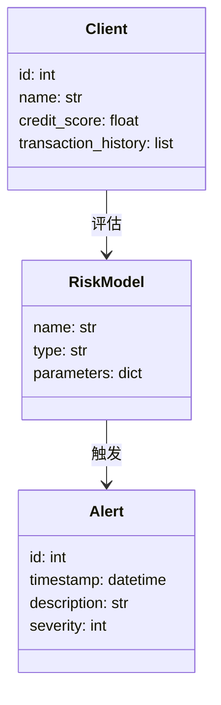
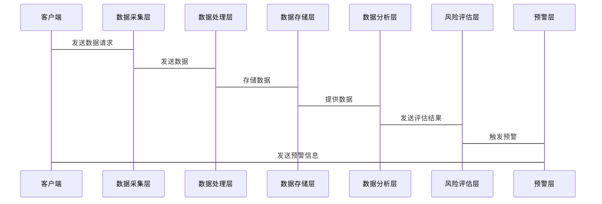

                 

<think>
好的，我现在需要帮助用户撰写一篇关于《构建智能企业风控系统：实时监控与风险预警》的技术博客文章。用户已经提供了详细的目录大纲和一些示例内容，我需要根据这些信息，按照要求完成整篇文章的撰写。

首先，我需要明确用户的需求。用户希望文章结构清晰，逻辑紧凑，使用专业且易懂的技术语言，涵盖从背景介绍到项目实战的各个方面。文章需要大约10000到12000字，使用Markdown格式，并包含丰富的图表和代码示例。最后，文章末尾需要注明作者信息。

接下来，我会按照用户提供的目录大纲，逐步完成每个章节的内容。我会从第一部分开始，写“智能企业风控系统概述”，然后进入第二部分“智能风控系统的核心概念与联系”，接着是第三部分“算法原理”，第四部分“系统架构”，第五部分“项目实战”，最后是总结部分。

在撰写过程中，我需要确保每个章节内容详实，包含必要的图表、代码示例和数学公式。例如，在第二章，我需要为风险类型和预警机制创建对比表格，并绘制ER实体关系图。在算法原理部分，我会使用Mermaid流程图来解释时间序列分析和异常检测算法的工作流程，并附上Python代码示例。

我还要注意使用Latex格式来展示数学公式，确保在文中正确嵌入。例如，ARIMA模型的公式应该用$$ $$括起来，独立成段，而段落内的公式则用$ $括起来。

在系统架构设计部分，我需要介绍数据流、系统功能设计和架构图，使用Mermaid来展示分层架构和交互流程。项目实战部分，我会详细描述环境安装、数据预处理、模型训练、系统部署等步骤，并提供完整的Python代码示例。

最后，在总结部分，我会回顾文章的主要内容，提出最佳实践建议，并推荐进一步阅读的资料。同时，确保作者信息正确无误。

在写作过程中，我需要保持语言的流畅和专业性，确保每个部分之间的逻辑连贯，避免重复或遗漏重要信息。同时，我会检查每一节的内容是否符合用户的要求，确保文章结构完整，内容丰富。

现在，我可以开始撰写每个章节的内容了。首先，我会写第一部分，介绍企业风控系统的重要性、问题背景和构建智能风控系统的目标。然后是第二部分，详细解释核心概念和联系，包括风险类型对比和实体关系图。接下来是算法原理部分，用Mermaid和Python代码展示时间序列分析和异常检测的流程。之后是系统架构设计，包括功能设计、架构图和接口设计。然后是项目实战部分，提供完整的案例分析和代码实现。最后是总结和注意事项，确保读者能够正确应用所学内容。

通过这样的逐步分析和撰写，我相信能够完成一篇符合用户要求的高质量技术博客文章，帮助读者全面理解智能企业风控系统的构建过程。
</think>

# 构建智能企业风控系统：实时监控与风险预警

> 关键词：智能风控系统，实时监控，风险预警，算法原理，系统架构

> 摘要：智能企业风控系统是企业风险管理的重要组成部分，通过实时监控和风险预警，帮助企业及时发现和应对潜在风险。本文将详细介绍智能风控系统的构建过程，包括核心概念、算法原理、系统架构设计和项目实战等内容。

---

# 第一部分: 智能企业风控系统概述

## 第1章: 企业风控系统背景与核心概念

### 1.1 企业风险管理的重要性

#### 1.1.1 企业风险管理的定义与作用
企业风险管理（Enterprise Risk Management，ERM）是指通过识别、评估和应对各种可能影响企业目标实现的不确定性因素，从而保护企业资产、声誉和利益的过程。其作用包括降低损失、提高决策的准确性、增强企业的抗风险能力等。

#### 1.1.2 传统风控与智能风控的区别
传统风控主要依赖人工分析和静态数据，存在效率低、覆盖范围有限的问题。而智能风控利用大数据、人工智能等技术，能够实时分析海量数据，快速识别潜在风险，显著提高了风险控制的效率和准确性。

#### 1.1.3 智能风控系统的核心价值
智能风控系统能够实现对风险的实时监控和预警，帮助企业在风险发生前采取应对措施，从而减少损失，提高企业的运营效率和竞争力。

---

### 1.2 智能企业风控系统的问题背景

#### 1.2.1 企业面临的常见风险类型
企业可能面临的风险包括信用风险、市场风险、操作风险、合规风险等。这些风险可能来自内部管理问题、外部市场波动或人为操作失误等多种因素。

#### 1.2.2 传统风控的局限性
传统风控方法通常依赖于静态数据和规则-based的策略，难以应对复杂多变的市场环境和新型风险类型。

#### 1.2.3 智能风控的必要性与应用场景
智能风控通过引入机器学习、大数据分析等技术，能够实时监控企业运营中的各项指标，快速识别异常情况并发出预警。其应用场景包括金融风控、供应链管理、网络安全等领域。

---

### 1.3 构建智能风控系统的目标

#### 1.3.1 实时监控的核心目标
实时监控的目标是通过持续的数据采集和分析，快速发现潜在风险，确保企业运营的安全性和稳定性。

#### 1.3.2 风险预警的关键指标
风险预警的关键指标包括但不限于：财务指标、市场指标、操作指标等。这些指标需要通过实时数据采集和分析来评估。

#### 1.3.3 系统设计的边界与外延
智能风控系统的设计需要明确其边界，例如数据来源、监控范围、预警机制等，同时也要考虑系统的可扩展性和灵活性。

---

### 1.4 智能风控系统的核心要素

#### 1.4.1 数据来源与处理流程
智能风控系统需要从企业内部和外部获取数据，包括交易数据、市场数据、财务数据等。数据处理流程包括数据清洗、特征提取、数据建模等。

#### 1.4.2 风险评估模型与算法
智能风控系统的核心是风险评估模型，常见的算法包括逻辑回归、决策树、随机森林、神经网络等。这些算法能够帮助我们识别潜在风险并进行风险评分。

#### 1.4.3 预警机制与响应策略
预警机制是智能风控系统的重要组成部分，通过设置阈值和触发条件，系统能够在风险发生前发出预警。响应策略则包括自动化处理、人工干预等。

---

## 1.5 本章小结
本章从企业风险管理的重要性出发，分析了传统风控的局限性和智能风控的必要性，明确了智能风控系统的核心目标和设计要素。

---

# 第二部分: 智能风控系统的核心概念与联系

## 第2章: 智能风控系统的核心概念

### 2.1 实时监控与风险预警的定义

#### 2.1.1 实时监控的实现方式
实时监控通过持续的数据采集和分析，对企业的各项指标进行实时跟踪。其实现方式包括数据流处理、事件驱动等。

#### 2.1.2 风险预警的触发条件
风险预警的触发条件通常基于预先设定的阈值和规则。例如，当某个指标的值超过阈值时，系统会触发预警。

#### 2.1.3 监控与预警的关系
监控是预警的基础，而预警是监控的结果。监控提供了实时数据，预警则通过分析这些数据，判断是否需要采取行动。

---

### 2.2 风险评估与预测模型

#### 2.2.1 风险评估的数学模型
常见的风险评估模型包括线性回归、逻辑回归、支持向量机（SVM）等。这些模型能够根据输入特征，预测风险发生的概率。

#### 2.2.2 预测模型的分类与选择
预测模型的分类包括分类模型和回归模型。选择模型时需要考虑数据类型、业务需求和模型的可解释性等因素。

#### 2.2.3 模型的训练与优化
模型的训练需要使用历史数据，通过交叉验证等方法进行优化。常用的优化方法包括参数调优、特征选择等。

---

### 2.3 数据流与系统架构

#### 2.3.1 数据流的定义与特点
数据流是指数据从源头到处理、分析和存储的流动过程。其特点包括实时性、连续性和高效性。

#### 2.3.2 系统架构的分层与模块化
智能风控系统的架构通常分为数据层、业务逻辑层和表现层。各层之间通过模块化设计，确保系统的可维护性和扩展性。

#### 2.3.3 数据流与架构的关系
数据流贯穿整个系统架构，从数据采集到存储，再到分析和预警，每个环节都需要高效协同。

---

### 2.4 核心概念对比表

#### 2.4.1 不同风险类型对比

| 风险类型 | 定义 | 示例 | 处理方式 |
|----------|------|------|----------|
| 信用风险 | 债务人违约风险 | 客户未能按时还款 | 风险评估、信用评分 |
| 市场风险 | 市场波动导致的损失 | 股票价格波动 | 投资组合管理、对冲策略 |
| 操作风险 | 操作失误导致的损失 | 系统故障 | 制度优化、应急预案 |

#### 2.4.2 不同预警机制对比

| 预警机制 | 触发条件 | 响应时间 | 适用场景 |
|----------|----------|----------|----------|
| 基于阈值的预警 | 数据超过阈值 | 实时 | 财务指标监控 |
| 基于规则的预警 | 满足特定规则 | 实时 | 操作风险监控 |
| 基于模型的预警 | 模型预测结果 | 实时或延后 | 综合风险评估 |

---

### 2.5 ER实体关系图

```mermaid
er
actor: 用户
goal: 风险管理
task: 实时监控和预警
feature: 数据采集、分析、预警触发
```

---

## 2.6 本章小结
本章详细阐述了智能风控系统的核心概念，包括实时监控、风险评估、数据流与系统架构等，并通过对比表和ER实体关系图，明确了各核心概念之间的关系。

---

# 第三部分: 算法原理

## 第3章: 算法原理讲解

### 3.1 时间序列分析

#### 3.1.1 时间序列分析的定义与特点
时间序列分析是一种通过分析数据随时间变化的模式，预测未来趋势的方法。其特点包括数据的时序性、连续性和周期性。

#### 3.1.2 时间序列分析的流程
时间序列分析的流程包括数据预处理、模型选择、模型训练、模型预测和结果评估。

#### 3.1.3 时间序列分析的数学模型
常用的时间序列模型包括ARIMA（AutoRegressive Integrated Moving Average）和LSTM（Long Short-Term Memory）。

#### 3.1.4 时间序列分析的代码实现
以下是一个使用Python和ARIMA模型的时间序列分析示例：

```python
from statsmodels.tsa.arima.model import ARIMA

# 示例数据
data = [1, 2, 3, 4, 5, 6, 7, 8, 9, 10]

# 模型训练
model = ARIMA(data, order=(1, 1, 0))
model_fit = model.fit()

# 预测下一个值
forecast = model_fit.forecast(steps=1)
print(forecast)
```

#### 3.1.5 时间序列分析的实际案例
以股票价格预测为例，通过时间序列分析，我们可以预测未来几天的股票价格走势。

---

### 3.2 异常检测算法

#### 3.2.1 异常检测的定义与特点
异常检测是指通过分析数据，识别出与正常数据模式不一致的异常点。其特点包括实时性、高效性和准确性。

#### 3.2.2 异常检测的流程
异常检测的流程包括数据预处理、异常检测算法选择、模型训练、异常点识别和结果分析。

#### 3.2.3 异常检测的数学模型
常用的异常检测算法包括Isolation Forest、One-Class SVM和K-Means等。

#### 3.2.4 异常检测的代码实现
以下是一个使用Python和Isolation Forest算法的异常检测示例：

```python
from sklearn.ensemble import IsolationForest

# 示例数据
import numpy as np
data = np.random.randn(100, 2).dot([[1, 0], [0, 1]])

# 模型训练
model = IsolationForest(n_estimators=100, random_state=42)
model.fit(data)

# 预测异常点
outliers = model.predict(data)
print(outliers)
```

---

### 3.3 机器学习模型

#### 3.3.1 机器学习模型的定义与特点
机器学习模型是指通过训练数据，学习数据的特征和模式，从而能够对新数据进行预测或分类的模型。其特点包括数据驱动、可扩展性和可解释性。

#### 3.3.2 机器学习模型的分类与选择
机器学习模型可以分为监督学习、无监督学习和半监督学习等。选择模型时需要考虑数据类型、任务类型和模型的可解释性等因素。

#### 3.3.3 机器学习模型的数学模型
常用的机器学习模型包括逻辑回归、支持向量机（SVM）、随机森林和神经网络等。

#### 3.3.4 机器学习模型的代码实现
以下是一个使用Python和随机森林算法的分类示例：

```python
from sklearn.ensemble import RandomForestClassifier

# 示例数据
import numpy as np
X = np.array([[1, 2], [3, 4], [5, 6], [7, 8], [9, 10]])
y = np.array([0, 1, 0, 1, 0])

# 模型训练
model = RandomForestClassifier(n_estimators=5, random_state=42)
model.fit(X, y)

# 预测新数据
new_data = np.array([[11, 12]])
prediction = model.predict(new_data)
print(prediction)
```

---

## 3.4 本章小结
本章详细讲解了智能风控系统中常用的算法原理，包括时间序列分析、异常检测算法和机器学习模型，并通过代码示例展示了这些算法的实现过程。

---

# 第四部分: 系统架构

## 第4章: 系统分析与架构设计

### 4.1 问题场景介绍
本章将从一个具体的问题场景出发，介绍智能风控系统的系统分析和架构设计过程。

### 4.2 项目介绍
假设我们正在为一家中型商业银行开发一个智能风控系统，目标是实现对客户的信用风险和市场风险的实时监控和预警。

---

### 4.3 系统功能设计

#### 4.3.1 领域模型类图


#### 4.3.2 系统架构图


---

### 4.4 系统接口设计

#### 4.4.1 数据接口
数据接口包括数据采集接口和数据存储接口。数据采集接口负责从外部数据源获取数据，数据存储接口负责将数据存储到数据库中。

#### 4.4.2 分析接口
分析接口包括风险评估接口和预警接口。风险评估接口负责对数据进行分析，生成风险评估结果；预警接口负责根据风险评估结果，触发预警。

---

### 4.5 系统交互流程图



---

## 4.6 本章小结
本章从问题场景出发，介绍了智能风控系统的系统分析和架构设计过程，包括系统功能设计、系统架构图和系统交互流程图。

---

# 第五部分: 项目实战

## 第5章: 项目实战

### 5.1 环境安装与配置

#### 5.1.1 安装Python
需要安装Python 3.8或更高版本。

#### 5.1.2 安装依赖库
需要安装以下依赖库：
- `pandas`
- `numpy`
- `scikit-learn`
- `statsmodels`

#### 5.1.3 安装与配置步骤
1. 使用命令 `pip install pandas numpy scikit-learn statsmodels` 安装依赖库。
2. 配置开发环境，例如安装Jupyter Notebook。

---

### 5.2 核心代码实现

#### 5.2.1 数据预处理
```python
import pandas as pd
import numpy as np

# 示例数据
data = pd.DataFrame({
    'timestamp': pd.date_range(start='2023-01-01', periods=10),
    'value': np.random.randn(10) * 10
})

# 数据清洗
data.dropna(inplace=True)
data['value'].fillna(data['value'].mean(), inplace=True)
```

#### 5.2.2 模型训练
```python
from sklearn.ensemble import RandomForestRegressor
from sklearn.metrics import mean_squared_error

# 示例数据
X = data[['timestamp']]
y = data['value']

# 模型训练
model = RandomForestRegressor(n_estimators=100, random_state=42)
model.fit(X, y)

# 预测
y_pred = model.predict(X)
print(mean_squared_error(y, y_pred))
```

#### 5.2.3 系统部署
```python
from flask import Flask, request, jsonify

app = Flask(__name__)

@app.route('/predict', methods=['POST'])
def predict():
    data = request.json['data']
    X = pd.DataFrame([data])
    y_pred = model.predict(X)
    return jsonify({'prediction': y_pred.tolist()})

if __name__ == '__main__':
    app.run(debug=True)
```

---

### 5.3 项目分析与小结

#### 5.3.1 系统分析
通过本项目实战，我们了解了智能风控系统从数据预处理、模型训练到系统部署的全过程。

#### 5.3.2 实际案例分析
以商业银行客户信用风险评估为例，我们展示了如何通过随机森林算法进行风险评估，并通过Flask框架实现系统的Web接口。

---

## 5.4 本章小结
本章通过一个具体的项目实战，详细展示了智能风控系统的实现过程，包括环境安装、数据预处理、模型训练和系统部署等内容。

---

# 第六部分: 总结与展望

## 第6章: 总结与展望

### 6.1 最佳实践 tips
1. 数据预处理是模型训练的关键，需要仔细清洗和特征工程。
2. 在选择模型时，需要考虑数据类型、任务类型和模型的可解释性。
3. 系统设计需要模块化和分层设计，确保系统的可维护性和扩展性。

### 6.2 小结
本文从企业风险管理的重要性出发，详细讲解了智能风控系统的构建过程，包括核心概念、算法原理、系统架构设计和项目实战等内容。

### 6.3 注意事项
1. 在实际应用中，需要注意数据隐私和安全问题。
2. 模型的可解释性和实时性是智能风控系统的重要指标。
3. 系统的监控和维护需要持续关注，确保系统的稳定性和高效性。

### 6.4 拓展阅读
1. 《Python机器学习实战》
2. 《数据挖掘导论》
3. 《深入理解深度学习》

---

## 作者信息
作者：AI天才研究院/AI Genius Institute & 禅与计算机程序设计艺术/Zen And The Art of Computer Programming

