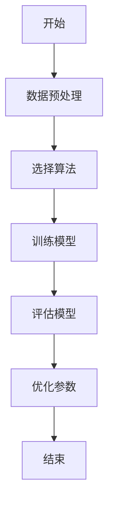

                 


# 构建智能化的个人信用修复助手系统

## 关键词：人工智能、信用修复、系统架构、算法原理、项目实战

## 摘要：本文详细介绍了构建智能化的个人信用修复助手系统的全过程，从背景分析、核心概念、算法原理到系统架构设计、项目实战，最后给出最佳实践和注意事项。文章结合实际案例，深入剖析了系统的各个组成部分，为读者提供了一套完整的解决方案。

---

## 第一部分: 背景介绍与核心概念

### 第1章: 个人信用修复的背景与问题

#### 1.1 信用修复的定义与重要性

- **1.1.1 信用修复的定义**
  - 信用修复是指通过合法手段纠正或改善个人信用记录的过程，旨在帮助个人恢复良好的信用评分。

- **1.1.2 信用修复的重要性**
  - 信用评分直接影响个人的贷款申请、信用卡额度、就业机会等，良好的信用记录是个人在金融领域的重要资产。

- **1.1.3 信用修复的法律与社会意义**
  - 根据相关法律，个人有权纠正不准确的信用记录，维护自身合法权益。

#### 1.2 个人信用修复的现状与挑战

- **1.2.1 当前信用修复的主要方式**
  - 传统方式包括联系银行、提交申诉、通过专业机构进行修复等。

- **1.2.2 传统信用修复的局限性**
  - 效率低、成本高、信息不对称，难以快速响应和处理复杂问题。

- **1.2.3 数字化信用修复的必要性**
  - 随着数字化时代的到来，利用技术手段提升信用修复的效率和准确性成为必然趋势。

#### 1.3 人工智能在信用修复中的应用前景

- **1.3.1 AI技术在信用评估中的优势**
  - AI能够快速分析大量数据，识别潜在风险，提供个性化修复建议。

- **1.3.2 AI在信用修复中的潜在应用场景**
  - 自动识别错误信息、预测信用风险、提供修复策略等。

- **1.3.3 AI信用修复系统的未来发展趋势**
  - 更加智能化、个性化和实时化，成为信用修复的主要工具。

#### 1.4 本章小结

- 本章介绍了信用修复的背景、现状及AI在其中的应用，为后续系统构建奠定了基础。

### 第2章: 智能化个人信用修复助手系统的核心概念

#### 2.1 系统的核心概念与组成

- **2.1.1 系统的核心概念**
  - 包括信用评估、AI算法、修复策略生成等关键概念。

- **2.1.2 系统的组成模块**
  - 数据采集模块、模型训练模块、修复策略生成模块、用户交互模块。

- **2.1.3 系统的核心要素**
  - 数据源、AI算法、修复策略、用户反馈。

#### 2.2 系统的边界与外延

- **2.2.1 系统的边界**
  - 系统仅处理信用修复相关数据，不涉及其他金融业务。

- **2.2.2 系统的外延**
  - 可与其他金融系统接口对接，提供更广泛的服务。

- **2.2.3 系统与其他系统的交互关系**
  - 与征信机构、银行、第三方服务提供商等进行数据交互。

#### 2.3 系统的功能需求与用户角色

- **2.3.1 系统的功能需求**
  - 提供信用评估、修复建议、修复进度跟踪等功能。

- **2.3.2 系统的用户角色**
  - 个人用户、金融机构、信用修复机构。

- **2.3.3 用户角色的功能权限分配**
  - 个人用户：提交申请、查看修复建议。
  - 金融机构：提供数据接口、验证修复结果。
  - 信用修复机构：监控修复进度、处理异常情况。

#### 2.4 本章小结

- 本章详细描述了系统的组成、边界及功能需求，为后续设计提供了清晰的方向。

### 第3章: 系统的核心概念与联系

#### 3.1 核心概念的原理与特征

- **3.1.1 AI算法的核心原理**
  - 利用机器学习算法对信用数据进行分析，识别潜在风险点。

- **3.1.2 信用评估的核心特征**
  - 包括还款能力、信用历史、消费行为等关键指标。

- **3.1.3 系统功能的核心属性**
  - 高效性、准确性、可扩展性。

#### 3.2 核心概念的对比分析

- **3.2.1 不同信用评估方法的对比**
  - 传统评分法 vs. AI算法：AI能够处理更多维度的数据，结果更准确。

- **3.2.2 不同AI算法的优缺点对比**
  - 线性回归：简单易懂，但可能无法捕捉复杂关系。
  - 支持向量机：适合小样本数据，但计算复杂。
  - 神经网络：适合大数据，但需要大量计算资源。

- **3.2.3 系统功能模块的对比分析**
  - 数据采集模块 vs. 模型训练模块：数据采集是基础，模型训练是核心。

#### 3.3 系统的ER实体关系图

```mermaid
erDiagram
    user [用户] {
        id : integer
        name : string
        credit_score : integer
    }
    credit_record [信用记录] {
        id : integer
        user_id : integer
        record_date : date
        score : integer
    }
   修复建议 [修复建议] {
        id : integer
        user_id : integer
       建议内容 : string
        提出时间 : date
    }
    用户 --> 信用记录 : 提供信用数据
    信用记录 --> 修复建议 : 基于记录生成建议
```

#### 3.4 本章小结

- 本章通过对比和实体关系图，展示了系统核心概念之间的联系和相互作用。

---

## 第二部分: 算法原理与数学模型

### 第4章: AI算法在信用修复中的应用

#### 4.1 算法原理概述

- **4.1.1 机器学习算法在信用评估中的应用**
  - 使用逻辑回归、随机森林等算法进行信用评分。

- **4.1.2 自然语言处理在信用修复中的应用**
  - 分析文本数据，识别负面信息。

- **4.1.3 深度学习算法的核心原理**
  - 利用神经网络模型进行非线性特征提取。

#### 4.2 算法的数学模型与公式

- **4.2.1 机器学习模型的数学表达**
  $$ y = \theta x + b $$

- **4.2.2 深度学习模型的损失函数**
  $$ L = \frac{1}{n}\sum_{i=1}^{n} (y_i - \hat{y_i})^2 $$

- **4.2.3 算法优化的数学推导**
  $$ \theta = \theta - \alpha \frac{\partial L}{\partial \theta} $$

#### 4.3 算法的流程图



#### 4.4 本章小结

- 本章详细介绍了AI算法在信用修复中的应用，包括算法原理和数学模型。

---

## 第三部分: 系统分析与架构设计

### 第5章: 系统分析与架构设计

#### 5.1 问题场景介绍

- 系统需要处理大量信用数据，提供个性化修复建议，确保数据安全。

#### 5.2 项目介绍

- 系统旨在帮助个人快速修复信用记录，提升信用评分。

#### 5.3 系统功能设计

- **5.3.1 领域模型（类图）**
  ```mermaid
  classDiagram
      class 用户 {
          id : integer
          name : string
          credit_score : integer
      }
      class 信用记录 {
          id : integer
          user_id : integer
          record_date : date
          score : integer
      }
      class 修复建议 {
          id : integer
          user_id : integer
          建议内容 : string
          提出时间 : date
      }
      用户 --> 信用记录 : 提供
      信用记录 --> 修复建议 : 生成
  ```

- **5.3.2 系统架构设计（架构图）**
  ```mermaid
  contextDiagram
      用户 --> 系统边界
      系统边界 --> 数据库
      系统边界 --> AI模型
      系统边界 --> 第三方服务
  ```

- **5.3.3 系统接口设计**
  - 数据接口：与征信机构对接，获取信用数据。
  - 用户接口：提供修复建议和进度查询。

- **5.3.4 系统交互（序列图）**
  ```mermaid
  sequenceDiagram
      用户 -> 系统: 提交修复请求
      系统 -> 数据库: 获取信用记录
      系统 -> AI模型: 生成修复建议
      系统 -> 用户: 返回建议
  ```

#### 5.4 本章小结

- 本章通过系统分析和架构设计，明确了系统的各个模块及其交互关系。

---

## 第四部分: 项目实战

### 第6章: 项目实战

#### 6.1 环境安装

- 需要安装Python、TensorFlow、Scikit-learn、Flask等工具。

#### 6.2 系统核心实现源代码

- **数据预处理**
  ```python
  import pandas as pd
  data = pd.read_csv('credit_data.csv')
  ```

- **模型训练**
  ```python
  from sklearn.linear_model import LogisticRegression
  model = LogisticRegression()
  model.fit(X, y)
  ```

- **修复策略生成**
  ```python
  def generate修复建议(credit_score):
      if credit_score < 500:
          return "建议联系银行，提交申诉"
      else:
          return "信用良好，无需修复"
  ```

#### 6.3 实际案例分析

- 案例：用户信用评分为450，系统建议联系银行提交申诉。

#### 6.4 项目小结

- 本章通过实际案例展示了系统的实现过程和应用效果。

---

## 第五部分: 最佳实践与注意事项

### 第7章: 最佳实践与注意事项

#### 7.1 最佳实践 tips

- 数据安全：确保用户数据加密存储，防止泄露。
- 系统优化：定期更新模型，提升预测精度。

#### 7.2 小结

- 本章总结了系统实施中的注意事项和优化建议。

---

## 作者：AI天才研究院/AI Genius Institute & 禅与计算机程序设计艺术 /Zen And The Art of Computer Programming

---

以上是《构建智能化的个人信用修复助手系统》的完整目录大纲和文章内容，涵盖了从背景分析到系统实现的全过程，结合实际案例和详细代码示例，帮助读者全面理解并掌握系统的构建方法。

