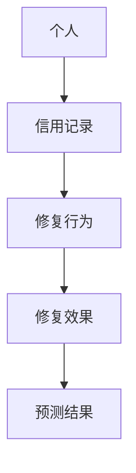
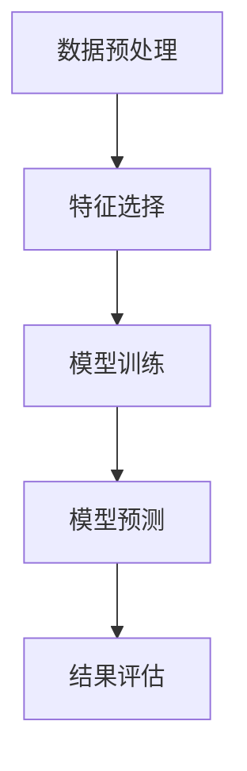

                 


# 构建智能化的个人信用修复效果预测器

## 关键词：
个人信用修复、信用评分、机器学习、预测模型、效果预测、系统架构、算法实现

## 摘要：
本文详细探讨了如何构建一个智能化的个人信用修复效果预测器。通过分析信用修复的背景与需求，结合机器学习算法和系统架构设计，提出了一种基于特征工程和模型优化的解决方案。文章从理论到实践，系统地介绍了预测器的设计思路、算法实现、系统架构以及实际案例分析，为读者提供了一套完整的信用修复效果预测方法。

---

# 第一部分: 背景介绍与问题定义

## 第1章: 个人信用修复效果预测器的背景与问题描述

### 1.1 信用修复的背景与意义
#### 1.1.1 信用修复的定义与重要性
信用修复是指通过改善个人的信用记录，修复因逾期、违约等行为导致的信用损害。良好的信用记录是个人在金融领域的重要资产，直接影响贷款审批、信用卡额度等金融行为。

#### 1.1.2 个人信用修复的现状与挑战
随着信用评分模型的广泛应用，个人信用修复的需求日益增加。然而，传统的信用修复效果评估方法通常依赖人工经验，缺乏智能化和精准性。修复效果的预测需要考虑多种因素，如修复行为的持续性、修复策略的有效性等。

#### 1.1.3 信用修复效果预测的必要性
信用修复效果预测器可以通过数据分析和机器学习算法，帮助个人和机构快速评估修复效果，制定最优修复策略，降低信用风险。

### 1.2 信用修复效果预测器的定义与目标
#### 1.2.1 预测器的核心目标
信用修复效果预测器的目标是通过输入个人信用记录和修复行为数据，输出修复效果的预测结果，包括信用评分的提升幅度、修复成功的概率等。

#### 1.2.2 预测器的功能边界与外延
- 输入：个人信用记录、修复行为数据
- 输出：修复效果预测结果
- 边界：不考虑外部经济环境和政策变化
- 外延：可扩展到企业信用修复效果预测

#### 1.2.3 预测器的核心要素与组成
- 数据采集模块
- 特征工程模块
- 模型训练模块
- 预测服务模块

---

## 第2章: 信用修复效果预测的核心概念与联系

### 2.1 核心概念原理
#### 2.1.1 信用评分模型的原理
信用评分模型通过分析个人信用历史、还款能力、行为特征等因素，计算出一个信用评分。常用的信用评分模型包括FICO评分和Vantage评分。

#### 2.1.2 修复效果预测的数学模型
修复效果预测模型基于信用评分的变化，结合修复行为的特征，预测修复后的信用评分提升幅度。

#### 2.1.3 修复效果预测器的输入输出关系
- 输入：修复行为数据（如还款记录、信用报告更新等）
- 输出：修复效果预测结果（如信用评分提升的概率、修复成功的可能性）

### 2.2 核心概念属性对比表
| 比较维度       | 信用评分模型           | 修复效果预测模型         |
|----------------|-----------------------|--------------------------|
| 核心目标       | 评估信用风险           | 预测修复效果             |
| 输入数据       | 信用历史、还款能力     | 修复行为数据、信用历史   |
| 输出结果       | 信用评分               | 修复效果预测结果         |
| 常用算法       | logistic regression    | random forest, XGBoost   |

### 2.3 ER实体关系图


---

# 第二部分: 算法原理与数学模型

## 第3章: 信用修复效果预测的算法原理

### 3.1 算法原理概述
#### 3.1.1 机器学习在信用修复中的应用
机器学习算法可以通过历史数据，学习信用修复行为与修复效果之间的关系，从而实现预测。

#### 3.1.2 常见预测算法的优缺点对比
| 算法名称       | 优点                     | 缺点                       |
|----------------|--------------------------|---------------------------|
| logistic regression | 简单、解释性强           | 非线性关系表现差           |
| random forest    | 高准确性、抗过拟合         | 对特征工程依赖较大         |
| XGBoost         | 高精度、支持并行计算       | 对参数敏感                 |

#### 3.1.3 选择合适算法的原则
- 数据量与复杂度
- 预测结果的可解释性要求
- 计算资源限制

### 3.2 算法流程图


### 3.3 数学模型与公式
#### 3.3.1 特征重要性评估公式
$$ \text{特征重要性} = \sum_{i=1}^{n} (f(x_i) \cdot w_i) $$
其中，$f(x_i)$ 是特征 $i$ 的影响程度，$w_i$ 是权重系数。

#### 3.3.2 模型调优公式
$$ \text{最优模型} = \argmin_{\theta} \sum_{i=1}^{m} (y_i - f(x_i, \theta))^2 $$
其中，$\theta$ 是模型参数，$y_i$ 是真实值，$f(x_i, \theta)$ 是模型预测值。

---

## 第4章: 算法实现与优化

### 4.1 算法实现步骤
#### 4.1.1 数据清洗与特征工程
- 数据清洗：处理缺失值、异常值
- 特征工程：提取关键特征（如还款频率、逾期天数等）

#### 4.1.2 模型训练与优化
- 选择合适的算法（如随机森林、XGBoost）
- 调整模型参数（如学习率、树深度）

#### 4.1.3 模型评估与优化
- 使用交叉验证评估模型性能
- 优化特征选择和模型参数

---

# 第三部分: 系统分析与架构设计

## 第5章: 系统架构设计

### 5.1 问题场景介绍
信用修复效果预测器需要处理大量信用数据，支持高并发请求，保证预测结果的准确性和实时性。

### 5.2 项目介绍
信用修复效果预测器是一个基于机器学习的系统，旨在帮助个人和机构快速评估信用修复效果。

### 5.3 系统功能设计
- 数据采集模块：获取个人信用记录和修复行为数据
- 特征工程模块：处理数据，提取关键特征
- 模型训练模块：训练预测模型
- 预测服务模块：提供API接口，返回预测结果

### 5.4 系统架构设计


---

## 第6章: 系统实现与代码解读

### 6.1 环境安装
- Python 3.8+
- NumPy、Pandas、Scikit-learn、XGBoost

### 6.2 核心代码实现
```python
import pandas as pd
import numpy as np
from sklearn.model_selection import train_test_split
from sklearn.ensemble import RandomForestClassifier
from xgboost import XGBClassifier
from sklearn.metrics import accuracy_score

# 数据加载与预处理
data = pd.read_csv('credit_data.csv')
data = data.dropna()
X = data.drop('target', axis=1)
y = data['target']

# 数据分割
X_train, X_test, y_train, y_test = train_test_split(X, y, test_size=0.2)

# 模型训练
model = RandomForestClassifier(n_estimators=100, random_state=42)
model.fit(X_train, y_train)

# 模型预测
y_pred = model.predict(X_test)

# 模型评估
print(accuracy_score(y_test, y_pred))
```

---

## 第7章: 项目实战与案例分析

### 7.1 实际案例分析
- 数据来源：信用报告数据
- 特征选择：逾期天数、还款频率、信用额度等
- 模型选择：随机森林和XGBoost对比

### 7.2 详细解读与分析
- 数据清洗：处理缺失值和异常值
- 特征工程：提取关键特征
- 模型训练：随机森林和XGBoost对比
- 模型评估：准确率、召回率、F1分数

---

## 第8章: 总结与展望

### 8.1 项目总结
信用修复效果预测器通过机器学习算法，实现了修复效果的智能化预测，提高了信用修复的效率和准确性。

### 8.2 项目局限性
- 数据质量和特征选择影响预测结果
- 模型对过时数据的敏感性

### 8.3 未来展望
- 引入时间序列分析，考虑修复行为的时间因素
- 增加情感分析，评估修复行为的稳定性

---

# 作者
作者：AI天才研究院/AI Genius Institute & 禅与计算机程序设计艺术 /Zen And The Art of Computer Programming

---

这篇文章通过系统地介绍信用修复效果预测器的背景、算法原理、系统架构和实际案例，为读者提供了一套完整的解决方案。希望对您有所帮助！

