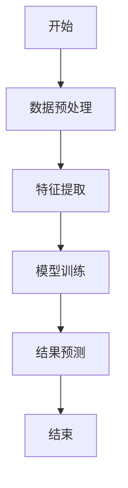
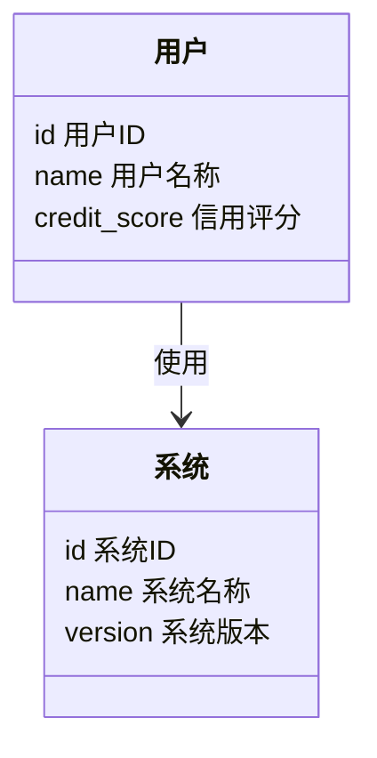
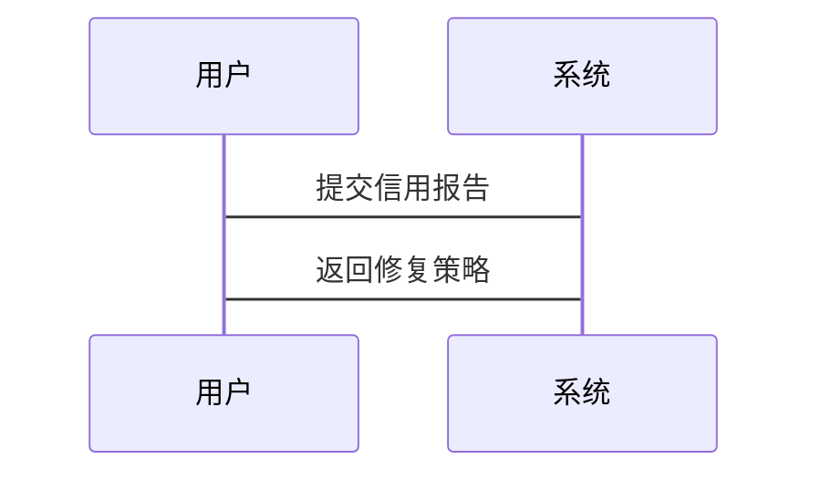

                 


# 《构建智能化的个人信用修复策略推荐系统》

## 关键词：信用修复，推荐系统，人工智能，大数据，个人信用评估

## 摘要：本文详细介绍了如何构建一个智能化的个人信用修复策略推荐系统。从背景介绍到核心算法，再到系统架构设计和项目实战，全面解析了系统的构建过程。通过分析信用修复的核心概念、推荐算法的原理、系统的功能模块和实际应用场景，本文为读者提供了一套完整的解决方案，帮助个人用户有效管理和修复信用记录。

---

# 第一部分：背景介绍与核心概念

## 第1章：个人信用修复策略推荐系统的背景与问题描述

### 1.1 个人信用修复的背景与意义

#### 1.1.1 个人信用修复的定义与重要性
个人信用修复是指通过合法手段，纠正和改善个人信用记录，以提升信用评分的过程。在现代社会中，信用评分不仅影响个人的贷款申请、信用卡额度，还可能影响就业、租房等重要事项。因此，个人信用修复具有重要意义。

#### 1.1.2 信用修复的法律与政策框架
在中国，个人信用修复主要依据《征信业管理条例》和相关法律法规。这些法规明确了信用修复的条件、程序和限制，为个人信用修复提供了法律依据。

#### 1.1.3 个人信用修复的现状与挑战
当前，个人信用修复主要通过人工方式完成，效率低、成本高。随着人工智能和大数据技术的发展，如何利用技术手段提高信用修复的效率和精准度，成为亟待解决的问题。

### 1.2 信用修复策略推荐系统的提出

#### 1.2.1 系统的目标与核心问题
系统的目标是通过分析用户的信用记录和行为数据，推荐最优的信用修复策略，帮助用户快速提升信用评分。核心问题是如何在大数据环境下，设计一个高效的推荐算法。

#### 1.2.2 系统的边界与外延
系统主要针对个人用户，不包括企业信用修复。系统的核心功能包括数据采集、策略推荐和效果评估。

#### 1.2.3 系统的核心要素与组成
系统由数据采集模块、数据分析模块、推荐算法模块和用户交互模块组成。各模块协同工作，完成信用修复策略的推荐。

### 1.3 系统的应用场景与价值

#### 1.3.1 个人信用修复的主要场景
- 信用卡逾期还款
- 贷款逾期
- 催收记录处理

#### 1.3.2 系统在金融领域的应用价值
- 提高信用评估的准确性
- 降低金融机构的风险
- 提升用户体验

#### 1.3.3 系统对个人用户的实际帮助
- 提供个性化的信用修复建议
- 提高信用评分
- 降低信用修复成本

### 1.4 本章小结

---

## 第2章：核心概念与联系

### 2.1 信用修复的定义与特征

#### 2.1.1 信用修复的定义
信用修复是通过合法途径，纠正和改善个人信用记录，以提升信用评分的过程。

#### 2.1.2 信用修复的核心特征对比
| 特征       | 信用评分       | 信用修复       |
|------------|----------------|----------------|
| 定义       | 衡量信用状况的指标 | 纠正信用记录的过程 |
| 影响因素   | 还款记录、信用历史 | 还款行为、信用报告 |
| 作用       | 评估信用风险 | 改善信用状况 |

### 2.2 个人信用修复策略推荐系统的原理

#### 2.2.1 系统的基本原理
系统通过分析用户的信用记录、消费行为和还款习惯，利用机器学习算法，推荐最优的信用修复策略。

#### 2.2.2 系统的核心功能模块
- 数据采集模块
- 数据分析模块
- 策略推荐模块
- 用户交互模块

#### 2.2.3 系统的输入与输出
- 输入：用户的信用报告、消费数据、还款记录
- 输出：推荐的信用修复策略

### 2.3 核心概念的ER实体关系图

```mermaid
erDiagram
    user {
        id 用户ID
        name 用户名称
        credit_score 信用评分
    }
    system {
        id 系统ID
        name 系统名称
        version 系统版本
    }
    user ~{system} "使用"~
```

### 2.4 本章小结

---

## 第3章：算法原理与数学模型

### 3.1 算法原理概述

#### 3.1.1 算法的选择与优化
推荐算法可以选择协同过滤、基于内容的推荐或基于深度学习的推荐。协同过滤适用于数据量小的情况，深度学习适用于数据量大的情况。

#### 3.1.2 算法的输入与输出
- 输入：用户的信用数据、行为数据
- 输出：推荐的信用修复策略

#### 3.1.3 算法的流程图



### 3.2 数学模型与公式

#### 3.2.1 相似度计算公式

$$
相似度(i, j) = \frac{\sum_{k=1}^{n} (x_{i,k} - \bar{x_i})(x_{j,k} - \bar{x_j})}{\sqrt{\sum_{k=1}^{n} (x_{i,k} - \bar{x_i})^2} \cdot \sqrt{\sum_{k=1}^{n} (x_{j,k} - \bar{x_j})^2}}
$$

其中，$x_{i,k}$ 是用户i的第k个特征值，$\bar{x_i}$是用户i的特征平均值。

---

# 第二部分：系统分析与架构设计

## 第4章：系统分析与架构设计方案

### 4.1 问题场景介绍

#### 4.1.1 系统需要解决的问题
- 数据分散，难以整合
- 算法复杂，难以实现
- 用户需求多样，难以满足

### 4.2 项目介绍

#### 4.2.1 项目目标
构建一个智能化的个人信用修复策略推荐系统。

### 4.3 系统功能设计

#### 4.3.1 领域模型设计



### 4.4 系统架构设计

#### 4.4.1 系统架构图


### 4.5 系统接口设计

#### 4.5.1 系统接口设计
- 数据接口：提供数据导入和导出功能
- 用户接口：提供用户交互界面

### 4.6 系统交互设计

#### 4.6.1 系统交互流程图



---

## 第5章：项目实战

### 5.1 环境安装与配置

#### 5.1.1 环境要求
- Python 3.6+
- scikit-learn、pandas等库

### 5.2 系统核心实现

#### 5.2.1 核心代码实现

```python
import pandas as pd
from sklearn.metrics.pairwise import cosine_similarity

# 数据预处理
def preprocess_data(data):
    # 假设data是数据框
    return data.dropna()

# 特征提取
def extract_features(data):
    return data[['信用评分', '还款记录']]

# 模型训练
def train_model(features):
    # 使用余弦相似度计算
    similarity_matrix = cosine_similarity(features)
    return similarity_matrix

# 结果预测
def predict_strategy(similarity_matrix, user_id):
    # 假设用户ID是整数
    top_users = 3  # 推荐的用户数量
    strategies = []
    return strategies
```

#### 5.2.2 代码解读与分析
- preprocess_data函数：处理缺失值
- extract_features函数：提取特征
- train_model函数：计算相似度矩阵
- predict_strategy函数：根据相似度推荐策略

### 5.3 实际案例分析

#### 5.3.1 案例分析
- 用户A：信用评分600，有一次逾期记录
- 系统推荐：优先偿还逾期贷款，保持良好的还款记录

### 5.4 项目总结

#### 5.4.1 项目成果
- 成功构建推荐系统
- 提高信用修复效率

#### 5.4.2 经验总结
- 数据质量影响推荐效果
- 算法选择需结合数据特点

---

## 第6章：最佳实践与总结

### 6.1 小结
通过本文的介绍，读者可以了解如何构建智能化的个人信用修复策略推荐系统。从背景介绍到算法实现，再到系统架构设计，每一步都至关重要。

### 6.2 注意事项
- 数据隐私保护
- 算法的可解释性
- 系统的可扩展性

### 6.3 拓展阅读
- 《推荐系统实战》
- 《机器学习在金融领域的应用》

---

# 作者：AI天才研究院 & 禅与计算机程序设计艺术

---

本文通过详细的背景介绍、核心概念分析、算法原理阐述、系统架构设计和项目实战，为读者提供了一套完整的构建智能化个人信用修复策略推荐系统的解决方案。希望本文能为相关领域的研究和实践提供有价值的参考。

