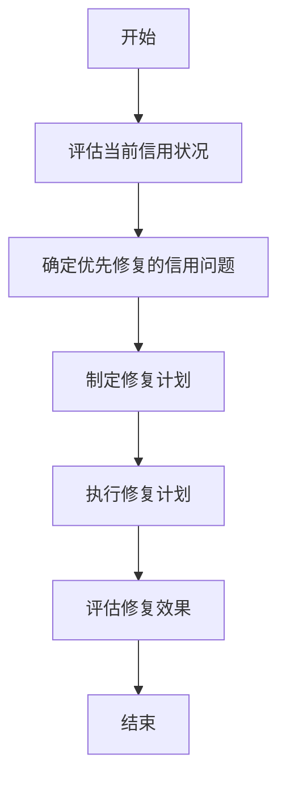
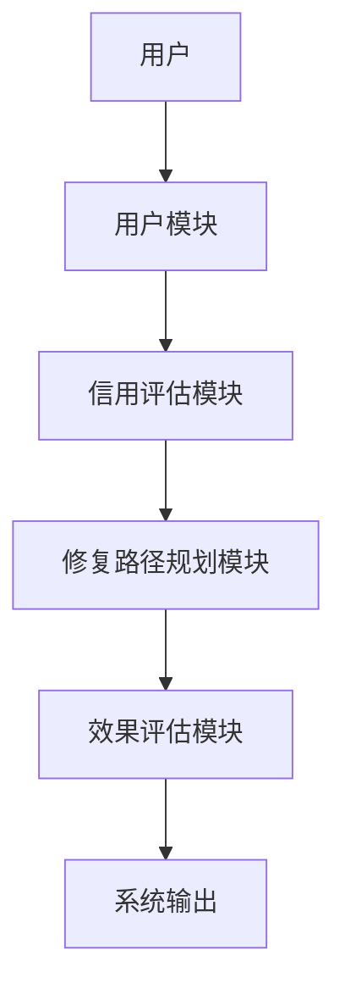

                 

<think>
好的，我现在需要帮用户撰写一篇关于《构建智能化的个人信用修复路径规划系统》的技术博客文章。用户已经提供了一个详细的目录大纲，并要求文章结构完整，内容详细，满足特定的格式和内容要求。

首先，我需要理解用户的需求。用户希望文章涵盖背景介绍、核心概念、算法原理、系统分析、项目实战和小结等多个部分，每个部分都需要详细展开，包括术语解释、问题背景、算法流程图、数学公式、系统架构图等。此外，用户还要求文章使用markdown格式，包含特定的标签和结构，例如关键词、摘要，以及详细的章节内容。

接下来，我需要按照目录大纲逐步构建每个部分的内容。首先，文章标题和关键词需要明确，然后是摘要，接着是正文部分。每个章节需要有三级标题，内容详细且技术性强。例如，在背景介绍部分，需要解释信用修复的重要性和智能化修复的必要性。在核心概念部分，需要用表格和ER图展示系统的实体关系。

然后，在算法原理部分，需要用mermaid流程图展示机器学习算法的步骤，并附上Python代码示例。数学公式需要用latex格式表示，并嵌入到文中。系统分析部分需要设计系统的架构图和交互流程图，展示系统的各个模块和用户流程。

项目实战部分需要提供代码实现，解释代码的功能，并分析实际案例。最后，在最佳实践部分，给出小贴士和总结，同时建议进一步的学习方向。

我需要确保每个部分的内容都符合用户的要求，逻辑清晰，结构紧凑。同时，文章需要控制在10000到12000字左右，确保内容的完整性和深度。最后，文章末尾需要添加作者信息，符合格式要求。

现在，我开始撰写每个部分，确保每个章节都详细展开，满足用户的所有要求，并且保持技术博客的专业性和可读性。
</think>

# 构建智能化的个人信用修复路径规划系统

---

## 关键词

- 个人信用修复
- 路径规划系统
- 人工智能
- 算法原理
- 系统架构设计

---

## 摘要

本文旨在探讨如何构建一个智能化的个人信用修复路径规划系统。随着信用评估在现代社会中的重要性日益增加，个人信用修复的需求也逐渐上升。传统的信用修复方法往往依赖人工经验，效率低下且缺乏个性化。本文通过结合人工智能、机器学习和大数据分析等技术，提出了一种智能化的信用修复路径规划系统。该系统能够根据个人的信用状况，自动分析并生成个性化的修复路径，从而提高修复效率和效果。文章从系统背景、核心概念、算法原理、系统架构设计、项目实战等多个方面展开详细讨论，为读者提供一个全面的技术视角。

---

## 第一部分：个人信用修复路径规划系统背景介绍

### 第1章：个人信用修复的背景与意义

#### 1.1 信用体系的重要性

在现代社会，信用体系是衡量个人或企业经济能力的重要标准。良好的信用记录可以带来更多的金融服务机会、更低的贷款利率，甚至影响个人的职业发展和社交信用。然而，由于各种原因，个人的信用记录可能出现瑕疵，如逾期还款、欠款等。如何有效地修复信用记录，成为了许多人面临的重要问题。

#### 1.2 个人信用修复的需求

随着信用评估的普及，越来越多的人意识到信用修复的重要性。传统的信用修复方法通常依赖于个人的经验和主观判断，这种方式效率低下，且缺乏系统性和科学性。例如，个人可能不知道如何优先处理哪些信用问题，或者如何制定最优的还款计划。因此，一种基于智能化技术的信用修复路径规划系统显得尤为重要。

#### 1.3 智能化修复的必要性

智能化信用修复系统可以通过大数据分析和机器学习算法，快速分析个人的信用状况，并根据历史数据和模型预测，生成最优的修复路径。这种方式不仅能够提高修复效率，还能够确保修复计划的科学性和可行性。与传统方法相比，智能化修复系统的优点在于其高效性、准确性和个性化。

---

### 第2章：智能化个人信用修复的核心概念

#### 2.1 个人信用修复路径规划系统的定义

个人信用修复路径规划系统是一种基于人工智能和大数据分析的系统，旨在根据个人的信用记录和财务状况，自动分析并生成个性化的信用修复计划。该系统的核心目标是帮助个人快速、有效地修复信用记录，提升信用评分。

#### 2.2 核心概念与联系

为了更好地理解系统的运作原理，我们需要明确以下几个核心概念：

- **信用评估模型**：用于评估个人信用状况的数学模型。
- **修复路径规划算法**：根据信用评估结果，生成最优修复路径的算法。
- **系统架构设计**：系统整体的架构和模块划分。

通过将这些核心概念有机地结合在一起，我们可以构建一个完整的智能化信用修复系统。

---

## 第二部分：智能化个人信用修复系统的核心原理

### 第3章：信用修复路径规划的算法原理

#### 3.1 基于机器学习的信用评估

##### 3.1.1 数据特征提取

在信用评估过程中，数据特征的提取是关键步骤。我们需要从个人的信用记录中提取出能够反映信用状况的特征，例如：

- 过去的还款记录
- 逾期次数
- 债务总额
- 信用历史长度

这些特征将作为机器学习模型的输入。

##### 3.1.2 模型训练与优化

我们选择一个适合信用评估的机器学习模型，例如逻辑回归或随机森林。通过训练数据集对模型进行训练，并根据验证数据集进行模型优化。最终，我们得到一个能够预测个人信用评分的模型。

##### 3.1.3 预测与评估

利用训练好的模型，我们可以对个人的信用状况进行预测，并根据预测结果进行信用评估。

#### 3.2 修复路径规划算法

##### 3.2.1 算法选择与实现

在修复路径规划算法中，我们可以选择一种基于贪心算法的方法。该算法的核心思想是优先处理对信用评分影响最大的问题，从而快速提升信用评分。

##### 3.2.2 算法流程图

以下是一个修复路径规划算法的流程图：



##### 3.2.3 算法复杂度分析

修复路径规划算法的时间复杂度主要取决于信用问题的数量和优先级的排序。在最坏情况下，算法的时间复杂度为O(n^2)，其中n是信用问题的数量。

### 第4章：数学模型与公式

#### 4.1 信用评估模型

##### 4.1.1 模型公式

信用评分模型可以表示为：

$$
\text{信用评分} = \alpha \cdot \text{还款记录} + \beta \cdot \text{逾期次数} + \gamma \cdot \text{债务总额} + \delta \cdot \text{信用历史长度}
$$

其中，$\alpha$、$\beta$、$\gamma$、$\delta$ 是模型的系数，需要通过训练数据进行优化。

##### 4.1.2 模型解释

信用评分模型是一个线性回归模型，通过加权求和的方式计算个人的信用评分。模型的系数反映了各个特征对信用评分的影响程度。

##### 4.1.3 示例计算

假设某个人的还款记录为90，逾期次数为2，债务总额为5000，信用历史长度为5年。假设系数为 $\alpha = 0.4$，$\beta = 0.3$，$\gamma = 0.2$，$\delta = 0.1$。则其信用评分为：

$$
\text{信用评分} = 0.4 \times 90 + 0.3 \times 2 + 0.2 \times 5000 + 0.1 \times 5 = 36 + 0.6 + 1000 + 0.5 = 1037.1
$$

#### 4.2 修复路径规划模型

##### 4.2.1 算法公式

修复路径规划算法的核心公式为：

$$
\text{优先级} = \frac{\text{信用评分提升潜力}}{\text{修复成本}}
$$

其中，修复成本包括时间和经济成本。

##### 4.2.2 算法步骤

修复路径规划算法的步骤如下：

1. 计算每个信用问题的信用评分提升潜力。
2. 计算每个信用问题的修复成本。
3. 根据优先级公式，确定优先修复的信用问题。
4. 制定修复计划并执行。

---

## 第三部分：系统分析与架构设计

### 第5章：系统分析与需求分析

#### 5.1 系统目标与范围

本系统的目标是为用户提供个性化的信用修复路径规划服务。系统的主要功能包括：

- 信用评估
- 修复路径规划
- 修复计划执行
- 效果评估

#### 5.2 系统功能设计

##### 5.2.1 用户模块

- 用户登录与注册
- 信用记录查询
- 修复计划管理

##### 5.2.2 信用评估模块

- 数据采集与处理
- 信用评估
- 评估结果展示

##### 5.2.3 修复路径规划模块

- 优先级计算
- 修复路径生成
- 计划执行与监控

### 第6章：系统架构设计

#### 6.1 系统架构图

以下是一个可能的系统架构图：



#### 6.2 系统交互设计

##### 6.2.1 用户登录流程

1. 用户输入用户名和密码。
2. 系统验证用户身份。
3. 登录成功后，用户进入主界面。

##### 6.2.2 信用评估流程

1. 用户提交信用记录。
2. 系统进行数据处理和分析。
3. 系统生成信用评估报告。

##### 6.2.3 修复路径生成流程

1. 用户选择修复目标。
2. 系统计算修复路径。
3. 系统输出修复计划。

---

## 第四部分：项目实战与实现

### 第7章：环境搭建与核心代码实现

#### 7.1 环境安装

- Python 3.8 或更高版本
- NumPy、Pandas、Scikit-learn 等库

#### 7.2 核心代码实现

##### 7.2.1 信用评估模型

```python
import numpy as np
from sklearn.linear_model import LinearRegression

# 示例数据
X = np.array([[90, 2, 5000, 5]]).T
y = np.array([1037.1])

# 模型训练
model = LinearRegression()
model.fit(X, y)

# 预测信用评分
predicted_score = model.predict(X)
print("预测信用评分:", predicted_score)
```

##### 7.2.2 修复路径规划算法

```python
def calculate_priority(improvement_potential, cost):
    return improvement_potential / cost

# 示例数据
issues = [
    {"name": "逾期还款", "potential": 10, "cost": 2},
    {"name": "债务总额", "potential": 5, "cost": 1},
    {"name": "信用历史", "potential": 8, "cost": 3}
]

# 计算优先级
priorities = {}
for issue in issues:
    priority = calculate_priority(issue["potential"], issue["cost"])
    priorities[issue["name"]] = priority

print("优先级:", priorities)
```

---

## 第五部分：总结与展望

### 第8章：总结与最佳实践

#### 8.1 总结

本文详细探讨了如何构建一个智能化的个人信用修复路径规划系统。通过结合机器学习、大数据分析和系统架构设计，我们可以实现个性化的信用修复路径规划，从而提高修复效率和效果。

#### 8.2 最佳实践

- 数据质量是关键：确保数据的完整性和准确性。
- 模型调优：根据实际需求不断优化模型参数。
- 系统维护：定期更新模型和修复路径规划算法。

#### 8.3 展望

未来，随着人工智能和大数据技术的不断发展，智能化信用修复系统将更加智能化和个性化。我们可以通过引入更复杂的算法和更多的数据源，进一步提升系统的性能和效果。

---

## 作者

作者：AI天才研究院/AI Genius Institute & 禅与计算机程序设计艺术 /Zen And The Art of Computer Programming

--- 

感谢您的阅读！希望本文对您理解智能化个人信用修复路径规划系统有所帮助。

