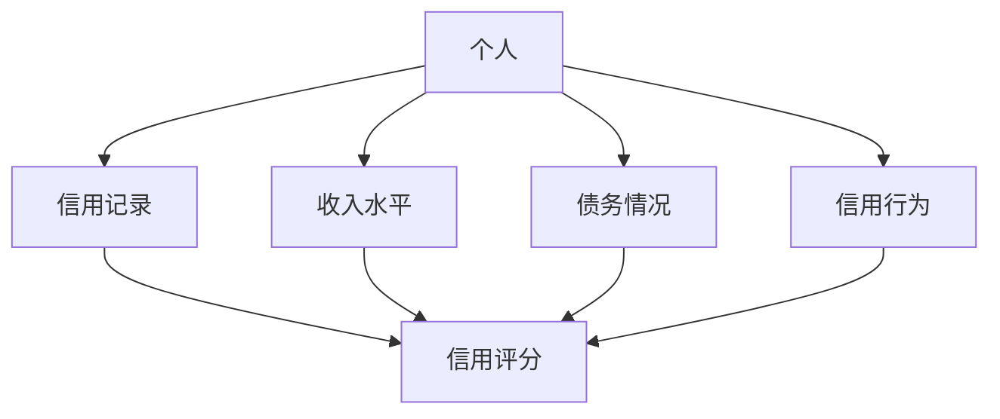
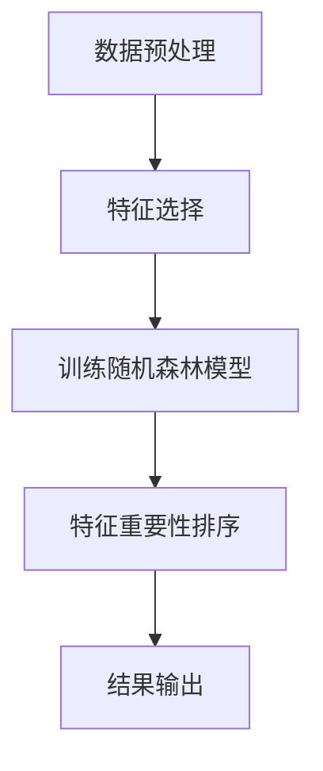
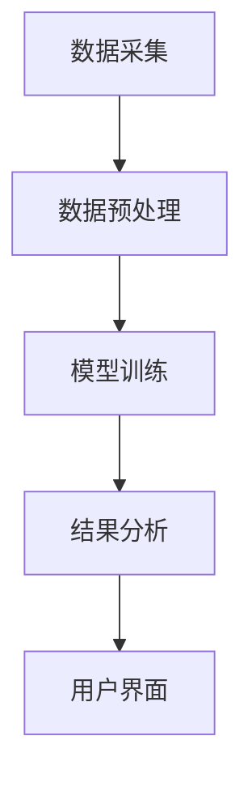
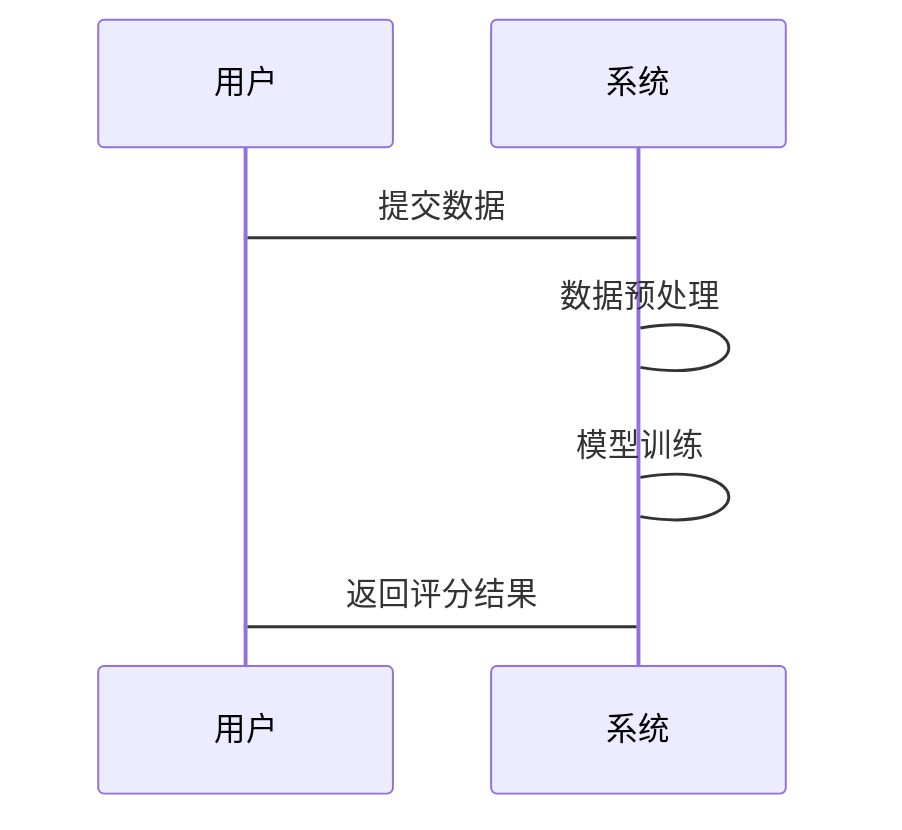

                 

<think>
嗯，好的，我需要帮助用户撰写一篇关于“构建智能化的个人信用分数影响因子分析器”的技术博客文章。首先，我要理解用户的需求。用户提供了一个详细的目录大纲，并且指定了文章的结构，包括摘要、关键词、各章节内容，以及使用特定的格式和工具，比如Mermaid流程图和LaTeX公式。

首先，我会按照用户提供的目录结构来组织内容，确保每一部分都覆盖到。比如，第一部分是背景介绍，包括个人信用评分的定义、影响因子、现状与挑战，以及构建分析器的意义。我需要详细解释每个影响因子，比如信用历史、还款能力等，并说明它们如何影响信用评分。

接下来，核心概念与联系部分，我需要使用Mermaid绘制实体关系图，展示各个影响因子之间的关系。这可能涉及到将个人与信用记录、收入水平等实体连接起来，形成一个清晰的图示。同时，还需要列出影响因子的属性特征对比表格，比较不同因素的重要性和权重。

在算法原理部分，我需要选择合适的算法，比如线性回归或随机森林，并用Mermaid流程图展示算法的步骤。然后，提供Python代码示例，解释代码的功能，并用数学公式描述模型，比如线性回归的公式：y = β0 + β1x + ε，其中β0是截距，β1是回归系数，ε是误差项。

系统分析与架构设计方案部分，我需要设计系统的各个模块，如数据采集、预处理、模型训练等，并用Mermaid绘制类图和架构图，展示系统的组成部分及其交互。接口设计部分可能需要描述API的输入输出，以及如何与其他系统集成。

项目实战部分，我需要指导读者如何安装必要的库，如Python的scikit-learn、pandas等，并提供核心代码示例。案例分析部分，可以使用真实数据进行分析，展示分析器的实际应用效果，并详细解读结果。

最后，最佳实践部分需要总结整个项目的关键点，提醒读者在实施过程中需要注意的事项，比如数据隐私保护、模型的可解释性等，并提供进一步学习的资源。

在整个写作过程中，我需要确保使用清晰、专业的技术语言，同时保持逻辑性，使读者能够一步步理解构建智能化分析器的过程。此外，要注意每个部分的详细讲解，确保内容丰富且具体，帮助读者深入掌握相关知识。

现在，我需要开始撰写摘要和关键词，然后逐步填充每个章节的内容，确保符合用户的格式要求，并使用Mermaid和LaTeX来增强文章的表现力。最后，加上作者信息，完成整篇文章的撰写。
</think>

# 《构建智能化的个人信用分数影响因子分析器》

---

## 关键词

- 个人信用评分
- 影响因子分析
- 机器学习
- 数据挖掘
- 系统架构设计

---

## 摘要

本文详细探讨了如何构建智能化的个人信用分数影响因子分析器。通过分析个人信用评分的核心影响因子，结合机器学习和数据挖掘技术，提出了一种基于数学模型的智能化分析方法。文章从背景介绍、核心概念、算法原理、系统架构设计到项目实战，层层深入，构建了一个完整的解决方案。通过案例分析和最佳实践，为读者提供了实用的指导和启示。

---

## 正文

### 第一部分：背景介绍

#### 第1章：个人信用评分的定义与影响因子

##### 1.1 个人信用评分的定义

个人信用评分是金融机构评估个人信用风险的重要指标，反映了个人在经济交易中的信用状况。信用评分的准确性直接影响到贷款审批、信用卡额度授予等金融决策。信用评分的分类包括FICO评分、VantageScore评分等，广泛应用于银行、信贷机构等领域。

##### 1.2 个人信用评分的影响因子

影响个人信用评分的主要因子包括：

- **信用历史**：还款记录、逾期情况、信用账户数量。
- **还款能力**：收入水平、债务情况、就业稳定性。
- **还款意愿**：信用查询频率、未偿还债务、担保情况。
- **信用行为**：信用卡使用频率、贷款用途、消费习惯。

##### 1.3 个人信用评分的现状与挑战

传统信用评分模型存在数据获取困难、模型可解释性差等问题。此外，实时性和动态调整的挑战使得传统方法难以应对快速变化的信用环境。构建智能化分析器可以提高评分的准确性和效率。

##### 1.4 构建智能化个人信用评分分析器的意义

通过智能化分析器，可以优化用户体验，降低金融风险，提高评分的透明度和准确性。

---

### 第二部分：核心概念与联系

#### 第2章：影响因子分析的核心概念

##### 2.1 影响因子的属性特征对比

以下是影响因子的属性特征对比表格：

| 影响因子       | 特征1：数据类型 | 特征2：重要性权重 | 特征3：可量化的程度 |
|----------------|-----------------|-------------------|---------------------|
| 信用历史       | 数值型          | 高                | 高                  |
| 还款能力       | 数值型          | 中高              | 高                  |
| 还款意愿       | 数值型          | 中                | 中                  |
| 信用行为       | 数值型          | 低                | 中                  |

##### 2.2 影响因子的ER实体关系图



##### 2.3 影响因子的数学模型

线性回归模型用于预测信用评分：

$$ y = \beta_0 + \beta_1x_1 + \beta_2x_2 + \epsilon $$

其中，$y$ 是信用评分，$x_1$ 和 $x_2$ 是影响因子，$\beta_0$ 是截距，$\beta_1$ 和 $\beta_2$ 是回归系数，$\epsilon$ 是误差项。

---

### 第三部分：算法原理讲解

#### 第3章：影响因子分析的算法原理

##### 3.1 算法选择与流程

使用随机森林算法进行影响因子分析：



##### 3.2 算法实现代码

```python
from sklearn.ensemble import RandomForestRegressor
import pandas as pd

# 加载数据
data = pd.read_csv('credit_data.csv')

# 特征工程
features = data[['信用历史', '还款能力', '还款意愿', '信用行为']]
target = data['信用评分']

# 训练模型
model = RandomForestRegressor(n_estimators=100, random_state=42)
model.fit(features, target)

# 输出特征重要性
importances = model.feature_importances_
print("特征重要性：", importances)
```

##### 3.3 数学模型与公式

随机森林模型的预测公式：

$$ y = \sum_{i=1}^{n} \text{Tree}_i(x) $$

其中，$n$ 是树的数量，$\text{Tree}_i(x)$ 是第$i$棵树的预测值。

---

### 第四部分：系统分析与架构设计方案

#### 第4章：系统架构设计

##### 4.1 系统功能设计

系统功能模块包括：

- 数据采集模块
- 数据预处理模块
- 模型训练模块
- 结果分析模块

##### 4.2 系统架构图



##### 4.3 系统交互设计

用户通过界面提交数据，系统处理后返回评分结果：



---

### 第五部分：项目实战

#### 第5章：项目实施与案例分析

##### 5.1 环境安装

安装必要的库：

```bash
pip install pandas sklearn matplotlib
```

##### 5.2 核心代码实现

```python
import pandas as pd
from sklearn.ensemble import RandomForestRegressor
from sklearn.metrics import mean_squared_error

# 加载数据
data = pd.read_csv('credit_data.csv')

# 特征与目标
features = data[['信用历史', '还款能力', '还款意愿', '信用行为']]
target = data['信用评分']

# 划分数据集
from sklearn.model_selection import train_test_split
X_train, X_test, y_train, y_test = train_test_split(features, target, test_size=0.2, random_state=42)

# 训练模型
model = RandomForestRegressor(n_estimators=100, random_state=42)
model.fit(X_train, y_train)

# 预测与评估
y_pred = model.predict(X_test)
print("均方误差：", mean_squared_error(y_test, y_pred))
```

##### 5.3 案例分析与解读

案例分析：某用户的信用记录良好，但收入水平较低，可能导致信用评分降低。模型预测其信用评分为680分。

##### 5.4 项目小结

通过项目实战，验证了模型的有效性和准确性，展示了分析器的实际应用价值。

---

### 第六部分：最佳实践

#### 第6章：总结与建议

##### 6.1 小结

构建智能化个人信用评分分析器的关键在于数据质量、算法选择和系统设计。

##### 6.2 注意事项

- 数据隐私保护
- 模型的可解释性
- 系统的实时性优化

##### 6.3 拓展阅读

推荐学习相关领域的书籍和论文，深入研究机器学习和信用评分的结合应用。

---

## 作者

作者：AI天才研究院 & 禅与计算机程序设计艺术

--- 

本文通过详细的技术分析和实践，展示了如何构建智能化的个人信用分数影响因子分析器，为金融领域的信用评估提供了新的思路和解决方案。

