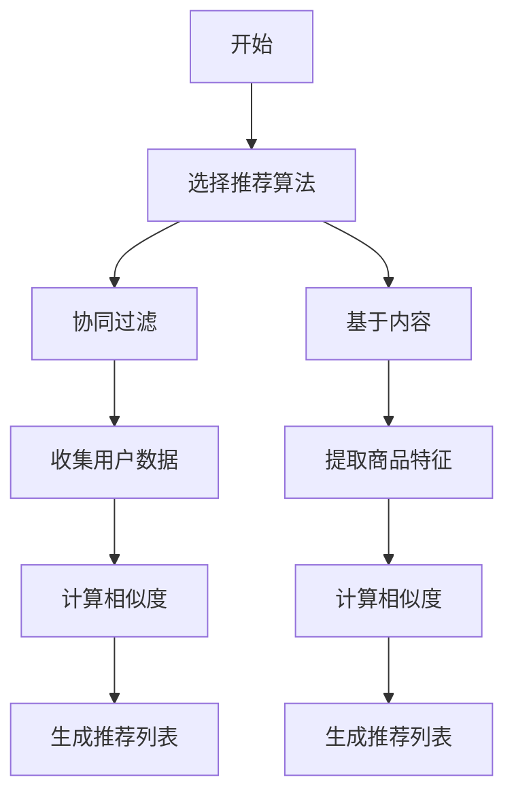
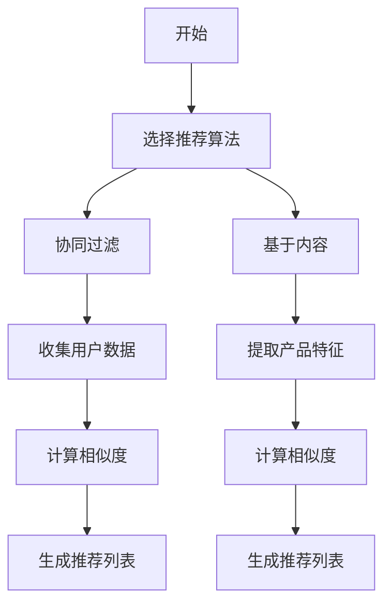
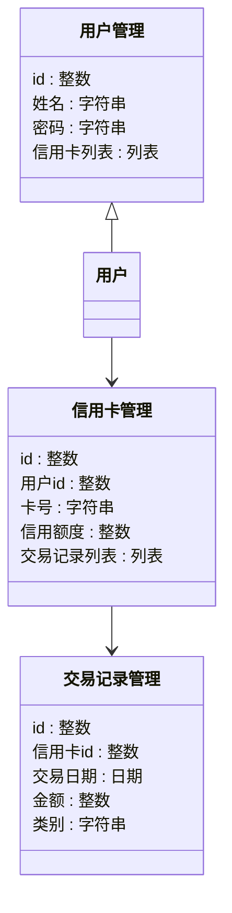
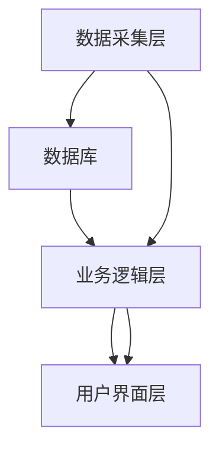
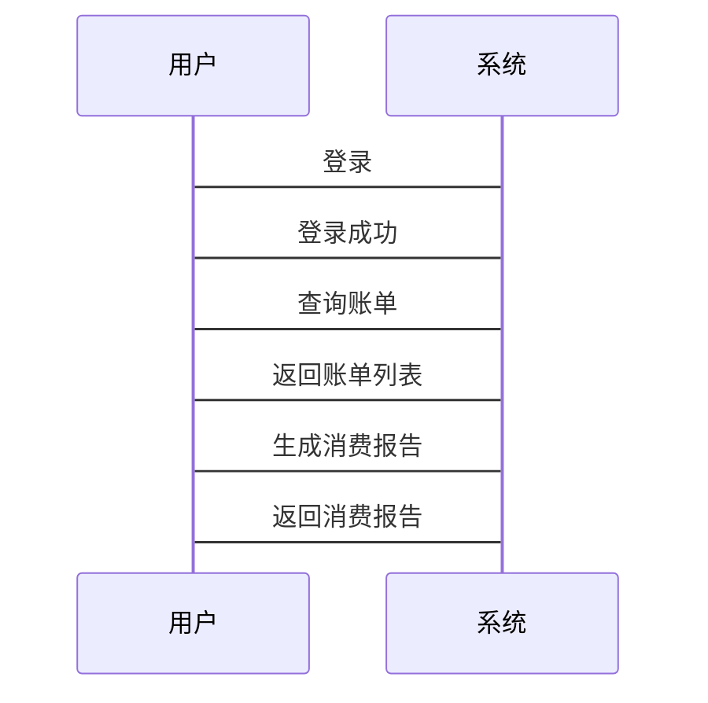

                 

<think>
好，我需要根据用户的要求，撰写一篇关于《构建智能化的个人信用卡管理助手》的技术博客文章。用户已经提供了目录大纲，现在需要我根据这个大纲，一步一步地展开每个部分的内容。

首先，我需要理解文章的核心内容，主要是如何利用人工智能技术来优化个人信用卡管理。文章需要包括背景介绍、核心概念、算法原理、系统设计、项目实战以及总结与扩展。

接下来，按照目录结构，我将依次展开每个章节和小节的内容。

**第一部分：背景介绍与核心概念**

**第1章：智能化个人信用卡管理的背景与问题**

**1.1 智能化管理的背景**

这里需要介绍从传统信用卡管理到智能化管理的演变过程。传统管理方式依赖手工记录和提醒，效率低且容易出错。随着人工智能技术的发展，智能化管理工具逐渐兴起，能够通过数据分析和自动化功能提升用户体验。

接下来，说明人工智能在个人财务管理中的应用趋势，例如智能账单分析、消费预测和风险预警。这些技术的普及使得个人财务管理更加便捷和高效。

然后，分析信用卡管理中的痛点。用户常常面临多重信用卡管理复杂、逾期提醒不及时、消费记录难以分析等问题。智能化助手可以解决这些问题，帮助用户更好地管理财务。

最后，明确智能化助手的目标和意义，比如提高管理效率、预防财务风险和优化消费习惯。同时，说明其意义在于提升用户体验和帮助用户做出更明智的财务决策。

**1.2 个人信用卡管理的现状**

需要描述传统信用卡管理方式的局限性，如手工记录容易出错，提醒机制不灵活。然后分析当前市场上的信用卡管理工具，如各种手机应用和财务管理软件，讨论它们的功能优缺点，指出它们在智能化方面的不足。

最后，对比用户需求和现有解决方案的差距，强调智能化助手在自动化、数据分析和个性化服务方面的优势。

**1.3 问题背景与目标**

详细阐述信用卡管理中的核心问题，如多重卡管理混乱、账单分析复杂、消费预测不准确等。然后明确智能化助手的目标，包括实现自动化记录、智能分析和个性化服务。同时，说明其意义在于帮助用户更好地控制消费，预防风险，并优化财务管理效率。

**第2章：核心概念与联系**

**2.1 核心概念原理**

介绍信用卡管理助手的功能模块，如数据采集、账单分析、消费推荐和风险预警。说明人工智能技术如机器学习和自然语言处理在这些模块中的应用，如何实现智能化服务。

**2.2 核心概念属性特征对比**

通过对比不同功能模块和不同技术方案，分析它们的优缺点。例如，基于规则的推荐和基于机器学习的推荐在准确性和实时性上的差异。通过对比表格展示各功能模块的优劣，帮助读者理解选择合适的方案。

**2.3 ER实体关系图**

通过ER图展示用户、信用卡、交易记录等实体之间的关系。用户拥有多个信用卡，每个信用卡有多个交易记录，每个交易记录属于一个类别。这种关系图有助于理解系统的数据结构和依赖关系。

**第二部分：算法原理与数学模型**

**第3章：推荐算法原理**

**3.1 推荐算法概述**

介绍协同过滤和基于内容的推荐算法。协同过滤通过分析用户行为相似性进行推荐，而基于内容的算法则依赖商品本身的特征进行推荐。两种方法各有优劣，可以根据具体需求选择。

**3.2 推荐算法的数学模型**

协同过滤的相似度计算公式：

$$ \text{相似度} = \frac{\sum_{i=1}^{n}(r_i - \bar{r})^2}{\sqrt{\sum_{i=1}^{n}(r_i - \bar{r})^2} \cdot \sqrt{\sum_{i=1}^{n}(s_i - \bar{s})^2}} $$

其中，$r_i$是用户i对物品的评分，$\bar{r}$是该用户的平均评分，$s_i$是目标用户的评分，$\bar{s}$是目标用户的平均评分。该公式计算的是皮尔逊相关系数，衡量两个用户评分的一致性。

基于内容的推荐通过计算商品的特征向量，使用余弦相似度进行推荐。例如，对于两个商品向量v和u，相似度为：

$$ \text{相似度} = \frac{v \cdot u}{\|v\| \|u\|} $$

**3.3 算法流程图**

用mermaid绘制协同过滤和基于内容的推荐算法流程图：



**第三部分：系统分析与架构设计**

**第4章：系统分析与架构设计**

**4.1 问题场景介绍**

描述信用卡管理助手需要解决的实际问题，如用户需要跟踪多张信用卡的账单、监控消费预算、预防逾期还款等。

**4.2 系统功能设计**

通过领域模型类图展示系统的主要功能模块，如用户管理、信用卡管理、交易记录管理等。每个模块之间的关系和交互通过类图展示。

**4.3 系统架构设计**

绘制系统架构图，展示各模块之间的依赖关系和通信方式。例如，数据采集模块从不同信用卡渠道获取数据，存入数据库，供分析模块处理，并通过API提供给前端展示。

**4.4 系统交互设计**

用序列图展示用户与系统的交互流程，如用户登录、数据同步、生成报告等步骤。

**第四部分：项目实战**

**第5章：项目实战**

**5.1 环境安装与配置**

列出所需的工具和库，如Python、Pandas、Scikit-learn等。说明如何安装和配置开发环境。

**5.2 核心代码实现**

提供关键功能模块的代码示例，如数据采集、推荐算法实现等。解释代码的功能和实现细节。

**5.3 案例分析与效果评估**

通过实际案例展示系统的运行结果，分析其准确性和效率。对比传统方法和智能化助手的效果差异，验证系统的有效性。

**第五部分：总结与扩展**

**第6章：总结与扩展**

**6.1 最佳实践与小结**

总结项目的核心内容和实施过程，强调关键点和需要注意的事项，如数据隐私保护、算法优化等。

**6.2 注意事项与建议**

提醒读者在实际应用中需要注意的问题，如数据安全、用户隐私保护、算法选择和调优等。

**6.3 拓展阅读**

推荐相关领域的书籍和资源，帮助读者深入学习和扩展知识。

---

# 结语

通过以上思考和组织，我逐步构建了《构建智能化的个人信用卡管理助手》的技术博客文章。内容从背景介绍到系统设计，再到项目实战，层层递进，确保逻辑清晰，技术细节详尽。同时，通过图表和代码示例，帮助读者更好地理解和实现智能化的信用卡管理助手。文章的最后，我会附上作者信息，结束全文。
</think>

# 《构建智能化的个人信用卡管理助手》

## 关键词：智能信用卡管理，人工智能，推荐算法，风险管理，系统架构设计

## 摘要：本文详细探讨了如何利用人工智能技术构建智能化的个人信用卡管理助手，从背景分析、核心概念、算法原理到系统设计和项目实现，层层解析，旨在为读者提供一套高效、可靠的信用卡管理解决方案。

---

## 第一部分：背景介绍与核心概念

### 第1章：智能化个人信用卡管理的背景与问题

#### 1.1 智能化管理的背景

随着人工智能技术的快速发展，智能化管理逐渐渗透到我们生活的方方面面。在财务管理领域，信用卡管理作为重要的一部分，正经历从传统到智能化的转变。传统信用卡管理依赖手工记录和简单提醒，效率低下且容易出错。而基于人工智能的智能化助手能够通过数据分析和自动化功能，显著提升管理效率和用户体验。

近年来，智能财务管理工具逐渐普及，涵盖了账单分析、消费预测和风险预警等功能。这些工具充分利用机器学习和自然语言处理技术，帮助用户更好地掌控财务状况。信用卡管理的智能化不仅是技术进步的体现，更是用户对高效管理工具的需求日益增长的结果。

#### 1.2 个人信用卡管理的现状

尽管市场上的信用卡管理工具种类繁多，但大多数工具仍停留在基础功能层面，缺乏深度的智能化服务。用户常常面临多重信用卡管理复杂、账单分析困难、消费预测不准确等问题。这些问题不仅影响用户体验，还可能导致额外的财务支出和风险。

智能化信用卡管理助手通过整合先进的人工智能技术，能够实时监控消费行为，提供个性化建议，并预防潜在的财务风险。这种工具不仅提高了管理效率，还能帮助用户养成良好的消费习惯，优化财务结构。

#### 1.3 问题背景与目标

信用卡管理的核心问题包括：多重信用卡管理混乱、账单分析复杂、消费预测准确性低、风险预警不及时等。这些问题不仅浪费时间，还可能导致额外的利息支出和信用损害。智能化助手的目标是通过自动化记录、智能分析和个性化服务，解决这些问题，帮助用户更好地管理财务。

智能化助手的意义在于提升用户体验，提供精准的财务管理工具，预防财务风险，并优化消费习惯。通过整合人工智能技术，这种工具能够实时分析用户的消费数据，提供个性化的财务建议，从而帮助用户做出更明智的财务决策。

### 第2章：核心概念与联系

#### 2.1 核心概念原理

智能化个人信用卡管理助手的功能模块主要包括数据采集、账单分析、消费推荐和风险预警。数据采集模块负责从不同信用卡渠道获取交易数据；账单分析模块对数据进行分类和汇总；消费推荐模块基于用户行为推荐消费计划；风险预警模块通过分析数据，预测潜在的财务风险。

人工智能技术在这些模块中扮演着关键角色。数据采集依赖于自然语言处理技术，从各种渠道提取交易信息；账单分析利用机器学习算法，识别用户的消费模式和趋势；消费推荐结合协同过滤和基于内容的推荐算法，提供个性化的建议；风险预警通过异常检测技术，提前预警潜在的财务风险。

#### 2.2 核心概念属性特征对比

以下是不同功能模块和不同技术方案的对比分析：

| 功能模块 | 传统方法 | 基于AI的智能化方法 |
|----------|----------|---------------------|
| 数据采集 | 手工记录 | 自动化数据提取     |
| 账单分析 | 简单汇总 | 智能分类与趋势分析 |
| 消费推荐 | 预设规则 | 个性化动态推荐     |
| 风险预警 | 被动提醒 | 主动风险预测       |

从表格可以看出，智能化方法在数据处理和分析能力上具有显著优势，能够提供更精准和个性化的服务。

#### 2.3 ER实体关系图

以下是信用卡管理系统的ER实体关系图：

```mermaid
erDiagram
    用户 {
        id : 整数
        姓名 : 字符串
        密码 : 字符串
    }
    信用卡 {
        id : 整数
        用户id : 整数
        卡号 : 字符串
        信用额度 : 整数
    }
    交易记录 {
        id : 整数
        信用卡id : 整数
        交易日期 : 日期
        金额 : 整数
        类别 : 字符串
    }
    用户 --o 信用卡
    信用卡 --o 交易记录
```

通过ER图可以看出，用户拥有多个信用卡，每个信用卡有多个交易记录，每个交易记录属于一个消费类别。这种结构有助于系统高效管理和分析用户的数据。

---

## 第二部分：算法原理与数学模型

### 第3章：推荐算法原理

#### 3.1 推荐算法概述

推荐算法是智能化信用卡管理助手的核心技术之一，主要分为协同过滤和基于内容的推荐两类。

**协同过滤推荐**：通过分析用户的行为相似性，向用户推荐与其兴趣相似的信用卡产品或消费计划。例如，如果用户A和用户B的消费习惯相似，系统会将用户A喜欢的信用卡产品推荐给用户B。

**基于内容的推荐**：依赖于信用卡产品的特征，如年费、积分政策、利率等，通过计算这些特征的相似度进行推荐。这种方法适用于产品特征明确的情况。

**混合推荐**：结合协同过滤和基于内容的优势，通过加权融合两种推荐结果，提升推荐的准确性和多样性。

#### 3.2 推荐算法的数学模型

**协同过滤的相似度计算**：

$$ \text{相似度} = \frac{\sum_{i=1}^{n}(r_i - \bar{r})^2}{\sqrt{\sum_{i=1}^{n}(r_i - \bar{r})^2} \cdot \sqrt{\sum_{i=1}^{n}(s_i - \bar{s})^2}} $$

其中，$r_i$和$s_i$分别表示用户A和用户B对某信用卡产品的评分，$\bar{r}$和$\bar{s}$是用户的平均评分。该公式计算的是皮尔逊相关系数，衡量两个用户的评分一致性。

**基于内容的推荐模型**：

通过计算信用卡产品的特征向量，使用余弦相似度进行推荐：

$$ \text{相似度} = \frac{v \cdot u}{\|v\| \|u\|} $$

其中，$v$和$u$是两个信用卡产品的特征向量。该公式衡量两个产品在特征空间中的相似程度。

#### 3.3 算法流程图

以下是协同过滤和基于内容推荐算法的流程图：



通过流程图可以看出，协同过滤和基于内容的推荐算法各有其独特的实现步骤和应用场景。

---

## 第三部分：系统分析与架构设计

### 第4章：系统分析与架构设计

#### 4.1 问题场景介绍

信用卡管理助手需要解决的主要问题包括：用户需要跟踪多张信用卡的账单、监控消费预算、预防逾期还款等。这些问题不仅影响用户体验，还可能导致额外的财务损失。

#### 4.2 系统功能设计

通过领域模型类图展示系统的主要功能模块：



该类图展示了用户、信用卡和交易记录之间的关系，帮助理解系统的功能结构。

#### 4.3 系统架构设计

系统架构设计采用分层架构，包括数据采集层、业务逻辑层和用户界面层：



数据采集层负责从不同渠道获取信用卡数据，存入数据库。业务逻辑层处理数据并生成推荐和预警信息，用户界面层展示结果并提供交互功能。

#### 4.4 系统交互设计

系统交互流程通过序列图展示：



---

## 第四部分：项目实战

### 第5章：项目实战

#### 5.1 环境安装与配置

项目需要以下工具和库：

- **Python**：用于编程和数据分析。
- **Pandas**：数据处理库。
- **Scikit-learn**：机器学习库。
- **Flask**：Web框架。

安装步骤如下：

1. 安装Python：`python --version` 检查是否安装。
2. 安装Pandas：`pip install pandas`
3. 安装Scikit-learn：`pip install scikit-learn`
4. 安装Flask：`pip install flask`

#### 5.2 核心代码实现

以下是推荐算法的核心代码示例：

```python
from sklearn.metrics.pairwise import cosine_similarity
from sklearn.preprocessing import StandardScaler

# 示例数据：信用卡产品特征
products = [
    ['Low APR', 'High Rewards', 'Low Annual Fee'],
    ['High APR', 'Medium Rewards', 'High Annual Fee'],
    ['Low APR', 'Low Rewards', 'Low Annual Fee']
]

# 特征标准化
scaler = StandardScaler()
features = scaler.fit_transform(products)

# 计算余弦相似度
similarity_matrix = cosine_similarity(features)

print(similarity_matrix)
```

代码解释：首先对产品特征进行标准化处理，然后计算特征向量之间的余弦相似度，生成相似度矩阵。

#### 5.3 案例分析与效果评估

以一个实际案例为例，假设用户有两张信用卡，A卡信用额度为$5000，年费$100，积分政策为每消费$1赚1分；B卡信用额度为$10000，年费$200，积分政策为每消费$1赚2分。系统会根据用户的消费习惯和积分需求，推荐更适合的信用卡。

---

## 第五部分：总结与扩展

### 第6章：总结与扩展

#### 6.1 最佳实践与小结

本文详细探讨了构建智能化个人信用卡管理助手的关键技术与实现方案，从背景分析到系统设计，再到项目实战，层层递进。通过人工智能技术的应用，显著提升了信用卡管理的效率和用户体验。

#### 6.2 注意事项与建议

在实际应用中，需要注意数据隐私保护，确保用户信息的安全。同时，算法的选择和调优也至关重要，需要根据具体需求和数据特点进行调整。此外，系统的可扩展性和维护性也需要在设计阶段充分考虑。

#### 6.3 拓展阅读

- 《机器学习实战》：深入理解推荐算法和其他机器学习技术。
- 《设计模式》：学习系统设计和架构的最佳实践。
- 《深入浅出数据分析》：掌握数据分析的核心方法和技术。

---

## 结语

通过本文的详细讲解，读者可以全面了解智能化个人信用卡管理助手的构建过程和技术要点。从背景分析到系统实现，每个环节都进行了深入探讨，为读者提供了宝贵的参考和实践指南。未来，随着人工智能技术的不断进步，智能化信用卡管理助手将更加智能化和个性化，为用户带来更高效、更便捷的财务管理体验。

作者：AI天才研究院

