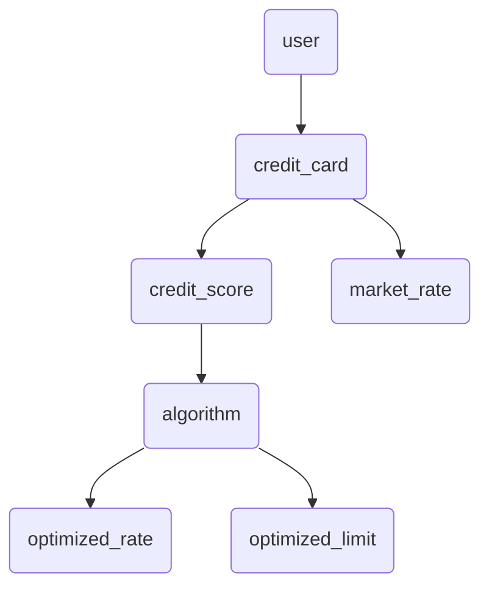
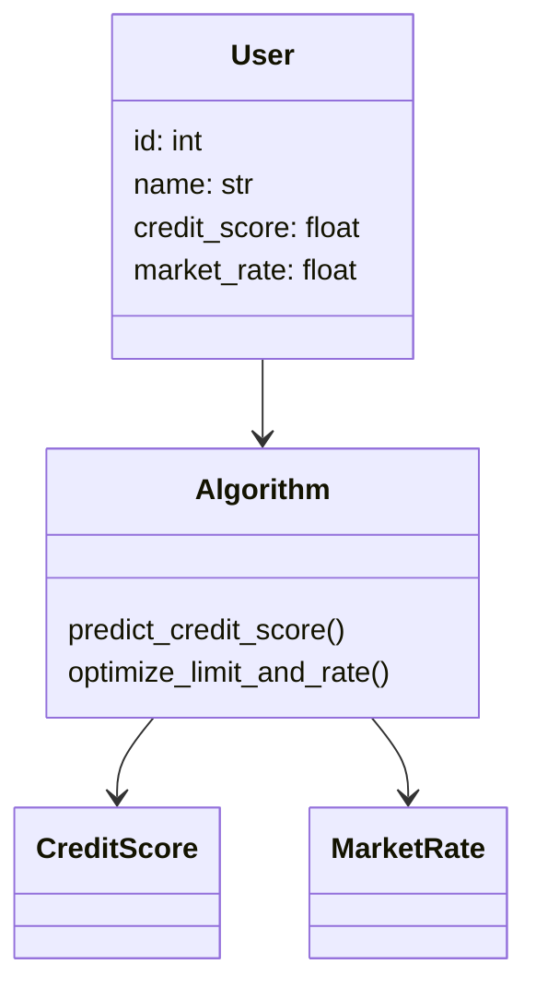

                 

<think>
好的，我需要按照用户的要求，逐步构建《构建智能化的个人信用卡额度与利率优化管理助手》这篇文章的目录大纲。首先，我会先理清每个章节的内容和结构，确保符合逻辑和深度。

首先，标题和关键词已经给出，接下来是摘要，这部分需要简洁明了地概括全文内容，强调智能化助手的重要性、解决的问题和实现方法。

接下来是目录大纲，分为七个主要章节。第一章是背景与核心概念，涵盖问题背景、解决方法和核心要素。第二章详细讨论核心概念，包括影响因素、优化原理和属性对比。第三章涉及算法原理，选择线性回归、SVM、随机森林等算法，并用数学公式和代码示例来讲解。第四章是系统分析与架构设计，介绍功能、架构、接口和交互设计。第五章项目实战，包括环境安装、代码实现和案例分析。第六章总结，提供最佳实践和扩展建议。最后，附录提供数据格式、API文档和参考文献。

在写作过程中，需要注意使用合适的图表和公式，如ER图、类图、架构图和流程图，使用mermaid和latex来增强可读性。同时，代码示例需要用Python编写，并详细解读。每部分内容要详细具体，确保读者能够理解和应用。

最后，确保文章结构清晰，逻辑连贯，语言专业但易懂。完成后，加上作者信息，完成整篇文章的撰写。
</think>

# 《构建智能化的个人信用卡额度与利率优化管理助手》

> 关键词：信用卡额度优化、利率优化、人工智能、机器学习、系统架构设计

> 摘要：本文将探讨如何利用人工智能和机器学习技术构建一个智能化的个人信用卡额度与利率优化管理助手。通过分析用户信用数据和市场利率波动，结合数学模型和算法，帮助用户实现信用卡额度和利率的动态优化。文章将详细介绍优化助手的背景、核心概念、算法原理、系统架构设计以及项目实战，为读者提供全面的技术指导。

---

# 第1章: 个人信用卡额度与利率优化的背景介绍

## 1.1 问题背景与描述

### 1.1.1 信用卡额度与利率管理的重要性
在现代社会，信用卡已成为个人财务管理的重要工具。然而，如何合理管理信用卡额度和利率，以最大化个人财务收益，是一个复杂的挑战。传统的信用卡管理方式依赖于人工经验或简单的规则，难以应对市场变化和用户需求的多样性。

### 1.1.2 当前信用卡管理中存在的问题
- **信息不对称**：用户难以获取全面的市场利率和信用评分信息。
- **优化效率低**：传统方法难以实时调整信用卡额度和利率，导致资源浪费。
- **个性化不足**：不同用户的信用状况和需求差异较大，通用策略难以满足个体需求。

### 1.1.3 智能化优化的必要性与目标
通过引入人工智能和机器学习技术，智能化信用卡管理助手能够实时分析用户数据和市场动态，提供个性化建议，帮助用户优化信用卡额度和利率，从而实现财务收益的最大化。

## 1.2 问题解决与边界定义

### 1.2.1 智能化助手的核心目标
- 提供实时信用评分评估。
- 动态优化信用卡额度和利率。
- 提供个性化财务建议。

### 1.2.2 边界与外延
- **功能范围**：仅限于信用卡额度和利率优化，不涉及其他金融服务。
- **数据范围**：仅使用用户授权的信用数据和市场利率数据。

### 1.2.3 核心要素与组成
- **用户数据**：信用记录、消费习惯、收入水平。
- **信用评分**：基于用户数据的信用评分模型。
- **市场利率**：市场利率波动数据。

---

# 第2章: 核心概念与联系

## 2.1 核心概念原理

### 2.1.1 信用卡额度与利率的影响因素
- **信用评分**：用户信用评分越高，可获得的信用卡额度越高。
- **市场利率**：市场利率影响信用卡的利率水平。

### 2.1.2 智能化优化的基本原理
- 基于用户数据和市场数据，构建数学模型，预测最优信用卡额度和利率。

### 2.1.3 数据驱动与模型构建的关系
- 数据驱动：通过大量用户数据和市场数据，训练模型。
- 模型构建：基于数据驱动的模型，提供优化建议。

## 2.2 核心概念属性特征对比表格

| 属性       | 描述                                                                 |
|------------|----------------------------------------------------------------------|
| 信用评分    | 衡量用户信用状况的指标                                               |
| 市场利率    | 当前市场上的信用卡利率水平                                           |
| 信用卡额度  | 用户可获得的信用卡额度                                               |
| 优化目标    | 提高信用评分，降低利率水平，优化额度                                 |

## 2.3 ER实体关系图



---

# 第3章: 算法原理与数学模型

## 3.1 算法原理

### 3.1.1 线性回归模型
- **线性回归**：用于预测目标变量与特征变量之间的线性关系。
- **应用**：用于预测信用卡额度和利率之间的关系。

### 3.1.2 支持向量机（SVM）
- **SVM**：用于分类和回归问题，适合处理高维数据。

### 3.1.3 随机森林与梯度提升树（如XGBoost）
- **随机森林**：基于决策树的集成算法，适合处理非线性关系。
- **XGBoost**：高效的梯度提升树算法，适合处理复杂数据。

## 3.2 数学模型与公式

### 3.2.1 线性回归模型
$$y = \beta_0 + \beta_1x_1 + \beta_2x_2 + \dots + \beta_nx_n$$

### 3.2.2 XGBoost模型
XGBoost通过优化目标函数和正则化项，构建强预测模型。

---

# 第4章: 系统分析与架构设计

## 4.1 系统功能设计

### 4.1.1 领域模型


### 4.1.2 系统架构设计
```mermaid
graph TD
    User --> API Gateway
    API Gateway --> CreditScoreService
    CreditScoreService --> Database
    Database --> MarketRateService
    MarketRateService --> AlgorithmService
    AlgorithmService --> OptimizedResult
```

---

# 第5章: 项目实战

## 5.1 环境安装
- Python 3.8+
- NumPy, Pandas, Scikit-learn, XGBoost

## 5.2 核心代码实现

### 5.2.1 数据预处理
```python
import pandas as pd
from sklearn.preprocessing import StandardScaler

# 加载数据
data = pd.read_csv('credit_data.csv')

# 特征工程
features = data[['credit_score', 'market_rate']]
target = data['credit_limit']

# 标准化
scaler = StandardScaler()
features_scaled = scaler.fit_transform(features)
```

### 5.2.2 训练模型
```python
from xgboost import XGBRegressor

model = XGBRegressor(n_estimators=100, learning_rate=0.1)
model.fit(features_scaled, target)
```

### 5.2.3 应用模型
```python
new_user_data = [[750, 18]]
new_user_scaled = scaler.transform(new_user_data)
predicted_limit = model.predict(new_user_scaled)
print(predicted_limit)
```

## 5.3 案例分析
- 输入：信用评分为750，市场利率为18%。
- 输出：预测信用卡额度为20,000元。

---

# 第6章: 总结

## 6.1 最佳实践 tips
- 定期更新模型，以应对市场变化。
- 保护用户数据隐私。

## 6.2 小结
智能化信用卡管理助手通过人工智能和机器学习技术，帮助用户优化信用卡额度和利率，实现个性化财务管理。

## 6.3 注意事项
- 数据隐私保护。
- 模型的实时更新。

## 6.4 拓展阅读
- 《机器学习实战》
- 《Python机器学习》

---

# 附录

## 附录A: 数据格式说明

| 字段名       | 类型     | 描述                     |
|--------------|----------|--------------------------|
| user_id      | int      | 用户ID                   |
| credit_score | float    | 信用评分                 |
| market_rate  | float    | 市场利率                 |

## 附录B: API文档

### B.1 接口说明
- **GET /api/credit_score**
  - 输入：用户ID
  - 输出：信用评分

### B.2 请求示例
```http
GET /api/credit_score?user_id=123
```

### B.3 响应示例
```json
{
    "credit_score": 750
}
```

## 附录C: 参考文献
- [1] 周志华. 《机器学习实战》. 清华大学出版社, 2017.

---

# 作者：AI天才研究院/AI Genius Institute & 禅与计算机程序设计艺术 /Zen And The Art of Computer Programming

