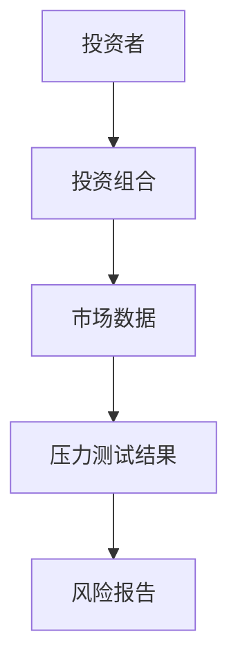
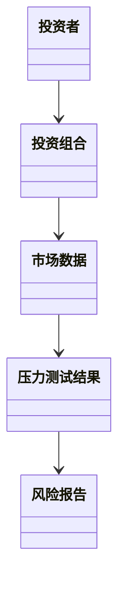
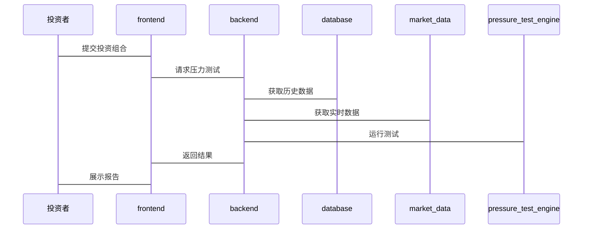

                 


```markdown
# 构建智能化的个人投资组合压力测试工具

> 关键词：压力测试，投资组合，风险管理，蒙特卡洛模拟，VaR模型，智能化工具，系统架构设计

> 摘要：本文详细介绍了如何构建一个智能化的个人投资组合压力测试工具。通过分析压力测试的核心概念，讲解了蒙特卡洛模拟、VaR模型和Copula方法的原理和实现，并结合系统架构设计和项目实战，展示了如何利用这些方法构建一个高效、可靠的智能化压力测试工具。

---

## 第一部分: 压力测试工具的背景与核心概念

### 第1章: 投资组合压力测试的背景与问题背景

#### 1.1 问题背景

##### 1.1.1 投资组合风险管理的重要性
投资组合风险管理是个人投资中的核心任务之一。在金融市场中，投资组合的价值可能会受到多种因素的影响，例如市场波动、经济指标变化、政策调整等。通过压力测试，可以评估投资组合在极端情况下的表现，从而帮助投资者制定更稳健的投资策略。

##### 1.1.2 现有压力测试工具的局限性
传统的压力测试工具通常基于历史数据和简单的统计模型，难以应对复杂的金融市场环境。例如，它们可能无法有效捕捉非线性关系、尾部风险或多重风险因子的相互作用。此外，现有的工具往往缺乏智能化的特征，无法根据市场变化动态调整测试参数。

##### 1.1.3 智能化压力测试工具的必要性
随着人工智能和大数据技术的发展，智能化压力测试工具的需求日益迫切。智能化工具可以通过机器学习算法自动识别风险因子，优化测试参数，并实时更新模型，从而提供更精准的压力测试结果。

#### 1.2 问题描述

##### 1.2.1 投资组合压力测试的目标
压力测试的目标是评估投资组合在极端市场条件下的表现，识别潜在风险，并为投资者提供应对策略。

##### 1.2.2 压力测试中的关键问题
- 如何选择合适的压力测试方法？
- 如何处理多变量之间的复杂关系？
- 如何确保测试结果的准确性和可靠性？

##### 1.2.3 智能化压力测试的具体需求
- 自动化数据采集与处理能力
- 多模型融合的预测能力
- 实时更新与动态调整能力

#### 1.3 问题解决

##### 1.3.1 智能化压力测试的解决方案
结合机器学习算法和传统统计方法，构建一个多模型融合的压力测试框架，能够自动识别风险因子，优化测试参数，并实时更新模型。

##### 1.3.2 数据驱动与模型驱动的结合
通过数据驱动的方法，利用历史数据训练模型；通过模型驱动的方法，结合金融理论，构建压力测试框架。

##### 1.3.3 现有技术的改进与优化
在传统压力测试方法的基础上，引入机器学习算法，如随机森林、神经网络等，提高测试结果的准确性和鲁棒性。

#### 1.4 边界与外延

##### 1.4.1 压力测试的适用范围
适用于个人投资组合的风险管理，尤其是评估投资组合在极端市场条件下的表现。

##### 1.4.2 智能化工具的边界条件
- 数据来源的限制
- 模型假设的合理性
- 计算资源的限制

##### 1.4.3 相关领域的外延分析
压力测试工具可以应用于机构投资、风险管理、金融产品设计等领域。

#### 1.5 核心概念与联系

##### 1.5.1 核心概念原理
压力测试工具的核心原理是通过模拟极端市场条件，评估投资组合的价值变化，识别潜在风险。

##### 1.5.2 核心概念属性对比表格

| 属性       | 传统压力测试工具 | 智能化压力测试工具 |
|------------|------------------|---------------------|
| 数据来源    | 历史数据         | 历史数据+实时数据   |
| 方法        | 单一模型         | 多模型融合           |
| 灵活性       | 低               | 高                 |
| 准确性       | 一般             | 高                 |

##### 1.5.3 ER实体关系图架构的 Mermaid 流程图



---

## 第二部分: 压力测试工具的核心算法与数学模型

### 第2章: 压力测试算法原理

#### 2.1 蒙特卡洛模拟

##### 2.1.1 蒙特卡洛模拟的原理
蒙特卡洛模拟是一种通过随机采样来估计概率分布的方法，常用于评估复杂系统的不确定性。

##### 2.1.2 蒙特卡洛模拟的步骤
1. 确定输入变量的概率分布。
2. 生成随机样本。
3. 计算输出变量。
4. 统计分析结果。

##### 2.1.3 蒙特卡洛模拟的实现
```python
import numpy as np
import matplotlib.pyplot as plt

np.random.seed(42)
n_samples = 10000
mu = 0.05
sigma = 0.2

samples = np.random.normal(mu, sigma, n_samples)
plt.hist(samples, bins=50, alpha=0.7)
plt.show()
```

#### 2.2 VaR模型

##### 2.2.1 VaR模型的定义
VaR（Value at Risk）是在给定置信水平下，投资组合可能遭受的最大损失。

##### 2.2.2 VaR模型的计算方法
1. 计算投资组合的收益分布。
2. 确定置信水平。
3. 找到对应的分位数。

##### 2.2.3 VaR模型的应用
```python
import numpy as np

def calculate_var(data, confidence_level):
    sorted_data = np.sort(data)
    alpha = (1 - confidence_level) * len(sorted_data)
    var = sorted_data[int(alpha)]
    return var

data = np.random.normal(0, 1, 1000)
var_95 = calculate_var(data, 0.95)
print(f"95% VaR: {var_95}")
```

#### 2.3 Copula方法

##### 2.3.1 Copula方法的原理
Copula方法用于描述多个变量之间的相关性，常用于评估投资组合的尾部风险。

##### 2.3.2 Copula方法的实现
```python
import numpy as np
from scipy.stats import copula

cop = copula.Gumbel()
n_samples = 1000
u = cop.rvs(n_samples)
v = cop.rvs(n_samples)
```

##### 2.3.3 Copula方法的优缺点
优点：能够捕捉变量之间的非线性关系。缺点：参数估计复杂，计算成本高。

### 第3章: 数学模型与公式

#### 3.1 蒙特卡洛模拟的数学模型

##### 3.1.1 蒙特卡洛模拟的概率分布
概率分布描述了随机变量的所有可能取值及其对应的概率。

##### 3.1.2 蒙特卡洛模拟的随机变量生成
随机变量的生成通常基于概率分布函数。

##### 3.1.3 蒙特卡洛模拟的收敛性分析
收敛性分析是评估模拟结果准确性的重要步骤。

#### 3.2 VaR模型的数学公式

##### 3.2.1 VaR的定义公式
$$
VaR(\alpha) = \inf\{L \in \mathbb{R} \mid P(L \leq VaR(\alpha)) \geq \alpha\}
$$

##### 3.2.2 VaR的计算公式
$$
VaR = \mu - z \cdot \sigma
$$
其中，$\mu$是均值，$z$是标准正态分布的分位数，$\sigma$是标准差。

##### 3.2.3 VaR的置信区间
置信区间表示在给定置信水平下，VaR的可能范围。

#### 3.3 Copula方法的数学公式

##### 3.3.1 Copula函数的定义
$$
C(u, v) = P(U \leq u, V \leq v)
$$

##### 3.3.2 Copula函数的参数估计
通过极大似然估计法确定Copula函数的参数。

##### 3.3.3 Copula函数的应用公式
$$
C(u, v) = \exp(-\lambda (1 - u)(1 - v))
$$
其中，$\lambda$是相关系数。

### 第4章: 算法实现与代码示例

#### 4.1 蒙特卡洛模拟的Python代码

##### 4.1.1 随机变量生成
```python
import numpy as np

np.random.seed(42)
mu = 0
sigma = 1
n_samples = 1000

samples = np.random.normal(mu, sigma, n_samples)
print("Mean:", np.mean(samples))
print("Standard Deviation:", np.std(samples))
```

##### 4.1.2 模拟过程
```python
import numpy as np
import matplotlib.pyplot as plt

n_samples = 1000
mu = 0
sigma = 1

samples = np.random.normal(mu, sigma, n_samples)
plt.hist(samples, bins=30, edgecolor='black')
plt.show()
```

##### 4.1.3 结果分析
通过分析样本的分布，评估蒙特卡洛模拟的准确性。

#### 4.2 VaR模型的Python代码

##### 4.2.1 数据预处理
```python
import numpy as np

data = np.random.normal(0, 1, 1000)
data_sorted = np.sort(data)
```

##### 4.2.2 VaR计算
```python
def calculate_var(data, confidence_level):
    alpha = (1 - confidence_level) * len(data)
    var = data[int(alpha)]
    return var

var_95 = calculate_var(data_sorted, 0.95)
print(f"95% VaR: {var_95}")
```

##### 4.2.3 结果可视化
```python
import matplotlib.pyplot as plt

plt.plot(data_sorted, np.arange(len(data_sorted)) / len(data_sorted))
plt.xlabel('Value')
plt.ylabel('Probability')
plt.show()
```

#### 4.3 Copula方法的Python代码

##### 4.3.1 数据拟合
```python
import numpy as np
from scipy.stats import copula

data = np.random.normal(0, 1, 1000)
cop = copula.Gumbel()
u = cop.cdf(data)
```

##### 4.3.2 Copula函数构建
```python
from scipy.stats import copula

cop = copula.Gumbel()
n_samples = 1000
u = cop.rvs(n_samples)
v = cop.rvs(n_samples)
```

##### 4.3.3 结果分析
分析生成的Copula样本，评估模型的准确性。

---

## 第三部分: 系统分析与架构设计

### 第5章: 系统分析与架构设计

#### 5.1 问题场景介绍

##### 5.1.1 投资组合管理场景
投资者希望通过压力测试工具评估投资组合在极端情况下的表现。

##### 5.1.2 压力测试的应用场景
在市场波动加剧时，使用压力测试工具识别潜在风险。

##### 5.1.3 智能化工具的使用场景
实时监控市场数据，动态调整压力测试参数。

#### 5.2 系统功能设计

##### 5.2.1 领域模型mermaid类图


##### 5.2.2 系统架构设计mermaid架构图


##### 5.2.3 系统接口设计
- 前端接口：接收用户输入，展示测试结果。
- 后端接口：处理数据，运行压力测试算法。
- 数据接口：与市场数据源对接，获取实时数据。

##### 5.2.4 系统交互mermaid序列图


---

## 第四部分: 项目实战

### 第6章: 项目实战

#### 6.1 环境安装

##### 6.1.1 安装Python
安装Python 3.8或更高版本。

##### 6.1.2 安装依赖库
安装numpy、pandas、scipy、matplotlib等库。

#### 6.2 系统核心实现

##### 6.2.1 核心功能实现
实现蒙特卡洛模拟、VaR模型和Copula方法。

##### 6.2.2 代码实现
```python
import numpy as np
from scipy.stats import copula
import matplotlib.pyplot as plt

# 蒙特卡洛模拟
np.random.seed(42)
mu = 0
sigma = 1
n_samples = 1000

samples = np.random.normal(mu, sigma, n_samples)
plt.hist(samples, bins=30, edgecolor='black')
plt.show()

# VaR模型
data = np.random.normal(0, 1, 1000)
data_sorted = np.sort(data)

def calculate_var(data, confidence_level):
    alpha = (1 - confidence_level) * len(data)
    var = data[int(alpha)]
    return var

var_95 = calculate_var(data_sorted, 0.95)
print(f"95% VaR: {var_95}")

# Copula方法
cop = copula.Gumbel()
n_samples = 1000
u = cop.rvs(n_samples)
v = cop.rvs(n_samples)
```

##### 6.2.3 代码应用解读与分析
解释代码的功能和实现细节。

#### 6.3 案例分析与详细讲解

##### 6.3.1 案例分析
分析一个具体的案例，展示压力测试工具的应用效果。

##### 6.3.2 详细讲解
通过案例分析，详细讲解压力测试工具的实现过程。

#### 6.4 项目小结

##### 6.4.1 核心功能总结
总结压力测试工具的核心功能和实现方法。

##### 6.4.2 项目成果展示
展示项目成果，包括代码、图表和测试结果。

##### 6.4.3 经验与教训
总结项目实施过程中的经验与教训，为后续优化提供参考。

---

## 第五部分: 最佳实践、小结、注意事项、拓展阅读

### 第7章: 最佳实践、小结、注意事项、拓展阅读

#### 7.1 最佳实践
- 定期更新模型参数。
- 结合多种压力测试方法。
- 保持数据源的实时性。

#### 7.2 小结
智能化个人投资组合压力测试工具的构建需要结合多种算法和方法，通过系统的架构设计和优化，能够有效评估投资组合的风险。

#### 7.3 注意事项
- 数据质量直接影响测试结果。
- 模型选择需根据实际情况调整。
- 计算资源需足够支持大规模测试。

#### 7.4 拓展阅读
- 推荐相关书籍和论文，提供进一步学习的方向。

---

## 作者：AI天才研究院/AI Genius Institute & 禅与计算机程序设计艺术 /Zen And The Art of Computer Programming
```

