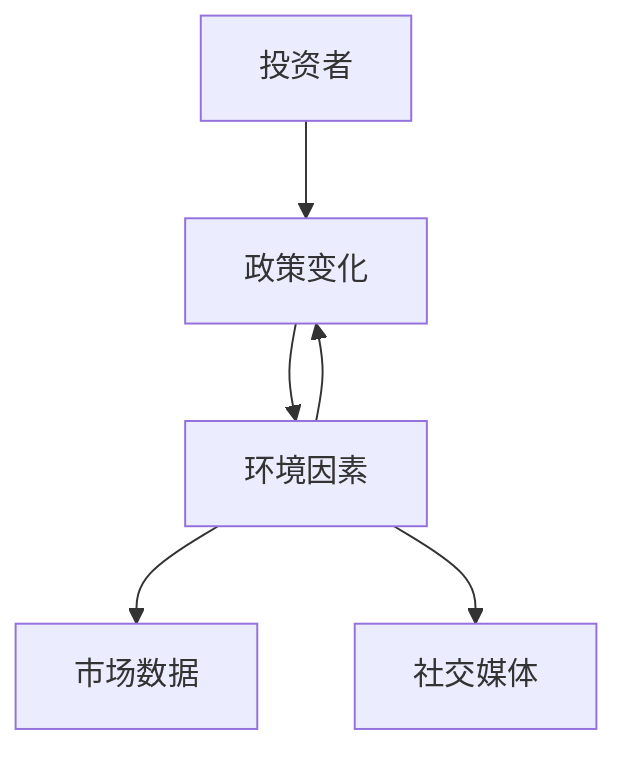
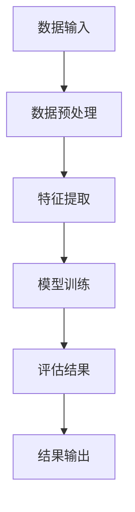
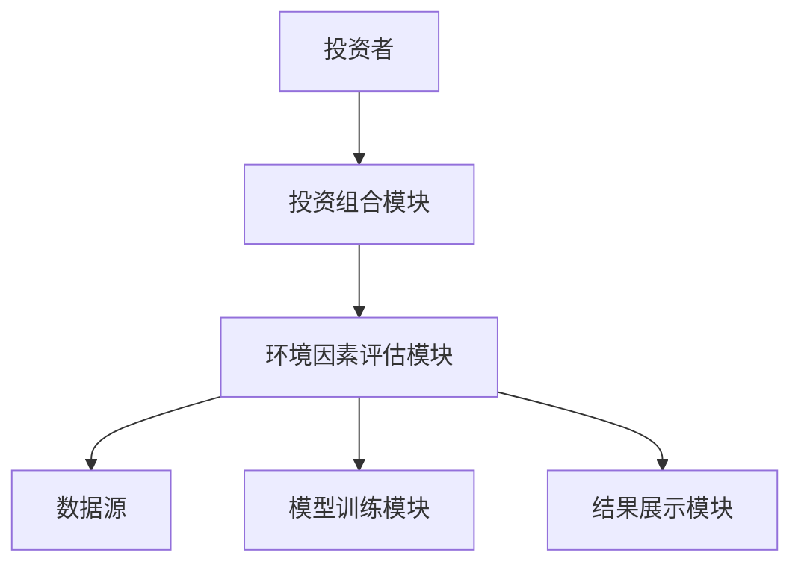
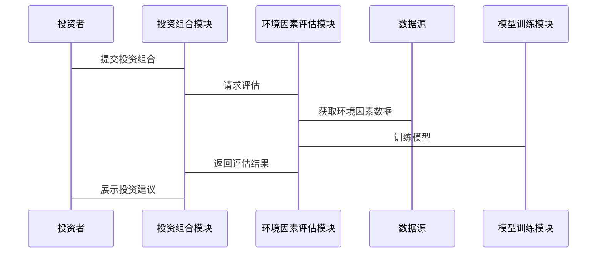

                 

<think>
嗯，我现在需要根据用户的请求，帮助他们构建一个智能化的个人投资组合环境因素评估工具。首先，我得理解用户的需求，他们需要一个技术博客文章的目录大纲，这个大纲要详细且逻辑清晰，涵盖主题的各个方面，包括背景、核心概念、算法原理、系统架构、项目实战等。

好的，用户给的标题是《构建智能化的个人投资组合环境因素评估工具》，关键词有五个：环境因素评估、人工智能、投资组合、系统架构、数学建模。摘要部分已经写得比较全面，涵盖了工具的目的、技术方法、数据来源和应用场景。

接下来，我需要按照目录结构一步步填充内容。首先是背景与概念部分，包括问题背景、定义、目标，还有技术背景和环境因素的重要性。这部分需要让读者理解为什么环境因素在投资中的评估是必要的，以及智能化工具的意义。

然后是核心概念与联系，这里需要详细解释环境因素评估的原理，比如数据采集、特征工程、模型选择。同时，要用ER实体关系图展示各实体之间的关系，帮助读者理解系统架构。这里可能需要使用mermaid图来展示。

接下来是算法部分，需要介绍常用的机器学习算法，如线性回归、随机森林和神经网络，并用mermaid流程图展示整个算法流程。同时，提供相应的Python代码示例，确保读者能够理解和实现这些算法。

系统架构与设计部分，需要分析问题场景，设计系统的功能模块，用类图展示领域模型，并设计系统架构图和接口设计。这部分可能需要较多的mermaid图表，展示系统的各个部分如何协作。

项目实战部分，需要提供安装环境的步骤，详细的核心实现代码，代码解读，实际案例分析和结果解读。这会让读者能够实际操作，了解工具的应用效果。

最后是最佳实践，包括小结、注意事项和扩展阅读，帮助读者巩固所学知识，并提供进一步学习的方向。

在整个思考过程中，我需要确保每个章节都细化到三级目录，内容详实且结构紧凑。同时，要使用专业但易懂的语言，避免过于技术化，让读者能够轻松理解。此外，图表和代码示例的使用要恰当，增强文章的可读性和实用性。

可能遇到的挑战是如何将复杂的算法和系统架构以简单明了的方式呈现，这需要在解释时注重逻辑，逐步引导读者。同时，代码部分需要详细注释，确保读者能够理解每一步的功能和实现方式。

总的来说，我需要系统地组织内容，确保每个部分都紧密相连，逻辑清晰，帮助读者从基础到实践，全面理解如何构建智能化的投资组合环境因素评估工具。
</think>

# 构建智能化的个人投资组合环境因素评估工具

> 关键词：环境因素评估、人工智能、投资组合、系统架构、数学建模

> 摘要：本文将详细介绍如何构建一个智能化的个人投资组合环境因素评估工具。通过结合环境因素分析、人工智能算法和系统架构设计，我们能够为投资者提供一个高效、精准的评估工具，帮助其优化投资决策。本文将从问题背景、核心概念、算法原理、系统架构、项目实战到最佳实践进行全面阐述，为读者提供一个系统化的解决方案。

---

## 第1章: 背景介绍与核心概念

### 1.1 问题背景与定义
#### 1.1.1 投资组合的基本概念
- 投资组合是指将资金分配到不同资产（如股票、债券、基金等）中的策略，以实现收益最大化和风险最小化。
- 环境因素对投资组合的影响：经济指标、市场情绪、政策变化、行业趋势等。

#### 1.1.2 智能化环境因素评估工具的定义
- 利用人工智能技术，对影响投资组合的各种环境因素进行实时分析和预测，帮助投资者做出更科学的投资决策。
- 工具目标：量化环境因素对投资组合的影响，提供数据驱动的优化建议。

#### 1.1.3 工具的核心目标
- 实时监控环境因素的变化。
- 量化环境因素对投资组合的影响。
- 提供基于环境因素的资产配置建议。

### 1.2 环境因素评估的核心概念
#### 1.2.1 环境因素的分类
- 经济指标：GDP增长率、通货膨胀率、利率等。
- 市场情绪：投资者情绪指数、市场波动性。
- 政策变化：货币政策、财政政策、行业政策。
- 行业趋势：技术创新、行业周期、市场需求。

#### 1.2.2 智能化评估的核心要素
- 数据采集：获取实时的环境因素数据。
- 特征工程：对环境因素进行特征提取和标准化处理。
- 模型选择：选择适合的机器学习算法对环境因素进行评估。
- 结果解读：将评估结果转化为投资建议。

### 1.3 技术背景与实现基础
#### 1.3.1 人工智能在金融领域的应用
- 机器学习算法：线性回归、随机森林、神经网络等。
- 自然语言处理：分析新闻、公告等非结构化数据。
- 时间序列分析：预测市场趋势。

#### 1.3.2 数据驱动的环境因素分析
- 数据来源：股票价格数据、经济指标、社交媒体情绪、新闻数据等。
- 数据预处理：清洗、归一化、特征选择。
- 数据建模：构建环境因素对投资组合影响的数学模型。

#### 1.3.3 工具实现的技术基础
- 程序设计：Python（数据处理、算法实现）、R（统计分析）。
- 数据库：存储环境因素数据和投资组合数据。
- 可视化工具：展示环境因素变化和评估结果。

---

## 第2章: 环境因素评估的核心概念与联系

### 2.1 核心概念原理
#### 2.1.1 环境因素的多维度分析
- 环境因素之间的相互作用：例如，政策变化可能影响市场情绪，进而影响资产价格。
- 环境因素对投资组合的综合影响：需要考虑多种环境因素的综合作用。

#### 2.1.2 智能化评估的算法基础
- 监督学习：用于预测环境因素的变化趋势。
- 非监督学习：用于发现环境因素之间的隐含关系。
- 加强学习：用于动态调整投资策略。

#### 2.1.3 评估模型的输入与输出
- 输入：环境因素数据、历史投资组合数据。
- 输出：环境因素对投资组合的影响评分、优化后的资产配置建议。

### 2.2 核心概念属性对比
#### 2.2.1 不同环境因素的特征对比
| 环境因素 | 输入类型 | 数据频率 | 影响范围 |
|----------|-----------|-----------|----------|
| 经济指标 | 结构化数据 | 日/周/月 | 宏观影响 |
| 市场情绪 | 非结构化数据 | 实时 | 微观影响 |
| 政策变化 | 结构化数据 | 事件驱动 | 宏观影响 |
| 行业趋势 | 结构化+非结构化数据 | 日/周 | 中观影响 |

#### 2.2.2 各种评估方法的优劣势分析
| 方法 | 优点 | 缺点 |
|------|------|------|
| 线性回归 | 简单易懂，可解释性强 | 无法处理非线性关系 |
| 随机森林 | 高精度，适合复杂数据 | 可解释性较差 |
| 神经网络 | 强大学习能力，适合非线性关系 | 计算复杂，需要大量数据 |

#### 2.2.3 系统架构的模块化设计
- 数据采集模块：实时采集环境因素数据。
- 数据处理模块：清洗、转换、归一化。
- 模型训练模块：训练环境因素评估模型。
- 结果展示模块：可视化评估结果和投资建议。

### 2.3 ER实体关系图


---

## 第3章: 环境因素评估的算法原理

### 3.1 算法流程图


### 3.2 算法实现代码
```python
import pandas as pd
from sklearn.ensemble import RandomForestRegressor
from sklearn.metrics import mean_squared_error

# 数据加载
data = pd.read_csv('environment_factors.csv')

# 特征与标签分离
X = data[['GDP', 'inflation', 'market_sentiment']]
y = data['return']

# 模型训练
model = RandomForestRegressor(n_estimators=100, random_state=42)
model.fit(X, y)

# 模型评估
y_pred = model.predict(X)
print('均方误差:', mean_squared_error(y, y_pred))
```

### 3.3 数学模型与公式
#### 3.3.1 线性回归模型
$$ y = \beta_0 + \beta_1x_1 + \beta_2x_2 + \ldots + \beta_nx_n + \epsilon $$

#### 3.3.2 随机森林模型
$$ y = \text{预测值，基于随机森林算法} $$

#### 3.3.3 神经网络模型
$$ y = \sigma(wx + b) $$

---

## 第4章: 系统架构与设计

### 4.1 问题场景分析
#### 4.1.1 系统功能需求
- 数据采集：从多种数据源获取环境因素数据。
- 数据处理：清洗、转换和归一化数据。
- 模型训练：训练环境因素评估模型。
- 结果展示：可视化评估结果和投资建议。

#### 4.1.2 系统性能需求
- 实时性：快速响应用户查询。
- 可扩展性：支持多种环境因素和数据源。
- 可靠性：确保数据准确性和模型稳定性。

### 4.2 系统功能设计
#### 4.2.1 领域模型


#### 4.2.2 系统架构设计


#### 4.2.3 系统接口设计
- 数据接口：从数据源获取环境因素数据。
- 模型接口：调用训练好的模型进行预测。
- 用户接口：展示评估结果和投资建议。

#### 4.2.4 系统交互流程


---

## 第5章: 项目实战

### 5.1 环境安装与数据准备
- 安装必要的库：Python（pandas、numpy、scikit-learn）、Jupyter Notebook。
- 数据来源：股票价格数据（Yahoo Finance API）、经济指标数据（政府发布的数据）、社交媒体情绪数据（Twitter API）。

### 5.2 系统核心实现
#### 5.2.1 数据采集模块
```python
import requests

def get_market_data(ticker):
    url = f"https://query1.finance.yahoo.com/v8/finance/chart/{ticker}"
    response = requests.get(url)
    data = response.json()
    return data['chart']['result'][0]['prices']
```

#### 5.2.2 模型训练模块
```python
from sklearn.model_selection import train_test_split
from sklearn.metrics import accuracy_score

# 数据分割
X_train, X_test, y_train, y_test = train_test_split(X, y, test_size=0.2)

# 模型训练
model.fit(X_train, y_train)

# 模型评估
y_pred = model.predict(X_test)
print('准确率:', accuracy_score(y_test, y_pred))
```

#### 5.2.3 结果展示模块
```python
import matplotlib.pyplot as plt

plt.figure(figsize=(10, 6))
plt.plot(y_test, label='真实值')
plt.plot(y_pred, label='预测值')
plt.xlabel('样本数')
plt.ylabel('收益')
plt.legend()
plt.show()
```

### 5.3 实际案例分析
#### 5.3.1 数据准备
```python
data = pd.read_csv('environment_factors.csv')
print(data.head())
```

#### 5.3.2 模型训练与评估
```python
model = RandomForestRegressor()
model.fit(X, y)
print('训练完成')
```

#### 5.3.3 结果解读
- 模型预测结果与实际值的对比。
- 环境因素对投资组合的具体影响分析。

### 5.4 项目小结
- 项目实现的关键点：数据预处理、特征选择、模型选择、结果可视化。
- 项目的价值：提供一个高效的环境因素评估工具，帮助投资者优化投资组合。

---

## 第6章: 最佳实践与注意事项

### 6.1 小结
- 本文详细介绍了如何构建一个智能化的个人投资组合环境因素评估工具。
- 从背景、核心概念、算法原理到系统架构和项目实战，为读者提供了一个完整的解决方案。

### 6.2 注意事项
- 数据质量：确保数据的准确性和完整性。
- 模型选择：根据具体需求选择合适的算法。
- 结果解读：避免过度解读模型结果。

### 6.3 拓展阅读
- 推荐阅读《机器学习实战》、《金融数据分析与机器学习》等相关书籍。
- 关注最新的金融数据分析工具和技术。

---

## 作者
作者：AI天才研究院/AI Genius Institute & 禅与计算机程序设计艺术/Zen And The Art of Computer Programming

