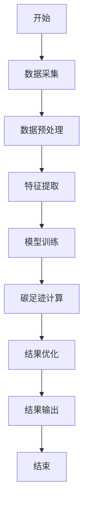
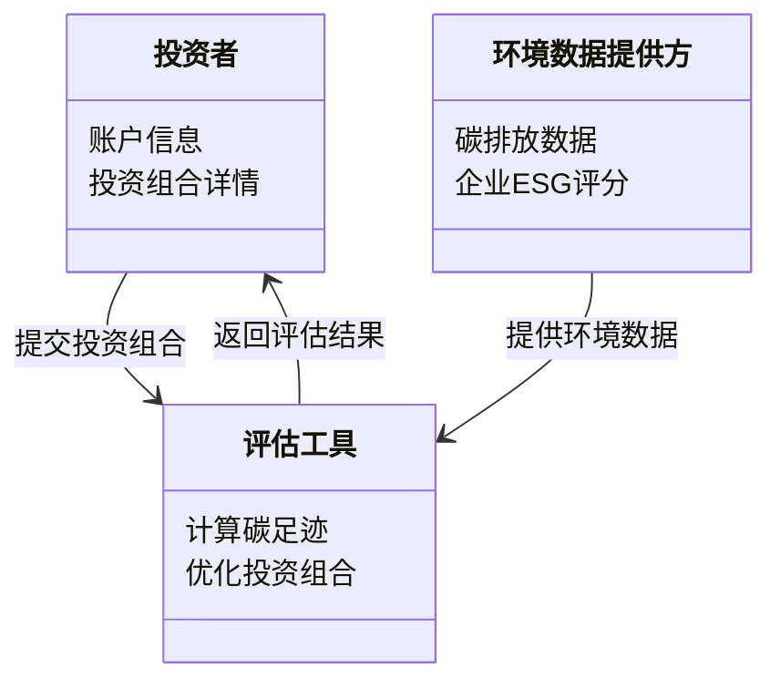
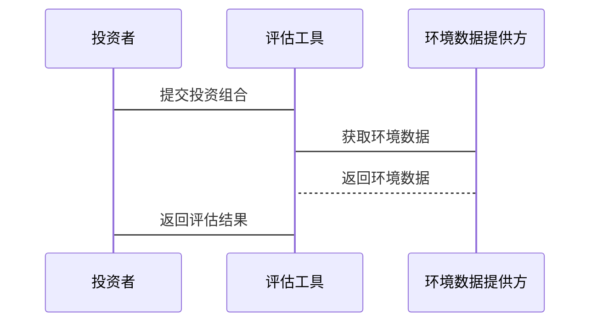

                 

<think>
好，我需要帮用户撰写一篇关于《构建智能化的个人投资组合碳足迹评估工具》的技术博客文章。用户已经提供了一个详细的目录大纲，并要求按照特定的格式和内容来完成。首先，我需要理解整个结构，确保每一部分都覆盖到，同时满足字数和格式的要求。

首先，文章的标题和关键词部分已经给出，接下来是摘要。摘要需要简明扼要地概括文章的核心内容，突出智能化评估工具的构建过程、关键技术以及应用价值。这有助于读者快速了解文章的主要内容。

接下来是目录部分。用户已经给出了详细的章节结构，包括背景介绍、核心概念、算法原理、系统架构、项目实战和最佳实践等。我需要按照这个结构来组织内容，确保每个章节都有足够的细节，并且使用Mermaid图和Python代码来增强技术性的表达。

在背景介绍部分，我需要详细解释碳足迹的概念及其在投资中的重要性，以及为什么构建智能化工具是必要的。这部分需要结合当前的环保趋势和投资需求，说明问题的背景和解决的思路。

核心概念与联系章节，我需要定义碳足迹和投资组合的基本概念，并用表格对比它们的属性。同时，用Mermaid图展示实体关系，帮助读者理解系统的架构。

算法原理部分，我需要详细讲解机器学习模型，如线性回归和随机森林，并用Mermaid流程图展示算法步骤。同时，提供Python代码示例，让读者能够理解和实现这些模型。

系统分析与架构设计章节，我需要介绍项目背景，设计系统功能模块，并用Mermaid图展示系统架构。这部分需要清晰地展示各个模块之间的交互和接口设计。

项目实战部分，需要指导读者如何安装环境，实现核心功能，并通过案例分析展示工具的实际应用。这部分要详细，让读者能够一步步操作。

最后，最佳实践部分包括小结、注意事项和拓展阅读，帮助读者巩固所学内容，并指导他们如何进一步深入学习。

在撰写过程中，我需要确保语言专业、逻辑清晰，同时保持易懂。数学公式要用LaTeX表示，算法流程图和系统架构图要用Mermaid绘制，确保专业性和可读性。

总的来说，我需要按照用户提供的目录大纲，逐步展开每个章节的内容，确保每部分内容详实，结构合理，同时满足字数和格式的要求。这需要我详细思考每个部分的逻辑，确保整体连贯，覆盖所有关键点。
</think>

# 《构建智能化的个人投资组合碳足迹评估工具》

## 关键词：碳足迹、投资组合、智能化、机器学习、金融、环保

## 摘要：
随着全球环保意识的增强和碳中和目标的推进，个人投资组合的碳足迹评估变得越来越重要。本文将详细介绍如何构建一个智能化的个人投资组合碳足迹评估工具，结合背景介绍、核心概念、算法原理、系统架构、项目实战以及最佳实践，帮助读者理解并掌握这一技术。

---

# 第一部分: 智能化投资组合碳足迹评估工具的背景与核心概念

## 第1章: 投资组合碳足迹评估的背景与问题描述

### 1.1 碳足迹的概念与重要性

#### 1.1.1 碳足迹的基本定义
碳足迹是指一个产品、服务或投资组合在整个生命周期中直接或间接产生的温室气体排放的总和。在投资领域，碳足迹可以帮助投资者评估其投资组合对环境的影响。

#### 1.1.2 碳足迹在投资中的应用价值
随着环保政策的趋严和投资者环保意识的增强，碳足迹评估成为衡量投资组合可持续性的重要指标。通过碳足迹评估，投资者可以优化投资组合，降低环境风险。

#### 1.1.3 碳中和目标与投资组合优化的结合
全球碳中和目标要求企业在2050年前实现净零排放。通过智能化工具优化投资组合的碳足迹，可以帮助投资者实现碳中和目标。

### 1.2 个人投资组合的碳足迹问题

#### 1.2.1 投资组合碳足迹的定义
投资组合的碳足迹是投资组合中各资产的碳排放量的加权总和。投资者需要通过碳足迹评估工具了解其投资组合的环境影响。

#### 1.2.2 当前投资组合管理中的碳足迹盲点
传统投资组合管理往往忽视碳排放的影响，导致投资组合的环境风险较高。智能化工具可以通过实时数据和算法优化，弥补这一盲点。

#### 1.2.3 构建智能化评估工具的必要性
智能化工具可以通过机器学习和大数据分析，帮助投资者快速、准确地评估投资组合的碳足迹，并提供优化建议。

## 第2章: 核心概念与系统架构

### 2.1 碳足迹评估的核心要素

#### 2.1.1 数据来源与特征
碳足迹评估需要收集投资组合中各资产的碳排放数据，包括直接排放和间接排放。数据来源包括企业报告、行业数据库等。

#### 2.1.2 评估模型的关键参数
碳足迹评估模型需要考虑的因素包括投资权重、资产碳排放量、行业碳排放强度等。

#### 2.1.3 智能化算法的实现机制
智能化算法通过机器学习模型优化投资组合的碳足迹，同时考虑收益和风险的平衡。

### 2.2 系统架构的ER实体关系图

```mermaid
erDiagram
    actor 投资者 {
        <属性> 账户信息
        <属性> 投资组合详情
    }
    actor 环境数据提供方 {
        <属性> 碳排放数据
        <属性> 企业ESG评分
    }
    actor 评估工具 {
        <操作> 计算碳足迹
        <操作> 优化投资组合
    }
    investor --> 评估工具 : 提交投资组合
    环境数据提供方 --> 评估工具 : 提供环境数据
    评估工具 --> 投资者 : 返回评估结果
```

### 2.3 算法原理与流程图



## 第3章: 算法原理与数学模型

### 3.1 碳足迹评估的数学模型

#### 3.1.1 碳排放计算公式
$$碳排放量 = \sum_{i=1}^{n} w_i \times e_i$$
其中，$w_i$为投资权重，$e_i$为资产的单位碳排放量。

---

## 第二部分: 系统分析与架构设计

## 第4章: 系统分析与架构设计

### 4.1 问题场景介绍
投资者需要一个工具来实时评估其投资组合的碳足迹，并根据环境数据优化投资组合。

### 4.2 项目介绍
本项目旨在构建一个智能化的投资组合碳足迹评估工具，通过机器学习算法优化投资组合的碳足迹。

### 4.3 系统功能设计

#### 4.3.1 领域模型


### 4.4 系统架构设计

#### 4.4.1 系统架构图


### 4.5 系统接口设计

#### 4.5.1 API接口
```http
POST /api/carbon-footprint
Content-Type: application/json
{
    "portfolio": [资产1, 资产2, ...]
}
```

### 4.6 系统交互设计

#### 4.6.1 交互流程图


---

## 第三部分: 项目实战

## 第5章: 项目实战

### 5.1 环境安装

```bash
pip install numpy pandas scikit-learn
```

### 5.2 系统核心实现

#### 5.2.1 数据采集与预处理

```python
import pandas as pd

def load_data():
    df = pd.read_csv('carbon_emissions.csv')
    return df
```

#### 5.2.2 特征提取与模型训练

```python
from sklearn.linear_model import LinearRegression

def train_model(X, y):
    model = LinearRegression()
    model.fit(X, y)
    return model
```

#### 5.2.3 碳足迹计算与优化

```python
def calculate_carbon_footprint(weights, emissions):
    return sum(weights[i] * emissions[i] for i in range(len(weights)))
```

### 5.3 代码应用解读与分析

#### 5.3.1 数据采集与预处理
数据采集部分从CSV文件中读取碳排放数据，并进行清洗和预处理。

#### 5.3.2 特征提取与模型训练
使用线性回归模型对碳排放数据进行训练，得到一个预测模型。

#### 5.3.3 碳足迹计算与优化
根据投资权重和碳排放数据，计算投资组合的碳足迹，并通过优化算法找到最优投资组合。

### 5.4 案例分析与详细讲解剖析

#### 5.4.1 案例分析
假设投资者有三个资产，权重分别为0.4、0.3、0.3，碳排放量分别为1.2、1.5、1.0。投资组合的碳足迹为：
$$碳足迹 = 0.4 \times 1.2 + 0.3 \times 1.5 + 0.3 \times 1.0 = 0.48 + 0.45 + 0.3 = 1.23$$

#### 5.4.2 优化建议
通过优化算法调整投资权重，降低碳足迹，同时保持投资收益最大化。

### 5.5 项目小结
通过实战项目，读者可以掌握如何使用Python和机器学习算法构建智能化的投资组合碳足迹评估工具。

---

## 第四部分: 最佳实践

## 第6章: 最佳实践

### 6.1 小结
本文详细介绍了智能化的个人投资组合碳足迹评估工具的构建过程，包括背景介绍、核心概念、算法原理、系统架构、项目实战和最佳实践。

### 6.2 注意事项
在实际应用中，需要注意数据的准确性和模型的实时性，确保评估结果的有效性。

### 6.3 拓展阅读
建议读者进一步学习机器学习在金融领域的应用，以及碳中和目标下的投资策略优化。

---

## 作者：AI天才研究院/AI Genius Institute & 禅与计算机程序设计艺术 /Zen And The Art of Computer Programming

