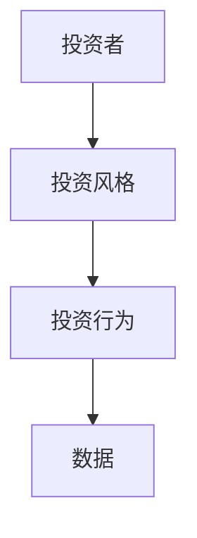
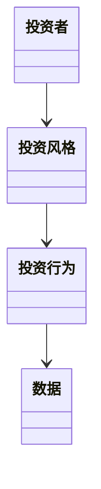
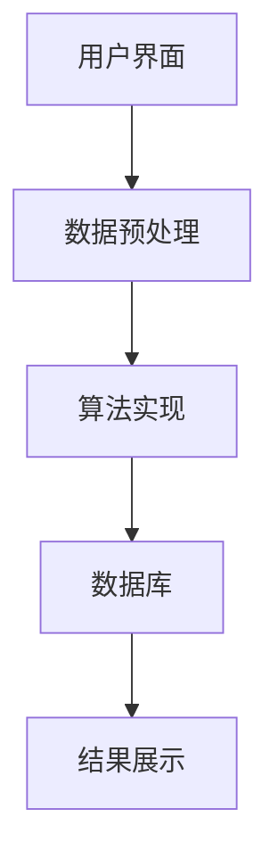

                 


# 《构建智能化的个人投资风格分析工具》

---

## 关键词：  
智能化投资、风格分析、机器学习、聚类分析、数据可视化、金融工具

---

## 摘要：  
本文详细介绍了如何通过智能化技术构建个人投资风格分析工具，从理论到实践，全面解析投资风格的分析方法。通过聚类分析和回归分析等算法，结合系统架构设计，帮助投资者实现个性化的投资决策支持。文章内容涵盖背景分析、核心概念、算法原理、系统设计和项目实战，旨在为读者提供一套完整的投资风格分析解决方案。

---

## 第一部分：背景介绍与核心概念

### 第1章：投资风格分析的背景与问题描述

#### 1.1 投资风格分析的背景  
- 传统投资分析的局限性  
- 数据驱动投资决策的兴起  
- 个人投资风格分析的必要性  

#### 1.2 问题背景与问题描述  
- 个人投资行为的多样性  
- 投资风格分析的核心问题  
- 数据获取与分析的挑战  

#### 1.3 投资风格分析的目标与意义  
- 揭示投资行为特征  
- 提供个性化投资建议  
- 优化投资决策的科学性  

#### 1.4 问题的边界与外延  
- 数据范围的边界  
- 时间维度的限制  
- 投资风格分类的颗粒度  

#### 1.5 核心概念与组成要素  
- 投资风格的定义  
- 数据、算法、模型的核心要素  
- 系统架构的主要组成部分  

---

### 第2章：投资风格的核心原理

#### 2.1 投资风格的属性特征  
- 风险偏好  
- 收益目标  
- 时间 horizon  

#### 2.2 投资风格分类的特征对比  
- 表格对比不同投资风格的属性特征  
- 数据可视化展示  

#### 2.3 实体关系架构（ER图）  



---

## 第二部分：投资风格分析的算法原理

### 第3章：聚类分析与投资风格分类

#### 3.1 聚类分析的原理  
- K-means算法的原理  
- 层次聚类的优缺点  

#### 3.2 投资风格分类的算法选择  
- K-means算法的适用性  
- DBSCAN算法的对比  

#### 3.3 算法实现步骤  
- 数据预处理  
- 特征提取  
- 聚类实现  
- 结果分析  

#### 3.4 代码实现与数学模型  

```python
from sklearn.cluster import KMeans
import numpy as np

# 示例数据
X = np.array([[1, 2], [3, 4], [5, 6], [7, 8]])

# K-means聚类
kmeans = KMeans(n_clusters=2, random_state=0)
kmeans.fit(X)
print(kmeans.labels_)
```

#### 3.5 数学模型与公式  
$$
\text{目标函数} = \sum_{i=1}^{n} \sum_{j=1}^{k} (x_{ij} - c_j)^2
$$  
其中，$c_j$ 是第 $j$ 个聚类中心，$x_{ij}$ 是第 $i$ 个样本的第 $j$ 个特征。

---

## 第三部分：系统分析与架构设计

### 第4章：问题场景与系统功能设计

#### 4.1 问题场景介绍  
- 数据收集与处理  
- 投资风格分析的系统需求  

#### 4.2 系统功能设计  
- 数据清洗模块  
- 风格识别模块  
- 结果展示模块  

#### 4.3 领域模型类图  



#### 4.4 系统架构设计  



---

## 第四部分：项目实战与优化

### 第5章：环境安装与核心代码实现

#### 5.1 环境安装  
- 安装Python与相关库  
- 数据库与工具安装  

#### 5.2 核心代码实现  
- 数据预处理代码  
- 聚类算法实现  
- 结果可视化代码  

#### 5.3 代码解读与优化  
- 代码功能分析  
- 优化建议  

#### 5.4 实际案例分析  
- 数据分析案例  
- 结果展示与解读  

#### 5.5 项目小结  
- 项目总结  
- 经验与教训  

---

## 第五部分：最佳实践与拓展阅读

### 第6章：投资风格分析工具的最佳实践

#### 6.1 数据更新与维护  
- 数据来源与频率  
- 数据清洗的重要性  

#### 6.2 工具的局限性与改进方向  
- 数据偏差问题  
- 算法优化方向  

#### 6.3 小结  
- 总结全文内容  
- 提出未来研究方向  

#### 6.4 注意事项  
- 数据隐私保护  
- 算法适用性分析  

#### 6.5 拓展阅读  
- 相关书籍推荐  
- 技术博客链接  

---

## 作者：  
AI天才研究院/AI Genius Institute  
禅与计算机程序设计艺术/Zen And The Art of Computer Programming

