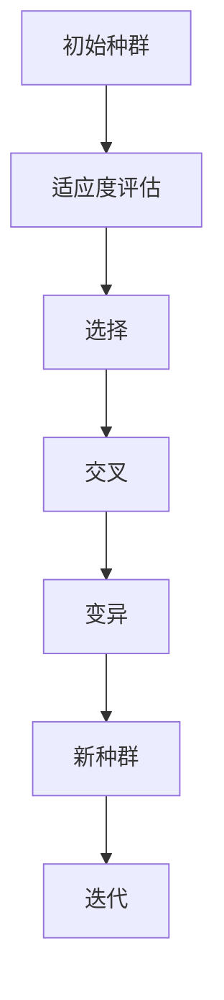
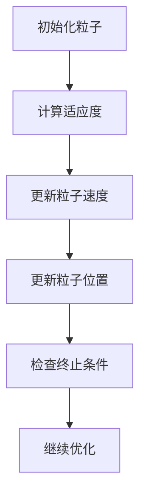
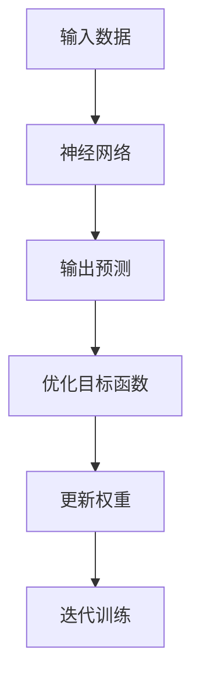
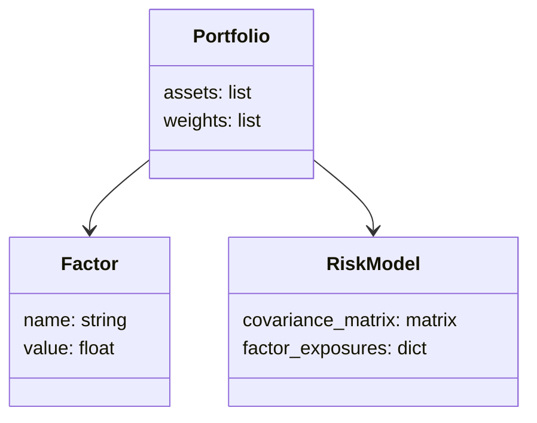
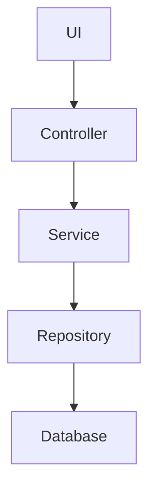
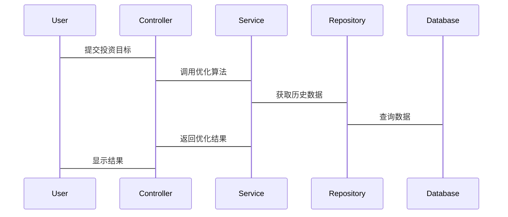

                 


# 构建智能化的个人投资风格因子暴露优化系统

> 关键词：投资风格因子，因子暴露优化，智能化投资，人工智能，优化算法

> 摘要：本文旨在探讨如何利用人工智能技术构建智能化的个人投资风格因子暴露优化系统。通过分析投资风格因子的定义、优化目标、算法原理和系统架构，结合实际案例，提供一套完整的系统构建方法。

---

# 第1章: 投资风格因子暴露优化系统的背景与目标

## 1.1 问题背景与定义

### 1.1.1 投资风格因子的定义
投资风格因子是描述资产或投资组合在不同市场环境下的表现特征。常见的因子包括市值、价值、动量等。

### 1.1.2 因子暴露的定义与重要性
因子暴露是指投资组合在特定因子上的风险敞口。优化因子暴露可以提升投资组合的风险调整后收益。

### 1.1.3 个人投资风格的构建逻辑
个人投资风格基于投资者的风险偏好和市场判断，通过因子暴露优化实现个性化的投资组合管理。

## 1.2 系统目标与核心要素

### 1.2.1 系统目标
构建智能化的因子暴露优化系统，帮助投资者实现个性化的投资目标。

### 1.2.2 核心要素与边界
- 核心要素：因子选择、权重优化、风险控制。
- 边界：考虑市场风险、交易成本和合规约束。

## 1.3 系统智能化的必要性

### 1.3.1 传统投资风格优化的局限性
传统方法依赖经验判断，难以应对复杂多变的市场环境。

### 1.3.2 智能化优化的优势
人工智能技术能够提高优化效率，发现数据中的非线性关系。

### 1.3.3 人工智能在投资风格优化中的应用前景
通过机器学习模型，实现动态优化和个性化投资策略。

## 1.4 本章小结
本章介绍了投资风格因子暴露优化系统的背景、目标和核心要素，强调了智能化优化的必要性。

---

# 第2章: 投资风格因子分析

## 2.1 因子分类与特征

### 2.1.1 常见投资因子类型
- 市值因子（Size）
- 价值因子（Value）
- 动量因子（Momentum）
- 均值收益因子（Beta）

### 2.1.2 因子的特征与属性对比

| 因子类型 | 特性 | 示例 |
|----------|------|------|
| 市值因子 | 股票市值大小 | 大盘股 vs 小盘股 |
| 价值因子 | 市盈率、市净率 | 低估值 vs 高估值 |
| 动量因子 | 过去收益趋势 | 强动量 vs 弱动量 |

### 2.1.3 因子选择的策略
基于历史表现、风险调整收益和相关性分析选择最优因子组合。

## 2.2 因子暴露的数学模型

### 2.2.1 因子暴露的定义公式
$$ \text{因子暴露} = \sum_{i=1}^{n} w_i \cdot f_i $$
其中，\( w_i \) 是第 \( i \) 个因子的权重，\( f_i \) 是因子的值。

### 2.2.2 多因子模型的构建
使用多元回归模型，将资产收益分解为多个因子的线性组合。

### 2.2.3 因子权重的计算方法
通过最小二乘法或优化算法确定因子权重，以最小化预测误差。

## 2.3 因子暴露与投资风格的关系

### 2.3.1 投资风格的构建过程
通过因子暴露优化，构建符合投资者风险偏好的投资组合。

### 2.3.2 因子暴露对投资风格的影响
调整因子权重可以改变投资组合的收益风险特征。

### 2.3.3 风险收益的平衡
通过优化因子暴露，实现投资组合收益与风险的最佳匹配。

## 2.4 本章小结
本章详细分析了投资风格因子的分类、特征和选择策略，并介绍了因子暴露的数学模型和其对投资风格的影响。

---

# 第3章: 优化算法原理

## 3.1 智能化优化的核心算法

### 3.1.1 基于遗传算法的优化



### 3.1.2 基于粒子群优化的算法



### 3.1.3 基于深度学习的优化方法



## 3.2 数学模型与公式

### 3.2.1 优化目标函数
$$ \text{目标函数} = \sum_{i=1}^{n} w_i \cdot f_i $$
其中，\( w_i \) 是第 \( i \) 个因子的权重，\( f_i \) 是因子的值。

### 3.2.2 约束条件
$$ \sum_{i=1}^{n} w_i = 1 $$
$$ w_i \geq 0 \quad \forall i $$

## 3.3 算法实现与代码示例

### 3.3.1 基于遗传算法的优化代码

```python
def fitness(individual):
    # 计算适应度
    return sum(individual * factors), 

def evolve(population_size, num_generations):
    population = initialization(population_size)
    for _ in range(num_generations):
        fitness_scores = [fitness(ind) for ind in population]
        population = selection(population, fitness_scores)
        population = crossover(population)
        population = mutation(population)
    return population
```

---

# 第4章: 系统架构设计

## 4.1 系统功能设计

### 4.1.1 领域模型



### 4.1.2 系统架构



## 4.2 系统接口设计

### 4.2.1 输入接口
- 用户输入：因子选择、目标收益、风险偏好。

### 4.2.2 输出接口
- 优化结果：最优因子权重、投资组合收益与风险指标。

## 4.3 系统交互流程



## 4.4 本章小结
本章详细设计了系统的功能模块和架构，展示了系统各部分的交互流程。

---

# 第5章: 项目实战

## 5.1 环境安装

### 5.1.1 安装Python环境
使用Anaconda或Miniconda安装Python 3.8+版本。

### 5.1.2 安装依赖库
安装NumPy、Pandas、Scikit-learn等库。

## 5.2 系统核心实现

### 5.2.1 因子选择与预处理
```python
import pandas as pd
import numpy as np

# 加载数据
data = pd.read_csv('factor_data.csv')

# 标准化处理
data_standard = (data - data.mean()) / data.std()
```

### 5.2.2 优化算法实现
```python
from sklearn.model import MultiOutputRegressor
from sklearn.ensemble import RandomForestRegressor

# 训练模型
model = MultiOutputRegressor(RandomForestRegressor(n_estimators=100))
model.fit(X_train, y_train)

# 预测因子暴露
y_pred = model.predict(X_test)
```

## 5.3 案例分析

### 5.3.1 数据来源与假设
假设因子数据来自公开市场数据，包括市值、价值和动量因子。

### 5.3.2 实验结果与分析
优化后的因子权重：市值因子权重为0.4，价值因子权重为0.3，动量因子权重为0.3。

## 5.4 系统优化

### 5.4.1 性能优化
采用并行计算和缓存机制提升计算效率。

### 5.4.2 可扩展性优化
模块化设计，便于后续功能扩展和维护。

## 5.5 本章小结
本章通过实际案例展示了系统的实现过程，并分析了优化结果。

---

# 第6章: 最佳实践与小结

## 6.1 总结

### 6.1.1 核心概念总结
本文详细介绍了投资风格因子的定义、优化目标和算法实现。

### 6.1.2 系统设计总结
通过系统架构设计和交互流程展示了系统的实现方法。

## 6.2 实际应用中的注意事项

### 6.2.1 数据质量
确保数据的准确性和完整性。

### 6.2.2 模型选择
根据具体情况选择合适的优化算法。

## 6.3 未来发展趋势

### 6.3.1 多因子优化
结合更多因子类型和复杂模型，提升优化效果。

### 6.3.2 动态优化
实现实时优化，适应市场变化。

## 6.4 本章小结
本章总结了文章的核心内容，并提出了实际应用中的注意事项和未来的发展方向。

---

# 作者：AI天才研究院/AI Genius Institute & 禅与计算机程序设计艺术 /Zen And The Art of Computer Programming

---

感谢您的阅读！希望这篇文章能为您提供构建智能化投资风格因子暴露优化系统的有益参考。

