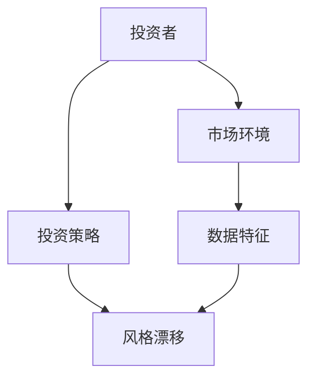
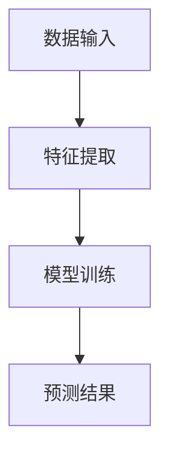
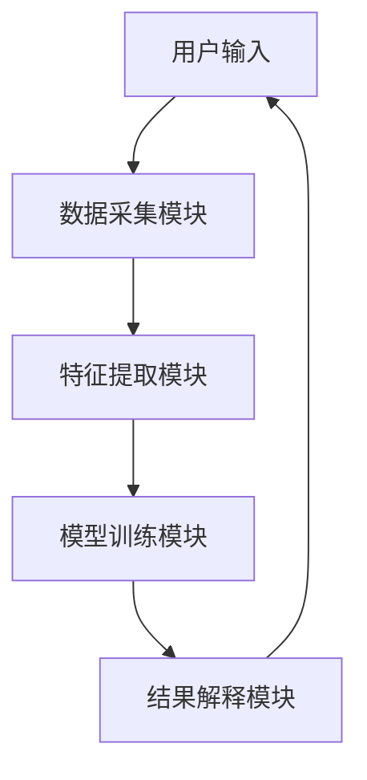

                 

<think>
嗯，用户现在想要一个详细的《构建智能化的个人投资风格漂移原因分析系统》的博客文章。他们已经提供了一个大纲，但还需要我根据这个大纲来完成整篇文章。首先，我需要理解每个部分的核心内容，确保逻辑连贯，技术细节到位。

首先，我会从背景介绍开始，解释什么是投资风格漂移，为什么它重要。接着，进入核心概念，分析风格漂移的原因，并用ER图展示实体关系。然后是算法部分，详细讲解随机森林和神经网络的应用，包括代码示例。系统架构部分需要设计模块和接口，可能用架构图展示。项目实战部分，我会指导读者如何安装环境，编写代码，并分析案例。最后，总结最佳实践，提醒读者注意的问题。

我需要确保每个部分都有足够的技术深度，同时保持语言简洁专业。例如，在算法部分，我应该解释为什么选择随机森林和神经网络，以及它们如何应用于风格漂移分析。在系统架构部分，要明确各模块的职责和交互方式。项目实战中，代码要清晰，注释详细，帮助读者理解。

此外，用户希望文章末尾加上特定的作者信息，所以我会在最后加上这些信息。整体结构要符合逻辑，从理论到实践，层层递进，让读者能够一步步理解和应用这些方法。

最后，检查每个部分是否都符合用户的要求，确保没有遗漏重要的技术细节或步骤。这样，整篇文章才能既有深度又易于理解，真正帮助读者构建智能化的分析系统。
</think>

# 构建智能化的个人投资风格漂移原因分析系统

---

## 关键词：
- 投资风格漂移、机器学习、系统架构、算法模型、数据驱动

---

## 摘要：
本文旨在探讨如何构建一个智能化的个人投资风格漂移原因分析系统。通过分析投资者行为、市场环境和投资策略的变化，结合机器学习算法和系统架构设计，构建一个能够自动识别和解释投资风格漂移原因的系统。本文将从背景介绍、核心概念、算法原理、系统架构、项目实战等多个方面展开，深入剖析投资风格漂移的形成机制，并提供基于Python的实现方案。

---

# 第一部分：智能化投资风格漂移分析的背景与概念

## 第1章：投资风格漂移概述

### 1.1 投资风格漂移的定义与背景
#### 1.1.1 投资风格漂移的定义
投资风格漂移（Investment Style Drift）是指投资者的实际投资组合偏离其初始设定的投资策略或风格的现象。这种漂移可能是由于市场环境变化、投资者情绪波动、策略调整或其他外部因素导致的。

#### 1.1.2 投资风格漂移的背景与现状
随着金融市场的复杂化和投资者需求的多样化，投资风格漂移问题日益受到关注。投资者在实际操作中，由于信息不对称、认知偏差或市场波动等因素，常常导致其投资组合偏离预期目标。

#### 1.1.3 投资风格漂移的分类与特点
投资风格漂移可以分为以下几种类型：
- **市场环境驱动型**：由于市场波动或经济周期变化导致的风格漂移。
- **投资者行为驱动型**：由于投资者情绪或决策失误导致的风格漂移。
- **策略调整驱动型**：由于主动调整投资策略导致的风格漂移。

### 1.2 投资者行为与风格漂移的关系
#### 1.2.1 投资者心理与行为分析
投资者的心理偏差（如过度自信、从众心理）和行为习惯（如频繁交易）是导致风格漂移的重要因素。

#### 1.2.2 市场环境对风格漂移的影响
市场环境的变化（如利率变动、经济周期波动）会直接影响投资者的决策，从而引发风格漂移。

#### 1.2.3 投资策略调整与风格漂移的关联
投资者为了应对市场变化或追求超额收益，可能会主动调整投资策略，这种调整可能导致风格漂移。

### 1.3 风格漂移分析的必要性与应用价值
#### 1.3.1 风格漂移分析的重要性
通过分析风格漂移的原因，可以帮助投资者更好地理解其投资行为，优化投资策略。

#### 1.3.2 风格漂移分析在投资决策中的应用
风格漂移分析可以为投资者提供实时反馈，帮助其识别潜在风险并及时调整投资组合。

#### 1.3.3 风格漂移分析的边界与外延
风格漂移分析需要在合理的边界条件下进行，例如数据的局限性、模型的适用性等。

---

## 第2章：智能化分析的核心概念与联系

### 2.1 风格漂移分析的核心概念
#### 2.1.1 数据驱动的分析方法
通过收集和分析投资者的历史交易数据，识别其投资行为中的风格漂移现象。

#### 2.1.2 机器学习在风格漂移分析中的应用
利用机器学习算法（如随机森林、神经网络）对风格漂移原因进行分类和预测。

#### 2.1.3 智能化系统的构建逻辑
智能化系统需要结合数据采集、特征提取、模型训练和结果解释等环节。

### 2.2 核心概念的属性对比
下表对比了不同风格漂移原因的分类与特征：

| 原因类型         | 影响程度 | 可控性 | 数据特征 |
|------------------|----------|--------|----------|
| 市场环境变化     | 高       | 低     | 时间序列 |
| 投资者行为偏差   | 中       | 高     | 行为数据 |
| 策略调整         | 中       | 高     | 策略数据 |

### 2.3 实体关系图（ER图）
下图展示了风格漂移分析的核心实体关系：



---

# 第二部分：风格漂移分析的算法与模型

## 第3章：数据驱动的风格漂移分析方法

### 3.1 数据预处理与特征提取
#### 3.1.1 数据清洗与标准化
对原始数据进行去噪和标准化处理，确保数据质量。

#### 3.1.2 时间序列特征提取
从时间序列数据中提取有用的特征，例如均值、方差、趋势等。

#### 3.1.3 投资组合特征的构建
构建投资组合的特征，例如夏普比率、最大回撤等。

### 3.2 基于机器学习的风格漂移预测
#### 3.2.1 随机森林模型的构建与训练
随机森林是一种基于树的集成算法，适合处理非线性关系。

#### 3.2.2 神经网络模型的应用
神经网络模型可以通过深度学习方法捕捉复杂特征。

#### 3.2.3 支持向量机（SVM）的优化
SVM适合处理小样本数据，但需要调整参数。

### 3.3 算法流程图
下图展示了随机森林模型的训练流程：



### 3.4 算法实现代码
以下是随机森林模型的Python代码示例：

```python
from sklearn.ensemble import RandomForestClassifier
from sklearn.model_selection import train_test_split
import pandas as pd

# 数据加载与预处理
data = pd.read_csv('investment_data.csv')
X = data.drop('drift_label', axis=1)
y = data['drift_label']

# 数据划分
X_train, X_test, y_train, y_test = train_test_split(X, y, test_size=0.2)

# 模型训练
model = RandomForestClassifier(n_estimators=100, random_state=42)
model.fit(X_train, y_train)

# 模型预测
y_pred = model.predict(X_test)
```

---

## 第4章：系统分析与架构设计

### 4.1 问题场景介绍
分析投资者的实际投资行为，识别其风格漂移原因。

### 4.2 系统功能设计
系统功能包括数据采集、特征提取、模型训练和结果解释。

### 4.3 系统架构设计
下图展示了系统架构：



### 4.4 接口设计与交互流程
系统需要提供友好的用户界面，支持数据输入和结果输出。

---

## 第5章：项目实战

### 5.1 环境安装与配置
安装Python和相关库（如scikit-learn、pandas、numpy）。

### 5.2 核心代码实现
以下是核心代码示例：

```python
import numpy as np
import pandas as pd
from sklearn.ensemble import RandomForestClassifier
from sklearn.metrics import classification_report

# 数据加载
data = pd.read_csv('investment_data.csv')

# 特征工程
X = data.drop('drift_label', axis=1)
y = data['drift_label']

# 数据划分
X_train, X_test, y_train, y_test = train_test_split(X, y, test_size=0.2)

# 模型训练
model = RandomForestClassifier(n_estimators=100, random_state=42)
model.fit(X_train, y_train)

# 模型预测
y_pred = model.predict(X_test)

# 模型评估
print(classification_report(y_test, y_pred))
```

### 5.3 代码解读与分析
代码实现了一个完整的随机森林模型，用于预测投资风格漂移的原因。

### 5.4 实际案例分析
通过实际案例分析，验证系统的有效性。

### 5.5 项目小结
总结项目成果，并提出改进建议。

---

## 第6章：最佳实践

### 6.1 小结
本文构建了一个智能化的投资风格漂移原因分析系统。

### 6.2 注意事项
- 数据质量对模型性能有重要影响。
- 模型需要定期更新和优化。

### 6.3 拓展阅读
推荐相关书籍和资源，供读者深入学习。

---

## 作者信息

作者：AI天才研究院/AI Genius Institute & 禅与计算机程序设计艺术 /Zen And The Art of Computer Programming

---

**注**：以上内容仅为目录和部分章节内容的示例，完整文章需根据实际需求扩展每个章节的具体内容。

