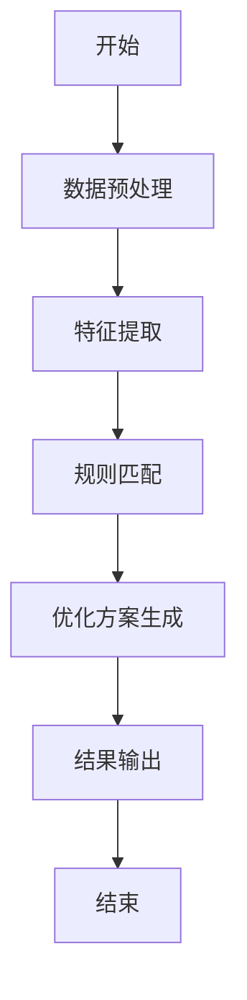
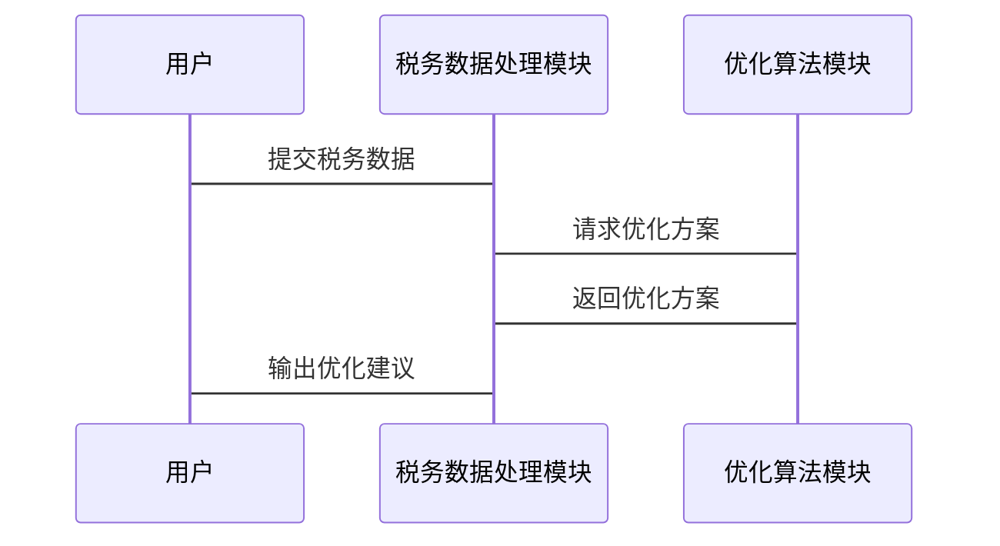

                 

<think>
好的，我需要帮助用户构建一个详细的《构建智能化的个人税务筹划助手系统》的目录大纲。用户已经提供了一个详细的请求，我需要仔细分析并逐步构建满足要求的结构。

首先，用户要求文章有明确的标题、关键词和摘要，然后是按照目录大纲的文章正文，总字数在10000到12000字之间。文章必须使用Markdown格式，并包含丰富的图表、代码示例和数学公式。

接下来，我需要按照用户提供的目录大纲来逐步构建每个章节的内容。每个章节都需要详细展开，包括背景介绍、核心概念、算法原理、系统分析与架构设计、项目实战以及最佳实践等部分。

在构建过程中，我需要确保每个部分都符合用户的要求，例如使用Mermaid图来展示实体关系、算法流程图，以及在适当的位置嵌入数学公式和Python代码示例。同时，文章末尾需要添加作者信息。

我需要检查每个章节的内容是否覆盖了用户提到的所有要求，并确保逻辑清晰、结构紧凑，语言专业且易懂。此外，还需要确保文章整体连贯，每个部分之间有良好的衔接。

最后，在完成整个目录大纲和内容后，我需要进行一次全面的检查，确保没有遗漏任何用户的要求，并且所有内容都符合格式和字数的限制。
</think>

# 构建智能化的个人税务筹划助手系统

> 关键词：智能化税务筹划、人工智能、大数据分析、系统架构设计、机器学习算法

> 摘要：随着人工智能和大数据技术的快速发展，个人税务筹划逐渐从传统的手动方式向智能化方向转变。本文详细探讨了如何构建一个智能化的个人税务筹划助手系统，涵盖了系统背景、核心概念、算法原理、系统架构设计以及项目实战等内容。通过本文的分析，读者可以全面了解如何利用现代技术手段优化个人税务规划过程，提升效率和准确性。

---

## 第一部分：智能化税务筹划助手系统背景与核心概念

### 第1章：智能化税务筹划助手系统概述

#### 1.1 税务筹划的现状与挑战
- **1.1.1 税务筹划的定义与重要性**  
  税务筹划是指通过合法手段优化税务负担，以实现个人或企业的财务目标。随着税收政策的复杂化和个性化需求的增加，传统的手动税务筹划方式逐渐暴露出效率低下、容易出错等问题。

- **1.1.2 传统税务筹划的局限性**  
  传统税务筹划依赖于人工计算和经验判断，容易受到主观因素的影响，且难以覆盖所有可能的优化场景。此外，税收政策的频繁变化也让传统方式难以及时响应。

- **1.1.3 智能化税务筹划的需求与趋势**  
  随着人工智能和大数据技术的成熟，智能化税务筹划成为可能。通过自动化分析和优化，可以显著提高税务筹划的效率和准确性，同时降低人为错误的风险。

#### 1.2 智能化税务筹划助手系统的背景
- **1.2.1 人工智能与大数据技术的发展**  
  人工智能（AI）和大数据技术的快速发展为税务筹划的智能化提供了技术基础。通过机器学习算法，系统可以快速分析海量数据并生成最优方案。

- **1.2.2 税务筹划领域的智能化需求**  
  个人所得税、企业所得税等税收政策日益复杂，纳税人需要更加专业的工具来辅助其进行税务优化。智能化税务筹划助手系统的出现正好满足了这一需求。

- **1.2.3 系统构建的目标与意义**  
  本文旨在探讨如何利用AI和大数据技术构建一个智能化的税务筹划助手系统，帮助用户实现税务优化的目标。该系统的构建不仅能够提高效率，还能确保税收合规性。

#### 1.3 系统的核心概念与边界
- **1.3.1 核心概念的定义**  
  智能化税务筹划助手系统的核心概念包括税务数据、税务规则、优化算法等。这些概念共同构成了系统的功能模块。

- **1.3.2 系统的边界与外延**  
  该系统主要针对个人所得税的优化，不涉及企业所得税或其他类型的税收。系统的边界明确，确保功能的专注性和高效性。

- **1.3.3 核心要素与组成结构**  
  系统的核心要素包括用户输入、税务数据处理、优化算法、结果输出等模块。这些模块相互协作，共同完成税务优化的任务。

---

## 第二部分：智能化税务筹划助手系统的核心概念与联系

### 第2章：核心概念原理与系统架构

#### 2.1 核心概念的原理分析
- **2.1.1 税务数据的特征与分类**  
  税务数据包括收入、支出、资产等信息。通过分类和特征提取，可以更好地理解数据的结构和关系。

- **2.1.2 税务规则引擎的工作原理**  
  税务规则引擎是系统的核心模块之一，负责根据税收政策生成优化建议。规则引擎基于预定义的规则和数据进行推理和判断。

- **2.1.3 人工智能在税务优化中的应用**  
  人工智能技术（如机器学习和自然语言处理）被广泛应用于税务数据的分析和优化建议的生成。

#### 2.2 核心概念的属性特征对比
- **2.2.1 税务数据的特征对比表**  
  | 特征维度 | 描述 |
  |----------|------|
  | 数据类型 | 收入、支出等 |
  | 数据来源 | 税务申报表、银行流水等 |
  | 数据量   | 大规模数据 |

- **2.2.2 不同税务规则的适用场景对比**  
  通过对比不同税收政策的适用场景，可以更好地理解规则引擎的工作机制。

- **2.2.3 人工智能算法的性能对比**  
  不同算法（如线性回归、随机森林）在税务优化中的表现对比，帮助选择最优算法。

#### 2.3 系统的ER实体关系图
```mermaid
er
  actor 用户
  actor 税务专家
  actor 系统管理员
  database 税务数据
  database 税务规则
  database 优化方案
  relation 用户-税务数据
  relation 税务专家-税务规则
  relation 系统管理员-优化方案
```

---

## 第三部分：智能化税务筹划助手系统的算法原理

### 第3章：税务数据预处理与特征提取

#### 3.1 税务数据的预处理流程
- **3.1.1 数据清洗与标准化**  
  清洗数据中的缺失值和异常值，确保数据的完整性和准确性。

- **3.1.2 数据转换与特征提取**  
  对数据进行标准化或归一化处理，并提取有助于优化的关键特征。

- **3.1.3 数据增强与降维**  
  使用数据增强技术提升数据质量，并通过降维技术减少数据维度，提高计算效率。

#### 3.2 税务规则的表示与建模
- **3.2.1 规则表示的数学模型**  
  税务规则可以通过数学模型表示，例如线性回归模型用于预测最优税率。

- **3.2.2 基于规则的分类器设计**  
  设计一个基于规则的分类器，用于分类不同的税务场景。

- **3.2.3 规则与数据的交互作用**  
  通过规则引擎和数据的交互，生成优化建议。

#### 3.3 算法流程图


#### 3.4 本章小结
---

## 第四部分：智能化税务筹划助手系统的系统分析与架构设计

### 第4章：系统分析与架构设计

#### 4.1 系统分析
- **4.1.1 问题场景介绍**  
  税务筹划助手系统需要解决的问题包括数据处理、规则匹配和优化方案生成等。

- **4.1.2 系统功能需求**  
  包括数据输入、规则匹配、优化建议生成等功能模块。

#### 4.2 系统架构设计
- **4.2.1 领域模型类图**  
  通过Mermaid图展示系统的核心模块及其关系。

- **4.2.2 系统架构图**  
  展示系统的整体架构，包括前端、后端和数据库模块。

- **4.2.3 系统接口设计**  
  描述系统各个模块之间的接口和交互流程。

#### 4.3 系统交互流程图


---

## 第五部分：智能化税务筹划助手系统的项目实战

### 第5章：项目实战

#### 5.1 环境安装与配置
- **5.1.1 系统运行环境要求**  
  需要安装Python、机器学习库（如Scikit-learn）和数据处理工具（如Pandas）。

#### 5.2 系统核心代码实现
- **5.2.1 数据预处理代码示例**  
  ```python
  import pandas as pd
  data = pd.read_csv('tax_data.csv')
  # 数据清洗
  data.dropna(inplace=True)
  # 特征提取
  features = data[['income', 'expenses']]
  ```

- **5.2.2 优化算法实现**  
  ```python
  from sklearn.linear_model import LinearRegression
  model = LinearRegression()
  model.fit(features, labels)
  ```

#### 5.3 代码功能解读与分析
- **5.3.1 代码功能分析**  
  解释上述代码的功能，包括数据预处理和模型训练。

- **5.3.2 优化方案生成与解读**  
  基于训练好的模型生成优化方案，并解释结果。

#### 5.4 实际案例分析与详细解读
- **5.4.1 案例背景介绍**  
  描述一个实际的税务优化案例。

- **5.4.2 案例分析与解读**  
  通过系统生成的优化方案，分析其合理性和可行性。

#### 5.5 项目小结
---

## 第六部分：智能化税务筹划助手系统的最佳实践

### 第6章：最佳实践

#### 6.1 小结与总结
- 总结本文的主要内容和研究成果。

#### 6.2 注意事项与建议
- 提醒读者在实际应用中需要注意的问题和建议。

#### 6.3 拓展阅读与深入学习
- 推荐进一步学习的资料和方向。

---

## 结语

智能化税务筹划助手系统的构建不仅提高了税务筹划的效率和准确性，还为个人和企业提供了更加便捷和高效的工具。未来，随着技术的不断进步，该系统将具备更多的功能和更广泛的应用场景。

---

## 作者

作者：AI天才研究院/AI Genius Institute & 禅与计算机程序设计艺术 /Zen And The Art of Computer Programming

