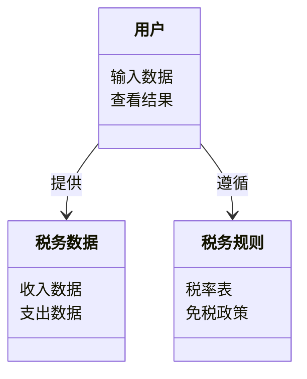
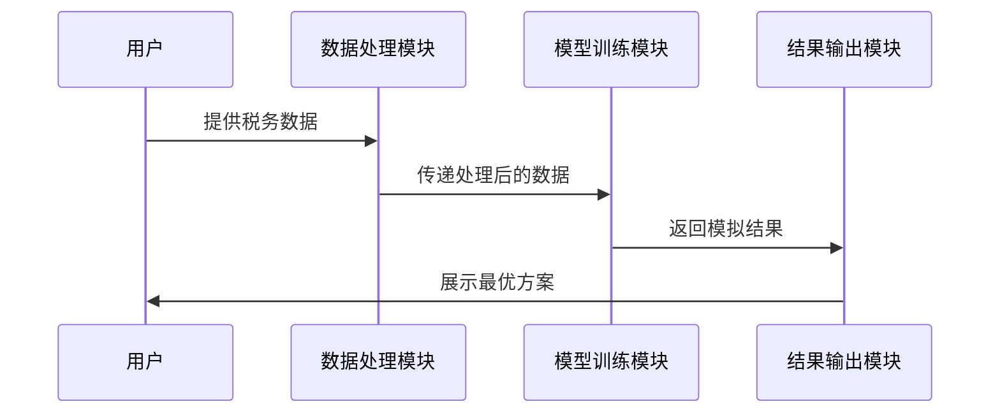

                 

<think>
嗯，用户需要我帮他构建一个关于《构建智能化的个人税务筹划多场景模拟助手》的详细技术博客。首先，我需要理解用户的具体要求。他希望文章结构清晰，包含特定的章节，并且每个部分都有足够的深度和详细的内容。

用户提供的示例已经给出了一个详细的目录大纲，包括背景、核心概念、算法原理、系统分析与架构设计、项目实战等部分。我需要按照这个结构来撰写文章，并且确保每个章节都有足够的细节，比如使用图表、代码示例和数学公式来解释内容。

接下来，我要考虑每个章节的具体内容。比如，在“背景与核心概念”部分，我需要解释税务筹划的背景，智能化助手的必要性，以及多场景模拟的核心价值。这部分需要让读者理解为什么需要这样的助手，以及它的应用场景。

然后，在“算法原理与数学模型”部分，我需要详细讲解数据预处理、特征提取、机器学习模型的构建，以及相关的数学公式。这部分需要使用Mermaid流程图和LaTeX公式来展示算法的原理和具体实现。

接下来是“系统分析与架构设计”，我需要介绍系统的功能模块、架构图、接口设计和交互流程图。这部分需要确保系统的模块化和可扩展性，让读者了解整个系统的结构和各个部分如何协同工作。

最后是“项目实战”部分，我需要提供环境安装步骤、核心代码实现、实际案例分析以及项目小结。这部分需要让读者能够实际操作，理解如何在实际中应用这些技术。

总的来说，我需要确保文章结构清晰，内容详实，每个部分都涵盖必要的细节，并且使用适当的图表和代码示例来增强理解。同时，语言要专业但不失易懂，确保读者能够顺利地跟随内容，理解技术原理和应用方法。

现在，我开始按照这个思路撰写每个部分，确保每个章节和小节都符合用户的要求，并且内容完整、逻辑连贯。
</think>

# 构建智能化的个人税务筹划多场景模拟助手

## 关键词：个人税务筹划，人工智能，多场景模拟，智能化助手，机器学习，数学模型

## 摘要：本文详细探讨了如何利用人工智能技术构建智能化的个人税务筹划多场景模拟助手。通过分析税务筹划的背景与挑战，结合机器学习算法和数学模型，提出了一种基于多场景模拟的解决方案，并通过系统架构设计和项目实战验证了其可行性和有效性。本文旨在为个人税务筹划提供一种高效、智能的工具，帮助用户在复杂多变的税务环境中做出最优决策。

---

## 第一部分: 背景与核心概念

### 第1章: 个人税务筹划的智能化需求

#### 1.1 税务筹划的背景与挑战

##### 1.1.1 个人税务筹划的基本概念
个人税务筹划是指个人在遵守法律法规的前提下，通过合理安排收入、支出、资产配置等方式，优化税务负担，实现税务合规与节税目标的过程。随着税收政策的复杂化和个性化需求的增加，传统的手动税务筹划方式已难以满足高效性和准确性要求。

##### 1.1.2 智能化税务筹划的必要性
人工智能（AI）技术的快速发展为税务筹划提供了新的可能性。通过智能化助手，用户可以快速获取个性化的税务建议，避免因信息不对称或知识不足导致的税务风险。

##### 1.1.3 多场景模拟助手的目标与意义
多场景模拟助手的目标是通过AI技术，模拟多种税务规划方案，帮助用户找到最优解。其意义在于提高税务筹划的效率、准确性和可操作性，同时降低用户的决策成本。

#### 1.2 人工智能在税务筹划中的应用

##### 1.2.1 人工智能技术的基本原理
人工智能通过模拟人类的思维过程，利用机器学习、自然语言处理、计算机视觉等技术，实现数据的分析、理解和决策。

##### 1.2.2 AI在税务筹划中的优势
- **数据处理能力**：AI能够快速处理大量税务数据，提取关键特征。
- **模式识别**：通过机器学习算法，AI可以识别复杂的税务模式。
- **实时更新**：AI能够实时跟踪税收政策的变化，确保筹划方案的合规性。

##### 1.2.3 多场景模拟的核心价值
多场景模拟助手可以在短时间内生成多种税务规划方案，并评估每种方案的优劣，帮助用户做出最优决策。

---

### 第2章: 智能化税务筹划助手的核心概念

#### 2.1 核心概念与定义

##### 2.1.1 个人税务筹划的定义
个人税务筹划是指个人在法律允许的范围内，通过合理安排经济活动，降低税务负担的过程。

##### 2.1.2 智能化助手的功能特点
- **智能化**：基于AI技术，提供自动化、个性化的税务建议。
- **多场景模拟**：支持多种税务规划方案的生成与评估。
- **实时更新**：根据最新税收政策调整建议。

##### 2.1.3 多场景模拟的核心要素
- **数据输入**：用户的基本信息、财务数据等。
- **模型构建**：基于机器学习的税务规划模型。
- **模拟输出**：多种税务规划方案及其对比分析。

#### 2.2 核心概念之间的关系

##### 2.2.1 税务数据与场景模拟的关系
税务数据是多场景模拟的基础，场景模拟通过分析数据生成不同的规划方案。

##### 2.2.2 AI算法与税务规则的结合
AI算法用于数据处理和模式识别，而税务规则则是算法决策的依据。

##### 2.2.3 用户需求与系统输出的关联
用户需求驱动系统的功能设计，系统输出满足用户的个性化税务规划需求。

---

## 第二部分: 算法原理与数学模型

### 第3章: 多场景模拟助手的算法原理

#### 3.1 数据预处理与特征提取

##### 3.1.1 数据清洗与标准化
- 数据清洗：去除无效数据，处理缺失值。
- 数据标准化：将数据归一化，便于模型处理。

##### 3.1.2 特征选择与提取方法
- 特征选择：通过统计学方法筛选重要特征。
- 特征提取：利用主成分分析（PCA）等方法降低数据维度。

##### 3.1.3 数据标注与分类
- 数据标注：根据税务规则对数据进行分类。
- 数据分类：利用监督学习算法（如决策树、随机森林）对数据进行分类。

#### 3.2 机器学习模型的构建

##### 3.2.1 监督学习与无监督学习的对比
- 监督学习：基于标注数据进行模型训练。
- 无监督学习：基于无标注数据发现数据内在结构。

##### 3.2.2 基于深度学习的模型选择
- 深度学习模型（如神经网络）适用于复杂数据的处理。

##### 3.2.3 模型训练与调优策略
- 模型训练：利用训练数据进行参数优化。
- 模型调优：通过交叉验证调整模型参数，防止过拟合。

### 第4章: 数学模型与公式解析

#### 4.1 概率论基础

##### 4.1.1 概率分布的定义与应用
概率分布描述了随机变量取值的概率，常用在机器学习模型的不确定性分析中。

##### 4.1.2 条件概率与贝叶斯定理
- 条件概率公式：$P(A|B) = \frac{P(B|A)P(A)}{P(B)}$
- 贝叶斯定理：用于基于条件概率的推断。

##### 4.1.3 马尔可夫链的基本原理
马尔可夫链描述了系统状态转移的概率，常用于时间序列分析。

#### 4.2 优化算法与模型训练

##### 4.2.1 最大似然估计公式
最大似然估计用于参数估计，公式为：$$\theta = \arg\max_{\theta} \prod_{i=1}^n p(x_i|\theta)$$

##### 4.2.2 梯度下降算法的数学推导
梯度下降用于最小化目标函数，更新规则为：$$\theta = \theta - \eta \nabla J(\theta)$$

##### 4.2.3 支持向量机的数学模型
支持向量机的目标是最小化经验风险，公式为：$$\min_{\theta, b} \frac{1}{2}\|\theta\|^2 + C \sum_{i=1}^n \xi_i$$
约束条件为：$$y_i (\theta^T x_i + b) \geq 1 - \xi_i$$

---

## 第三部分: 系统分析与架构设计

### 第5章: 智能化税务筹划助手的系统分析

#### 5.1 问题场景介绍

##### 5.1.1 多场景模拟的核心问题
如何在多种税务规划方案中找到最优解。

##### 5.1.2 系统功能需求分析
- 数据输入与处理
- 多场景模拟与评估
- 方案输出与优化建议

##### 5.1.3 用户角色与权限设计
- 用户：输入数据，查看结果
- 系统管理员：维护系统，更新税收政策

#### 5.2 系统功能设计

##### 5.2.1 领域模型设计（Mermaid 类图）


##### 5.2.2 系统架构设计（Mermaid 架构图）


#### 5.3 系统接口设计与交互流程图

##### 5.3.1 系统接口设计
- 输入接口：接收用户数据
- 输出接口：提供模拟结果

##### 5.3.2 系统交互流程图（Mermaid 序列图）


---

## 第四部分: 项目实战

### 第6章: 项目实战与案例分析

#### 6.1 环境安装与配置

##### 6.1.1 环境要求
- Python 3.8+
- 安装必要的库：pandas、numpy、scikit-learn、keras

##### 6.1.2 安装步骤
```bash
pip install pandas numpy scikit-learn keras
```

#### 6.2 核心代码实现

##### 6.2.1 数据预处理代码
```python
import pandas as pd
import numpy as np

# 读取数据
data = pd.read_csv('tax_data.csv')

# 数据清洗
data.dropna(inplace=True)

# 标准化处理
from sklearn.preprocessing import StandardScaler
scaler = StandardScaler()
scaled_data = scaler.fit_transform(data)
```

##### 6.2.2 机器学习模型实现
```python
from sklearn.ensemble import RandomForestClassifier
from sklearn.model_selection import train_test_split

# 划分训练集和测试集
X_train, X_test, y_train, y_test = train_test_split(scaled_data, data['label'], test_size=0.2)

# 训练模型
model = RandomForestClassifier()
model.fit(X_train, y_train)

# 预测结果
y_pred = model.predict(X_test)
print('准确率:', model.score(X_test, y_test))
```

#### 6.3 实际案例分析与解读

##### 6.3.1 案例背景
某高收入者希望优化个人所得税负担，通过多场景模拟助手生成多种方案。

##### 6.3.2 方案模拟与对比
模拟方案包括不同的收入分配、支出优化、资产配置等策略，系统评估每种方案的税后收入。

##### 6.3.3 最优方案选择
根据模拟结果，选择最优方案并生成详细报告。

#### 6.4 项目小结

##### 6.4.1 核心代码总结
- 数据预处理：清洗和标准化
- 模型训练：随机森林分类器

##### 6.4.2 项目实现的关键点
- 数据的准确输入与处理
- 模型的调优与优化
- 结果的可视化与解读

---

## 第五部分: 总结与展望

### 第7章: 总结与展望

#### 7.1 小结
本文详细探讨了智能化个人税务筹划多场景模拟助手的构建过程，从背景分析、算法原理到系统设计，再到项目实战，为读者提供了一套完整的解决方案。

#### 7.2 注意事项
- 数据隐私保护
- 税收政策的及时更新
- 模型的可解释性

#### 7.3 拓展阅读
- 推荐阅读《机器学习实战》
- 参考相关论文：《基于机器学习的税务优化方法研究》

---

## 作者信息

作者：AI天才研究院（AI Genius Institute） & 禅与计算机程序设计艺术（Zen And The Art of Computer Programming）

---

感谢您的阅读！如需进一步探讨或合作，请随时联系！

