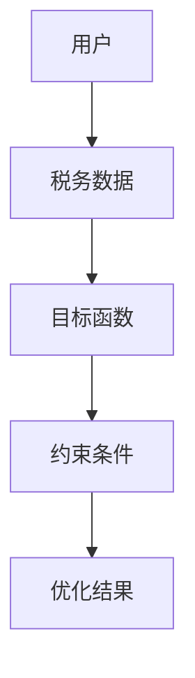
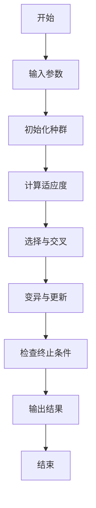
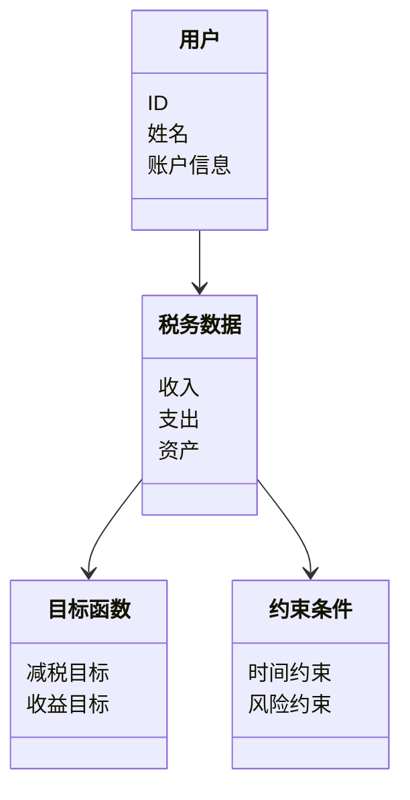
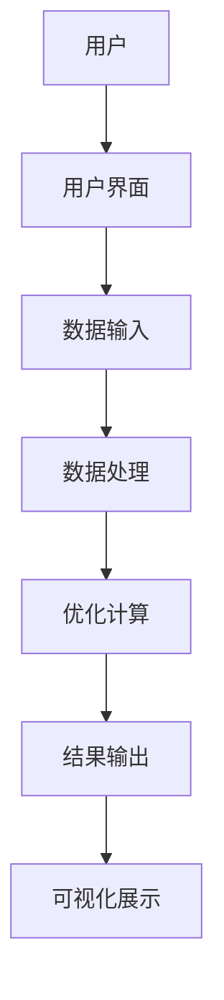

                 


# 构建智能化的个人税务筹划多目标动态优化助手

> 关键词：人工智能，税务筹划，多目标优化，动态规划，智能化助手

> 摘要：本文探讨如何构建一个智能化的个人税务筹划多目标动态优化助手，利用人工智能和优化算法，解决传统税务筹划中的效率与准确性问题。通过分析多目标动态优化的算法原理，设计系统架构，并提供项目实战案例，展示如何将技术应用于实际税务筹划中，为个人用户提供高效、智能的税务优化方案。

---

# 第一部分: 智能化税务筹划助手的背景与概念

## 第1章: 个人税务筹划的背景与挑战

### 1.1 个人税务筹划的背景介绍

#### 1.1.1 税务筹划的基本概念
税务筹划是指通过合法的手段，优化个人或企业的税务负担，以实现税后收益最大化的过程。个人税务筹划通常涉及收入、支出、资产配置、投资等多种因素的综合考量。

#### 1.1.2 个人税务筹划的重要性
随着经济全球化和税收政策的复杂化，个人税务筹划的重要性日益凸显。合理的税务筹划可以帮助个人合法降低税负，提高可支配收入，同时避免税务风险。

#### 1.1.3 税务筹划的法律与合规性
税务筹划必须在法律允许的范围内进行，确保所有操作符合税法规定，避免因不当行为导致的法律风险。

---

### 1.2 税务筹划中的多目标优化问题

#### 1.2.1 多目标优化的基本概念
多目标优化是指在多个目标之间寻找最优解的过程。例如，在税务筹划中，可能需要在税后收入最大化、风险最小化、合规性保障等多个目标之间找到平衡。

#### 1.2.2 税务筹划中的多目标冲突
在税务筹划中，不同目标之间可能存在冲突。例如，追求税后收入最大化可能会增加税务风险，而降低风险可能需要牺牲部分收入。

#### 1.2.3 动态优化的必要性
税法政策、经济环境和个人财务状况的变化，使得税务筹划需要不断动态调整，以应对新的优化目标。

---

### 1.3 传统税务筹划方法的局限性

#### 1.3.1 传统税务筹划的流程与工具
传统税务筹划通常依赖人工计算和经验判断，工具主要包括Excel表格和简单的财务软件。

#### 1.3.2 传统方法的效率与准确性问题
传统方法效率低下，容易受到人为因素的影响，且难以应对复杂的多目标优化问题。

#### 1.3.3 传统方法的局限性与改进方向
传统方法难以处理动态变化的优化目标，且缺乏智能化的分析能力。

---

### 1.4 智能化税务筹划助手的提出

#### 1.4.1 智能化税务筹划的定义
智能化税务筹划助手是指利用人工智能、大数据和优化算法，提供智能化的税务筹划建议和动态优化方案的工具。

#### 1.4.2 智能化助手的核心目标
智能化助手的目标是通过动态优化算法，帮助用户在多个目标之间找到最优平衡，实现税后收益的最大化。

#### 1.4.3 智能化助手的预期价值
智能化助手能够显著提高税务筹划的效率和准确性，同时降低税务风险，为用户提供个性化的优化方案。

---

### 1.5 本章小结

---

## 第2章: 智能化税务筹划助手的核心概念与联系

### 2.1 多目标动态优化的基本原理

#### 2.1.1 多目标优化的数学模型
多目标优化问题可以表示为：
$$ \text{Minimize } f(x) $$
$$ \text{Subject to } g(x) \leq 0 $$

其中，\( f(x) \) 是目标函数，\( g(x) \) 是约束条件。

#### 2.1.2 动态优化的核心思想
动态优化是指在优化过程中，目标函数或约束条件会随着环境的变化而动态调整，需要不断重新优化以适应新的条件。

#### 2.1.3 智能化助手中的多目标动态优化
在智能化税务筹划助手中，多目标动态优化用于实时调整用户的财务状况和税法变化，找到最优的税务筹划方案。

---

### 2.2 核心概念的属性特征对比

#### 2.2.1 多目标优化与单目标优化的对比

| 特性         | 单目标优化       | 多目标优化       |
|--------------|------------------|------------------|
| 优化目标数   | 1                | 多个             |
| 解的个数     | 唯一最优解       | 多个 Pareto 解   |
| 复杂度       | 较低             | 较高             |

#### 2.2.2 动态优化与静态优化的对比

| 特性         | 静态优化         | 动态优化         |
|--------------|------------------|------------------|
| 优化条件     | 固定             | 动态变化         |
| 优化频率     | 低               | 高               |
| 应用场景     | 稳定环境         | 动态变化环境     |

#### 2.2.3 智能化助手与其他税务工具的对比

| 特性         | 传统税务工具     | 智能化助手       |
|--------------|------------------|------------------|
| 智能化程度   | 低               | 高               |
| 优化目标数   | 单一             | 多个             |
| 自适应性     | 无               | 有               |

---

### 2.3 ER实体关系图架构



---

### 2.4 本章小结

---

## 第3章: 多目标动态优化算法的原理与实现

### 3.1 算法原理概述

#### 3.1.1 多目标优化的基本原理
多目标优化通过权衡多个目标的优先级，找到 Pareto 最优解。Pareto 最优解是指无法在不损害一个目标的情况下改善另一个目标的解。

#### 3.1.2 动态优化的核心思想
动态优化通过实时更新目标函数和约束条件，动态调整优化过程，以适应变化的环境。

#### 3.1.3 智能化助手中的算法选择
在智能化税务筹划助手 中，选择基于遗传算法的多目标优化算法（如 NSGA-II），因为其能够有效处理多目标问题。

---

### 3.2 算法实现流程



---

### 3.3 算法的数学模型与公式

#### 3.3.1 多目标优化的数学模型
多目标优化问题可以表示为：
$$ \text{Minimize } f_1(x), f_2(x), \ldots, f_n(x) $$
$$ \text{Subject to } g_1(x) \leq 0, g_2(x) \leq 0, \ldots, g_m(x) \leq 0 $$

其中，\( f_i(x) \) 是目标函数，\( g_j(x) \) 是约束条件。

#### 3.3.2 动态优化的约束条件
动态优化的约束条件可以表示为：
$$ x_{t+1} = f(x_t, t) $$

其中，\( x_t \) 表示第 \( t \) 时刻的状态，\( f \) 是状态更新函数。

---

### 3.4 算法实现的代码示例

```python
import numpy as np

def evaluate(individual):
    # 计算目标函数值
    f1 = individual[0] + individual[1]
    f2 = individual[0] * individual[1]
    return (f1, f2)

def constraints(individual):
    # 计算约束条件
    g1 = individual[0] + individual[1] - 2
    g2 = individual[0] * individual[1] - 1
    return (g1 <= 0, g2 <= 0)

# 初始化种群
population = np.random.rand(10, 2)

# 计算适应度
fitness = np.zeros(10)
for i in range(10):
    fitness[i] = evaluate(population[i])

# 选择与交叉
selected = np.argsort(fitness)
new_population = population[selected[:5]]
new_population = (new_population + population[selected[5:]]) / 2

# 变异与更新
mutated = new_population + np.random.rand(5, 2) * 0.1
population = np.vstack((mutated, population))
```

---

### 3.5 本章小结

---

## 第4章: 系统分析与架构设计

### 4.1 系统功能设计

#### 4.1.1 领域模型类图



---

### 4.2 系统架构设计



---

### 4.3 系统接口设计

#### 4.3.1 输入接口
用户通过输入接口提供税务数据，包括收入、支出、资产等信息。

#### 4.3.2 输出接口
系统通过输出接口提供优化结果，包括最优税务方案和可视化报告。

---

## 第5章: 项目实战

### 5.1 环境安装

#### 5.1.1 安装Python
```bash
python --version
pip install numpy
pip install pymo
pip install pygmo
```

---

### 5.2 系统核心实现源代码

```python
import numpy as np
from pymo import *
from pygmo import *

def main():
    # 初始化问题
    prob = problem(
        dimensions=2,
        evaluate=lambda x: (x[0] + x[1], x[0] * x[1]),
        constraints=lambda x: (x[0] + x[1] <= 2, x[0] * x[1] <= 1)
    )
    
    # 初始化算法
    algo = algorithm(algorithm.nsga2)
    
    # 初始化种群
    pop = population(prob, size=10)
    
    # 运行优化
    pop = algo.evolve(pop)
    
    # 获取最优解
    pareto_front = pop.get_pareto_front()
    print("最优解：", pareto_front)

if __name__ == "__main__":
    main()
```

---

### 5.3 代码应用解读与分析

#### 5.3.1 代码功能解读
上述代码通过 NSGA-II 算法，实现多目标优化问题的求解。用户输入税务数据后，系统将生成 Pareto 最优解，供用户选择最佳税务方案。

#### 5.3.2 代码实现细节
代码使用了 Python 的 pymo 和 pygmo 库，分别用于定义问题和实现 NSGA-II 算法。

---

### 5.4 实际案例分析

#### 5.4.1 案例背景
假设用户年收入为 100 万元，需在不同的资产配置下优化税后收益。

#### 5.4.2 优化结果
系统将生成多个 Pareto 最优解，用户可以根据风险偏好选择最优方案。

---

### 5.5 项目小结

---

## 第6章: 最佳实践与总结

### 6.1 最佳实践 tips
- 定期更新税务数据和税法政策。
- 结合用户实际需求，调整优化目标和权重。
- 注意税务风险，确保所有操作符合法律规定。

### 6.2 本章小结
智能化税务筹划助手通过多目标动态优化算法，显著提高了税务筹划的效率和准确性，为个人用户提供个性化的优化方案。

---

## 第7章: 注意事项与拓展阅读

### 7.1 注意事项
- 确保数据的准确性和完整性。
- 定期维护和更新系统。
- 遵守税法政策和相关规定。

### 7.2 拓展阅读
- 《多目标优化算法及其应用》
- 《人工智能在金融领域的应用》
- 《税务筹划与风险管理》

---

## 作者：AI天才研究院/AI Genius Institute & 禅与计算机程序设计艺术/Zen And The Art of Computer Programming

---

感谢您的阅读！如果对本文内容感兴趣，欢迎关注我们的公众号或订阅专栏，获取更多深度技术文章！

