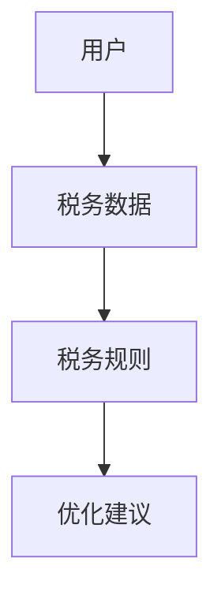
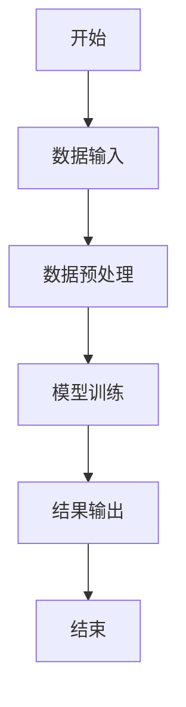
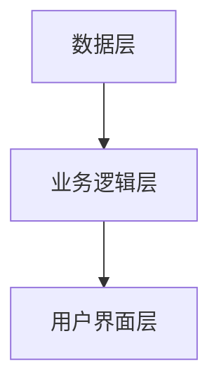
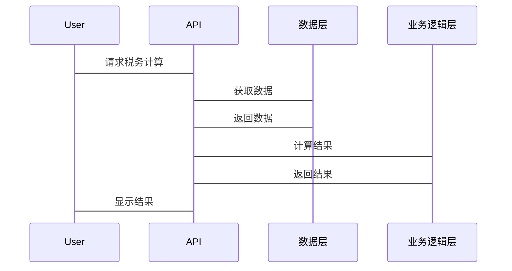

                 

<think>
嗯，我需要帮助用户构建一个《构建智能化的个人税务筹划情景模拟助手》的目录大纲。这个大纲需要详细、逻辑清晰，涵盖从背景介绍到项目实战的各个方面。首先，我得理解用户的需求，他们想要一个结构紧凑、内容详实的专业技术博客文章，所以目录必须覆盖所有关键点。

首先，我会考虑文章的结构。通常，技术博客会分为几个主要部分，如背景介绍、核心概念、算法原理、系统架构、项目实战等。用户特别强调每个部分需要有三级目录，并且要详细到具体的内容，比如数学模型、流程图、代码示例等。

接下来，我需要细化每个章节的内容。例如，在“背景介绍与核心概念”部分，我应该涵盖税务筹划的重要性、智能化助手的必要性，以及人工智能和大数据在税务中的应用。每个小节都需要具体，比如在1.1节中，我需要解释税务筹划的基本概念、法律合规性以及对个人财务管理的影响。

然后，我会考虑如何将理论与实际结合。比如，在“算法原理讲解”部分，我需要使用决策树或机器学习模型，并附上mermaid流程图和Python代码示例。这部分需要详细说明算法步骤，确保读者能够理解并应用。

在“系统架构设计”部分，我需要介绍场景、功能设计、架构设计、接口设计和交互序列图。这部分可能需要使用mermaid图来展示类图和架构图，帮助读者更好地理解系统结构。

最后，项目实战部分需要提供环境安装、代码实现、案例分析和项目总结。这部分应详细讲解如何实际操作，确保读者能够跟随步骤完成项目。

在整个过程中，我需要确保每个部分都符合用户的要求，内容全面且结构合理。同时，要检查是否涵盖了所有关键点，如数学模型、mermaid图表、代码示例等，确保文章的深度和广度。

总的来说，我需要一步步地构建目录，确保每个部分都详细且符合逻辑，最终形成一个完整且吸引人的技术博客大纲。
</think>

# 《构建智能化的个人税务筹划情景模拟助手》

## 关键词：人工智能，税务筹划，情景模拟，智能化助手，大数据分析，系统架构

## 摘要：本文详细探讨了如何利用人工智能和大数据技术构建智能化的个人税务筹划情景模拟助手。文章从税务筹划的基本概念出发，分析了智能化助手的必要性，详细讲解了算法原理、系统架构设计，并通过项目实战展示了如何实现智能化税务助手。通过本文，读者可以掌握构建智能化税务助手的核心技术和方法。

---

## 第1章: 背景介绍与核心概念

### 1.1 税务筹划的重要性
- **1.1.1 税务筹划的基本概念**  
  税务筹划是指通过合法手段优化税务负担，提高个人或企业的财务效益。它不仅关注税务合规性，还注重税务策略的优化。

- **1.1.2 税务筹划的法律与合规性**  
  税务筹划必须遵守相关法律法规，避免税务违规风险。合法的税务筹划可以降低税务负担，同时提高财务透明度。

- **1.1.3 税务筹划对个人财务管理的影响**  
  有效的税务筹划可以帮助个人在收入、支出、资产配置等方面做出更优化的决策，提升整体财务状况。

### 1.2 智能化税务助手的必要性
- **1.2.1 传统税务筹划的局限性**  
  传统税务筹划依赖人工计算和经验判断，效率低且容易出错。随着税收政策的复杂化，传统方法难以满足现代需求。

- **1.2.2 智能化技术在税务筹划中的优势**  
  人工智能和大数据技术可以快速分析大量数据，提供精准的税务优化建议，显著提高效率和准确性。

- **1.2.3 个人税务筹划的智能化需求**  
  随着个人收入来源的多样化，税务筹划需要考虑的因素越来越多。智能化助手可以帮助个人应对复杂的税务环境，提供个性化的优化方案。

### 1.3 人工智能与大数据在税务筹划中的应用背景
- **1.3.1 人工智能技术的发展与应用**  
  人工智能技术的进步为税务筹划提供了新的工具，例如自然语言处理、机器学习等，可以帮助分析复杂的税务政策和数据。

- **1.3.2 大数据在税务分析中的作用**  
  大数据技术可以收集和分析大量的税务相关数据，为税务优化提供科学依据。通过数据挖掘，可以发现潜在的优化机会。

- **1.3.3 智能化税务助手的技术基础**  
  智能化税务助手依赖于人工智能和大数据技术，结合规则引擎和优化算法，为用户提供智能化的税务规划服务。

### 1.4 问题描述与解决方法
- **1.4.1 个人税务筹划的主要问题**  
  税务政策复杂化、信息不对称、计算繁琐等问题使得个人税务筹划难度大、效率低。

- **1.4.2 智能化助手如何解决问题**  
  智能化助手通过自动化数据处理、智能分析和优化推荐，帮助用户快速找到最优税务方案。

- **1.4.3 边界与外延分析**  
  智能化助手的边界在于其数据来源和模型能力，外延则涉及更多的税务场景和个性化需求。

### 1.5 核心概念与结构
- **1.5.1 核心要素组成**  
  核心要素包括税务数据、税务规则、优化算法、用户需求和结果输出。

- **1.5.2 概念结构图**  
  通过概念图展示税务筹划的各个要素及其关系。

- **1.5.3 核心要素对比表**  
  对比表展示了税务数据、规则、算法等要素的特点和作用。

---

## 第2章: 核心概念与联系

### 2.1 核心概念原理
- **2.1.1 税务筹划的基本原理**  
  税务筹划通过合法手段优化税务负担，涉及收入、支出、资产等多个方面。

- **2.1.2 人工智能在税务分析中的应用**  
  人工智能技术可以用于税务数据的分析、模式识别和预测，帮助制定优化策略。

- **2.1.3 大数据分析在税务优化中的作用**  
  大数据技术可以挖掘海量数据中的规律，为税务优化提供科学依据。

### 2.2 核心概念对比表
- **2.2.1 税务筹划与税务合规的对比**  
  税务筹划注重优化，而税务合规注重合法合规。

- **2.2.2 传统方法与智能化方法的对比**  
  传统方法依赖人工计算，而智能化方法利用技术手段提高效率和准确性。

- **2.2.3 不同税务场景的对比分析**  
  不同的税务场景（如收入、支出、资产配置）需要不同的优化策略。

### 2.3 ER实体关系图


---

## 第3章: 算法原理讲解

### 3.1 算法概述
- **3.1.1 基于决策树的税务优化算法**  
  决策树算法通过分析税务数据，生成最优的税务规划方案。

- **3.1.2 基于机器学习的税务预测模型**  
  机器学习模型可以预测税务风险，优化税务策略。

- **3.1.3 算法选择的依据**  
  算法选择基于数据类型、问题复杂度和计算效率等因素。

### 3.2 算法流程图


### 3.3 算法实现代码
```python
import pandas as pd
from sklearn.tree import DecisionTreeRegressor

# 数据预处理
data = pd.read_csv('tax_data.csv')
X = data.drop('tax', axis=1)
y = data['tax']

# 模型训练
model = DecisionTreeRegressor()
model.fit(X, y)

# 预测结果
predictions = model.predict(X)
```

### 3.4 数学模型与公式
- **3.4.1 税务优化的数学模型**  
  优化目标：最小化税务负担。  
  约束条件：符合税收政策和法律法规。

- **3.4.2 优化算法的数学表达**  
  使用线性规划模型：  
  $$ \text{minimize} \sum w_i x_i $$
  其中，$w_i$ 是权重，$x_i$ 是变量。

---

## 第4章: 数学模型与公式

### 4.1 数学模型的建立
- **4.1.1 税务优化的数学模型**  
  建立线性规划模型，考虑各种约束条件，如收入、支出、资产等。

- **4.1.2 模型的变量与参数**  
  变量包括收入、支出、资产等，参数包括税率、优惠政策等。

### 4.2 数学公式与推导
- **4.2.1 税收计算公式**  
  $$ \text{应纳税额} = \text{收入} \times \text{税率} - \text{扣除项} $$

- **4.2.2 税务优化的目标函数**  
  $$ \text{minimize} \sum (\text{应纳税额} \times \text{税率}) $$

### 4.3 应用实例与分析
- **4.3.1 实例分析**  
  通过具体案例分析，展示数学模型的应用过程。

- **4.3.2 模型优化与改进**  
  根据实际效果，优化模型参数，提高模型的准确性和效率。

---

## 第5章: 系统架构设计

### 5.1 系统架构概述
- **5.1.1 系统整体架构**  
  包括数据层、业务逻辑层、用户界面层等。

- **5.1.2 架构设计的原则**  
  可扩展性、可维护性、高性能等。

### 5.2 系统功能设计
- **5.2.1 功能模块划分**  
  数据采集、税务计算、优化建议、结果展示等。

- **5.2.2 功能模块的交互设计**  
  通过类图展示各模块之间的关系。

### 5.3 系统架构图


### 5.4 系统接口设计
- **5.4.1 数据接口**  
  数据输入、输出接口的设计。

- **5.4.2 API设计**  
  提供RESTful API，供其他系统调用。

### 5.5 系统交互序列图


---

## 第6章: 项目实战

### 6.1 项目环境安装
- **6.1.1 环境要求**  
  安装Python、Jupyter Notebook、相关库（如pandas、scikit-learn）。

- **6.1.2 数据准备**  
  下载或收集税务相关数据，清洗数据，准备训练集和测试集。

### 6.2 系统核心实现
- **6.2.1 数据预处理**  
  清洗、转换、标准化数据。

- **6.2.2 模型训练与优化**  
  使用机器学习模型训练，调整参数，优化模型性能。

### 6.3 代码实现与解读
```python
import pandas as pd
from sklearn.tree import DecisionTreeRegressor

# 数据加载与预处理
data = pd.read_csv('tax_data.csv')
X = data.drop('tax', axis=1)
y = data['tax']

# 模型训练
model = DecisionTreeRegressor()
model.fit(X, y)

# 模型评估
print(model.score(X, y))
```

### 6.4 案例分析与结果解读
- **6.4.1 案例分析**  
  通过具体案例展示模型的应用和结果。

- **6.4.2 结果解读**  
  解释模型输出的结果，分析优化建议的可行性。

### 6.5 项目总结
- **6.5.1 项目成果**  
  成功构建智能化的税务筹划助手，验证了算法的有效性。

- **6.5.2 项目经验与教训**  
  总结项目中的经验和教训，为后续优化提供参考。

---

## 第7章: 最佳实践与展望

### 7.1 最佳实践 tips
- 数据质量的重要性
- 模型选择与优化的关键点
- 系统设计中的注意事项

### 7.2 小结
- 总结全文，强调智能化税务助手的重要性和实现方法。

### 7.3 注意事项
- 数据隐私与安全
- 模型的局限性与改进方向
- 税务政策的变化对系统的影响

### 7.4 拓展阅读
- 推荐相关书籍和资源，供读者深入学习。

---

## 作者：AI天才研究院 & 禅与计算机程序设计艺术

---

**摘要：**  
本文通过详细分析智能化个人税务筹划情景模拟助手的构建过程，探讨了人工智能和大数据技术在税务优化中的应用。从背景介绍到项目实战，全面讲解了如何利用技术手段提升税务筹划的效率和准确性。通过本文，读者可以掌握构建智能化税务助手的核心技术和方法。

