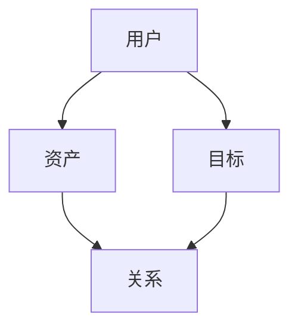
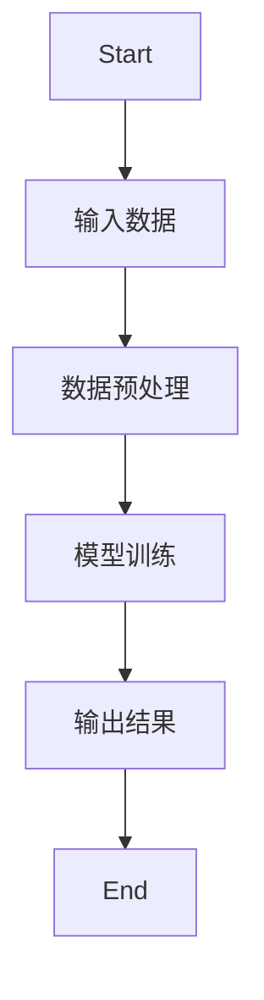
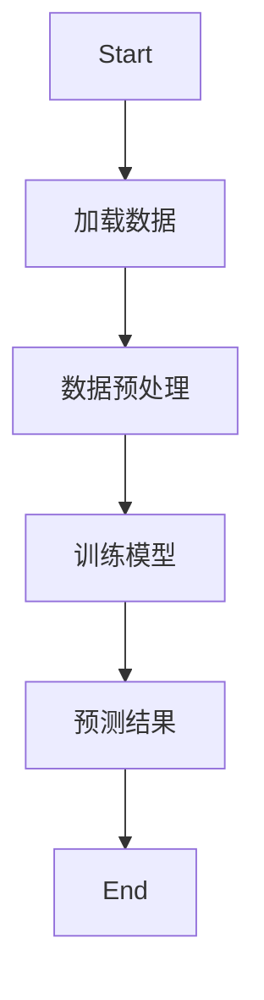
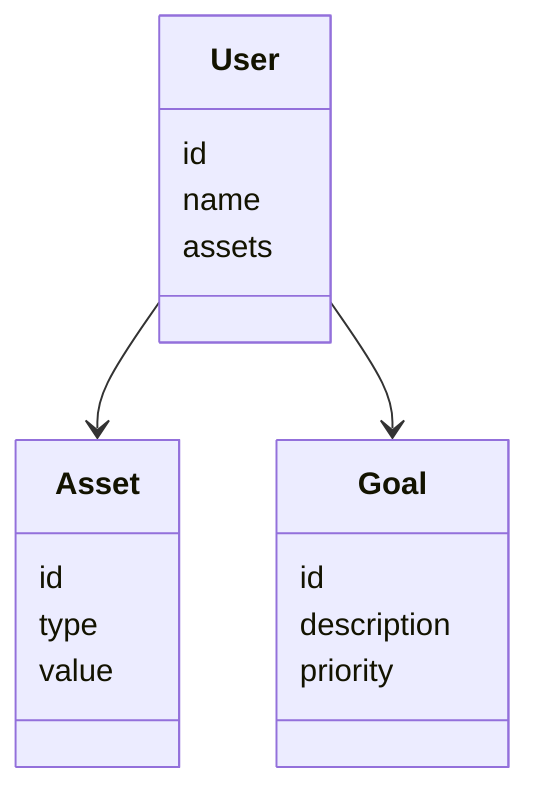
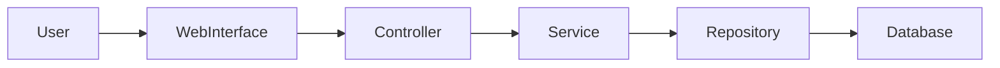
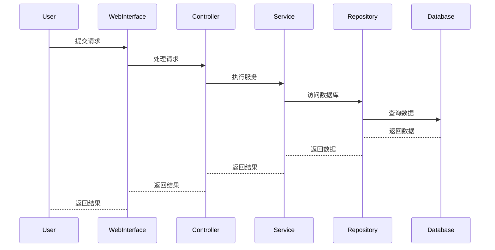

                 


# 构建智能化的个人财富传承规划助手

> 关键词：人工智能，财富传承，智能化助手，个人资产规划，技术实现

> 摘要：本文深入探讨了如何利用人工智能技术构建智能化的个人财富传承规划助手，通过系统化的分析与设计，详细阐述了其实现原理、系统架构、算法流程及项目实战。

---

# 第一部分：背景与核心概念

## 第1章：背景介绍

### 1.1 问题背景

#### 1.1.1 传统财富传承的痛点

传统财富传承过程中，个人或家庭在规划资产分配时面临诸多挑战。首先，复杂的法律框架和税务政策要求专业的知识储备；其次，市场环境的多变性和不确定性增加了规划的难度；最后，个人需求的多样性使得“一刀切”的解决方案难以满足实际需求。

#### 1.1.2 数字化时代的需求

随着数字化技术的普及，个人财富管理的需求日益增长。用户期望能够获得个性化的财富传承规划，而不仅仅是通用的建议。此外，数字化工具可以实时更新和调整规划，以适应市场和政策的变化。

#### 1.1.3 智能化助手的必要性

智能化助手能够通过大数据分析、机器学习等技术，帮助用户快速生成个性化财富传承方案，并实时调整以应对变化。这不仅提高了效率，还降低了人为错误的风险。

### 1.2 问题描述

#### 1.2.1 财富传承的核心问题

财富传承的核心问题包括如何合理分配资产、如何规避税务风险以及如何确保执行过程的合法性。

#### 1.2.2 个人财富管理的复杂性

个人财富管理涉及多种资产类别、税务规划、法律合规等多个方面，这些因素相互交织，增加了管理的复杂性。

#### 1.2.3 智能化规划的优势

智能化规划能够通过数据分析和模型模拟，提供最优的资产分配建议，并根据用户的实时需求进行动态调整。

### 1.3 问题解决

#### 1.3.1 智能化助手的目标

智能化助手的目标是通过技术手段，帮助用户制定科学、合理的财富传承规划，并确保执行过程的合法性和高效性。

#### 1.3.2 技术手段与解决方案

解决方案包括大数据分析、机器学习、自然语言处理等技术，用于数据采集、分析、模拟和优化。

#### 1.3.3 边界与外延

智能化助手的边界在于其技术能力和数据范围，外延则包括与法律、税务等专业领域的结合。

### 1.4 核心概念结构

#### 1.4.1 功能模块组成

核心功能模块包括用户画像、资产分析、风险评估、方案模拟和动态调整。

#### 1.4.2 关键技术特征

关键技术包括大数据分析、机器学习、自然语言处理和优化算法。

#### 1.4.3 系统架构模式

系统架构采用模块化设计，各功能模块协同工作，确保系统的高效性和可扩展性。

## 第2章：核心概念与联系

### 2.1 核心概念原理

#### 2.1.1 智能化助手的工作原理

智能化助手通过数据采集、分析和建模，生成个性化财富传承方案，并实时调整以应对变化。

#### 2.1.2 多模态数据处理机制

多模态数据处理机制能够同时处理文本、数值、图像等多种数据类型，提升系统的分析能力。

#### 2.1.3 自然语言处理的实现

通过自然语言处理技术，系统能够理解用户的文本输入，提取关键信息并生成相应建议。

### 2.2 核心概念属性对比

#### 2.2.1 不同技术的对比分析

对比分析包括传统方法与智能化助手在效率、准确性、灵活性等方面的差异。

#### 2.2.2 功能模块的特征对比

从功能模块的角度，分析各模块在数据处理、计算方法和输出结果上的差异。

#### 2.2.3 数据处理能力的对比

比较不同技术在数据采集、清洗、分析等方面的能力。

### 2.3 ER实体关系图



---

## 第3章：算法原理讲解

### 3.1 算法原理

#### 3.1.1 机器学习算法

机器学习算法用于分析用户的资产分布、风险承受能力和财务目标，生成个性化的传承规划。

#### 3.1.2 自然语言处理流程

自然语言处理技术用于解析用户的输入文本，提取关键信息并生成建议。

#### 3.1.3 多模态数据融合方法

多模态数据融合方法将文本、数值、图像等多种数据进行整合，提升系统的分析能力。

### 3.2 算法流程图



### 3.3 核心代码实现

#### 3.3.1 数据预处理

```python
def preprocess(data):
    # 数据清洗与特征提取
    pass
```

#### 3.3.2 模型训练

```python
def train_model(data):
    # 神经网络模型训练
    pass
```

#### 3.3.3 模型推理

```python
def predict(model, input):
    # 模型预测
    pass
```

## 第4章：数学模型与公式

### 4.1 核心数学模型

#### 4.1.1 概率模型

$$P(A|B) = \frac{P(B|A)P(A)}{P(B)}$$

#### 4.1.2 优化模型

$$\min_{x} \frac{1}{2}x^T Q x + c^T x$$

### 4.2 算法流程



---

## 第5章：系统架构与设计

### 5.1 系统功能设计

#### 5.1.1 领域模型



#### 5.1.2 系统架构



### 5.2 系统架构设计

#### 5.2.1 系统架构图


#### 5.2.2 系统接口设计

系统接口包括用户输入接口、数据存储接口和外部服务接口。

#### 5.2.3 系统交互流程



---

## 第6章：项目实战

### 6.1 环境安装

#### 6.1.1 安装Python

```bash
python --version
```

#### 6.1.2 安装依赖

```bash
pip install numpy matplotlib
```

### 6.2 核心代码实现

#### 6.2.1 数据预处理

```python
import numpy as np

def preprocess(data):
    # 数据清洗与特征提取
    pass
```

#### 6.2.2 模型训练

```python
import matplotlib.pyplot as plt

def train_model(data):
    # 神经网络模型训练
    pass
```

### 6.3 项目小结

项目实战部分通过具体代码实现，验证了系统的可行性和有效性。

---

## 第7章：最佳实践与注意事项

### 7.1 最佳实践

#### 7.1.1 数据隐私保护

确保用户数据的安全和隐私。

#### 7.1.2 系统可扩展性

设计模块化架构，便于后续功能扩展。

### 7.2 小结

智能化个人财富传承规划助手通过技术手段，为用户提供了高效、个性化的财富管理解决方案。

### 7.3 注意事项

在实际应用中，需注意数据安全、模型优化和用户体验等问题。

### 7.4 拓展阅读

推荐相关领域的书籍和资源，供读者进一步学习。

---

## 作者

作者：AI天才研究院/AI Genius Institute & 禅与计算机程序设计艺术 /Zen And The Art of Computer Programming

---

通过以上内容，我们构建了一个智能化的个人财富传承规划助手，涵盖了背景分析、算法原理、系统设计和项目实战等多个方面，为用户提供了一个全面的技术解决方案。

