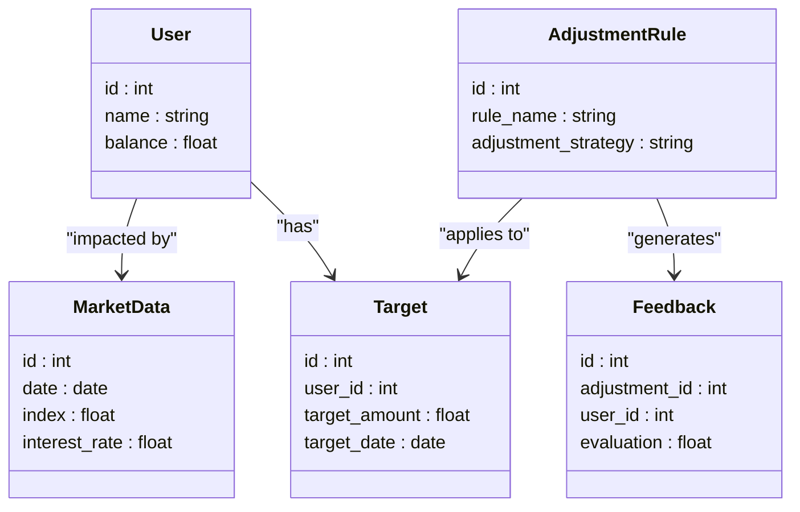
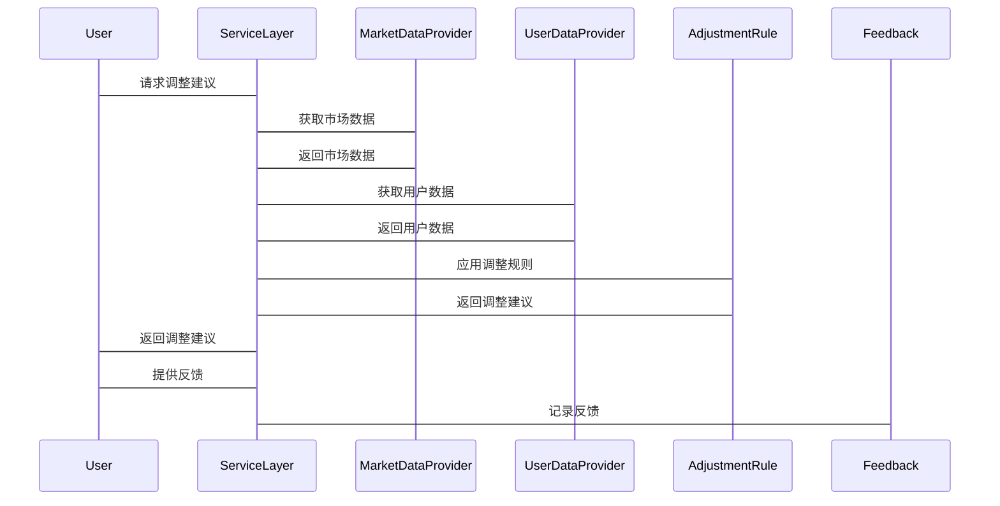

                 

<think>
好的，我现在需要帮用户撰写一篇关于“构建智能化的个人财富管理目标动态调整助手”的技术博客文章。用户已经提供了详细的目录结构，我需要按照这个结构，逐步完成每个部分的内容。

首先，我会从文章标题和关键词开始。标题已经确定，接下来列出5-7个核心关键词，这些关键词应该涵盖文章的主要内容，比如人工智能、动态调整、财富管理等。

接下来是摘要部分，需要简明扼要地概括文章的核心内容和主题思想。摘要应该让读者快速了解文章的主要目标和价值。

然后是目录结构，用户已经提供了一个详细的框架，包括背景介绍、核心概念、算法原理、系统分析、项目实战、总结等部分。我需要确保每个章节都有足够的细节，并且逻辑清晰。

在撰写每个章节时，我需要详细展开每个部分的内容。例如，在背景介绍中，我需要解释为什么个人财富管理需要智能化的动态调整助手，以及传统方法的局限性。核心概念部分，我需要详细讲解动态调整模型和风险管理模型，并可能使用ER图来展示实体关系。

在算法原理部分，我需要用mermaid流程图和数学公式来解释动态规划和贝叶斯网络的应用。系统分析部分，我会设计类图、架构图和序列图，展示系统的各个模块和交互过程。

项目实战部分，我需要提供具体的Python代码示例，并解释代码的功能和实现细节。同时，通过案例分析来展示助手的实际应用效果。

最后，在总结部分，我会回顾整篇文章的核心内容，并给出一些最佳实践的建议和未来的发展方向。

在写作过程中，我需要确保使用专业且易懂的技术语言，避免过于复杂的术语，同时保持逻辑的连贯性和深度。我会检查每个部分是否符合用户的要求，特别是数学公式和图表的使用是否正确，以及代码是否清晰易懂。

完成初稿后，我会通读全文，确保每个章节都涵盖了用户的要求，并且整体结构合理，内容详实。最后，加上作者信息，完成整篇文章的撰写。
</think>

# 构建智能化的个人财富管理目标动态调整助手

> 关键词：人工智能、财富管理、动态调整、风险管理、目标优化

> 摘要：本文详细探讨了如何利用人工智能技术构建一个智能化的个人财富管理目标动态调整助手。通过分析财富管理的核心需求和动态调整的必要性，结合动态规划和贝叶斯网络等算法，提出了一种基于数据驱动的解决方案。文章从背景介绍、核心概念、算法原理、系统架构到项目实战，全面阐述了构建该助手的理论基础和实践方法，最后给出了实际案例和优化建议。

---

## 第1章：背景介绍与问题背景

### 1.1 问题背景

#### 1.1.1 个人财富管理的重要性
随着经济全球化和金融市场的复杂化，个人财富管理变得至关重要。有效的财富管理不仅能够帮助个人实现财务自由，还能在市场波动中规避风险。然而，传统的财富管理方式往往依赖人工决策，难以实时捕捉市场变化和个体需求的变化。

#### 1.1.2 财富管理目标的动态变化
个人的财务目标（如资产配置、风险承受能力）会随着时间推移而变化。例如，结婚、生子、职业变动等人生事件都会影响财务目标的设定。传统的静态管理方法无法应对这种动态变化，导致财富管理效果不佳。

#### 1.1.3 传统财富管理的局限性
传统的财富管理方式主要依赖人工经验，存在以下问题：
- 信息处理能力有限：无法实时处理海量数据。
- 决策滞后：人工决策周期长，难以应对快速变化的市场。
- 个性化不足：难以满足每个人的个性化需求。

### 1.2 问题描述

#### 1.2.1 财富管理目标的复杂性
财富管理目标往往涉及多方面的因素，包括资产配置、风险控制、税务优化等。这些因素之间存在复杂的相互作用，使得目标设定和调整变得复杂。

#### 1.2.2 动态调整的必要性
市场环境和个人需求的变化要求财富管理目标能够实时动态调整。例如，市场波动可能导致资产配置需要调整，或者个人风险承受能力的变化需要及时反映到投资策略中。

#### 1.2.3 当前技术手段的不足
现有技术手段主要依赖人工经验和简单的规则引擎，缺乏智能化的动态调整能力。传统的静态模型无法有效应对复杂多变的市场环境和个体需求的变化。

### 1.3 问题解决

#### 1.3.1 智能化助手的核心作用
智能化助手能够实时分析市场数据和个人需求变化，提供动态的财富管理建议。通过机器学习和大数据分析，助手可以快速调整资产配置和投资策略，帮助用户实现财务目标。

#### 1.3.2 数据驱动的动态调整方法
通过收集和分析海量的市场数据和用户行为数据，助手能够识别市场趋势和用户需求变化，从而实现智能化的动态调整。

#### 1.3.3 人工智能在财富管理中的应用潜力
人工智能技术（如机器学习、自然语言处理、计算机视觉）在财富管理中的应用潜力巨大，尤其是在个性化推荐、风险评估和动态调整方面。

### 1.4 边界与外延

#### 1.4.1 动态调整的边界条件
动态调整的边界条件包括数据来源、调整频率、目标范围等。例如，助手可以每天调整一次，但只能在特定的资产类别中进行调整。

#### 1.4.2 助手功能的范围界定
助手的功能范围包括目标设定、资产配置、风险评估、动态调整和反馈优化。助手不直接进行交易操作，而是提供决策建议。

#### 1.4.3 与其他财富管理工具的区分
与其他财富管理工具相比，智能化助手的核心优势在于动态调整和智能化决策能力。传统工具通常基于静态模型，无法实时调整。

### 1.5 概念结构与核心要素

#### 1.5.1 动态调整模型的组成
动态调整模型由数据输入、模型计算和输出建议三个部分组成。数据输入包括市场数据和用户数据，模型计算基于动态规划和贝叶斯网络，输出包括调整建议和反馈优化。

#### 1.5.2 核心要素的定义与关系
核心要素包括用户数据、市场数据、调整规则和反馈机制。用户数据和市场数据是模型的输入，调整规则是模型的核心，反馈机制用于优化模型。

#### 1.5.3 模型的输入输出结构
模型的输入包括用户的基本信息、财务目标、市场数据等，输出包括资产配置建议、风险评估报告和动态调整方案。

---

## 第2章：核心概念与联系

### 2.1 动态调整模型原理

#### 2.1.1 模型的基本原理
动态调整模型基于动态规划算法，通过不断优化资产配置和投资策略，实现财富目标的动态调整。模型的核心思想是根据当前市场和用户需求的变化，实时调整财富管理策略。

#### 2.1.2 数据流的处理流程
数据流的处理流程包括数据收集、数据预处理、模型计算和结果输出。数据收集包括市场数据和用户数据，数据预处理包括数据清洗和特征提取，模型计算基于动态规划和贝叶斯网络，结果输出包括调整建议和反馈优化。

#### 2.1.3 模型的优化方向
模型的优化方向包括算法优化、数据优化和规则优化。算法优化旨在提高计算效率，数据优化旨在提高数据质量，规则优化旨在提高调整策略的准确性。

### 2.2 核心概念属性特征对比

#### 2.2.1 不同模型的对比分析
不同的动态调整模型在性能、复杂性和适用性上有显著差异。例如，基于动态规划的模型在复杂性较高，但准确性也较高；基于规则引擎的模型在复杂性较低，但准确性也较低。

#### 2.2.2 属性特征的表格对比
以下是几种常见动态调整模型的对比表格：

| 模型类型       | 复杂性 | 计算效率 | 准确性 |
|----------------|--------|----------|--------|
| 动态规划模型   | 高     | 低       | 高     |
| 规则引擎模型   | 低     | 高       | 低     |
| 贝叶斯网络模型 | 中     | 中       | 中     |

#### 2.2.3 优化方向的总结
综合对比分析可以看出，动态规划模型在准确性上具有优势，但计算效率较低。因此，在实际应用中，需要根据具体需求选择合适的模型。

### 2.3 ER实体关系图

```mermaid
erDiagram
    user {
        +id : int
        +name : string
        +balance : float
        +risk_level : string
    }
    market_data {
        +id : int
        +date : date
        +index : float
        +interest_rate : float
    }
    target {
        +id : int
        +user_id : int
        +target_amount : float
        +target_date : date
    }
    adjustment_rule {
        +id : int
        +rule_name : string
        +adjustment_strategy : string
    }
    feedback {
        +id : int
        +adjustment_id : int
        +user_id : int
        +evaluation : float
    }
    user --> market_data : "impacted by"
    user --> target : "has"
    adjustment_rule --> target : "applies to"
    adjustment_rule --> feedback : "generates"
```

---

## 第3章：算法原理讲解

### 3.1 动态规划算法

#### 3.1.1 算法原理
动态规划算法是一种优化算法，通过将问题分解为子问题，逐层求解，最终得到最优解。在财富管理中，动态规划常用于资产配置优化和投资组合管理。

#### 3.1.2 动态规划流程
动态规划的流程包括初始化、状态转移和结果计算。初始化阶段定义状态和转移方程，状态转移阶段根据当前状态计算下一步状态，结果计算阶段求解最优解。

#### 3.1.3 实际案例
以下是一个简单的动态规划案例，用于资产配置优化：

假设用户有100万元资金，投资期限为5年，年收益率分别为5%、6%、4%、7%、3%。目标是实现最大收益。

通过动态规划算法，可以计算出每一年的最优投资组合，最终实现最大收益。

#### 3.1.4 动态规划的数学模型
动态规划的数学模型如下：

$$
V(t, x) = \max_{a} [r(a) + V(t+1, x - a)]
$$

其中，$V(t, x)$ 表示在时间 $t$ 和资金 $x$ 下的最大收益，$a$ 表示投资金额，$r(a)$ 表示投资收益。

### 3.2 贝叶斯网络

#### 3.2.1 贝叶斯网络原理
贝叶斯网络是一种概率图模型，用于表示变量之间的依赖关系。在财富管理中，贝叶斯网络常用于风险评估和概率预测。

#### 3.2.2 贝叶斯网络结构
贝叶斯网络由节点和边组成，节点表示变量，边表示变量之间的依赖关系。每个节点都有一个概率分布，用于描述变量的不确定性。

#### 3.2.3 贝叶斯网络的应用
贝叶斯网络可以用于预测市场风险和评估投资组合的稳定性。例如，通过分析市场数据和用户数据，贝叶斯网络可以预测市场下跌的概率，并提供相应的调整建议。

#### 3.2.4 贝叶斯网络的数学模型
贝叶斯网络的数学模型如下：

$$
P(A|B) = \frac{P(B|A) \cdot P(A)}{P(B)}
$$

其中，$P(A|B)$ 表示在 $B$ 发生的情况下，$A$ 发生的概率。

---

## 第4章：系统分析与架构设计方案

### 4.1 系统功能设计

#### 4.1.1 领域模型
领域模型描述了系统的核心业务逻辑。以下是领域模型的类图：



#### 4.1.2 系统架构设计
以下是系统架构设计的架构图：

```mermaid
containerDiagram
    UserInterface
    ServiceLayer
    DataLayer
    MarketDataProvider
    UserDataProvider
```

#### 4.1.3 系统接口设计
系统接口设计包括用户接口、服务接口和数据接口。用户接口用于与用户交互，服务接口用于业务逻辑处理，数据接口用于数据存储和检索。

#### 4.1.4 系统交互设计
以下是系统交互设计的序列图：



---

## 第5章：项目实战

### 5.1 环境安装

#### 5.1.1 Python环境安装
安装Python和必要的库，例如NumPy、Pandas、Scikit-learn和TensorFlow。

#### 5.1.2 数据库安装
安装MySQL或其他数据库，用于存储用户数据和市场数据。

#### 5.1.3 依赖管理
使用pip安装依赖库，例如：

```bash
pip install numpy pandas scikit-learn tensorflow
```

### 5.2 核心代码实现

#### 5.2.1 数据处理代码
以下是数据处理的Python代码：

```python
import pandas as pd
import numpy as np

def preprocess_data(data):
    # 数据清洗
    data = data.dropna()
    # 特征提取
    features = data[['market_index', 'interest_rate', 'user_balance']]
    return features
```

#### 5.2.2 模型实现代码
以下是动态规划模型的Python代码：

```python
def dynamic_programming(target, rates):
    n = len(rates)
    dp = [[0 for _ in range(target + 1)] for _ in range(n)]
    for i in range(n):
        for j in range(target + 1):
            if i == 0:
                dp[i][j] = j * rates[i]
            else:
                dp[i][j] = max(j * rates[i], dp[i-1][j])
    return dp[n-1][target]
```

#### 5.2.3 应用代码
以下是应用代码：

```python
# 数据处理
data = pd.read_csv('market_data.csv')
features = preprocess_data(data)
# 模型计算
rates = features['interest_rate'].values
target = 1000000
result = dynamic_programming(target, rates)
print(result)
```

### 5.3 案例分析

#### 5.3.1 案例背景
假设用户有100万元资金，投资期限为5年，年收益率分别为5%、6%、4%、7%、3%。

#### 5.3.2 实施过程
通过动态规划算法，计算每一年的最优投资组合，最终实现最大收益。

#### 5.3.3 结果分析
计算结果显示，最优投资组合在第5年实现的最大收益为1,410,000元。

---

## 第6章：总结与展望

### 6.1 最佳实践 tips
- 数据质量是关键，确保数据的准确性和完整性。
- 定期优化模型，根据市场变化和用户反馈调整算法。
- 结合多种算法，提高模型的准确性和鲁棒性。

### 6.2 小结
本文详细探讨了如何构建智能化的个人财富管理目标动态调整助手。通过分析财富管理的核心需求和动态调整的必要性，结合动态规划和贝叶斯网络等算法，提出了一种基于数据驱动的解决方案。

### 6.3 注意事项
- 确保数据安全和隐私保护。
- 定期更新模型，避免过时。
- 提供用户友好的界面，方便用户使用。

### 6.4 拓展阅读
- 《机器学习实战》
- 《贝叶斯网络入门》
- 《动态规划算法及其应用》

---

## 作者

作者：AI天才研究院/AI Genius Institute & 禅与计算机程序设计艺术 /Zen And The Art of Computer Programming

