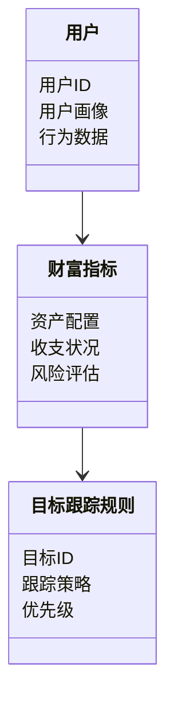
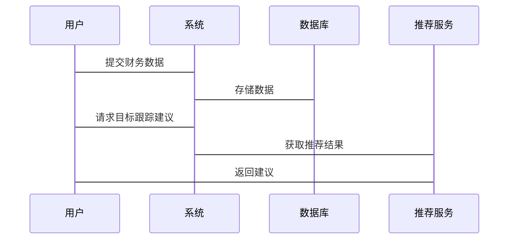

                 


# 构建智能化的个人财富管理目标跟踪助手

> 关键词：智能化、财富管理、目标跟踪、人工智能、系统架构、推荐算法、用户行为分析

> 摘要：本文将深入探讨如何利用人工智能技术构建智能化的个人财富管理目标跟踪助手。通过结合用户行为分析、推荐算法和系统架构设计，我们提出了一种创新的解决方案，帮助用户高效管理和优化他们的财富目标。本文将从背景介绍、核心概念、算法原理、系统架构设计、项目实战到最佳实践进行全面解析。

---

## 第一部分: 智能化个人财富管理目标跟踪助手的背景与概念

### 第1章: 背景介绍

#### 1.1 问题背景
- **1.1.1 个人财富管理的重要性**  
  随着经济全球化和金融市场的复杂化，个人财富管理变得越来越重要。有效的财富管理不仅能帮助个人实现财务自由，还能规避潜在的财务风险。

- **1.1.2 现有财富管理工具的局限性**  
  当前的财富管理工具大多依赖于人工操作或简单的规则引擎，难以适应用户的个性化需求和复杂市场环境。

- **1.1.3 智能化目标跟踪的必要性**  
  随着人工智能技术的发展，通过智能化手段实时跟踪和优化财富目标，能够显著提升管理效率和准确性。

#### 1.2 问题描述
- **1.2.1 财富管理目标的多样性**  
  用户的财富目标可能包括资产增值、风险控制、税务优化等，这些目标往往相互关联，且具有动态变化的特点。

- **1.2.2 目标跟踪的复杂性**  
  目标跟踪需要考虑市场波动、用户行为、经济指标等多种因素，传统的线性模型难以应对这种复杂性。

- **1.2.3 用户行为与目标偏差的关联性**  
  用户的财务行为直接影响目标的实现，但现有工具难以实时捕捉和分析这些行为数据。

#### 1.3 问题解决
- **1.3.1 智能化目标跟踪的核心思路**  
  通过机器学习算法实时分析用户行为和市场数据，动态调整目标跟踪策略。

- **1.3.2 数据驱动的财富管理方法**  
  利用大数据技术收集和分析用户行为数据，构建用户画像，从而为个性化财富管理提供支持。

- **1.3.3 AI技术在目标跟踪中的应用**  
  引入自然语言处理和强化学习技术，优化目标跟踪模型的准确性和实时性。

#### 1.4 边界与外延
- **1.4.1 功能边界**  
  本系统仅专注于财富目标的跟踪与优化，不涉及具体的财富操作（如投资决策）。

- **1.4.2 相关领域**  
  系统需要与会计、金融分析、数据挖掘等领域进行交互。

- **1.4.3 与其他系统的交互**  
  系统需要与银行、证券公司等第三方系统进行数据对接。

#### 1.5 概念结构与核心要素
- **1.5.1 核心概念**  
  包括用户需求、财富目标、目标跟踪规则、用户行为等。

- **1.5.2 关键属性**  
  包括目标优先级、目标时间跨度、目标实现路径等。

- **1.5.3 组成要素**  
  包括数据采集模块、目标分析模块、算法推荐模块、用户反馈模块等。

---

## 第二部分: 核心概念与联系

### 第2章: 核心概念与联系

#### 2.1 目标跟踪助手的核心原理
- **2.1.1 数据收集与处理**  
  系统通过收集用户的财务数据、行为数据和市场数据，构建用户画像和市场环境模型。

- **2.1.2 智能分析与推荐**  
  利用机器学习算法分析数据，生成目标跟踪策略和优化建议。

- **2.1.3 人机交互与反馈**  
  系统通过用户界面展示分析结果，并根据用户反馈调整跟踪策略。

#### 2.2 核心概念属性对比
- **2.2.1 用户需求与目标的关系**  
  用户需求是目标的来源，目标是需求的具体化和量化。

- **2.2.2 数据特征与目标关联性**  
  数据特征（如收入、支出、资产配置）直接影响目标的实现路径和优先级。

- **2.2.3 算法性能与目标精度的对比**  
  算法的性能（如准确率、计算速度）直接影响目标跟踪的精度和实时性。

#### 2.3 ER实体关系图
```mermaid
er
  actor: 用户
  goal: 财富目标
  action: 行为记录
  metric: 财富指标
  rule: 目标跟踪规则
  relation: 用户 -> 行为记录
  relation: 行为记录 -> 财富指标
  relation: 财富指标 -> 财富目标
  relation: 财富目标 -> 目标跟踪规则
```

---

## 第三部分: 算法原理讲解

### 第3章: 推荐算法原理

#### 3.1 基于协同过滤的推荐算法
- **3.1.1 算法流程**
  1. 数据预处理：对用户行为数据进行清洗和特征提取。
  2. 计算相似度：基于用户行为数据计算用户之间的相似度。
  3. 生成推荐：根据相似用户的偏好生成目标跟踪建议。

- **3.1.2 数学模型与公式**
  $$ \text{相似度} = \frac{\sum_{i=1}^{n} (x_i - \bar{x})(y_i - \bar{y})}{\sqrt{\sum_{i=1}^{n} (x_i - \bar{x})^2} \sqrt{\sum_{i=1}^{n} (y_i - \bar{y})^2}} $$

- **3.1.3 实际案例分析**  
  例如，用户A和用户B在消费习惯和投资偏好上相似，系统可以根据用户A的目标跟踪结果推荐给用户B相似的策略。

#### 3.2 基于内容的推荐算法
- **3.2.1 算法流程**
  1. 数据预处理：对市场数据和用户数据进行特征提取。
  2. 训练模型：基于内容的特征向量生成推荐。
  3. 优化推荐：根据用户反馈调整模型参数。

- **3.2.2 数学模型与公式**
  $$ \text{推荐得分} = \sum_{i=1}^{m} w_i \cdot f_i $$  
  其中，\( w_i \) 是特征 \( f_i \) 的权重。

---

## 第四部分: 系统分析与架构设计

### 第4章: 系统分析与架构设计

#### 4.1 问题场景介绍
- **4.1.1 系统目标**  
  构建一个智能化的财富目标跟踪系统，帮助用户实时优化财富管理策略。

- **4.1.2 项目介绍**  
  本项目旨在通过AI技术实现财富目标的智能化跟踪与优化。

#### 4.2 系统功能设计
- **4.2.1 领域模型**  
  使用mermaid类图展示系统的核心类及其关系。



- **4.2.2 系统架构设计**  
  使用mermaid架构图展示系统的整体架构。


- **4.2.3 系统接口设计**  
  使用mermaid序列图展示系统接口的交互流程。



---

## 第五部分: 项目实战

### 第5章: 项目实战

#### 5.1 环境安装
- **5.1.1 安装Python**  
  需要安装Python 3.8及以上版本。

- **5.1.2 安装依赖库**  
  使用以下命令安装推荐算法所需的依赖库：
  ```
  pip install numpy pandas scikit-learn
  ```

#### 5.2 核心代码实现
- **5.2.1 数据预处理代码**
  ```python
  import pandas as pd
  import numpy as np

  # 读取数据
  df = pd.read_csv('user_data.csv')
  # 数据清洗
  df.dropna(inplace=True)
  ```

- **5.2.2 协同过滤算法实现**
  ```python
  from sklearn.metrics.pairwise import cosine_similarity

  # 计算用户相似度矩阵
  user_features = df[['收入', '支出', '资产']].values
  similarity_matrix = cosine_similarity(user_features)
  ```

- **5.2.3 模型优化与测试**
  ```python
  from sklearn.model_selection import GridSearchCV
  from sklearn.neighbors import NearestNeighbors

  # 参数优化
  param_grid = {'n_neighbors': [5, 10, 15]}
  grid_search = GridSearchCV(NearestNeighbors(n_neighbors=5), param_grid)
  grid_search.fit(user_features)
  ```

#### 5.3 案例分析与结果展示
- **5.3.1 数据分析结果**  
  使用可视化工具（如Matplotlib）展示用户行为分析结果和目标跟踪建议。

- **5.3.2 优化建议展示**  
  根据模型输出的推荐结果，生成具体的财富管理优化建议。

#### 5.4 项目总结
- **5.4.1 实践收获**  
  通过本项目，我们掌握了如何将AI技术应用于财富目标跟踪的全过程。

- **5.4.2 项目经验**  
  在实际开发中，数据质量和模型调优对系统性能影响显著。

---

## 第六部分: 最佳实践

### 第6章: 最佳实践

#### 6.1 小结
- 本项目通过结合用户行为分析和推荐算法，构建了一个智能化的财富目标跟踪系统，能够帮助用户实时优化财富管理策略。

#### 6.2 注意事项
- 数据隐私保护是系统设计中的重点，需严格遵守相关法律法规。
- 模型的实时性和准确性需要根据实际应用场景进行动态调整。

#### 6.3 拓展阅读
- 推荐阅读《机器学习实战》、《Python机器学习》等书籍，深入学习相关技术。

---

作者：AI天才研究院/AI Genius Institute & 禅与计算机程序设计艺术/Zen And The Art of Computer Programming

