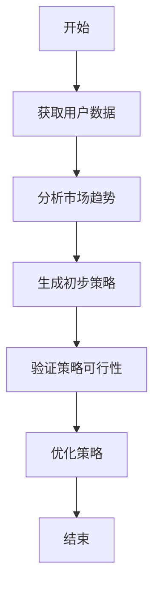
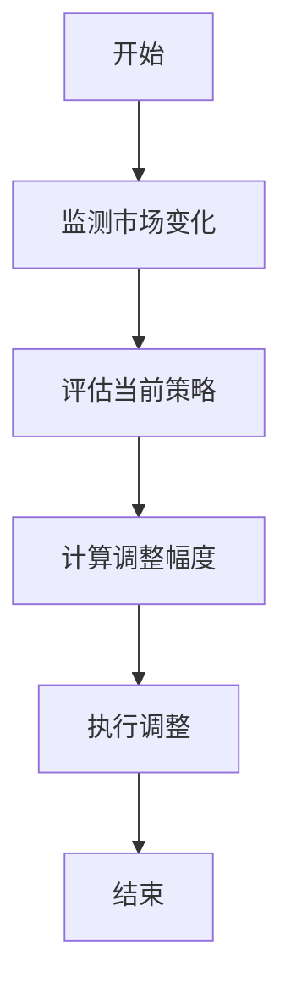
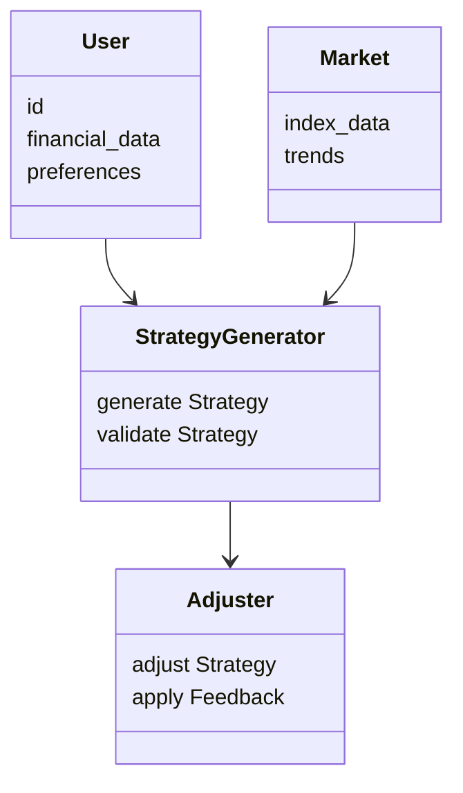
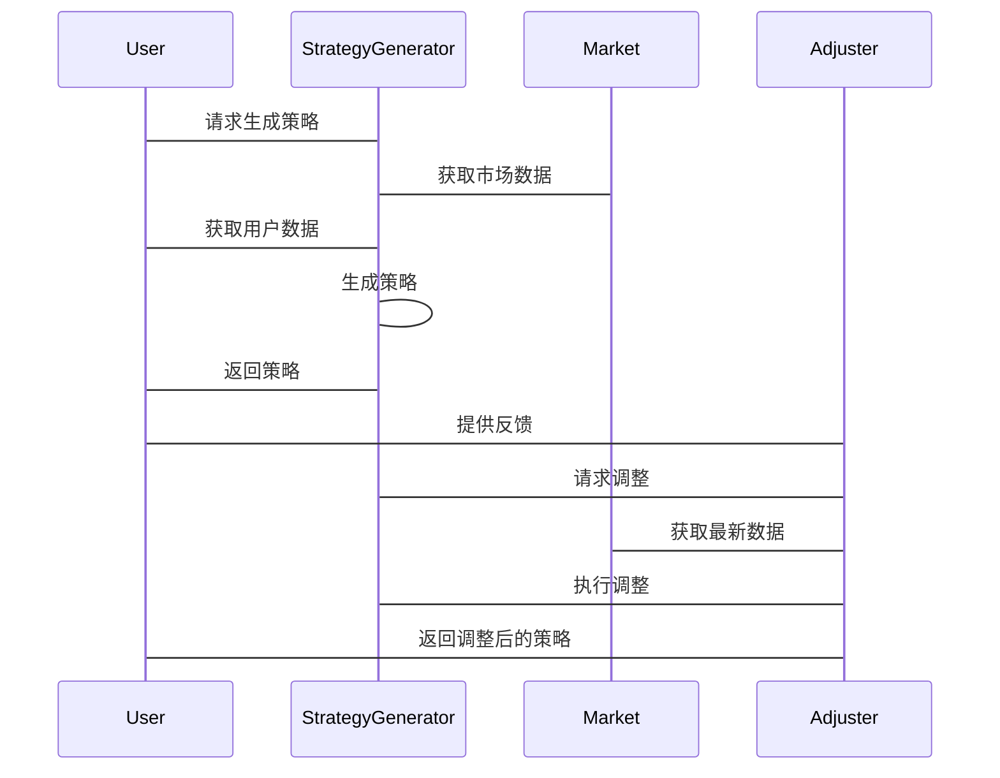

                 

<think>
好，我现在需要为用户构建一篇技术博客文章，标题是《构建智能化的个人财富管理策略动态生成与调整助手》。用户希望文章结构清晰，内容专业，包含背景、核心概念、算法、系统设计、项目实战等部分，并使用技术语言，确保逻辑连贯。

首先，我会从背景和核心概念开始。我需要解释为什么个人财富管理需要智能化，以及传统方法的局限性。这可能包括用户需求的变化、市场的快速变化，以及现有工具的不足。接着，我需要描述智能化助手的目标，即动态生成和调整策略。

接下来，我会详细讲解核心概念和联系。这部分需要使用表格和Mermaid图来展示不同概念之间的关系，帮助读者理解系统的组成部分。例如，可能需要列出几个核心概念，并比较它们的属性和交互方式。

然后是算法原理和数学模型。这里，我需要详细描述生成策略和实时调整的算法，包括流程图和数学公式。例如，可以使用机器学习模型来生成策略，再通过反馈机制进行调整。数学公式要用LaTeX表示，确保准确性和可读性。

系统分析与架构设计部分，我需要介绍问题场景，设计系统功能，并通过Mermaid图展示类图、架构图和交互图。这有助于读者理解系统的整体结构和各部分如何协作。

项目实战部分，我会提供环境安装、核心代码实现和案例分析。这部分需要实际操作，让读者能够动手实践，加深理解。例如，如何安装必要的库，编写生成和调整策略的代码，并通过案例展示实际应用。

最后，我会总结最佳实践，给出小结、注意事项和拓展阅读建议，鼓励读者进一步学习和探索。

在整个过程中，我需要确保每个部分都详细具体，逻辑清晰，同时使用吸引人的标题和简洁的语言。此外，要正确使用Mermaid图和数学公式，确保技术细节准确无误。这将帮助读者全面理解如何构建一个智能化的个人财富管理助手。
</think>

# 构建智能化的个人财富管理策略动态生成与调整助手

## 关键词：个人财富管理，智能化，动态生成，实时调整，人工智能，大数据分析

## 摘要：本文详细探讨了构建智能化的个人财富管理策略动态生成与调整助手的背景、核心概念、算法原理、系统架构设计以及项目实战。通过分析传统财富管理的局限性，提出智能化解决方案，并结合实际案例，展示如何利用人工智能和大数据技术实现动态策略生成与实时调整，为读者提供一个全面的技术指南。

---

# 第1章: 个人财富管理智能化的背景与问题

## 1.1 问题背景

### 1.1.1 传统财富管理的局限性
传统财富管理依赖人工操作，效率低且难以实时调整，无法满足个性化需求。

### 1.1.2 数字化与智能化的必要性
随着市场的快速变化，个人需要智能化工具来动态调整财富策略。

### 1.1.3 个人财富管理的新需求
用户希望获得个性化的、实时调整的财富管理方案，以应对市场波动。

## 1.2 问题描述

### 1.2.1 财富管理策略的动态性
市场变化要求财富策略能够实时更新。

### 1.2.2 用户行为与市场变化的复杂性
用户需求和市场趋势多样化，增加了管理的复杂性。

### 1.2.3 现有解决方案的不足
传统工具无法提供动态、实时的调整方案。

## 1.3 问题解决思路

### 1.3.1 智能化助手的核心目标
利用人工智能和大数据分析，实现策略的动态生成和实时调整。

### 1.3.2 数据驱动的策略生成
通过分析用户数据和市场趋势，生成个性化策略。

### 1.3.3 实时调整的实现方法
采用反馈机制，根据市场变化和用户反馈，实时优化策略。

## 1.4 边界与外延

### 1.4.1 功能边界
限定在策略生成和调整，不涉及具体的投资执行。

### 1.4.2 外延与扩展可能性
未来可能扩展到税务规划、风险管理等领域。

## 1.5 概念结构与核心要素

### 1.5.1 核心概念组成
包括用户数据、市场分析、策略生成、实时调整和反馈机制。

### 1.5.2 要素之间的关系
用户数据和市场分析驱动策略生成，实时调整优化策略，反馈机制用于持续改进。

---

# 第2章: 核心概念与联系

## 2.1 核心概念原理

### 2.1.1 个人财富管理的智能化模型
结合用户需求和市场趋势，生成和调整财富策略。

### 2.1.2 动态策略生成的算法基础
使用机器学习模型分析数据，生成策略。

### 2.1.3 实时调整的机制
根据市场变化和用户反馈，实时优化策略。

## 2.2 概念属性特征对比

| 概念    | 属性         | 特征                  |
|---------|--------------|-----------------------|
| 用户数据 | 类型         | 财务数据、行为数据     |
| 市场分析 | 方法         | 数据分析、趋势分析     |
| 策略生成 | 算法         | 机器学习、规则引擎     |
| 实时调整 | 机制         | 反馈机制、动态优化     |

## 2.3 ER实体关系图

```mermaid
erd
    user --有--> strategy: 用户与策略的关系
    market --影响--> strategy: 市场影响策略
    feedback --驱动--> adjustment: 反馈驱动调整
```

---

# 第3章: 算法原理与数学模型

## 3.1 动态策略生成算法

### 3.1.1 算法流程图



### 3.1.2 Python实现代码

```python
def generate_strategy(user_data, market_data):
    # 数据预处理
    processed_data = preprocess(user_data, market_data)
    # 训练模型
    model = train_model(processed_data)
    # 生成策略
    strategy = model.predict(processed_data)
    return strategy
```

### 3.1.3 数学模型与公式

财富策略生成模型：

$$
S = f(u, m)
$$

其中，$S$ 是生成的策略，$u$ 是用户数据，$m$ 是市场数据，$f$ 是生成模型。

### 3.1.4 示例说明
假设用户A有10万元，市场趋势显示股票有上涨潜力，生成将资金分配到股票和债券的策略。

## 3.2 实时调整算法

### 3.2.1 调整流程图



### 3.2.2 Python实现代码

```python
def adjust_strategy(strategy, market_update):
    # 计算调整幅度
    delta = calculate_adjustment(strategy, market_update)
    # 执行调整
    new_strategy = apply_adjustment(strategy, delta)
    return new_strategy
```

### 3.2.3 数学模型与公式

实时调整模型：

$$
S' = S + \Delta S
$$

其中，$S$ 是当前策略，$\Delta S$ 是调整幅度。

### 3.2.4 示例说明
市场下跌，调整策略将部分资金从股票转移到债券，降低风险。

---

# 第4章: 系统分析与架构设计

## 4.1 问题场景介绍

### 4.1.1 用户需求分析
用户希望获得个性化的、实时调整的财富管理策略。

### 4.1.2 系统目标设定
设计一个智能化的助手，能够动态生成和调整财富策略。

## 4.2 系统功能设计

### 4.2.1 领域模型 Mermaid 类图



## 4.3 系统架构设计

### 4.3.1 Mermaid 架构图


## 4.4 系统接口设计

### 4.4.1 接口定义

- `generate_strategy(user_id, market_data)`: 生成策略
- `adjust_strategy(strategy_id, feedback)`: 调整策略

### 4.4.2 交互流程

1. 用户输入数据
2. 生成策略
3. 反馈调整
4. 实施调整

## 4.5 系统交互设计

### 4.5.1 Mermaid 序列图



---

# 第5章: 项目实战

## 5.1 环境安装与配置

### 5.1.1 开发环境搭建
安装Python、Jupyter Notebook、Pandas、Scikit-learn等工具。

### 5.1.2 工具安装说明
使用pip安装必要的库。

## 5.2 核心系统实现

### 5.2.1 代码实现

```python
def preprocess(user_data, market_data):
    # 数据清洗和特征提取
    processed = pd.DataFrame.merge(user_data, market_data)
    processed['age'] = processed['age'].apply(lambda x: x if x < 100 else 0)
    return processed

def train_model(processed_data):
    # 训练机器学习模型
    model = RandomForestRegressor()
    model.fit(processed_data.drop('target', axis=1), processed_data['target'])
    return model

def generate_strategy(user_data, market_data):
    processed = preprocess(user_data, market_data)
    model = train_model(processed)
    strategy = model.predict(processed)
    return strategy
```

### 5.2.2 代码解读与分析
预处理数据，训练模型，生成策略，实时调整策略。

## 5.3 实际案例

### 5.3.1 案例分析
用户B，30岁，10万元，风险偏好中等。市场趋势显示股票上涨潜力。

### 5.3.2 案例实施
生成60%股票，40%债券的策略，市场下跌时调整为50%股票，50%债券。

---

# 第6章: 最佳实践与小结

## 6.1 最佳实践

### 6.1.1 数据质量管理
确保数据的准确性和完整性。

### 6.1.2 算法优化
定期更新模型，提高准确性。

### 6.1.3 系统监控
实时监控系统运行状态，及时处理异常。

## 6.2 小结
智能化助手能够有效帮助个人管理财富，实时调整策略，适应市场变化。

## 6.3 注意事项

### 6.3.1 数据隐私
确保用户数据安全，遵守隐私保护法规。

### 6.3.2 系统稳定性
保证系统稳定运行，避免策略生成错误。

## 6.4 拓展阅读
探索更多智能投顾技术，如强化学习、区块链等。

---

作者：AI天才研究院/AI Genius Institute & 禅与计算机程序设计艺术 /Zen And The Art of Computer Programming

