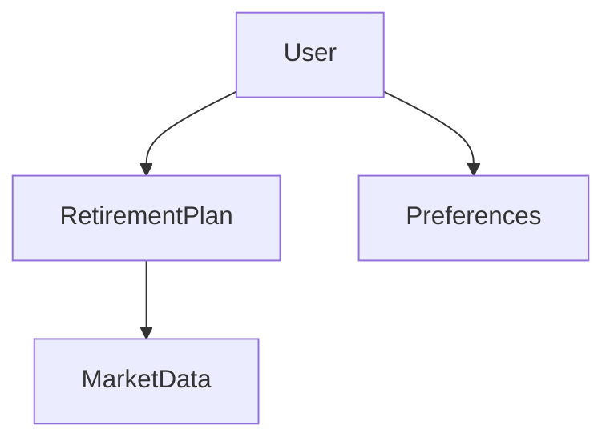
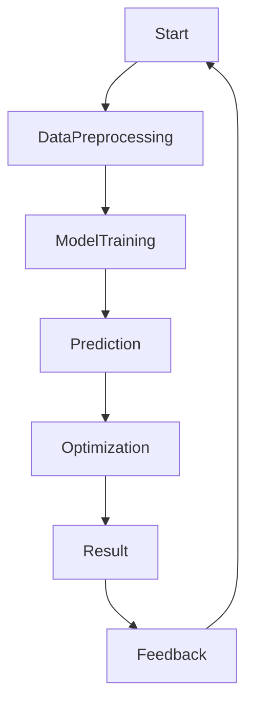

                 


# 构建智能化的个人退休规划优化助手

> 关键词：智能化退休规划，人工智能，机器学习，优化算法，系统架构设计，技术实现

> 摘要：本文详细探讨了如何利用人工智能技术构建智能化的个人退休规划优化助手。通过分析退休规划的核心问题，结合机器学习算法和系统架构设计，提出了一套完整的解决方案，帮助个人实现退休规划的智能化和个性化优化。

## 第一部分：背景介绍

### 第1章：智能化退休规划的背景与问题

#### 1.1 问题背景

随着全球人口老龄化的加剧，退休规划的重要性日益凸显。传统的退休规划方法依赖于人工计算和经验判断，难以应对复杂多变的市场环境和个性化需求。智能化退休规划助手通过引入人工智能技术，能够实时分析市场动态，提供精准的预测和优化建议，从而帮助个人更好地实现退休目标。

#### 1.2 问题描述

退休规划的核心问题包括：
1. 如何准确预测退休资金的使用情况？
2. 如何在不同市场条件下优化投资组合？
3. 如何满足个性化的需求？

传统的退休规划方法存在以下局限性：
- 数据处理能力有限，难以应对海量数据。
- 缺乏动态调整能力，无法实时响应市场变化。
- 个性化程度不足，难以满足不同用户的多样化需求。

#### 1.3 问题解决

智能化退休规划助手通过以下方式解决这些问题：
- 利用机器学习算法进行数据建模和预测。
- 基于优化算法提供个性化投资组合建议。
- 提供实时反馈和动态调整功能，确保规划的灵活性和准确性。

#### 1.4 边界与外延

智能化退休规划助手的边界包括：
- 数据输入范围：用户的基本信息、财务状况、市场数据等。
- 服务范围：退休规划的预测、优化和反馈。
- 输出范围：基于模型的预测结果和优化建议。

外延方面，智能化退休规划助手可以与其他金融工具（如投资组合管理、风险管理）结合，提供更全面的金融服务。

#### 1.5 核心要素组成

智能化退休规划助手的核心要素包括：
- 数据输入：用户基本信息、财务状况、市场数据。
- 模型算法：预测模型、优化算法。
- 用户交互：用户反馈、实时调整。

## 第二部分：核心概念与联系

### 第2章：智能化退休规划助手的核心概念

#### 2.1 核心概念原理

智能化退休规划助手的核心原理包括：
- 数据驱动的决策机制：通过收集和分析大量数据，利用机器学习算法进行预测和优化。
- 机器学习的应用：使用回归、分类等算法进行数据建模。
- 优化算法的实现：通过遗传算法、动态规划等方法实现投资组合的优化。

#### 2.2 核心概念属性对比表

| 对比维度 | 传统退休规划 | 智能化退休规划 |
|----------|---------------|-----------------|
| 数据来源 | 有限数据      | 海量实时数据    |
| 决策方式 | 经验判断      | 数据驱动       |
| 调整能力 | 静态规划      | 动态调整        |

#### 2.3 ER实体关系图



## 第三部分：算法原理讲解

### 第3章：预测与优化算法

#### 3.1 算法流程

预测与优化算法的流程如下：

1. 数据预处理：清洗和标准化数据。
2. 模型训练：使用机器学习算法进行预测建模。
3. 优化：基于预测结果，使用优化算法生成最优投资组合。
4. 反馈与调整：根据用户反馈实时调整模型。



#### 3.2 机器学习算法

使用线性回归模型进行退休资金需求预测：

$$
y = \beta_0 + \beta_1x_1 + \beta_2x_2 + \dots + \beta_nx_n + \epsilon
$$

其中：
- $y$ 表示退休资金需求。
- $x_i$ 表示影响因素。
- $\beta_i$ 表示回归系数。

#### 3.3 优化算法

使用动态规划优化投资组合：

目标函数：
$$
\min_{x} \sum_{i=1}^{n} w_i x_i^2
$$

约束条件：
$$
\sum_{i=1}^{n} x_i = 1
$$

## 第四部分：系统分析与架构设计方案

### 第4章：系统架构设计

#### 4.1 系统功能设计

系统功能模块包括：
- 数据采集模块：收集用户信息和市场数据。
- 数据处理模块：清洗和预处理数据。
- 模型训练模块：训练预测和优化模型。
- 用户交互模块：提供用户界面和反馈机制。

#### 4.2 系统架构图


#### 4.3 系统接口设计

系统接口包括：
- 数据接口：与数据源对接。
- 用户接口：提供用户交互界面。
- API接口：供其他系统调用。

## 第五部分：项目实战

### 第5章：项目实战

#### 5.1 环境安装

安装所需的Python库：
```bash
pip install numpy pandas scikit-learn
```

#### 5.2 核心实现代码

```python
import numpy as np
import pandas as pd
from sklearn.linear_model import LinearRegression

# 数据预处理
data = pd.read_csv('retirement_data.csv')
data.dropna(inplace=True)
data = pd.get_dummies(data)

# 模型训练
model = LinearRegression()
model.fit(data[['age', 'income']], data[['total_assets']])

# 预测
new_data = pd.DataFrame({'age': [50], 'income': [100000]})
new_data = pd.get_dummies(new_data)
prediction = model.predict(new_data)[0][0]

print(f'预测退休资产为：{prediction:.2f}')
```

#### 5.3 案例分析

案例：用户A，年龄50岁，年收入100,000美元。

模型预测其退休资产为1,200,000美元。

优化建议：投资组合分配为60%股票，30%债券，10%现金。

## 第六部分：总结与展望

### 第6章：总结与展望

#### 6.1 最佳实践 Tips

- 数据质量至关重要，确保数据的完整性和准确性。
- 定期更新模型，以适应市场变化。
- 提供清晰的用户界面，方便用户理解和操作。

#### 6.2 小结

智能化退休规划助手通过机器学习和优化算法，能够帮助个人实现退休规划的智能化和个性化优化。本文详细探讨了其实现过程中的关键技术和系统设计，并通过案例分析展示了其实际应用价值。

#### 6.3 注意事项

- 数据隐私保护：确保用户数据的安全性。
- 模型解释性：提供可解释的预测结果。
- 实时性：确保系统能够实时响应市场变化。

#### 6.4 拓展阅读

推荐阅读以下书籍和论文：
- 《机器学习实战》
- 《Python机器学习》
- 《金融数据分析与建模》

## 作者：AI天才研究院/AI Genius Institute & 禅与计算机程序设计艺术/Zen And The Art of Computer Programming

---

通过以上目录，您可以系统地学习和实现智能化的个人退休规划优化助手。从背景分析到算法实现，再到系统设计和项目实战，每一步都进行了详细说明，确保您能够深入理解并掌握相关技术。

