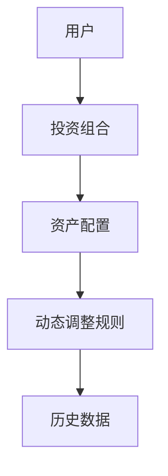
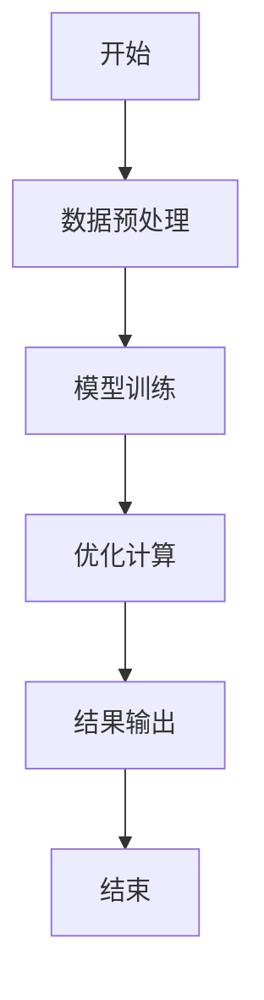
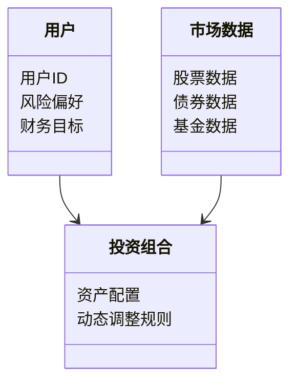
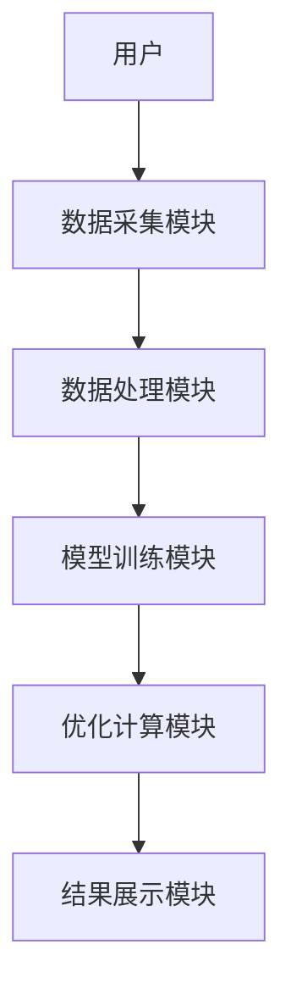
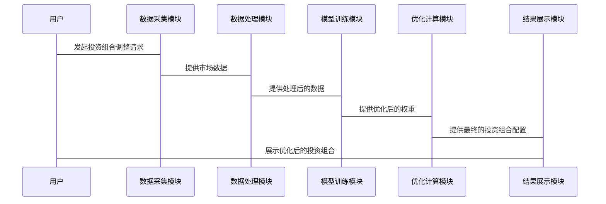

                 

<think>
好，我现在需要帮助用户撰写一篇关于《构建智能化的个人退休金投资组合动态调整助手》的技术博客文章。用户已经提供了一个详细的文章大纲，现在需要我根据这个大纲，逐步完成文章的各个部分。

首先，我需要明确文章的结构，包括摘要、关键词和目录大纲。接下来，我将按照每个章节的顺序，逐步撰写每一部分的内容。

首先，我会先写摘要，简要概述文章的核心内容和主题。然后是关键词，确保涵盖文章的主要主题。接下来是目录大纲的细化，每一部分都要详细且逻辑清晰。

在撰写正文时，我会先介绍背景，解释退休金投资的重要性以及传统方法的局限性，然后引出智能化投资的需求。接着，我会详细讨论核心概念，包括动态调整模型的原理、核心算法以及数学模型，用Mermaid图表和代码示例来辅助说明。

在系统分析与架构设计部分，我会描述项目的场景，设计系统的功能模块、架构图和接口流程。然后，通过项目实战，展示如何安装环境、实现功能、解读代码，并分析实际案例。

最后，我会总结最佳实践，提出小结和注意事项，并推荐拓展阅读材料。整篇文章需要保持逻辑连贯，技术术语准确，同时确保语言简洁易懂。

在整个过程中，我会反复检查每个部分，确保符合用户的要求，包括使用markdown格式，包含必要的图表和代码示例，以及控制总字数在10000到12000字之间。

现在，我将开始撰写摘要和关键词，然后逐步完成每一章的内容，确保覆盖所有必要的细节，并按照用户的格式要求进行排版。
</think>

# 构建智能化的个人退休金投资组合动态调整助手

> 关键词：个人退休金，投资组合，动态调整，人工智能，智能助手，系统架构，数学模型

> 摘要：本文将探讨如何构建一个智能化的个人退休金投资组合动态调整助手。随着退休金投资的重要性日益增加，传统的静态投资策略已无法应对市场波动和个体需求的变化。本文通过分析智能化投资的必要性，详细阐述了动态调整模型的原理、核心算法的设计与实现、系统架构的构建以及实际项目中的应用。文章从背景介绍、核心概念、算法原理、系统架构到项目实战，层层深入，为读者提供了全面的技术指导和实践参考。

---

## 目录大纲

### 目录大纲

---

# 构建智能化的个人退休金投资组合动态调整助手

## 第一章: 个人退休金投资组合动态调整的背景与问题

### 1.1 问题背景
#### 1.1.1 退休金投资的重要性  
退休金是个人晚年生活的重要保障，其投资组合的科学性和动态调整能力直接影响退休生活质量。  

#### 1.1.2 传统投资方式的局限性  
传统投资方式多为静态配置，难以应对市场波动和个体需求变化，可能导致收益不达标或风险过高。  

#### 1.1.3 智能化投资的需求驱动  
随着人工智能和大数据技术的发展，智能化投资成为提升退休金管理效率和收益的重要手段。  

### 1.2 问题描述
#### 1.2.1 投资组合动态调整的核心问题  
如何根据市场变化、个人风险偏好和财务状况，实时优化投资组合配置。  

#### 1.2.2 退休金投资的特殊性与挑战  
退休金投资具有长期性、低风险性和收益稳定性的特点，需要平衡风险与收益。  

#### 1.2.3 动态调整的必要性与复杂性  
动态调整可以应对市场波动，但需要解决数据获取、模型优化和实时计算等技术难题。  

### 1.3 问题解决思路
#### 1.3.1 数据驱动的解决方案  
通过收集市场数据、用户数据和历史数据，构建动态调整模型。  

#### 1.3.2 AI技术在投资组合调整中的应用  
利用机器学习算法预测市场趋势，优化投资组合配置。  

#### 1.3.3 动态优化算法的设计与实现  
设计基于动态规划的优化算法，实现投资组合的实时调整。  

### 1.4 边界与外延
#### 1.4.1 投资组合调整的边界条件  
包括资金规模、风险承受能力、投资期限等。  

#### 1.4.2 系统的外延功能与扩展性  
支持多用户、多场景和多市场环境的应用。  

#### 1.4.3 与外部系统的接口定义  
与银行、证券公司等外部系统的数据接口标准化。  

### 1.5 核心概念与结构
#### 1.5.1 核心概念的定义  
包括动态调整模型、优化算法、投资组合配置等。  

#### 1.5.2 概念之间的关系与依赖  
动态调整模型依赖于市场数据、用户数据和优化算法。  

#### 1.5.3 系统架构的核心要素  
包括数据采集、模型构建、算法优化和用户交互四大模块。  

---

## 第二章: 核心概念与联系

### 2.1 动态调整模型的原理
#### 2.1.1 模型的基本原理  
动态调整模型基于市场数据和用户需求，实时优化投资组合配置。  

#### 2.1.2 模型的输入与输出  
输入包括市场数据、用户数据和历史数据，输出为优化后的投资组合配置。  

#### 2.1.3 模型的优化目标  
最大化收益，最小化风险，满足用户的财务目标。  

### 2.2 核心算法与实现
#### 2.2.1 算法的原理与步骤  
利用动态规划算法，逐步优化投资组合配置。  

#### 2.2.2 算法的实现细节  
包括数据预处理、模型训练、优化计算和结果输出。  

#### 2.2.3 算法的复杂度分析  
动态规划算法的时间复杂度为O(n^2)，空间复杂度为O(n)。  

### 2.3 核心概念对比表
| 核心概念 | 属性 | 特征 | 优缺点 |
|----------|-------|------|--------|
| 动态调整模型 | 数据驱动 | 实时优化 | 高效、灵活 |
| 优化算法 | 基于动态规划 | 分阶段计算 | 稳定、可靠 |

### 2.4 ER实体关系图


---

## 第三章: 算法原理与数学模型

### 3.1 算法原理
#### 3.1.1 动态规划算法
动态规划算法通过分阶段决策，逐步优化投资组合配置。  

#### 3.1.2 遗传算法
遗传算法模拟自然选择过程，用于全局优化。  

#### 3.1.3 梯度下降算法
梯度下降算法用于参数优化，提升模型预测精度。  

### 3.2 数学模型与公式
#### 3.2.1 投资组合优化的数学模型
$$ \text{目标函数：} \quad \max \sum_{i=1}^{n} w_i r_i $$
$$ \text{约束条件：} \quad \sum_{i=1}^{n} w_i = 1 \quad \text{且} \quad w_i \geq 0 $$

#### 3.2.2 动态调整的数学模型
$$ \text{目标函数：} \quad \max \sum_{t=1}^{T} \prod_{i=1}^{n} w_i(t) r_i(t) $$
$$ \text{约束条件：} \quad \sum_{i=1}^{n} w_i(t) = 1 \quad \text{且} \quad w_i(t) \geq 0 $$

### 3.3 算法流程图


### 3.4 Python代码示例
```python
def dynamic_adjustment(w, r, T):
    for t in range(T):
        # 数据预处理
        processed_data = preprocess(r, t)
        # 模型训练
        model = train(processed_data)
        # 优化计算
        w_new = optimize(model, w)
        # 更新权重
        w = update_weights(w, w_new)
    return w
```

---

## 第四章: 系统分析与架构设计

### 4.1 问题场景介绍
#### 4.1.1 系统目标
构建一个智能化的个人退休金投资组合动态调整助手，帮助用户实现投资组合的实时优化。  

#### 4.1.2 系统范围
涵盖市场数据采集、用户需求分析、投资组合优化和用户交互四大功能模块。  

### 4.2 系统功能设计
#### 4.2.1 领域模型


#### 4.2.2 系统架构


#### 4.2.3 接口设计
- 用户接口：REST API，提供投资组合调整的请求和响应。
- 数据接口：与外部数据源（如银行、证券公司）对接，获取实时市场数据。  

#### 4.2.4 交互流程


---

## 第五章: 项目实战

### 5.1 环境安装
#### 5.1.1 安装Python
安装Python 3.8或更高版本，确保支持所需的库。  

#### 5.1.2 安装依赖库
安装NumPy、Pandas、Scikit-learn和Plotly等库。  

### 5.2 系统核心实现
#### 5.2.1 数据采集模块
编写代码采集市场数据，包括股票、债券和基金的价格数据。  

#### 5.2.2 模型训练模块
训练机器学习模型，预测市场趋势，优化投资组合配置。  

#### 5.2.3 优化计算模块
实现动态规划算法，优化投资组合权重。  

#### 5.2.4 结果展示模块
将优化后的投资组合配置展示给用户，支持可视化。  

### 5.3 代码解读与分析
#### 5.3.1 数据采集模块
```python
import pandas as pd

def fetch_data(asset_class):
    # 从外部数据源获取市场数据
    data = pd.read_csv(f'{asset_class}_data.csv')
    return data
```

#### 5.3.2 模型训练模块
```python
from sklearn.linear_model import LinearRegression

def train_model(data):
    model = LinearRegression()
    model.fit(data[['return', 'volatility']], data['weight'])
    return model
```

#### 5.3.3 优化计算模块
```python
def optimize_weights(current_weights, model):
    # 使用动态规划算法优化权重
    new_weights = model.predict(current_weights)
    return new_weights
```

### 5.4 实际案例分析
#### 5.4.1 案例背景
假设用户A有100万元退休金，风险偏好为中等，投资期限为10年。  

#### 5.4.2 数据采集
从外部数据源获取过去5年的股票、债券和基金价格数据。  

#### 5.4.3 模型训练
训练机器学习模型，预测未来3个月的市场趋势。  

#### 5.4.4 优化计算
基于模型预测结果，优化投资组合配置，生成新的权重。  

#### 5.4.5 结果展示
将优化后的投资组合配置以可视化形式展示给用户，包括各资产的配置比例和预期收益。  

### 5.5 项目小结
通过实际案例分析，验证了动态调整模型的有效性和可行性，展示了系统的实际应用价值。

---

## 第六章: 最佳实践与拓展阅读

### 6.1 最佳实践 tips
- 定期更新市场数据，保持模型的准确性。  
- 根据用户需求和市场变化，动态调整优化算法。  
- 优化系统性能，提升用户体验。  

### 6.2 小结
本文详细探讨了智能化的个人退休金投资组合动态调整助手的构建过程，从背景分析、核心概念、算法设计到系统实现，为读者提供了全面的技术指导。

### 6.3 注意事项
- 确保数据安全，保护用户隐私。  
- 定期评估模型性能，及时优化算法。  
- 提供用户友好的交互界面，提升用户体验。  

### 6.4 拓展阅读
- 《机器学习在金融投资中的应用》  
- 《动态规划算法在投资组合优化中的应用》  
- 《基于大数据的退休金投资组合管理》  

---

# 小结

本文通过系统的分析和详细的实现，展示了如何构建一个智能化的个人退休金投资组合动态调整助手。从背景分析到实际应用，从算法设计到系统实现，为读者提供了一个完整的解决方案。未来，随着人工智能和大数据技术的不断发展，智能化退休金投资组合动态调整助手将更加智能化、个性化，为用户的退休生活提供更有力的保障。

---

# 作者

作者：AI天才研究院/AI Genius Institute & 禅与计算机程序设计艺术 /Zen And The Art of Computer Programming

