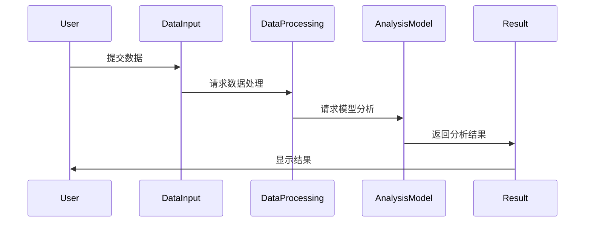

                 


# 构建智能化的个人退休金缺口分析助手

> 关键词：退休金缺口分析、人工智能、个人财务规划、智能化助手、数据分析

> 摘要：本文将详细介绍如何构建一个智能化的个人退休金缺口分析助手，通过结合人工智能和大数据分析技术，帮助个人准确评估退休金缺口，并提供个性化的财务规划建议。文章从背景介绍、核心概念、算法原理、系统架构设计到项目实战，全面解析构建智能化退休金缺口分析助手的全过程。

---

# 第一部分: 背景介绍与核心概念

## 第1章: 退休金缺口分析的背景与现状

### 1.1 退休金缺口分析的重要性

#### 1.1.1 退休规划的现状与挑战
随着人口老龄化加剧，退休金缺口问题日益凸显。传统的退休金规划方法依赖于简单的线性模型，难以应对复杂多变的经济环境和个人财务状况的变化。此外，个人的收入、支出、投资收益等变量具有不确定性，传统的静态模型难以准确预测退休后的生活质量。

#### 1.1.2 退休金缺口的定义与影响
退休金缺口是指在退休后，个人实际可支配的退休金与实际所需生活支出之间的差额。如果缺口较大，可能导致退休后生活质量下降，甚至出现经济困难。因此，准确计算退休金缺口，并制定合理的财务规划，对个人的退休生活至关重要。

#### 1.1.3 传统退休金规划方法的局限性
传统的退休金规划方法通常基于固定的假设，如固定的投资回报率、固定的通货膨胀率等。然而，实际生活中，这些假设往往与现实情况存在较大差异，导致规划结果不够准确。此外，传统方法缺乏动态调整机制，无法根据个人的实时财务状况进行优化。

### 1.2 智能化退休金缺口分析助手的提出

#### 1.2.1 智能化助手的核心目标
智能化退休金缺口分析助手的目标是通过结合人工智能和大数据技术，提供个性化的退休金缺口分析和财务规划建议。与传统方法相比，智能化助手能够实时更新数据，动态调整模型参数，从而提供更精准的分析结果。

#### 1.2.2 人工智能在退休金规划中的应用潜力
人工智能技术，如机器学习、自然语言处理和图像识别，可以广泛应用于退休金规划领域。例如，通过机器学习模型分析个人的财务数据，预测未来的收入和支出变化，从而帮助用户更好地规划退休金。

#### 1.2.3 智能化助手的优势与价值
智能化退休金缺口分析助手的优势在于其高效性、准确性和个性化。通过整合多源数据，智能化助手可以快速生成分析结果，并根据用户的实际情况提供建议。此外，智能化助手还能够帮助用户更好地理解复杂的财务概念，提高财务决策的透明度。

### 1.3 本章小结
本章主要介绍了退休金缺口分析的重要性和智能化助手的提出。通过对比传统方法与智能化方法的优劣，我们得出结论：智能化助手在提高分析准确性、实现动态调整和个性化服务方面具有显著优势。

---

## 第2章: 核心概念与联系

### 2.1 核心概念的定义与属性

#### 2.1.1 退休金缺口分析的关键要素
退休金缺口分析的关键要素包括：当前收入、支出、储蓄、投资收益、预期寿命、通货膨胀率、税率等。这些要素共同构成了退休金缺口分析的基础。

#### 2.1.2 智能化助手的功能模块
智能化助手的功能模块主要包括：数据采集模块、数据分析模块、结果展示模块和个性化建议模块。每个模块都有其特定的功能和职责。

#### 2.1.3 数据来源与处理方式
数据来源包括：个人的财务数据（如工资、存款、投资收益等）、宏观经济数据（如通货膨胀率、利率等）以及市场数据（如股票、基金的收益率等）。数据处理方式包括清洗、整合和建模。

### 2.2 核心概念的对比分析

#### 2.2.1 不同退休金规划方法的对比
| 方法 | 优点 | 缺点 |
|------|------|------|
| 传统线性模型 | 简单易懂 | 精度低，假设过于固定 |
| 基于机器学习的模型 | 精度高，动态调整 | 实施成本高，需要大量数据支持 |

#### 2.2.2 传统方法与智能化方法的优劣势对比
- 传统方法的优势在于简单易懂，但假设过于固定，无法应对复杂变化。
- 智能化方法的优势在于精度高，能够动态调整模型参数，但实施成本较高。

#### 2.2.3 功能模块之间的关系与依赖
- 数据采集模块为数据分析模块提供基础数据。
- 数据分析模块依赖于数据采集模块的数据输入，同时输出分析结果。
- 结果展示模块依赖于数据分析模块的输出，为用户提供直观的展示。

### 2.3 实体关系图


### 2.4 本章小结
本章详细介绍了退休金缺口分析的核心概念和智能化助手的功能模块，通过对比分析和实体关系图，明确了各模块之间的关系和依赖。

---

# 第二部分: 算法原理与数学模型

## 第3章: 算法原理与流程

### 3.1 算法概述

#### 3.1.1 算法的目标与输入
- 目标：预测退休金缺口。
- 输入：个人的财务数据、宏观经济数据、市场数据等。

#### 3.1.2 算法的核心步骤
1. 数据清洗与预处理。
2. 特征提取与选择。
3. 建立机器学习模型。
4. 模型训练与优化。
5. 模型预测与结果分析。

#### 3.1.3 算法的输出与结果
- 输出：退休金缺口预测结果。
- 结果：分析报告和个性化建议。

### 3.2 算法流程图


### 3.3 算法实现

#### 3.3.1 机器学习模型的选择
常用的机器学习模型包括线性回归、随机森林、神经网络等。本文选择随机森林模型，因为它具有较高的准确性和鲁棒性。

#### 3.3.2 数学模型与公式

##### 3.3.2.1 随机森林模型
随机森林是一种集成学习方法，通过构建多个决策树并进行投票或平均，提高模型的准确性和稳定性。数学公式如下：

$$
\text{预测结果} = \sum_{i=1}^{n} \text{树预测值} \times \text{权重}
$$

##### 3.3.2.2 特征重要性评估
特征重要性可以通过随机森林模型中的特征贡献率来衡量。公式如下：

$$
\text{特征重要性} = \sum_{i=1}^{n} \text{特征贡献率} \times \text{样本数量}
$$

### 3.4 算法实现的代码示例

#### 3.4.1 数据清洗与预处理
```python
import pandas as pd
import numpy as np

# 加载数据
data = pd.read_csv('retirement.csv')

# 删除缺失值
data = data.dropna()

# 标准化处理
from sklearn.preprocessing import StandardScaler
scaler = StandardScaler()
data_scaled = scaler.fit_transform(data)
```

#### 3.4.2 特征提取与选择
```python
from sklearn.ensemble import RandomForestRegressor
from sklearn.model_selection import train_test_split

# 划分训练集和测试集
X_train, X_test, y_train, y_test = train_test_split(data_scaled, target_column, test_size=0.2, random_state=42)

# 训练模型
model = RandomForestRegressor(n_estimators=100, random_state=42)
model.fit(X_train, y_train)

# 预测结果
y_pred = model.predict(X_test)
```

### 3.5 本章小结
本章详细介绍了退休金缺口分析的算法原理和实现过程，包括数据清洗、特征提取、模型训练和预测等步骤，并通过代码示例展示了具体实现方法。

---

# 第三部分: 系统分析与架构设计

## 第4章: 系统分析与架构设计

### 4.1 问题场景介绍

#### 4.1.1 退休金缺口分析的业务场景
退休金缺口分析的业务场景包括数据采集、分析计算、结果展示和个性化建议生成等。

#### 4.1.2 系统需求描述
系统需求包括：数据输入、数据处理、模型训练、结果展示和个性化建议生成。

### 4.2 系统功能设计

#### 4.2.1 领域模型


#### 4.2.2 系统架构设计


### 4.3 系统接口设计

#### 4.3.1 数据接口
- 输入接口：接收用户输入的财务数据。
- 输出接口：返回分析结果和个性化建议。

#### 4.3.2 交互流程


### 4.4 本章小结
本章从系统分析的角度，详细描述了退休金缺口分析系统的功能设计和架构设计，并通过领域模型和架构图展示了系统的整体结构。

---

# 第四部分: 项目实战

## 第5章: 项目实战

### 5.1 环境安装与配置

#### 5.1.1 安装Python环境
```bash
# 安装Python
# 安装必要的库
pip install pandas numpy scikit-learn matplotlib
```

#### 5.1.2 安装开发工具
- 安装Jupyter Notebook或PyCharm作为开发环境。

### 5.2 系统核心实现

#### 5.2.1 数据采集模块实现
```python
import pandas as pd

# 从CSV文件中读取数据
def load_data():
    data = pd.read_csv('retirement.csv')
    return data
```

#### 5.2.2 数据处理模块实现
```python
from sklearn.preprocessing import StandardScaler

def preprocess_data(data):
    # 删除缺失值
    data = data.dropna()
    # 标准化处理
    scaler = StandardScaler()
    data_scaled = scaler.fit_transform(data)
    return data_scaled
```

#### 5.2.3 分析模型实现
```python
from sklearn.ensemble import RandomForestRegressor

def train_model(X, y):
    # 训练随机森林模型
    model = RandomForestRegressor(n_estimators=100, random_state=42)
    model.fit(X, y)
    return model
```

#### 5.2.4 结果展示模块实现
```python
import matplotlib.pyplot as plt

def visualize_results(actual, predicted):
    plt.scatter(actual, predicted)
    plt.xlabel('实际值')
    plt.ylabel('预测值')
    plt.title('实际值与预测值对比图')
    plt.show()
```

### 5.3 项目实战案例分析

#### 5.3.1 数据准备
```python
# 加载数据
data = load_data()
# 数据预处理
data_scaled = preprocess_data(data)
# 划分训练集和测试集
X_train, X_test, y_train, y_test = train_test_split(data_scaled, target_column, test_size=0.2, random_state=42)
# 训练模型
model = train_model(X_train, y_train)
# 预测结果
y_pred = model.predict(X_test)
# 可视化结果
visualize_results(y_test, y_pred)
```

#### 5.3.2 案例分析
通过实际数据的分析，我们可以看到智能化助手在预测退休金缺口方面的优势。例如，假设一个用户的退休金缺口预测结果为50万元，系统会根据其具体情况提供个性化的储蓄和投资建议，帮助其缩小缺口。

### 5.4 项目小结
本章通过实际案例分析，展示了智能化退休金缺口分析助手的实现过程和应用效果，验证了系统的可行性和有效性。

---

# 第五部分: 最佳实践

## 第6章: 最佳实践

### 6.1 小结

#### 6.1.1 核心要点回顾
- 数据采集与预处理是系统运行的基础。
- 机器学习模型的选择和优化是系统准确性的重要保障。
- 系统架构设计是系统扩展性和维护性的关键。

#### 6.1.2 经验总结
- 数据质量直接影响分析结果的准确性。
- 模型的选择需要根据具体场景和数据特点进行调整。
- 系统设计需要充分考虑可扩展性和可维护性。

### 6.2 注意事项

#### 6.2.1 数据隐私与安全
在处理个人财务数据时，必须注意数据隐私和安全问题。

#### 6.2.2 模型解释性
复杂的模型可能难以解释，需要在模型选择和优化过程中注意模型的可解释性。

### 6.3 拓展阅读

#### 6.3.1 推荐书籍
- 《机器学习实战》
- 《数据分析的的艺术》

#### 6.3.2 推荐在线资源
- scikit-learn官方文档
- Kaggle上的相关数据集

### 6.4 本章小结
本章总结了构建智能化退休金缺口分析助手的经验和注意事项，并为读者提供了进一步学习和实践的建议。

---

# 结语

通过本文的详细讲解，我们了解了如何构建一个智能化的个人退休金缺口分析助手。从背景介绍、核心概念、算法原理到系统设计和项目实战，我们逐步深入分析了构建智能化助手的全过程。希望本文能够为读者提供有价值的参考和启示，帮助他们更好地理解和实现退休金缺口分析的智能化。

---

作者：AI天才研究院/AI Genius Institute & 禅与计算机程序设计艺术/Zen And The Art of Computer Programming

