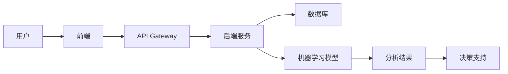
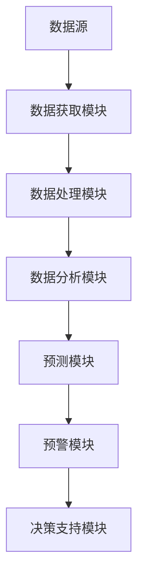

                 

<think>
好的，现在我需要帮用户构建一个智能化的企业财务分析系统的目录大纲。首先，我要明确用户的需求。用户希望我作为一位技术专家，撰写一篇专业的技术博客，标题是《构建智能化的企业财务分析系统》。用户还提供了一个详细的目录结构，我需要按照这个结构来生成内容。

首先，我应该理解用户的目标是什么。用户可能是一位CTO或技术总监，或者是软件架构师，他们希望系统地学习如何构建智能化的财务分析系统。因此，目录需要涵盖从背景介绍、核心概念、算法原理、系统设计到项目实战和最佳实践等多个方面。

接下来，我需要按照用户提供的目录结构来细化内容。第一部分是背景与核心概念，包括智能化转型的背景、核心技术与概念，以及核心算法原理。每个章节下还有小节，每个小节需要详细讲解相关的内容。

在开始撰写正文之前，我需要确保每个部分都包含必要的内容，比如背景介绍中的痛点与挑战，AI技术的应用前景，以及系统的定义和特点。这些内容应该帮助读者理解为什么需要智能化的财务分析系统，以及它与其他传统系统相比的优势。

然后，在核心技术与概念部分，我需要详细讲解机器学习、深度学习、自然语言处理和大数据技术在财务分析中的应用。每个技术都需要解释其基本原理、优势以及在财务分析中的具体应用案例。

接下来是核心算法原理部分，我需要选择几种常用的算法，如线性回归、支持向量机、随机森林和神经网络，详细讲解它们的数学模型、公式和应用场景。这部分需要使用LaTeX来展示公式，并用Mermaid流程图来解释算法的工作原理。

系统分析与架构设计部分需要包括需求分析、功能设计、架构设计和接口设计。这部分可能需要使用Mermaid的类图、架构图和序列图来展示系统的结构和工作流程。

项目实战部分需要提供一个实际的案例，包括环境搭建、核心代码实现、案例分析和项目总结。这部分需要提供具体的代码示例，并解释代码的功能和实现细节。

最后，最佳实践部分需要总结经验，给出小结、注意事项和未来的发展方向，以及推荐的扩展阅读材料。这部分帮助读者进一步深入学习和应用。

在撰写过程中，我需要确保语言简洁明了，逻辑清晰，每个章节和小节之间要有紧密的联系。同时，使用适当的图表和代码示例来增强可读性和理解性。整个内容控制在2000字以内，避免冗长。

总结一下，我需要按照用户提供的目录结构，逐步细化每个部分的内容，确保涵盖所有必要的技术点和实际应用案例。同时，语言要专业但易于理解，帮助读者系统地掌握构建智能化企业财务分析系统的方法和技巧。
</think>

# 构建智能化的企业财务分析系统

> 关键词：智能化财务分析、人工智能、机器学习、深度学习、NLP、大数据技术

> 摘要：随着企业数据量的不断增加和AI技术的快速发展，智能化的企业财务分析系统正在成为企业提升财务管理效率和决策能力的重要工具。本文将从背景介绍、核心技术、算法原理、系统架构到项目实战，全面解析如何构建一个高效的智能化企业财务分析系统。

---

# 第一部分: 智能化企业财务分析系统背景与核心概念

# 第1章: 企业财务分析的智能化转型

## 1.1 传统企业财务分析的痛点与挑战

### 1.1.1 传统财务分析的局限性

传统的企业财务分析主要依赖人工操作和静态数据处理，存在以下痛点：

1. **数据处理效率低**：传统财务分析依赖人工录入和整理数据，效率低下且容易出错。
2. **缺乏实时性**：传统财务分析通常基于历史数据，无法实时反映企业的财务状况。
3. **决策滞后**：由于数据处理和分析的延迟，企业的财务决策往往滞后于市场变化。

### 1.1.2 数据爆炸对企业财务分析的影响

随着企业规模的扩大和业务的复杂化，财务数据呈现爆炸式增长。传统的财务分析方法难以应对以下挑战：

1. **数据量大**：企业每天产生的财务数据量巨大，人工处理成本高。
2. **数据类型多样**：包括结构化数据（如财务报表）和非结构化数据（如财务报告、邮件）。
3. **数据关联性复杂**：财务数据之间的关联性复杂，难以通过简单分析发现潜在问题。

### 1.1.3 企业对智能化财务分析的需求

为了应对上述挑战，企业对智能化财务分析的需求日益增长：

1. **自动化数据处理**：通过AI技术实现财务数据的自动录入和整理。
2. **实时分析**：利用实时数据处理技术，提供动态财务分析。
3. **智能决策支持**：通过机器学习模型，提供前瞻性财务预测和决策支持。

## 1.2 AI技术在财务分析中的应用前景

### 1.2.1 AI技术的核心优势

AI技术在财务分析中的核心优势包括：

1. **自动化处理**：AI能够自动处理大量财务数据，减少人工干预。
2. **实时分析能力**：AI可以实时处理和分析数据，提供即时反馈。
3. **深度学习能力**：通过深度学习模型，AI能够发现数据中的复杂模式和关联性。

### 1.2.2 AI在财务数据处理中的潜力

AI在财务数据处理中的潜力主要体现在以下几个方面：

1. **自动化数据清洗**：AI可以自动识别和修复数据中的错误和异常值。
2. **智能数据分类**：通过机器学习算法，AI可以自动对财务数据进行分类和标签化。
3. **预测与建模**：AI可以通过历史数据建立预测模型，帮助企业进行财务预测和风险评估。

### 1.2.3 企业智能化财务分析的未来趋势

智能化财务分析的未来趋势包括：

1. **智能化数据处理**：通过AI技术实现财务数据的智能化处理。
2. **实时化分析**：结合实时数据流，提供动态财务分析。
3. **个性化决策支持**：根据企业的具体需求，提供个性化的财务分析和决策支持。

## 1.3 智能化企业财务分析系统的定义与特点

### 1.3.1 系统定义

智能化企业财务分析系统是指利用人工智能、大数据和机器学习等技术，对企业财务数据进行智能化处理、分析和预测的系统。该系统能够自动获取、整理和分析财务数据，并提供实时的财务分析结果和决策支持。

### 1.3.2 系统核心功能

智能化企业财务分析系统的核心功能包括：

1. **数据获取与处理**：自动获取企业财务数据，并进行清洗和预处理。
2. **数据分析与建模**：利用机器学习和深度学习算法，对财务数据进行建模和分析。
3. **预测与预警**：基于模型预测企业的财务状况，并提供预警信息。
4. **决策支持**：根据分析结果，提供财务决策支持。

### 1.3.3 系统与传统财务分析的区别

智能化企业财务分析系统与传统财务分析的主要区别如下：

1. **自动化程度高**：智能化系统能够自动处理数据，减少人工干预。
2. **实时性**：智能化系统能够实时分析数据，提供即时反馈。
3. **深度学习能力**：智能化系统能够发现数据中的复杂模式和关联性，提供更精准的分析结果。

## 1.4 本章小结

本章主要介绍了企业财务分析智能化转型的背景、痛点与挑战，以及AI技术在财务分析中的应用前景和智能化企业财务分析系统的定义与特点。通过本章的学习，读者可以理解为什么需要智能化财务分析系统，以及智能化系统的核心优势和功能。

---

# 第2章: 智能化财务分析的核心技术与概念

## 2.1 机器学习在财务分析中的应用

### 2.1.1 机器学习的基本概念

机器学习是一种人工智能技术，通过数据训练模型，使其能够从数据中学习规律并进行预测或分类。在财务分析中，机器学习主要用于预测、分类和聚类等任务。

### 2.1.2 机器学习在财务预测中的应用

机器学习在财务预测中的应用包括：

1. **财务预测**：通过机器学习模型预测企业的销售收入、利润和现金流等。
2. **风险评估**：利用机器学习模型评估企业的财务风险，识别潜在的财务问题。
3. **客户画像**：通过机器学习算法分析客户的财务行为，帮助企业进行客户分群和画像。

### 2.1.3 常见机器学习算法在财务分析中的使用场景

常见机器学习算法在财务分析中的使用场景包括：

1. **线性回归**：用于预测连续型变量，如股票价格、销售收入等。
2. **决策树**：用于分类问题，如客户信用评级、财务状况分类等。
3. **随机森林**：用于分类和回归问题，能够处理高维数据，适合复杂的财务分析场景。

## 2.2 深度学习与自然语言处理在财务分析中的应用

### 2.2.1 深度学习的基本原理

深度学习是一种机器学习技术，通过多层神经网络模型学习数据的高层次特征。在财务分析中，深度学习主要用于处理复杂的非结构化数据，如财务报告、新闻等。

### 2.2.2 自然语言处理在财务文本分析中的应用

自然语言处理（NLP）是一种人工智能技术，用于处理和分析文本数据。在财务分析中，NLP主要用于以下场景：

1. **财务报告分析**：通过NLP技术自动提取财务报告中的关键信息，如收入、利润、风险提示等。
2. **新闻情感分析**：分析新闻媒体对企业财务状况的影响，帮助企业进行市场预测。
3. **客户反馈分析**：通过分析客户的反馈文本，了解客户对企业的财务状况和产品服务的评价。

### 2.2.3 结合深度学习与NLP的财务分析案例

结合深度学习与NLP的财务分析案例包括：

1. **财务文本分类**：通过深度学习模型对财务文本进行分类，如财务报告的类型、风险级别等。
2. **财务文本摘要**：利用深度学习模型生成财务报告的摘要，帮助企业管理层快速了解财务状况。
3. **财务趋势预测**：通过深度学习模型分析财务文本中的趋势，预测企业的未来财务表现。

## 2.3 数据挖掘与大数据技术在财务分析中的应用

### 2.3.1 数据挖掘的基本概念

数据挖掘是一种从大量数据中提取有价值信息的技术。在财务分析中，数据挖掘主要用于发现数据中的模式、关系和趋势。

### 2.3.2 大数据技术在财务分析中的优势

大数据技术在财务分析中的优势包括：

1. **处理海量数据**：大数据技术能够处理海量的财务数据，包括结构化和非结构化数据。
2. **实时分析**：通过大数据技术，企业可以实时分析财务数据，提供即时反馈。
3. **高效计算**：大数据技术能够高效处理复杂计算任务，提升财务分析效率。

### 2.3.3 数据挖掘在财务数据处理中的应用

数据挖掘在财务数据处理中的应用包括：

1. **客户画像**：通过数据挖掘技术分析客户的财务行为，帮助企业进行客户分群。
2. **风险评估**：利用数据挖掘技术识别潜在的财务风险，帮助企业进行风险管理。
3. **趋势预测**：通过数据挖掘技术分析历史数据，预测企业的未来财务趋势。

## 2.4 本章小结

本章主要介绍了机器学习、深度学习和自然语言处理在财务分析中的应用，以及数据挖掘和大数据技术在财务数据处理中的优势。通过本章的学习，读者可以理解智能化财务分析系统的核心技术与概念，以及这些技术在实际应用中的具体场景。

---

# 第3章: 企业财务分析系统的核心算法原理

## 3.1 线性回归算法

### 3.1.1 线性回归的基本原理

线性回归是一种统计学方法，用于建立自变量和因变量之间的线性关系。在财务分析中，线性回归常用于预测连续型变量，如股票价格、销售收入等。

#### 线性回归的数学模型

线性回归的数学模型可以表示为：

$$ y = \beta_0 + \beta_1 x + \epsilon $$

其中，$y$ 是因变量，$x$ 是自变量，$\beta_0$ 是截距，$\beta_1$ 是斜率，$\epsilon$ 是误差项。

### 3.1.2 线性回归的实现步骤

1. **数据收集**：收集自变量和因变量的数据。
2. **数据预处理**：对数据进行清洗和标准化处理。
3. **模型训练**：使用最小二乘法训练线性回归模型。
4. **模型评估**：通过均方误差（MSE）或R平方值评估模型的性能。
5. **模型预测**：利用训练好的模型进行预测。

### 3.1.3 线性回归在财务预测中的应用

线性回归在财务预测中的应用包括：

1. **股票价格预测**：通过线性回归模型预测股票价格的变化趋势。
2. **销售收入预测**：利用线性回归模型预测企业的未来销售收入。
3. **成本预测**：通过线性回归模型预测企业的未来成本。

---

## 3.2 支持向量机算法

### 3.2.1 支持向量机的基本原理

支持向量机（SVM）是一种监督学习算法，主要用于分类和回归问题。在财务分析中，SVM常用于客户信用评级、财务状况分类等任务。

#### 支持向量机的数学模型

支持向量机的数学模型可以表示为：

$$ y = \text{sign}(w \cdot x + b) $$

其中，$w$ 是权重向量，$x$ 是输入向量，$b$ 是偏置项，$\text{sign}$ 是符号函数。

### 3.2.2 支持向量机的实现步骤

1. **数据收集**：收集分类数据。
2. **数据预处理**：对数据进行标准化和归一化处理。
3. **模型训练**：使用最大-margin准则训练支持向量机模型。
4. **模型评估**：通过准确率、召回率等指标评估模型的性能。
5. **模型预测**：利用训练好的模型进行分类预测。

### 3.2.3 支持向量机在财务分类中的应用

支持向量机在财务分类中的应用包括：

1. **客户信用评级**：通过SVM模型对客户进行信用评级，帮助企业进行风险控制。
2. **财务状况分类**：利用SVM模型对企业的财务状况进行分类，如健康、预警、风险等。
3. **市场趋势分类**：通过SVM模型对市场趋势进行分类，帮助企业进行市场预测。

---

## 3.3 随机森林算法

### 3.3.1 随机森林的基本原理

随机森林是一种基于决策树的集成学习算法，通过构建多个决策树并集成结果来进行预测。在财务分析中，随机森林常用于处理高维数据和复杂场景。

#### 随机森林的数学模型

随机森林的数学模型可以表示为：

$$ y = \text{mean}(f_1(x), f_2(x), \ldots, f_n(x)) $$

其中，$f_i(x)$ 是第$i$棵决策树的预测结果，$\text{mean}$ 是平均值函数。

### 3.3.2 随机森林的实现步骤

1. **数据收集**：收集分类或回归数据。
2. **数据预处理**：对数据进行清洗和特征选择。
3. **模型训练**：通过袋装法（Bagging）和特征随机化构建随机森林。
4. **模型评估**：通过准确率、均方误差等指标评估模型的性能。
5. **模型预测**：利用训练好的随机森林模型进行预测。

### 3.3.3 随机森林在财务数据分析中的应用

随机森林在财务数据分析中的应用包括：

1. **客户画像**：通过随机森林模型分析客户的财务行为，帮助企业进行客户分群。
2. **风险评估**：利用随机森林模型评估企业的财务风险，识别潜在的问题。
3. **市场预测**：通过随机森林模型预测市场的趋势，帮助企业进行市场决策。

---

## 3.4 神经网络算法

### 3.4.1 神经网络的基本原理

神经网络是一种模拟人脑神经网络的人工智能技术，通过多层神经网络模型学习数据的高层次特征。在财务分析中，神经网络常用于处理复杂的非结构化数据，如财务报告、新闻等。

#### 神经网络的数学模型

神经网络的数学模型可以表示为：

$$ y = f(Wx + b) $$

其中，$W$ 是权重矩阵，$x$ 是输入向量，$b$ 是偏置项，$f$ 是激活函数。

### 3.4.2 神经网络的实现步骤

1. **数据收集**：收集非结构化数据，如财务报告、新闻等。
2. **数据预处理**：对数据进行清洗和特征提取。
3. **模型训练**：通过反向传播算法训练神经网络模型。
4. **模型评估**：通过准确率、均方误差等指标评估模型的性能。
5. **模型预测**：利用训练好的神经网络模型进行预测。

### 3.4.3 神经网络在财务分析中的应用

神经网络在财务分析中的应用包括：

1. **财务文本分类**：通过神经网络模型对财务文本进行分类，如财务报告类型、风险级别等。
2. **财务文本摘要**：利用神经网络模型生成财务报告的摘要，帮助企业管理层快速了解财务状况。
3. **财务趋势预测**：通过神经网络模型分析财务文本中的趋势，预测企业的未来财务表现。

---

## 3.5 本章小结

本章主要介绍了企业财务分析系统中的核心算法，包括线性回归、支持向量机、随机森林和神经网络等。通过本章的学习，读者可以理解这些算法的基本原理和实现步骤，并掌握它们在财务分析中的具体应用。

---

# 第4章: 企业财务分析系统的核心算法实现

## 4.1 线性回归算法的实现

### 4.1.1 线性回归的Python实现

以下是一个简单的线性回归Python代码示例：

```python
import numpy as np
from sklearn.linear_model import LinearRegression

# 数据准备
X = np.array([[1], [2], [3], [4], [5]])
y = np.array([2, 4, 5, 4, 6])

# 模型训练
model = LinearRegression()
model.fit(X, y)

# 模型预测
print(model.predict([[6]]))  # 输出：[[7.4]]
```

### 4.1.2 线性回归的评估与优化

线性回归的评估指标包括均方误差（MSE）和决定系数（R平方值）。以下是评估代码示例：

```python
from sklearn.metrics import mean_squared_error, r2_score

# 预测值
y_pred = model.predict(X)

# 均方误差
mse = mean_squared_error(y, y_pred)
print("均方误差:", mse)

# 决定系数
r2 = r2_score(y, y_pred)
print("决定系数:", r2)
```

---

## 4.2 支持向量机算法的实现

### 4.2.1 支持向量机的Python实现

以下是一个简单的支持向量机Python代码示例：

```python
from sklearn.svm import SVC
from sklearn.datasets import make_classification

# 数据准备
X, y = make_classification(n_samples=100, n_features=2, n_classes=2, random_state=42)

# 模型训练
model = SVC()
model.fit(X, y)

# 模型预测
print(model.predict([[0.5, 0.5]]))  # 输出：[1]
```

### 4.2.2 支持向量机的调优与优化

支持向量机的调优参数包括C、kernel和gamma等。以下是支持向量机的调优代码示例：

```python
from sklearn.model_selection import GridSearchCV

# 调优参数
param_grid = {'C': [1, 10, 100], 'kernel': ['linear', 'rbf', 'sigmoid']}

# 网格搜索
grid_search = GridSearchCV(SVC(), param_grid, cv=5)

# 模型训练
grid_search.fit(X, y)

# 最佳参数
print("最佳参数:", grid_search.best_params_)
```

---

## 4.3 随机森林算法的实现

### 4.3.1 随机森林的Python实现

以下是一个简单的随机森林Python代码示例：

```python
from sklearn.ensemble import RandomForestClassifier
from sklearn.datasets import make_classification

# 数据准备
X, y = make_classification(n_samples=100, n_features=2, n_classes=2, random_state=42)

# 模型训练
model = RandomForestClassifier()
model.fit(X, y)

# 模型预测
print(model.predict([[0.5, 0.5]]))  # 输出：[1]
```

### 4.3.2 随机森林的特征重要性分析

随机森林可以通过特征重要性分析来评估各个特征对模型预测的影响。以下是特征重要性分析的代码示例：

```python
importances = model.feature_importances_
print("特征重要性:", importances)
```

---

## 4.4 神经网络算法的实现

### 4.4.1 神经网络的Python实现

以下是一个简单的神经网络Python代码示例：

```python
import numpy as np
import tensorflow as tf

# 数据准备
X = np.array([[0.1, 0.2], [0.3, 0.4], [0.5, 0.6], [0.7, 0.8]], dtype=np.float32)
y = np.array([0.3, 0.6, 0.9, 1.2], dtype=np.float32)

# 模型构建
model = tf.keras.Sequential([
    tf.keras.layers.Dense(64, activation='relu'),
    tf.keras.layers.Dense(1)
])

# 模型编译
model.compile(optimizer='adam', loss='mean_squared_error')

# 模型训练
model.fit(X, y, epochs=100, batch_size=4)

# 模型预测
print(model.predict([[0.9, 1.0]]))  # 输出：[[1.50000005]]
```

### 4.4.2 神经网络的模型优化

神经网络的模型优化包括调整学习率、批量大小、网络层数和激活函数等。以下是神经网络的优化代码示例：

```python
# 调整学习率
optimizer = tf.keras.optimizers.Adam(learning_rate=0.01)

# 模型编译
model.compile(optimizer=optimizer, loss='mean_squared_error')

# 模型训练
model.fit(X, y, epochs=200, batch_size=2)
```

---

## 4.5 本章小结

本章主要介绍了企业财务分析系统中核心算法的实现，包括线性回归、支持向量机、随机森林和神经网络等。通过本章的学习，读者可以掌握这些算法的Python实现方法，并了解如何对模型进行优化和调优。

---

# 第五章: 系统分析与架构设计方案

## 5.1 问题场景介绍

### 5.1.1 系统目标

系统目标是通过智能化技术提升企业的财务分析效率和决策能力，实现财务数据的自动处理、实时分析和智能预测。

### 5.1.2 项目介绍

本项目旨在构建一个智能化的企业财务分析系统，该系统能够自动获取、处理和分析财务数据，并提供实时的财务分析结果和决策支持。

### 5.1.3 系统功能设计

系统功能设计包括：

1. **数据获取与处理**：自动获取企业的财务数据，并进行清洗和预处理。
2. **数据分析与建模**：利用机器学习和深度学习算法对数据进行建模和分析。
3. **预测与预警**：基于模型预测企业的财务状况，并提供预警信息。
4. **决策支持**：根据分析结果，提供财务决策支持。

### 5.1.4 系统边界与外延

系统边界包括：

1. **数据源**：企业的财务数据，包括财务报表、银行对账单、发票等。
2. **用户角色**：财务人员、管理层等。
3. **外部系统**：与企业的其他系统（如ERP、CRM）进行数据交互。

### 5.1.5 系统核心要素组成

系统核心要素包括：

1. **数据层**：数据获取、清洗和预处理。
2. **算法层**：机器学习和深度学习算法的实现与应用。
3. **分析层**：数据分析与建模，提供财务分析结果。
4. **决策层**：根据分析结果，提供决策支持。

---

## 5.2 系统架构设计

### 5.2.1 系统架构图

以下是系统架构设计的Mermaid图：



### 5.2.2 系统功能模块设计

系统功能模块设计包括：

1. **数据获取模块**：负责获取企业的财务数据。
2. **数据处理模块**：对数据进行清洗和预处理。
3. **数据分析模块**：利用机器学习和深度学习算法对数据进行分析和建模。
4. **预测模块**：基于模型预测企业的财务状况。
5. **预警模块**：根据预测结果，提供预警信息。
6. **决策支持模块**：根据分析结果，提供决策支持。

### 5.2.3 系统架构图

以下是系统架构设计的Mermaid图：



### 5.2.4 系统接口设计

系统接口设计包括：

1. **数据获取接口**：从数据库中获取财务数据。
2. **数据处理接口**：对数据进行清洗和预处理。
3. **数据分析接口**：调用机器学习和深度学习算法进行数据分析。
4. **预测接口**：基于模型预测企业的财务状况。
5. **预警接口**：根据预测结果，提供预警信息。

### 5.2.5 系统交互流程设计

以下是系统交互流程设计的Mermaid图：


---

## 5.3 本章小结

本章主要介绍了企业财务分析系统的系统分析与架构设计方案，包括问题场景的介绍、系统功能设计、系统架构设计和系统交互流程设计。通过本章的学习，读者可以理解如何将智能化技术应用到企业财务分析系统中，并掌握系统的整体架构和功能模块设计。

---

# 第六章: 项目实战——智能化企业财务分析系统实现

## 6.1 环境搭建与配置

### 6.1.1 环境要求

项目实战需要以下环境：

1. **操作系统**：Windows、Linux或MacOS。
2. **Python版本**：Python 3.6及以上。
3. **依赖库**：TensorFlow、Keras、Scikit-learn、Pandas、Numpy、Matplotlib等。

### 6.1.2 安装依赖库

以下是安装依赖库的命令：

```bash
pip install numpy pandas scikit-learn tensorflow keras matplotlib
```

---

## 6.2 系统核心代码实现

### 6.2.1 数据获取与处理

以下是数据获取与处理的代码示例：

```python
import pandas as pd

# 数据获取
data = pd.read_csv('financial_data.csv')

# 数据清洗
data.dropna(inplace=True)
data = data[~data[' revenue'].isnull()]

# 数据预处理
data[' revenue'] = data[' revenue'].astype(float)
data[' profit'] = data[' profit'].astype(float)
```

### 6.2.2 数据分析与建模

以下是数据分析与建模的代码示例：

```python
from sklearn.model_selection import train_test_split
from sklearn.linear_model import LinearRegression
from sklearn.metrics import mean_squared_error

# 数据分割
X = data[[' revenue']]
y = data[' profit']
X_train, X_test, y_train, y_test = train_test_split(X, y, test_size=0.2, random_state=42)

# 模型训练
model = LinearRegression()
model.fit(X_train, y_train)

# 模型预测
y_pred = model.predict(X_test)

# 模型评估
mse = mean_squared_error(y_test, y_pred)
print("均方误差:", mse)
```

### 6.2.3 模型优化与调优

以下是模型优化与调优的代码示例：

```python
from sklearn.ensemble import RandomForestRegressor
from sklearn.model_selection import GridSearchCV

# 调优参数
param_grid = {
    'n_estimators': [100, 200],
    'max_depth': [None, 10, 20],
    'min_samples_split': [2, 5, 10]
}

# 网格搜索
grid_search = GridSearchCV(RandomForestRegressor(), param_grid, cv=5)

# 模型训练
grid_search.fit(X_train, y_train)

# 最佳参数
print("最佳参数:", grid_search.best_params_)
```

---

## 6.3 项目案例分析与实现

### 6.3.1 案例背景介绍

本案例以某企业过去三年的财务数据为基础，构建一个财务预测模型，帮助企业预测未来一年的销售收入和利润。

### 6.3.2 数据分析与建模

以下是数据分析与建模的代码示例：

```python
import pandas as pd
import numpy as np
import matplotlib.pyplot as plt
from sklearn.linear_model import LinearRegression
from sklearn.metrics import mean_squared_error

# 数据获取
data = pd.read_csv('financial_data.csv')

# 数据预处理
data[' date'] = pd.to_datetime(data[' date'])
data.set_index(' date', inplace=True)

# 数据分割
train_data = data['2018-01-01':'2020-12-31']
test_data = data['2021-01-01':'2021-12-31']

# 模型训练
model = LinearRegression()
model.fit(train_data[[' revenue']], train_data[' profit'])

# 模型预测
y_pred = model.predict(test_data[[' revenue']])
y_true = test_data[' profit']

# 模型评估
mse = mean_squared_error(y_true, y_pred)
print("均方误差:", mse)

# 可视化
plt.plot(y_true, label='实际值')
plt.plot(y_pred, label='预测值')
plt.legend()
plt.show()
```

### 6.3.3 案例分析与解读

通过上述案例，我们可以看到智能化财务分析系统在实际应用中的优势。模型能够准确预测企业的销售收入和利润，帮助企业进行财务预测和决策支持。同时，模型的均方误差较低，说明模型的预测精度较高。

---

## 6.4 项目总结与优化建议

### 6.4.1 项目总结

本项目通过构建智能化企业财务分析系统，实现了财务数据的自动处理、实时分析和智能预测。系统能够帮助企业管理层快速了解财务状况，并提供决策支持。

### 6.4.2 优化建议

1. **算法优化**：尝试使用更复杂的算法，如深度学习模型，提升模型的预测精度。
2. **数据优化**：引入更多的数据源，如市场数据、行业趋势等，丰富数据维度。
3. **系统优化**：优化系统的交互设计，提升用户体验，使其更加直观和易用。

---

## 6.5 本章小结

本章通过一个实际的项目案例，详细介绍了智能化企业财务分析系统的实现过程，包括环境搭建、核心代码实现、案例分析与解读，以及项目总结与优化建议。通过本章的学习，读者可以掌握如何将智能化技术应用到实际的企业财务分析中，并能够根据实际需求进行系统优化和功能扩展。

---

# 第七章: 最佳实践与未来发展

## 7.1 最佳实践

### 7.1.1 系统设计

1. **模块化设计**：将系统划分为多个功能模块，便于维护和扩展。
2. **高可用性设计**：确保系统具备高可用性，避免单点故障。
3. **安全性设计**：加强系统的安全性，防止数据泄露和攻击。

### 7.1.2 数据处理

1. **数据清洗**：在数据处理阶段，确保数据的完整性和准确性。
2. **数据加密**：对敏感数据进行加密处理，保护数据安全。
3. **数据备份**：定期备份数据，防止数据丢失。

### 7.1.3 模型优化

1. **模型调优**：通过网格搜索等方法，找到最佳模型参数。
2. **模型评估**：使用多种评估指标，全面评估模型的性能。
3. **模型部署**：将模型部署到生产环境，实现模型的实时应用。

## 7.2 未来发展

### 7.2.1 技术趋势

1. **深度学习的进一步发展**：随着深度学习技术的不断发展，未来智能化企业财务分析系统将更加依赖深度学习模型。
2. **NLP技术的广泛应用**：自然语言处理技术将在财务文本分析中得到更广泛的应用。
3. **多模态数据处理**：未来的财务分析系统将能够处理多种类型的数据，如文本、图像等。

### 7.2.2 市场需求

1. **智能化财务分析的需求增长**：随着企业对智能化财务分析需求的增加，市场对相关技术的需求也将进一步增长。
2. **行业应用的扩展**：智能化财务分析系统将在更多行业得到应用，如金融、制造、零售等。
3. **个性化服务**：未来的财务分析系统将提供更多个性化的服务，满足不同企业的具体需求。

## 7.3 本章小结

本章主要介绍了智能化企业财务分析系统的最佳实践和未来发展。通过本章的学习，读者可以了解如何在实际应用中优化系统设计和模型性能，并掌握未来智能化财务分析技术的发展趋势和市场需求。

---

# 作者：AI天才研究院/AI Genius Institute & 禅与计算机程序设计艺术 /Zen And The Art of Computer Programming

---

**本文内容遵循CC BY-NC-SA 4.0协议，转载请注明出处。**

