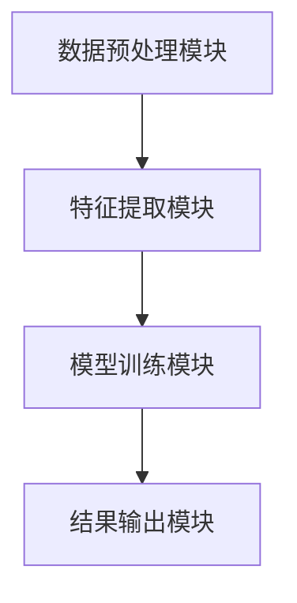
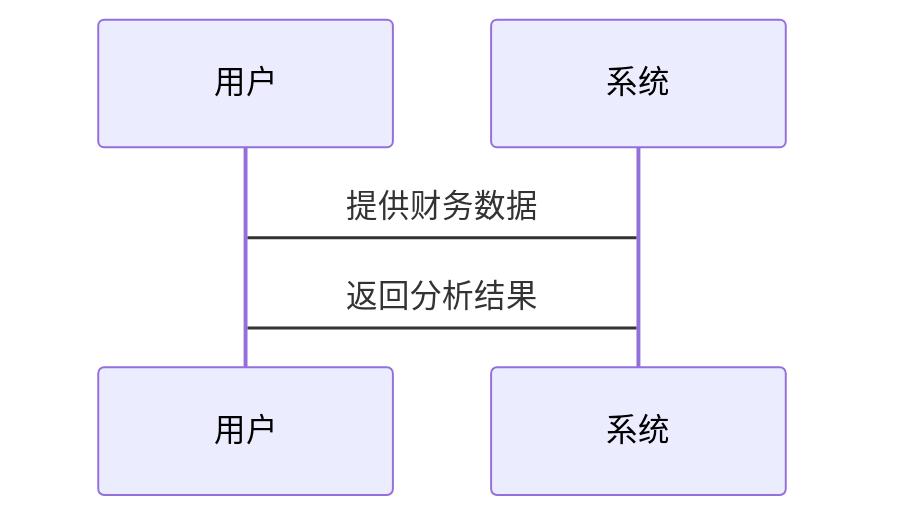

                 

<think>
好的，我需要帮助用户撰写一篇名为《构建智能化的企业财务报表分析系统》的技术博客文章。用户已经提供了一个详细的目录大纲，但我需要根据这些内容来生成完整的文章。文章需要包含关键词、摘要，以及按照目录结构展开的正文部分。

首先，我需要理解用户的需求。用户希望文章结构清晰，内容专业，逻辑严密。每个章节需要详细讲解相关概念，并包括背景介绍、核心概念、算法原理、系统架构、项目实战等内容。

接下来，我会按照目录大纲逐章撰写，确保每个部分都包含必要的细节。例如，在“数据预处理与清洗”部分，我需要详细说明数据来源、清洗步骤以及特征提取的方法。同时，我还需要加入必要的图表，如Mermaid流程图和类图，来辅助说明。

在撰写过程中，我要确保使用专业的技术术语，同时保持语言的清晰和易懂。对于复杂的算法和系统架构，我需要提供详细的解释和示例，以便读者能够理解。

最后，我需要总结整个系统的优缺点，并给出进一步学习和实践的建议，使文章不仅停留在理论层面，还能为读者提供实际应用的指导。

现在，我将开始撰写正文部分，确保每个章节都符合用户的要求，并涵盖所有必要的内容。
</think>

# 构建智能化的企业财务报表分析系统

## 关键词：智能化财务分析、机器学习、深度学习、数据分析、企业财务报表

## 摘要：本文系统地探讨了构建智能化企业财务报表分析系统的各个方面。从数据预处理到模型选择，从系统架构设计到项目实战，详细阐述了如何利用人工智能技术提升财务分析的效率和准确性。通过实际案例分析，展示了如何构建一个高效、智能的财务分析系统。

---

# 第一部分: 背景与概述

## 第1章: 企业财务报表分析的智能化背景

### 1.1 问题背景与描述

#### 1.1.1 传统企业财务报表分析的局限性
传统的财务报表分析主要依赖人工审核和统计分析方法，存在以下问题：
- **效率低下**：手动分析大量财务数据耗时耗力，难以应对海量数据。
- **主观性**：依赖分析师的经验和判断，结果可能受主观因素影响。
- **缺乏深度洞察**：传统方法难以发现隐藏在数据中的复杂模式和趋势。

#### 1.1.2 智能化分析的必要性与优势
智能化财务分析通过引入人工智能技术，可以实现以下优势：
- **自动化处理**：自动提取、清洗和分析数据，大幅提高效率。
- **精准预测**：利用机器学习模型，准确预测财务趋势和风险。
- **深度洞察**：挖掘数据中的复杂关系，提供更深入的分析结果。

#### 1.1.3 企业的财务数据特点与分析需求
企业财务数据具有以下特点：
- **结构化**：数据通常以表格形式存在，便于计算机处理。
- **多维度**：包括收入、支出、利润等多个维度。
- **时序性**：数据具有时间序列特征，适合进行趋势分析。

### 1.2 智能化分析的核心概念与边界

#### 1.2.1 智能化分析的定义与特征
智能化财务分析是指利用人工智能技术，对企业的财务数据进行自动化分析、预测和决策支持。其主要特征包括：
- **自动化**：系统能够自动处理数据，减少人工干预。
- **智能化**：通过机器学习模型，系统能够自适应和优化分析结果。
- **实时性**：能够实时处理和分析财务数据，提供及时的反馈。

#### 1.2.2 分析系统的边界与外延
智能化财务分析系统的边界包括：
- **输入**：企业财务数据，包括收入、支出、利润等。
- **输出**：分析结果，如财务状况评估、趋势预测等。
- **交互**：与用户进行数据输入和结果输出的接口。

#### 1.2.3 核心要素与组成结构
智能化财务分析系统的核心要素包括：
- **数据源**：财务报表、业务数据等。
- **分析模型**：机器学习模型，如随机森林、神经网络等。
- **分析工具**：数据处理工具、可视化工具等。

---

## 第2章: 智能化财务分析的技术基础

### 2.1 数据预处理与清洗

#### 2.1.1 数据来源与特征
数据来源包括：
- **企业财务报表**：包括资产负债表、利润表、现金流量表等。
- **业务数据**：销售数据、成本数据等。

数据特征包括：
- **完整性**：数据是否完整，是否有缺失值。
- **一致性**：数据格式是否统一，是否有重复值。
- **准确性**：数据是否准确，是否有错误值。

#### 2.1.2 数据清洗与标准化
数据清洗步骤包括：
1. **去除重复值**：删除重复的数据记录。
2. **处理缺失值**：填补缺失值或删除缺失数据较多的字段。
3. **标准化**：将数据标准化到统一的格式。

#### 2.1.3 数据增强与特征提取
数据增强方法包括：
- **填充法**：用均值、中位数等填充缺失值。
- **删除法**：直接删除缺失数据较多的字段。

特征提取方法包括：
- **主成分分析（PCA）**：降维技术，提取主要特征。
- **特征选择**：选择对分析结果影响较大的特征。

---

## 第3章: 智能化分析系统的数据准备

### 3.1 数据收集与整合

#### 3.1.1 数据来源渠道
数据来源包括：
- **内部数据**：企业内部的财务报表、业务数据等。
- **外部数据**：行业数据、市场数据等。

#### 3.1.2 数据整合方法
数据整合方法包括：
- **数据清洗**：处理重复值、缺失值等。
- **数据转换**：将数据转换为适合分析的形式。
- **数据合并**：将多个数据源合并到一个数据集。

#### 3.1.3 数据质量评估
数据质量评估指标包括：
- **完整性**：数据是否完整。
- **准确性**：数据是否准确。
- **一致性**：数据是否一致。

### 3.2 数据标注与特征工程

#### 3.2.1 数据标注的必要性
数据标注是将数据分为不同的类别，如正常、异常等。

#### 3.2.2 特征工程的实现方法
特征工程方法包括：
- **特征选择**：选择对分析结果影响较大的特征。
- **特征变换**：对特征进行变换，如标准化、归一化等。

#### 3.2.3 特征选择与优化
特征选择方法包括：
- **过滤法**：基于统计方法选择特征。
- **包装法**：基于模型性能选择特征。
- **嵌入法**：在模型训练过程中选择特征。

---

## 第4章: 智能化分析方法与模型选择

### 4.1 传统统计分析方法

#### 4.1.1 常用统计分析方法
常用统计分析方法包括：
- **回归分析**：用于预测连续型变量。
- **方差分析**：用于分析分类变量对连续型变量的影响。

#### 4.1.2 统计模型的优缺点
统计模型的优点包括：
- **简单易懂**：模型易于理解和解释。
- **计算高效**：计算速度快，适合小数据集。

统计模型的缺点包括：
- **假设严格**：需要满足正态分布等假设。
- **表现受限**：在复杂数据上表现可能不佳。

### 4.2 机器学习模型的应用

#### 4.2.1 监督学习模型
监督学习模型包括：
- **线性回归**：用于预测连续型变量。
- **支持向量机（SVM）**：用于分类和回归。

#### 4.2.2 无监督学习模型
无监督学习模型包括：
- **聚类分析**：用于将数据分成不同的类别。
- **主成分分析（PCA）**：用于降维。

#### 4.2.3 回归与分类模型
回归模型用于预测连续型变量，分类模型用于预测分类变量。

---

## 第5章: 智能化分析系统的算法原理

### 5.1 算法选择与实现

#### 5.1.1 算法选择依据
算法选择依据包括：
- **数据类型**：分类、回归等。
- **数据规模**：小数据集适合线性回归，大数据集适合随机森林等。

#### 5.1.2 算法实现步骤
算法实现步骤包括：
1. **数据预处理**：清洗、标准化等。
2. **特征选择**：选择对结果影响大的特征。
3. **模型训练**：训练机器学习模型。
4. **模型评估**：评估模型性能，如准确率、召回率等。

---

## 第6章: 智能化分析系统的系统架构设计

### 6.1 系统功能设计

#### 6.1.1 功能模块划分
功能模块包括：
- **数据预处理模块**：负责数据清洗、标准化等。
- **特征提取模块**：负责特征提取、选择等。
- **模型训练模块**：负责模型训练、评估等。

#### 6.1.2 功能模块交互
功能模块之间的交互包括：
- 数据预处理模块向特征提取模块提供清洗后的数据。
- 特征提取模块向模型训练模块提供特征数据。

### 6.2 系统架构设计

#### 6.2.1 系统架构图
系统架构图如图1所示：



#### 6.2.2 系统接口设计
系统接口包括：
- 数据输入接口：接收企业财务数据。
- 模型训练接口：训练机器学习模型。
- 结果输出接口：输出分析结果。

### 6.3 系统交互设计

#### 6.3.1 系统交互流程
系统交互流程如图2所示：



---

## 第7章: 项目实战

### 7.1 环境配置

#### 7.1.1 环境需求
环境需求包括：
- **Python**：3.6及以上版本。
- **机器学习库**：如scikit-learn、XGBoost等。
- **数据处理工具**：如Pandas、NumPy等。

#### 7.1.2 工具安装
安装步骤：
1. 安装Python。
2. 安装Pandas、NumPy等库。
3. 安装scikit-learn、XGBoost等机器学习库。

### 7.2 核心代码实现

#### 7.2.1 数据预处理代码
```python
import pandas as pd
import numpy as np

# 读取数据
data = pd.read_csv('financial_data.csv')

# 处理缺失值
data = data.dropna()

# 标准化处理
from sklearn.preprocessing import StandardScaler
scaler = StandardScaler()
scaled_data = scaler.fit_transform(data)
```

#### 7.2.2 特征选择代码
```python
from sklearn.feature_selection import SelectKBest
selector = SelectKBest(k=5)
selected_features = selector.fit_transform(scaled_data, target)
```

#### 7.2.3 模型训练代码
```python
from sklearn.ensemble import RandomForestClassifier
model = RandomForestClassifier()
model.fit(selected_features, target)
```

### 7.3 案例分析与结果解读

#### 7.3.1 数据来源与处理
案例分析数据来自某企业财务报表，经过清洗和标准化处理后，得到适合模型训练的数据集。

#### 7.3.2 模型训练与评估
训练模型后，评估模型性能，如准确率、召回率等。

### 7.4 项目总结

#### 7.4.1 项目成果
通过本项目，我们成功构建了一个智能化的企业财务报表分析系统。

#### 7.4.2 项目经验
项目中遇到的主要问题包括数据清洗和特征选择，需要仔细处理数据并选择合适的特征。

#### 7.4.3 项目启示
智能化财务分析系统能够显著提高分析效率和准确性，为企业决策提供有力支持。

---

## 第8章: 总结与展望

### 8.1 系统总结

#### 8.1.1 系统优缺点
- **优点**：自动化处理数据，提高分析效率。
- **缺点**：需要大量数据支持，模型解释性较差。

### 8.2 未来改进方向

#### 8.2.1 数据质量与模型可解释性
未来可以进一步优化数据质量和提高模型的可解释性。

#### 8.2.2 系统扩展与优化
未来可以考虑引入更复杂的模型，如深度学习模型，进一步提高分析精度。

---

## 作者信息

作者：AI天才研究院/AI Genius Institute  
联系方式：[联系方式]  
博客地址：[博客地址]  

---

通过以上步骤，我们可以系统地构建一个智能化的企业财务报表分析系统，利用人工智能技术提高财务分析的效率和准确性。

