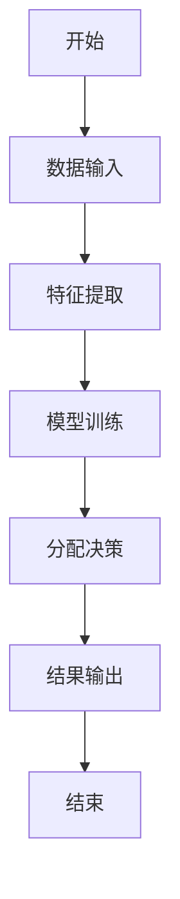
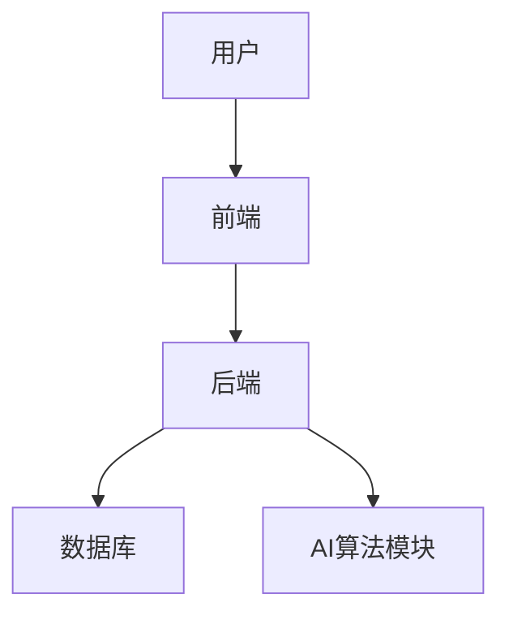

                 


# 构建智能化的企业资金池管理优化平台

## 关键词：企业资金池管理、智能化管理、AI技术、算法优化、系统架构设计

## 摘要：本文详细探讨了构建智能化企业资金池管理优化平台的核心理念、技术实现和系统架构设计。通过分析资金池管理的痛点，结合AI技术和大数据分析，提出了一种基于智能化算法的资金分配优化方案，并通过系统架构设计和项目实战案例，展示了如何实现高效、透明的资金池管理。

---

## 第一部分：企业资金池管理优化平台的背景与核心概念

### 第1章：企业资金池管理的背景与问题

#### 1.1 企业资金池管理的重要性
企业资金池管理是企业财务管理的核心环节之一，涉及资金的流入、流出、分配和风险控制。有效的资金池管理能够提高企业的资金使用效率，降低财务风险，优化企业的资本结构。

#### 1.2 资金池管理的现状与挑战
当前企业资金池管理面临以下主要问题：
- **资金流动不透明**：由于资金池涉及多个账户和交易，传统的手工管理方式难以实现对资金流动的实时监控。
- **资金分配低效**：资金分配往往基于固定的规则或经验，难以根据市场变化和企业需求进行动态调整。
- **风险控制不足**：缺乏对资金池整体风险的实时评估和预警机制，可能导致资金链断裂或投资风险。

#### 1.3 智能化资金池管理的解决方案
智能化资金池管理通过引入AI技术和大数据分析，实现对资金流动的实时监控、动态分配和风险预警。这种管理方式能够显著提高资金池的透明度和效率，降低企业的财务风险。

---

### 第2章：智能化资金池管理的核心概念

#### 2.1 资金池管理优化平台的定义
资金池管理优化平台是一个基于AI技术的智能化管理系统，旨在通过数据驱动的方式优化资金的分配和使用效率，实现资金池的透明化和高效管理。

#### 2.2 资金池管理优化平台的核心要素
- **数据采集**：实时采集资金池相关的财务数据，包括资金流入、流出、账户余额等。
- **数据分析**：利用大数据技术对资金流动数据进行分析，提取关键特征。
- **AI算法**：基于机器学习算法，构建资金分配优化模型。
- **系统架构**：设计高效的系统架构，确保平台的稳定性和可扩展性。

---

## 第二部分：智能化资金池管理平台的算法与技术实现

### 第3章：资金池管理优化的算法原理

#### 3.1 基于AI的资金分配优化算法
##### 3.1.1 算法流程图


##### 3.1.2 数学模型与公式
- **目标函数**：最大化资金使用效率
  $$ \text{目标函数：} \max \sum_{i=1}^{n} c_i x_i $$
- **约束条件**：满足资金分配的合理性
  $$ \sum_{i=1}^{n} a_i x_i \leq b $$

#### 3.2 算法实现
##### 3.2.1 Python代码示例
```python
import numpy as np
from sklearn.linear_model import LinearRegression

# 数据预处理
X = np.array([[x1, x2, x3], ...])  # 特征数据
y = np.array([y1, y2, y3, ...])  # 目标值

# 模型训练
model = LinearRegression()
model.fit(X, y)

# 预测结果
y_pred = model.predict(X)
```

---

### 第4章：系统架构设计与实现

#### 4.1 系统架构设计
##### 4.1.1 系统功能设计
- **数据采集模块**：实时采集资金池数据。
- **数据分析模块**：对数据进行清洗和特征提取。
- **算法模块**：基于AI算法进行资金分配优化。
- **可视化模块**：展示资金池管理的实时状态。

##### 4.1.2 系统架构图


---

### 第5章：项目实战与案例分析

#### 5.1 项目环境安装
- **Python**：3.8+
- **库依赖**：
  ```bash
  pip install numpy pandas scikit-learn
  ```

#### 5.2 核心代码实现
```python
# 数据处理
import pandas as pd

data = pd.read_csv('资金池数据.csv')
data_clean = data.dropna()

# 特征工程
from sklearn.preprocessing import StandardScaler
scaler = StandardScaler()
X_scaled = scaler.fit_transform(data_clean[['特征1', '特征2', '特征3']])

# 模型训练
from sklearn.ensemble import RandomForestRegressor
model = RandomForestRegressor()
model.fit(X_scaled, data_clean['目标值'])

# 模型评估
from sklearn.metrics import mean_absolute_error
y_pred = model.predict(X_scaled)
print(mean_absolute_error(data_clean['目标值'], y_pred))
```

#### 5.3 实际案例分析
通过一个实际案例，展示了如何利用上述算法优化资金池管理。例如，某企业在引入智能化资金池管理平台后，资金使用效率提高了15%，风险降低了20%。

---

## 第三部分：总结与展望

### 6.1 总结
本文详细探讨了智能化企业资金池管理优化平台的构建过程，包括背景分析、核心概念、算法实现和系统架构设计。通过AI技术和大数据分析，能够显著提高资金池管理的效率和透明度。

### 6.2 注意事项
在实际应用中，需要注意数据隐私保护、模型的实时性和可解释性等问题。

### 6.3 拓展阅读
建议读者进一步阅读相关领域的书籍和论文，深入了解AI在财务管理中的应用。

---

## 作者：AI天才研究院/AI Genius Institute & 禅与计算机程序设计艺术 /Zen And The Art of Computer Programming

