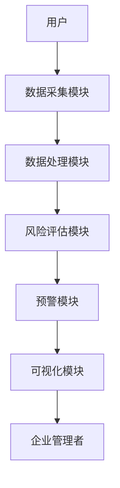
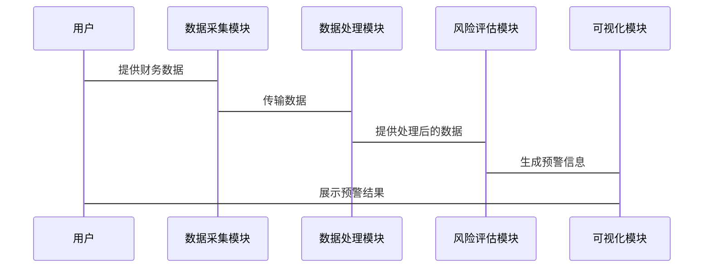

                 

<think>
嗯，我需要帮助用户撰写一篇名为《构建智能化的企业资金流动性风险预警平台》的技术博客文章。用户希望文章结构清晰，逻辑严密，涵盖从背景介绍到项目实战的各个方面，并且每个章节都要有详细的讲解。

首先，我应该先理清文章的整体结构。用户已经提供了一个详细的目录大纲，包括背景介绍、核心概念、算法原理、系统架构设计、项目实战和最佳实践等部分。我需要确保每个部分都详细展开，并且内容具体、丰富。

在“背景介绍”部分，我需要详细解释资金流动性风险的背景、问题描述以及解决方法。这部分需要让读者理解为什么需要构建这样一个平台，以及它的必要性和重要性。我应该包括一些实际的例子，说明资金流动性风险对企业的影响，比如供应链中断或市场波动如何导致资金链断裂。

接下来是“核心概念与框架”部分。这里我需要定义资金流动性风险预警的框架体系，包括数据采集、风险评估和预警模型。我需要使用ER图来展示实体关系，帮助读者理解系统中各实体之间的关系。例如，企业资金部、供应链和市场波动之间的联系。

在“算法原理”部分，我需要详细讲解时间序列分析和机器学习模型的应用。这部分需要用Mermaid流程图展示算法步骤，并提供Python代码示例，使读者能够理解如何实现这些算法。同时，我还需要解释数学模型，如ARIMA和多元线性回归，并通过例子说明如何应用这些模型进行风险预测。

系统架构设计部分需要展示系统的分层架构，包括数据采集、处理、分析和可视化模块。我需要使用Mermaid架构图来展示系统结构，并详细说明每个模块的功能和接口设计。同时，交互流程图可以帮助读者理解用户与系统之间的交互过程。

项目实战部分需要指导读者如何安装环境、实现核心功能，并通过实际案例进行分析。我应该提供代码示例，并解读代码的功能，展示如何使用机器学习模型进行风险预测。最后，总结项目的经验和教训，强调系统的优势和局限性。

最佳实践部分需要总结整个项目的建设过程，给出注意事项和未来的发展方向。我应该提醒读者在实施过程中需要注意的问题，如数据质量的重要性，模型的可解释性等，并建议未来可以扩展的功能，如引入外部数据源或优化预警算法。

在整个写作过程中，我需要确保每个部分都详细展开，内容具体，逻辑清晰。同时，使用适当的图表和代码示例，使文章更具可读性和实用性。这将帮助读者更好地理解如何构建智能化的资金流动性风险预警平台，并实际应用到自己的工作中。

现在，我应该按照这个思路，逐步展开每个章节的内容，确保覆盖所有必要的细节，并保持文章的连贯性和专业性。
</think>

# 构建智能化的企业资金流动性风险预警平台

## 关键词
资金流动性风险，风险预警，人工智能，机器学习，企业财务管理

## 摘要
随着全球经济的快速发展和市场的不确定性增加，企业资金流动性风险日益成为企业管理中的重要挑战。本文旨在探讨如何利用人工智能和大数据技术构建智能化的资金流动性风险预警平台，通过分析资金流动的特征和风险因素，设计高效的预警模型，并结合实际案例展示系统的实现与应用。

---

# 1. 资金流动性风险的背景与问题描述

## 1.1 企业资金流动性风险的背景
### 1.1.1 企业资金流动性的定义与特征
企业的资金流动性是指企业在一定时间内将资产转化为现金的能力，通常包括流动资产与流动负债的比率。资金流动性管理是企业财务管理的核心部分，直接影响企业的生存与发展。

### 1.1.2 资金流动性风险的产生原因
资金流动性风险主要来源于以下几个方面：
1. **市场波动**：如原材料价格波动、市场需求变化等。
2. **供应链中断**：供应商延迟交货或停止供应。
3. **内部管理问题**：如资金分配不合理、应收账款回收不及时。
4. **外部经济环境**：如经济衰退、货币政策变化等。

### 1.1.3 数字化时代资金流动性风险管理的重要性
在数字化时代，企业需要实时监控资金流动情况，及时发现潜在风险。传统的财务报表分析已无法满足快速变化的市场需求，智能化预警平台成为必然选择。

## 1.2 资金流动性风险的典型场景
### 1.2.1 企业现金流波动的常见原因
现金流波动可能是由于销售季节性变化、客户付款延迟或突发的市场需求变化引起。

### 1.2.2 供应链中断对企业资金流动性的影响
供应链中断可能导致企业的库存积压或原材料短缺，进而影响资金周转。

### 1.2.3 市场波动对企业资金链的冲击
市场波动可能导致企业的收入下降，从而影响其偿还短期债务的能力。

## 1.3 资金流动性风险预警的必要性
### 1.3.1 预警机制对企业财务健康的重要性
通过预警机制，企业可以提前发现资金流动中的问题，采取有效措施进行调整。

### 1.3.2 传统资金管理的局限性
传统资金管理依赖人工分析，存在滞后性、主观性强、效率低等问题。

### 1.3.3 智能化预警平台的优势
智能化预警平台能够实时监控资金流动情况，利用机器学习算法预测潜在风险，帮助企业在风险发生前采取预防措施。

---

# 2. 资金流动性风险预警的核心概念与框架

## 2.1 资金流动性风险预警的定义与目标
### 2.1.1 预警的定义与核心目标
资金流动性风险预警是指通过分析企业的财务数据和市场信息，提前预测资金流动中可能存在的风险，并发出预警信号。

### 2.1.2 预警系统的功能模块
- 数据采集与处理模块：实时采集企业的财务数据和市场信息。
- 风险评估模块：利用机器学习算法评估资金流动风险。
- 预警模块：根据评估结果发出预警信号。
- 可视化模块：将预警结果以图表形式展示给企业管理者。

## 2.2 资金流动性风险的核心要素
### 2.2.1 资金流动的主体、客体与环境
- 主体：企业、供应商、客户。
- 客体：资金、资产、负债。
- 环境：市场、政策、经济周期。

### 2.2.2 资金流动的周期性与波动性
资金流动具有周期性特征，不同行业和企业的资金流动周期可能不同。波动性是指资金流动的不稳定程度，通常与市场环境和企业内部管理密切相关。

### 2.2.3 风险的量化与评估指标
- **流动比率（Current Ratio）**：流动资产与流动负债的比值。
- **速动比率（Quick Ratio）**：（流动资产 - 存货）与流动负债的比值。
- **现金流量比率**：经营活动产生的现金流与流动负债的比值。

## 2.3 资金流动性风险预警的框架体系
### 2.3.1 数据采集与处理框架
- 数据源：企业财务报表、供应链数据、市场信息。
- 数据预处理：清洗、转换、标准化。

### 2.3.2 风险评估与预警模型
- 时间序列分析：ARIMA模型。
- 机器学习模型：随机森林、XGBoost。
- 预警指标体系：根据风险程度设置不同预警级别。

### 2.3.3 预警结果的可视化与反馈
- 可视化工具：图表、仪表盘。
- 反馈机制：根据预警结果调整企业资金管理策略。

---

# 3. 资金流动性风险预警的核心概念与联系

## 3.1 资金流动性风险的核心概念
### 3.1.1 资金流动性的定义与度量
资金流动性不仅包括企业的资产流动性，还包括资金的使用效率和周转速度。

### 3.1.2 风险的来源与分类
- 内部风险：管理不善、资金分配不合理。
- 外部风险：市场波动、经济环境变化。

### 3.1.3 预警系统的功能模块
- 数据采集：实时采集资金流动数据。
- 风险评估：利用算法预测潜在风险。
- 预警通知：通过邮件、短信等方式通知相关人员。

## 3.2 资金流动性风险的核心要素对比
### 3.2.1 资金流动的主体与客体对比
| 主体       | 客体       |
|------------|------------|
| 企业       | 资金       |
| 供应商     | 资产       |
| 客户       | 负债       |

### 3.2.2 风险来源的特征对比
| 内部风险     | 外部风险     |
|--------------|--------------|
| 管理问题     | 市场波动     |
| 资金分配不合理 | 经济政策变化 |

### 3.2.3 预警指标的维度对比
| 财务指标     | 市场指标     |
|--------------|--------------|
| 流动比率     | 供应链稳定性 |
| 现金流       | 市场需求变化 |

## 3.3 资金流动性风险预警的ER实体关系图
```mermaid
erDiagram
    actor 企业资金部 {
        key id
        string 名称
        string 职责
    }
    actor 供应链 {
        key id
        string 供应商名称
        string 供应类型
    }
    actor 市场波动 {
        key id
        string 波动指标
        string 影响程度
    }
    entity 资金流动数据 {
        key id
        date 日期
        decimal 流动比率
        decimal 速动比率
        decimal 现金流净额
    }
    entity 预警信息 {
        key id
        date 发布时间
        string 预警级别
        string 预警原因
    }
    资金流动数据 --> 资金流动数据 (
        "由资金流动数据生成预警信息"
    )
    企业资金部 --> 资金流动数据 (
        "企业资金部提供资金流动数据"
    )
    供应链 --> 资金流动数据 (
        "供应链提供相关数据"
    )
    市场波动 --> 资金流动数据 (
        "市场波动影响资金流动数据"
    )
```

---

# 4. 资金流动性风险预警系统的算法原理

## 4.1 时间序列分析
### 4.1.1 ARIMA模型
ARIMA（自回归积分滑动平均模型）用于预测未来的资金流动趋势。

#### 4.1.1.1 ARIMA模型的数学公式
$$ ARIMA(p, d, q) $$
其中，p为自回归阶数，d为差分阶数，q为移动平均阶数。

#### 4.1.1.2 ARIMA模型的实现步骤
1. 数据预处理：检查数据的平稳性。
2. 确定p、d、q的值。
3. 模型训练与预测。
4. 模型验证：计算残差、检验预测准确性。

```python
from statsmodels.tsa.arima.model import ARIMA
import pandas as pd

# 示例数据
data = pd.read_csv('financial_data.csv')

# 训练模型
model = ARIMA(data, order=(5,1,0))
model_fit = model.fit()

# 预测未来10天的流动比率
forecast = model_fit.forecast(steps=10)
print(forecast)
```

## 4.2 机器学习模型
### 4.2.1 随机森林
随机森林是一种基于决策树的集成学习方法，适用于分类和回归问题。

#### 4.2.1.1 随机森林的数学模型
$$ y = \sum_{i=1}^{n} w_i \cdot h(x_i, x) $$
其中，$w_i$为树的重要性权重，$h(x_i, x)$为决策树的预测结果。

#### 4.2.1.2 随机森林的实现步骤
1. 数据预处理：特征选择、数据标准化。
2. 训练模型：使用交叉验证选择最佳参数。
3. 模型预测：输入测试数据，输出预测结果。
4. 模型评估：计算准确率、召回率、F1分数。

```python
from sklearn.ensemble import RandomForestRegressor
from sklearn.metrics import mean_squared_error

# 示例数据
X_train, y_train, X_test, y_test = train_test_split(X, y)

# 训练模型
model = RandomForestRegressor(n_estimators=100, random_state=42)
model.fit(X_train, y_train)

# 预测
y_pred = model.predict(X_test)

# 评估
mse = mean_squared_error(y_test, y_pred)
print(f'Mean Squared Error: {mse}')
```

## 4.3 预警指标体系
### 4.3.1 预警指标的设计
根据企业的实际情况设计预警指标，如流动比率、速动比率、现金流净额等。

### 4.3.2 预警级别的划分
- **绿色**：正常，无风险。
- **黄色**：预警，存在潜在风险。
- **红色**：紧急，存在重大风险。

---

# 5. 资金流动性风险预警系统的系统架构设计

## 5.1 系统功能设计
### 5.1.1 数据采集模块
实时采集企业的财务数据和市场信息，包括流动比率、速动比率、现金流净额等。

### 5.1.2 数据处理模块
对采集的数据进行清洗、转换和标准化处理，确保数据的准确性和一致性。

### 5.1.3 风险评估模块
利用机器学习算法对资金流动风险进行评估，生成预警信息。

### 5.1.4 可视化模块
将预警结果以图表形式展示，方便企业管理者直观了解资金流动情况。

## 5.2 系统架构设计


## 5.3 系统接口设计
### 5.3.1 数据接口
- 数据来源：企业财务系统、供应链管理系统、市场数据API。
- 数据格式：JSON、CSV、XML。

### 5.3.2 用户接口
- 登录界面：用户登录、权限管理。
- 主界面：预警信息展示、数据查询、报告生成。

## 5.4 系统交互流程图


---

# 6. 资金流动性风险预警系统的项目实战

## 6.1 环境安装
### 6.1.1 安装Python环境
使用Anaconda安装Python 3.8及以上版本。

### 6.1.2 安装依赖库
安装Pandas、NumPy、Scikit-learn、Statsmodels等库。

## 6.2 系统核心实现
### 6.2.1 数据采集与处理
```python
import pandas as pd
import requests

# 从企业财务系统获取数据
data = pd.read_csv('financial_data.csv')

# 数据清洗
data.dropna(inplace=True)
data['日期'] = pd.to_datetime(data['日期'])
data.set_index('日期', inplace=True)
```

### 6.2.2 预警模型实现
```python
from sklearn.ensemble import RandomForestRegressor
import joblib

# 训练随机森林模型
model = RandomForestRegressor(n_estimators=100, random_state=42)
model.fit(X_train, y_train)

# 保存模型
joblib.dump(model, 'financial_risk_model.pkl')
```

### 6.2.3 可视化展示
```python
import matplotlib.pyplot as plt

# 绘制流动比率趋势图
plt.figure(figsize=(10,6))
plt.plot(data.index, data['流动比率'], label='流动比率')
plt.xlabel('日期')
plt.ylabel('流动比率')
plt.title('流动比率趋势图')
plt.legend()
plt.show()
```

## 6.3 实际案例分析
### 6.3.1 数据分析与预测
使用历史数据训练模型，预测未来3个月的资金流动情况。

### 6.3.2 预警信息解读
根据模型预测结果，生成预警信息，并通过邮件通知相关人员。

## 6.4 项目小结
通过实际案例分析，验证了智能化资金流动性风险预警平台的有效性。系统能够准确预测潜在风险，帮助企业及时调整资金管理策略，降低风险损失。

---

# 7. 最佳实践与总结

## 7.1 小结
智能化资金流动性风险预警平台通过实时监控和预测，帮助企业提前发现并应对资金流动风险，保障企业的财务健康。

## 7.2 注意事项
1. 数据质量是模型预测准确性的重要保障。
2. 预警系统的安全性需高度重视，防止数据泄露。
3. 模型需定期更新，以适应市场环境的变化。

## 7.3 拓展阅读
- 《时间序列分析与应用》
- 《机器学习实战》
- 《企业财务管理》

---

# 作者：AI天才研究院 & 禅与计算机程序设计艺术

---

通过本文的详细讲解，读者可以系统地了解如何构建智能化的资金流动性风险预警平台，并在实际项目中应用相关技术和方法，帮助企业有效管理资金流动风险。

