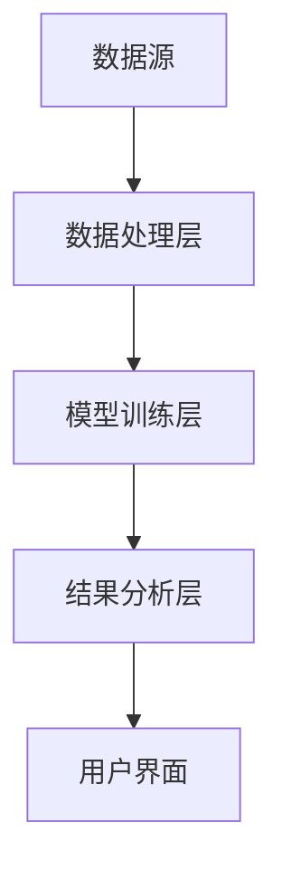

                 


# 构建智能化的资产证券化信用增级优化模型

## 关键词：资产证券化，信用增级，智能化，优化模型，风险管理

## 摘要：  
本文详细探讨了如何构建智能化的资产证券化信用增级优化模型。通过结合金融理论与人工智能技术，提出了一种基于机器学习的信用风险评估方法，优化传统信用增级手段的不足，提升了资产证券化产品的信用等级和市场认可度。文章从核心概念、算法原理、系统架构到项目实战，全面解析了模型的设计与实现过程，为金融从业者和数据科学家提供了理论与实践相结合的深度解析。

---

## 第一章: 资产证券化与信用增级概述

### 1.1 资产证券化的定义与特点  
资产证券化（Asset Securitization）是将缺乏流动性的资产转化为可流通证券的过程。其特点包括：  
- **资产池化**：将多个资产打包成一个资产池。  
- **风险隔离**：通过特殊目的载体（SPV）隔离原始债务人的信用风险。  
- **现金流重构**：通过资产池产生的现金流重新分配证券的本息偿还。  
- **标准化产品**：将非标准化资产转化为可交易的金融证券。  

### 1.2 信用增级的定义与作用  
信用增级（Credit Enhancement）是通过降低债券的违约风险，提高其信用评级的过程。其作用包括：  
- 提高资产证券化产品的信用等级，吸引更多的投资者。  
- 降低投资者的风险感知，扩大市场流动性。  
- 增强发行方的市场竞争力，降低融资成本。  

### 1.3 资产证券化信用增级的必要性  
资产证券化过程中，原始资产的信用风险可能较低，但通过信用增级可以进一步降低风险，提升产品吸引力。传统信用增级手段（如过桥贷、超额抵押）存在效率低、成本高等问题，难以满足复杂金融环境的需求。因此，智能化的信用增级优化模型成为必然选择。

---

## 第二章: 资产证券化信用增级优化模型的核心概念

### 2.1 资产池构建  
资产池是信用增级优化模型的基础。通过筛选优质资产、优化资产组合结构，可以降低整体风险。  
- **资产筛选**：根据历史数据、评级结果等指标筛选优质资产。  
- **资产组合优化**：通过量化方法（如马科维茨均值-方差模型）优化资产池结构。  

### 2.2 信用风险评估  
信用风险评估是模型的核心环节，通过机器学习算法对资产池的违约概率进行预测。  
- **特征选择**：提取资产的财务指标、市场数据等特征。  
- **模型训练**：使用逻辑回归、随机森林等算法训练信用风险模型。  

### 2.3 增级工具设计  
增级工具是信用增级的核心工具，包括：  
- **优先级划分**：将证券划分为优先级和次级，优先级证券享有更高的信用等级。  
- **信用支持凭证**：通过引入外部信用支持（如担保、保险）提升证券信用等级。  

### 2.4 模型优化方法  
- **参数优化**：通过网格搜索、随机搜索等方法优化模型参数。  
- **模型集成**：结合多种算法（如XGBoost、LightGBM）提升预测精度。  
- **动态调整**：根据市场变化动态调整资产池和增级工具，确保模型的实时性。  

---

## 第三章: 智能化信用增级优化模型的算法原理

### 3.1 算法选择与流程设计  
- **算法选择**：基于资产证券化的业务需求，选择适合的机器学习算法（如随机森林、梯度提升树）。  
- **流程设计**：包括数据预处理、特征选择、模型训练、结果评估等步骤。  

### 3.2 算法实现与优化  
- **数据预处理**：处理缺失值、异常值，进行特征标准化。  
- **特征选择**：使用特征重要性分析方法筛选关键特征。  
- **模型优化**：通过超参数调优提升模型性能。  

### 3.3 算法实现示例  
```python
import pandas as pd
from sklearn.ensemble import RandomForestClassifier
from sklearn.model_selection import GridSearchCV

# 数据预处理
data = pd.read_csv('assets.csv')
X = data.drop(columns=['label'])
y = data['label']

# 特征选择
feature_importance = data.columns[:-1]

# 模型训练与优化
param_grid = {
    'n_estimators': [100, 200],
    'max_depth': [None, 5, 10],
    'min_samples_split': [2, 5]
}
clf = GridSearchCV(RandomForestClassifier(), param_grid, cv=5)
clf.fit(X[feature_importance], y)

# 最优参数选择
best_clf = clf.best_estimator_
```

### 3.4 算法评估与结果分析  
- **评估指标**：使用准确率、召回率、F1分数等指标评估模型性能。  
- **结果分析**：分析模型预测结果，找出影响信用增级的关键因素。  

---

## 第四章: 智能化信用增级优化模型的系统架构

### 4.1 系统需求分析  
- **输入数据**：资产池数据、市场数据、信用评级数据。  
- **输出结果**：优化后的信用增级方案、风险评估报告。  

### 4.2 系统功能设计  
- **数据采集模块**：从多源数据中采集资产信息。  
- **模型训练模块**：基于机器学习算法训练信用风险模型。  
- **结果分析模块**：生成信用增级方案和风险报告。  

### 4.3 系统架构设计  


### 4.4 接口与交互设计  
- **API接口**：提供RESTful API，供外部系统调用。  
- **用户交互**：通过Web界面输入资产池数据，输出优化结果。  

---

## 第五章: 项目实战与案例分析

### 5.1 项目环境搭建  
- **安装依赖**：安装Python、Pandas、Scikit-learn等工具。  

### 5.2 核心代码实现  
```python
from sklearn.metrics import accuracy_score, precision_score, recall_score

def evaluate_model(y_true, y_pred):
    accuracy = accuracy_score(y_true, y_pred)
    precision = precision_score(y_true, y_pred)
    recall = recall_score(y_true, y_pred)
    return accuracy, precision, recall

# 模型预测与评估
y_pred = best_clf.predict(X[feature_importance])
accuracy, precision, recall = evaluate_model(y, y_pred)
print(f"Accuracy: {accuracy}, Precision: {precision}, Recall: {recall}")
```

### 5.3 实际案例分析  
- **案例背景**：某资产池的信用风险评估。  
- **模型优化**：通过机器学习算法优化信用增级方案。  
- **结果分析**：比较传统方法与智能化方法的信用增级效果。  

---

## 第六章: 最佳实践与未来展望

### 6.1 数据质量与模型调优  
- 数据质量是模型性能的关键，需注意数据清洗和特征工程。  
- 模型调优是优化信用增级效果的重要手段，需结合业务需求进行调整。  

### 6.2 模型监控与维护  
- 定期监控模型性能，及时更新数据和参数。  
- 根据市场变化动态调整模型，确保其适应性。  

### 6.3 未来展望  
- 结合区块链技术，提升资产证券化的透明度和安全性。  
- 推动AI技术在信用增级中的应用，实现更智能化的信用管理。  

---

## 作者：AI天才研究院/AI Genius Institute & 禅与计算机程序设计艺术 /Zen And The Art of Computer Programming

