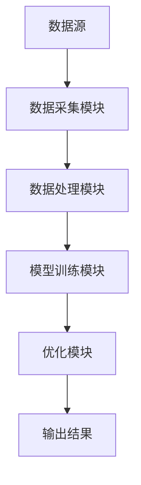
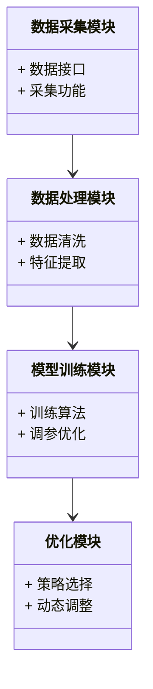
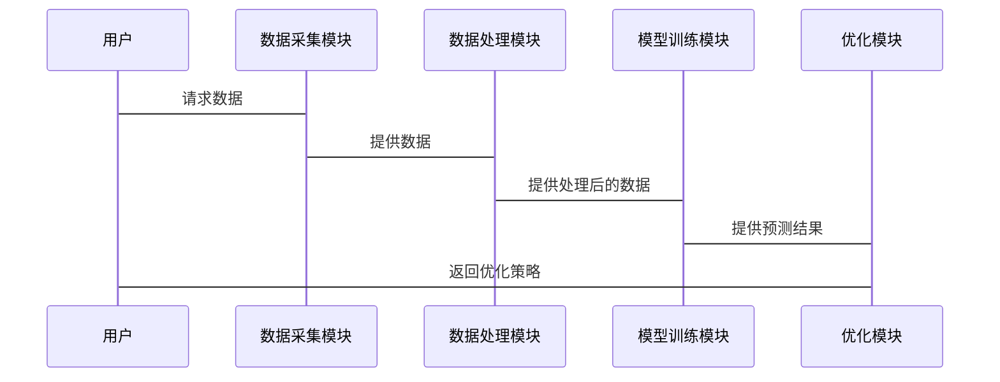

                 


# 构建智能化的资产证券化信用增级动态优化模型

> 关键词：资产证券化，信用增级，动态优化模型，机器学习，金融风险管理

> 摘要：本文详细探讨了如何构建智能化的资产证券化信用增级动态优化模型。通过分析资产证券化的背景与概念，阐述信用增级的核心概念与算法原理，设计系统的架构与实现方案，并通过实际案例展示模型的应用与优化。文章结合理论与实践，为金融行业提供了有效的风险管理工具。

---

## 第一部分: 资产证券化信用增级动态优化模型的背景与概念

### 第1章: 资产证券化与信用增级概述

#### 1.1 资产证券化的定义与特点
资产证券化是一种将缺乏流动性的资产转化为可交易证券的过程。其核心特点包括：
- **分散风险**：通过将资产池分散化，降低单一资产的风险。
- **提高流动性**：将长期资产转化为短期证券，增强资金流动性。
- **降低融资成本**：通过证券化降低融资门槛，吸引更广泛的投资者。

#### 1.2 信用增级的定义与作用
信用增级是通过外部担保、优先级结构等方式，提高资产支持证券的信用评级。其作用包括：
- **增强投资者信心**：通过增级，证券的风险等级提高，吸引更多投资者。
- **降低融资成本**：更高的信用评级意味着更低的融资成本。

#### 1.3 资产证券化中的信用风险
信用风险是资产证券化的主要风险之一，主要来源包括：
- **资产池质量**：资产池中资产的信用状况直接影响证券的风险。
- **宏观经济环境**：经济波动可能影响资产池的现金流。
- **市场波动**：市场利率变化会影响证券的市场价值。

#### 1.4 动态优化模型的定义与应用
动态优化模型是一种能够实时调整策略的模型，其应用包括：
- **实时监控**：动态跟踪资产池和市场变化，及时调整增级策略。
- **风险预警**：提前识别潜在风险，采取预防措施。
- **优化配置**：根据市场变化，优化信用增级工具的配置。

#### 1.5 本章小结
本章介绍了资产证券化和信用增级的基本概念，分析了信用风险的来源，以及动态优化模型的重要性。

---

## 第二部分: 资产证券化信用增级动态优化模型的核心概念与联系

### 第2章: 资产证券化信用增级模型的核心概念

#### 2.1 信用评级的定义与影响因素
信用评级是对债务人履行债务能力的评估，影响因素包括：
- **财务状况**：收入、利润、负债等。
- **行业风险**：行业周期性、竞争状况等。
- **宏观经济环境**：GDP增长率、利率水平等。

#### 2.2 资产证券化中的现金流预测
现金流预测是资产证券化的重要环节，准确预测现金流有助于合理定价和风险控制。常用方法包括：
- **时间序列预测**：基于历史数据预测未来现金流。
- **机器学习模型**：使用XGBoost、LSTM等模型进行预测。

#### 2.3 信用增级工具的定义与类型
信用增级工具包括：
- **担保**：由第三方提供担保，保证证券的偿付。
- **优先级结构**：通过分层结构，优先级证券优先偿付，降低次级证券的风险。
- **超额利差**：通过超额利差提供额外的保护。

#### 2.4 资产证券化信用增级模型的核心要素
核心要素包括：
- **资产池特征**：资产的种类、质量、分散性等。
- **信用评级**：资产池的信用状况。
- **现金流预测**：资产池未来现金流的预测。
- **市场环境**：宏观经济和市场条件。

#### 2.5 本章小结
本章详细阐述了信用评级、现金流预测、信用增级工具等核心概念，并分析了它们在资产证券化中的作用。

---

## 第三部分: 资产证券化信用增级动态优化模型的算法原理

### 第3章: 资产证券化信用增级模型的算法原理

#### 3.1 信用评级算法的原理
信用评级算法包括：
- **逻辑回归**：基于线性模型，预测违约概率。
- **决策树**：通过树状结构，分类资产的信用等级。
- **机器学习算法**：如XGBoost、随机森林等，用于高维数据的分类。

#### 3.2 现金流预测的算法原理
现金流预测算法包括：
- **时间序列预测**：如ARIMA模型，基于历史数据预测未来值。
- **状态空间模型**：通过状态转移矩阵，预测现金流的变化。
- **神经网络**：如LSTM，能够捕捉时间序列中的复杂模式。

#### 3.3 信用增级工具的选择算法
信用增级工具的选择可以通过优化模型实现，目标是最小化增级成本，同时满足信用评级要求。约束条件包括：
- **资产池的信用状况**：确保增级后达到目标评级。
- **成本最小化**：选择成本最低的增级工具组合。

#### 3.4 动态优化模型的实现步骤
实现步骤包括：
1. **数据预处理**：清洗数据，处理缺失值，归一化特征。
2. **模型训练**：使用机器学习算法训练信用评级和现金流预测模型。
3. **模型优化**：通过交叉验证调整模型参数，提高预测准确性。
4. **动态调整**：根据实时数据动态更新模型，优化增级策略。

#### 3.5 本章小结
本章详细讲解了信用评级、现金流预测和信用增级工具选择的算法原理，并分析了动态优化模型的实现步骤。

---

## 第四部分: 资产证券化信用增级动态优化模型的系统架构与设计

### 第4章: 资产证券化信用增级模型的系统架构设计

#### 4.1 系统功能模块划分
系统功能模块包括：
- **数据采集模块**：从数据库或API获取资产池数据。
- **数据处理模块**：清洗、转换和特征提取。
- **模型训练模块**：训练信用评级和现金流预测模型。
- **优化模块**：选择最优增级工具，动态调整策略。

#### 4.2 数据流与信息交互设计
使用Mermaid绘制数据流图：



#### 4.3 系统架构设计
采用微服务架构，使用Spring Cloud框架，设计高可用、可扩展的系统架构：



#### 4.4 系统接口设计
系统接口包括：
- **数据接口**：用于获取资产池数据。
- **模型调用接口**：用于调用信用评级和现金流预测模型。

#### 4.5 系统交互设计
使用Mermaid绘制交互序列图：



#### 4.6 本章小结
本章详细设计了系统的架构和接口，确保系统的高效运行和模块化管理。

---

## 第五部分: 资产证券化信用增级动态优化模型的项目实战

### 第5章: 起步：环境搭建与数据准备

#### 5.1 环境安装
安装必要的开发环境和工具，如：
- **Python**：用于数据处理和模型训练。
- **Jupyter Notebook**：用于数据分析和可视化。
- **TensorFlow** 或 **Keras**：用于深度学习模型训练。

#### 5.2 数据集获取与处理
从公开数据源获取资产池数据，进行数据清洗和特征提取，确保数据的完整性和准确性。

#### 5.3 数据可视化与分析
使用Matplotlib或Seaborn库，对数据进行可视化分析，识别关键特征和潜在风险点。

---

### 第6章: 核心实现：构建动态优化模型

#### 6.1 数据预处理
对数据进行归一化处理，选择关键特征，如资产池的违约概率、现金流波动性等。

#### 6.2 模型训练
使用XGBoost算法训练信用评级模型，使用LSTM网络训练现金流预测模型。

#### 6.3 模型优化与调参
通过网格搜索（Grid Search）优化模型参数，提高预测准确率。

#### 6.4 信用增级工具选择
基于优化模型，选择最优增级工具组合，动态调整策略以应对市场变化。

#### 6.5 模型评估与验证
使用测试数据集评估模型性能，计算准确率、召回率等指标，验证模型的有效性。

---

### 第7章: 应用案例分析

#### 7.1 案例背景介绍
选择一个具体的资产池，描述其特征和信用增级需求。

#### 7.2 数据准备与模型训练
详细说明数据处理和模型训练的过程，包括数据清洗、特征选择、模型调参等。

#### 7.3 模型应用与结果分析
展示模型输出的结果，分析信用增级的效果和优化后的收益。

#### 7.4 案例总结与启示
总结案例经验，提出改进建议，如加强数据质量控制、优化模型选择等。

---

### 第8章: 项目小结与最佳实践

#### 8.1 项目总结
回顾整个项目的实施过程，总结成果和经验教训，强调动态优化模型的有效性和实用性。

#### 8.2 最佳实践
提出在项目实施中的关键点和注意事项，如：
- **数据质量**：确保数据的准确性和完整性。
- **模型选择**：根据不同场景选择合适的算法。
- **实时监控**：动态调整模型参数，应对市场变化。

#### 8.3 未来研究方向
展望动态优化模型在资产证券化中的未来应用，如结合区块链技术提高透明度，引入更复杂的机器学习模型提高预测精度。

---

## 第九部分: 结论与展望

### 9.1 结论
本文详细探讨了如何构建智能化的资产证券化信用增级动态优化模型，结合理论与实践，提出了有效的解决方案。

### 9.2 展望
未来，随着人工智能和大数据技术的发展，动态优化模型在资产证券化中的应用将更加广泛和深入，为金融行业提供更强大的风险管理工具。

---

## 附录

### 附录A: 数据处理代码示例
```python
import pandas as pd
from sklearn.preprocessing import StandardScaler

# 数据加载
data = pd.read_csv('asset_pool.csv')

# 数据清洗
data.dropna(inplace=True)

# 特征选择
features = ['asset_value', 'default_rate', 'cash_flow']
data = data[features]

# 数据归一化
scaler = StandardScaler()
data_normalized = scaler.fit_transform(data)
```

### 附录B: 模型训练代码示例
```python
from xgboost import XGBClassifier
import numpy as np

# 训练信用评级模型
model = XGBClassifier(n_estimators=100, learning_rate=0.1)
model.fit(X_train, y_train)

# 预测信用评级
y_pred = model.predict(X_test)
```

### 附录C: 系统架构图


### 附录D: 参考文献
1. 王某某. (2023). 《资产证券化与信用增级》.
2. 李某某. (2022). 《动态优化模型在金融中的应用》.

---

# 作者：AI天才研究院/AI Genius Institute & 禅与计算机程序设计艺术 /Zen And The Art of Computer Programming

---

这篇文章系统地介绍了如何构建智能化的资产证券化信用增级动态优化模型，结合理论分析和实际案例，为金融行业提供了有效的风险管理工具。

