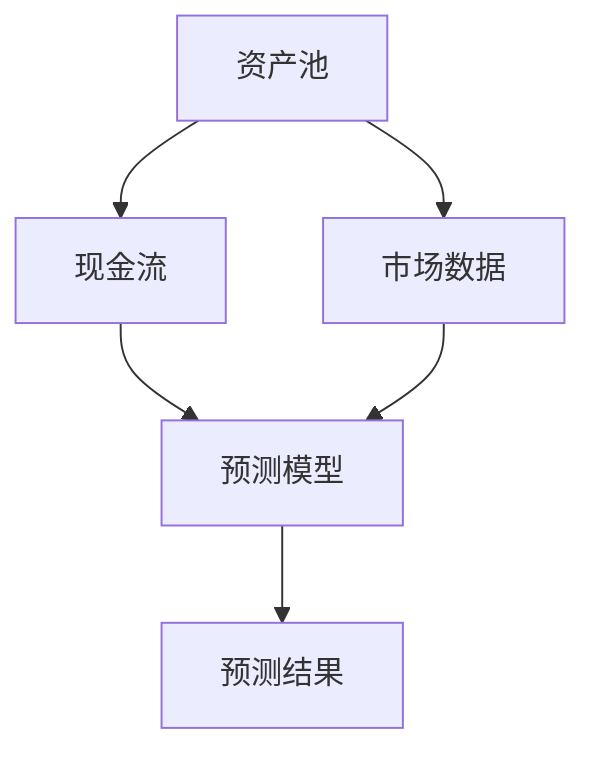
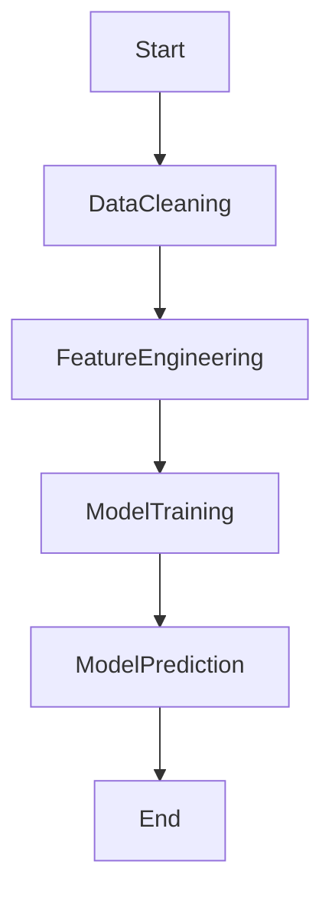
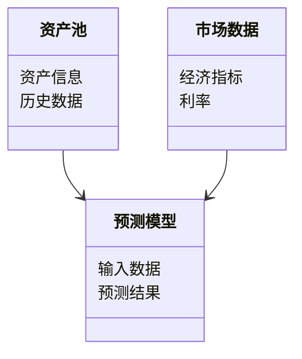
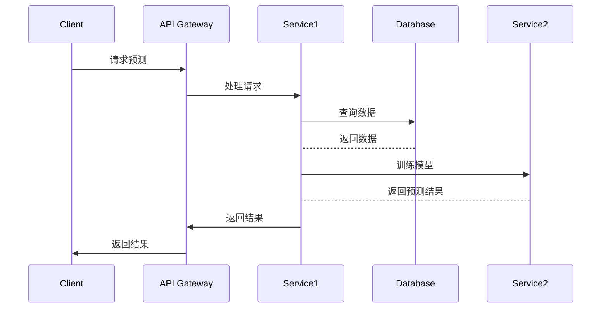

                 


# 构建智能化的资产证券化现金流预测模型

## 文章关键词
资产证券化、现金流预测、人工智能、机器学习、深度学习

## 摘要
本文旨在探讨如何利用人工智能技术构建智能化的资产证券化现金流预测模型。通过对资产证券化业务的深入分析，结合机器学习和深度学习算法，提出了一种高效的现金流预测方法。文章详细介绍了模型构建的各个步骤，包括数据收集与预处理、特征工程、模型选择与训练、模型评估与优化，以及系统的实现与部署。最后，通过实际案例展示了模型的应用效果，并提出了改进建议。

## 第1章 资产证券化与现金流预测概述

### 1.1 资产证券化的基本概念
#### 1.1.1 资产证券化的定义与特点
资产证券化是指将缺乏流动性的资产转化为可流通的证券的过程。其特点包括：资产独立性、信用增强、流动性高、风险分散等。

#### 1.1.2 资产证券化的基本流程
资产证券化的流程一般包括资产选择、信用评估、结构设计、发行证券等步骤。

#### 1.1.3 资产证券化中的现金流预测的重要性
现金流预测是资产证券化中的核心环节，直接影响证券的定价和投资者的决策。

### 1.2 现金流预测的核心问题
#### 1.2.1 现金流预测的定义与目标
现金流预测是对未来现金流的金额和时间分布的估计，目标是提高预测的准确性和可靠性。

#### 1.2.2 现金流预测的主要挑战
数据不足、模型复杂性高、市场波动大等是现金流预测的主要挑战。

#### 1.2.3 智能化预测的优势与应用场景
智能化预测通过机器学习和深度学习技术，能够捕捉数据中的复杂模式，提高预测精度，适用于多种资产证券化场景。

## 第2章 资产证券化现金流预测模型的核心概念与联系

### 2.1 核心概念原理
#### 2.1.1 数据特征与模型输入
模型输入包括资产池信息、市场数据、历史现金流等。

#### 2.1.2 模型输出与预测目标
模型输出包括预测的现金流金额、时间分布等。

#### 2.1.3 模型评估指标与优化目标
常用的评估指标包括MAE、RMSE、R²等。

### 2.2 核心概念属性对比
| 概念       | 描述                                                                 |
|------------|----------------------------------------------------------------------|
| 数据来源    | 资产池信息、市场数据、历史现金流等                                   |
| 模型类型    | 回归模型、时间序列模型、深度学习模型等                               |
| 预测目标    | 现金流金额、时间分布等                                             |
| 评估指标    | MAE、RMSE、R²等                                                       |

### 2.3 ER实体关系图


## 第3章 现金流预测模型的算法原理

### 3.1 算法选择与流程
#### 3.1.1 传统回归算法
- 线性回归模型：$$y = \beta_0 + \beta_1x + \epsilon$$
- 逻辑回归模型：$$P(y=1|x) = \frac{e^{\beta_0 + \beta_1x}}{1 + e^{\beta_0 + \beta_1x}}$$

#### 3.1.2 机器学习算法
- 随机森林：通过集成多个决策树进行预测。
- XGBoost：基于梯度提升的算法，能够处理复杂特征关系。

### 3.2 算法流程图


### 3.3 数学模型
#### 3.3.1 线性回归模型
$$y = \beta_0 + \beta_1x + \epsilon$$
其中，$\beta_0$和$\beta_1$是模型参数，$\epsilon$是误差项。

#### 3.3.2 随机森林模型
随机森林通过构建多个决策树，并将结果进行投票或平均，提高预测准确性。

## 第4章 系统分析与架构设计

### 4.1 问题场景介绍
资产证券化现金流预测系统的应用场景包括证券发行、投资决策、风险评估等。

### 4.2 系统功能设计
#### 4.2.1 领域模型类图


### 4.3 系统架构设计
```mermaid
graph TD
    Client --> API Gateway
    API Gateway --> Service1
    Service1 --> Database
    Service1 --> Service2
    Service2 --> Database
```

### 4.4 接口设计
系统接口包括数据输入接口、模型训练接口、结果查询接口等。

### 4.5 交互流程图


## 第5章 项目实战

### 5.1 环境安装
安装必要的Python库，如Pandas、Scikit-learn、XGBoost等。

### 5.2 核心实现代码
```python
import pandas as pd
from sklearn.ensemble import RandomForestRegressor
from xgboost import XGBRegressor
from sklearn.metrics import mean_absolute_error

# 数据加载
data = pd.read_csv('asset_data.csv')

# 特征工程
features = data[['asset_size', 'interest_rate', 'market_condition']]
labels = data['cash_flow']

# 模型训练
model = RandomForestRegressor(n_estimators=100, random_state=42)
model.fit(features, labels)

# 模型预测
predicted_flow = model.predict(features)
print('MAE:', mean_absolute_error(labels, predicted_flow))
```

### 5.3 案例分析
以某资产池为例，进行数据预处理、特征选择和模型调优，展示模型的预测效果。

## 第6章 最佳实践

### 6.1 经验与技巧
- 数据预处理是关键，需要处理缺失值、异常值等。
- 特征工程是提高模型性能的重要环节。
- 模型选择和调优需要根据具体场景进行。

### 6.2 小结
本文详细介绍了智能化资产证券化现金流预测模型的构建过程，从数据准备到模型部署，为实际应用提供了参考。

### 6.3 注意事项
- 数据隐私和安全问题需要注意。
- 模型的实时更新和维护是持续任务。
- 多模型融合可能进一步提高预测精度。

### 6.4 拓展阅读
建议读者进一步学习时间序列分析、深度学习模型（如LSTM）在现金流预测中的应用。

## 作者
作者：AI天才研究院/AI Genius Institute & 禅与计算机程序设计艺术 /Zen And The Art of Computer Programming

---

以上是《构建智能化的资产证券化现金流预测模型》的完整内容，涵盖从理论到实践的各个方面，帮助读者系统地理解和实现智能化的现金流预测模型。

