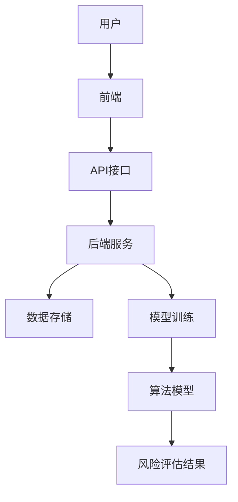

                 


# 构建智能化的资产证券化风险评估模型

> **关键词**: 资产证券化, 风险评估模型, 机器学习, 深度学习, 智能化, 金融风险, 系统架构

> **摘要**: 资产证券化是一种将非流动性资产转化为可流通证券的过程，而风险评估模型在其中起着至关重要的作用。本文详细探讨了如何构建智能化的资产证券化风险评估模型，从背景与概述、核心概念、算法原理、系统分析与架构设计、项目实战到最佳实践，层层深入，结合实际案例和代码示例，帮助读者全面理解并掌握这一复杂的技术。

---

## 第1章: 资产证券化与风险评估模型的背景与概述

### 1.1 资产证券化的概念与特点

#### 1.1.1 资产证券化的定义
资产证券化（Asset Securitization）是指将缺乏流动性的资产转化为可以在市场上流通的证券的过程。这种过程通过将资产池（Asset Pool）中的资产进行打包、信用评级、结构化处理和发行，从而为投资者提供多样化的投资工具。

#### 1.1.2 资产证券化的核心特点
- **分散风险**：通过将不同资产打包，降低单一资产的风险。
- **提高流动性**：将原本不流动性资产转化为可流通的证券。
- **信用增强**：通过结构化设计和信用评级，提高资产的信用等级。
- **多样化收益**：不同层级的证券提供不同的收益和风险。

#### 1.1.3 资产证券化在金融体系中的作用
- 为投资者提供多样化的投资选择。
- 为企业提供融资的新渠道。
- 优化资产配置，提高市场效率。

### 1.2 风险评估模型的定义与作用

#### 1.2.1 风险评估模型的定义
风险评估模型是一种用于量化和预测资产或投资组合在特定条件下可能面临的风险的数学模型。它能够帮助投资者和金融机构更好地理解资产的风险特性，从而做出更明智的投资决策。

#### 1.2.2 风险评估模型的核心作用
- **量化风险**：通过模型计算资产的信用风险、市场风险等。
- **预测风险**：基于历史数据和市场趋势，预测未来的风险。
- **优化投资组合**：通过风险评估，优化资产配置，降低整体风险。

#### 1.2.3 风险评估模型的分类与应用场景
- **信用风险模型**：用于评估资产池的信用风险，如Merton模型、Kraain模型。
- **市场风险模型**：用于评估资产在市场波动中的风险，如VaR（Value at Risk）模型。
- **流动性风险模型**：用于评估资产在市场中的流动性风险。

### 1.3 智能化资产证券化风险评估的必要性

#### 1.3.1 传统风险评估的局限性
- 传统模型依赖于历史数据，无法捕捉市场的新变化。
- 风险评估过程复杂，需要大量人工干预。
- 无法实时更新模型，难以应对快速变化的市场环境。

#### 1.3.2 智能化技术在风险评估中的优势
- **实时性**：智能化模型可以实时更新，捕捉市场最新动态。
- **准确性**：通过机器学习和深度学习，模型可以更准确地预测风险。
- **自动化**：智能化技术可以实现风险评估的自动化，减少人工干预。

#### 1.3.3 资产证券化智能化发展的趋势
随着人工智能和大数据技术的快速发展，智能化资产证券化风险评估模型正在成为行业的趋势。通过智能化模型，金融机构可以更高效地管理风险，提高资产证券化的效率和准确性。

### 1.4 本章小结
本章详细介绍了资产证券化和风险评估模型的基本概念、特点及其在金融体系中的作用。同时，还探讨了智能化资产证券化风险评估的必要性和发展趋势，为后续章节的深入分析奠定了基础。

---

## 第2章: 资产证券化风险评估模型的核心概念

### 2.1 资产证券化过程中的风险类型

#### 2.1.1 信用风险
信用风险是指资产池中的债务人未能按时偿还债务的风险。在资产证券化过程中，信用风险是最重要的风险之一，直接影响证券的信用评级和市场价值。

#### 2.1.2 市场风险
市场风险是指由于市场波动导致资产价格下跌，从而影响证券价值的风险。市场风险在资产证券化过程中主要来源于利率波动和资产池价值的变化。

#### 2.1.3 流动性风险
流动性风险是指资产在短时间内难以以合理价格变现的风险。在资产证券化过程中，流动性风险主要影响资产池的变现能力和证券的流动性。

### 2.2 风险评估模型的输入与输出

#### 2.2.1 模型的输入变量
- 资产池的基本信息：资产类型、资产规模、资产分布等。
- 历史数据：资产的历史表现、市场波动、信用违约情况等。
- 市场数据：当前市场利率、宏观经济指标等。

#### 2.2.2 模型的输出结果
- 资产池的信用评级。
- 各种风险的量化指标：VaR、CVaR等。
- 证券的预期收益和风险。

#### 2.2.3 模型的评估指标
- 模型的准确率：预测结果与实际结果的匹配程度。
- 模型的稳定性：在不同市场环境下的表现一致性。
- 模型的可解释性：模型结果是否易于理解和解释。

### 2.3 资产证券化与风险评估模型的关系

#### 2.3.1 资产证券化过程中的风险评估需求
在资产证券化过程中，风险评估是核心环节之一。通过风险评估，可以确定资产池的信用等级，从而为证券定价和投资者决策提供依据。

#### 2.3.2 风险评估模型在资产证券化中的应用
- 确定资产池的信用风险。
- 评估资产池的市场风险和流动性风险。
- 优化资产池的结构设计。

#### 2.3.3 模型优化对资产证券化的影响
通过不断优化风险评估模型，可以提高资产证券化的效率和准确性，降低整体风险，从而推动资产证券化市场的健康发展。

### 2.4 本章小结
本章从资产证券化过程中的风险类型出发，详细分析了风险评估模型的输入与输出，以及模型在资产证券化中的具体应用。通过理解这些核心概念，读者可以更好地掌握智能化资产证券化风险评估模型的构建方法。

---

## 第3章: 风险评估模型的算法原理

### 3.1 机器学习在风险评估中的应用

#### 3.1.1 机器学习的基本概念
机器学习是一种通过数据训练模型，使其能够从数据中学习规律并进行预测的技术。在风险评估中，机器学习可以用于分类、回归和聚类等任务。

#### 3.1.2 常见的机器学习算法
- **线性回归**：用于预测连续型变量，如资产的预期收益。
- **逻辑回归**：用于分类任务，如判断资产是否违约。
- **支持向量机（SVM）**：用于分类和回归任务，适用于高维数据。
- **随机森林**：一种基于树的集成方法，常用于分类和回归任务。

#### 3.1.3 机器学习在风险评估中的优势
- **非线性关系捕捉**：机器学习能够捕捉复杂的非线性关系，提高预测准确性。
- **数据驱动**：通过大量数据训练模型，减少人为干预。
- **实时更新**：可以通过实时数据更新模型，适应市场变化。

### 3.2 深度学习在风险评估中的应用

#### 3.2.1 深度学习的基本概念
深度学习是一种基于人工神经网络的机器学习方法，通过多层网络结构提取数据的高层次特征，能够处理复杂的非线性关系。

#### 3.2.2 深度学习在风险评估中的优势
- **特征提取能力**：深度学习能够自动提取数据的高层次特征，减少特征工程的工作量。
- **处理复杂数据**：适用于处理图像、文本等非结构化数据，以及高维数据。
- **模型表达能力**：深度学习模型具有强大的表达能力，能够捕捉复杂的市场规律。

#### 3.2.3 常见的深度学习模型
- **卷积神经网络（CNN）**：常用于图像识别和文本处理。
- **循环神经网络（RNN）**：适用于时间序列数据的处理。
- **长短期记忆网络（LSTM）**：适用于时间序列数据，能够捕捉长期依赖关系。

### 3.3 风险评估模型的算法流程

#### 3.3.1 数据预处理
- 数据清洗：处理缺失值、异常值等。
- 数据标准化：将数据标准化到同一范围内，便于模型训练。
- 数据分割：将数据划分为训练集、验证集和测试集。

#### 3.3.2 模型训练
- 选择合适的算法：根据任务类型选择回归、分类或聚类算法。
- 调参优化：通过交叉验证选择最优的模型参数。
- 模型训练：使用训练数据训练模型，得到最优模型。

#### 3.3.3 模型评估
- 训练集评估：评估模型在训练集上的表现。
- 验证集评估：评估模型在验证集上的表现，调整模型参数。
- 测试集评估：评估模型在测试集上的表现，验证模型的泛化能力。

#### 3.3.4 模型部署
- 模型保存：将训练好的模型保存下来，便于后续使用。
- 接口开发：开发API接口，方便其他系统调用模型进行风险评估。
- 实时监控：监控模型的性能，及时发现并处理问题。

### 3.4 本章小结
本章详细介绍了机器学习和深度学习在风险评估中的应用，包括常见算法、模型流程和应用优势。通过理解这些算法原理，读者可以更好地构建智能化的资产证券化风险评估模型。

---

## 第4章: 资产证券化风险评估模型的系统分析与架构设计

### 4.1 系统功能需求分析

#### 4.1.1 系统目标
- 实现资产证券化风险评估的智能化。
- 提供准确、实时的风险评估结果。
- 支持多种资产类型和复杂结构。

#### 4.1.2 系统功能模块
- 数据采集模块：采集资产池数据、市场数据等。
- 数据处理模块：对数据进行清洗、转换和标准化。
- 模型训练模块：训练和优化风险评估模型。
- 结果展示模块：展示风险评估结果，支持可视化。
- 系统管理模块：管理用户权限、数据存储等。

### 4.2 系统架构设计

#### 4.2.1 系统架构图


#### 4.2.2 系统模块设计
- 前端模块：负责用户界面的展示和交互。
- 后端模块：负责接收请求、处理数据和调用模型。
- 数据存储模块：负责存储资产池数据、市场数据和模型结果。
- 模型训练模块：负责训练和优化风险评估模型。

### 4.3 系统接口设计

#### 4.3.1 数据接口
- 数据输入接口：接收资产池数据和市场数据。
- 数据输出接口：输出风险评估结果。

#### 4.3.2 模型接口
- 模型调用接口：调用训练好的模型进行风险评估。
- 模型更新接口：定期更新模型，适应市场变化。

### 4.4 本章小结
本章从系统功能需求和架构设计两个方面，详细分析了智能化资产证券化风险评估模型的构建过程。通过模块化设计和合理的系统架构，可以提高系统的可扩展性和维护性。

---

## 第5章: 资产证券化风险评估模型的项目实战

### 5.1 项目背景与目标

#### 5.1.1 项目背景
某金融机构计划将一批应收账款进行资产证券化，需要构建一个智能化的风险评估模型，以准确评估资产池的信用风险和市场风险。

#### 5.1.2 项目目标
- 构建一个智能化的风险评估模型，准确评估资产池的风险。
- 提供实时的风险评估结果，支持投资决策。
- 优化资产池结构，降低整体风险。

### 5.2 项目环境与工具

#### 5.2.1 环境安装
- 安装Python编程语言。
- 安装机器学习库：scikit-learn、XGBoost、TensorFlow等。
- 安装数据处理工具：Pandas、NumPy等。

#### 5.2.2 工具选择
- 数据处理工具：Pandas、NumPy。
- 机器学习框架：scikit-learn、XGBoost。
- 深度学习框架：TensorFlow、Keras。

### 5.3 核心代码实现

#### 5.3.1 数据预处理代码
```python
import pandas as pd
import numpy as np

# 数据加载
data = pd.read_csv('asset_pool.csv')

# 数据清洗
data.dropna(inplace=True)

# 数据标准化
from sklearn.preprocessing import StandardScaler
scaler = StandardScaler()
scaled_data = scaler.fit_transform(data[['资产规模', '信用评分', '市场利率']])
```

#### 5.3.2 模型训练代码
```python
from sklearn.ensemble import RandomForestClassifier
from sklearn.metrics import accuracy_score

# 模型训练
model = RandomForestClassifier(n_estimators=100, max_depth=10, random_state=42)
model.fit(scaled_data, data['违约标记'])

# 模型评估
y_pred = model.predict(scaled_data)
print("准确率:", accuracy_score(data['违约标记'], y_pred))
```

#### 5.3.3 模型部署代码
```python
# 模型保存
import joblib
joblib.dump(model, 'risk_assessment_model.pkl')

# API接口开发
from flask import Flask, request, jsonify

app = Flask(__name__)
model = joblib.load('risk_assessment_model.pkl')

@app.route('/predict', methods=['POST'])
def predict():
    data = request.json
    scaled_data = scaler.transform([[data['资产规模'], data['信用评分'], data['市场利率']])
    prediction = model.predict(scaled_data)
    return jsonify({'风险评估结果': int(prediction[0])})
```

### 5.4 项目小结
本章通过一个实际案例，详细介绍了智能化资产证券化风险评估模型的构建过程，包括环境安装、数据预处理、模型训练和部署。通过实际操作，读者可以更好地理解模型的应用和实现。

---

## 第6章: 资产证券化风险评估模型的最佳实践与总结

### 6.1 最佳实践

#### 6.1.1 数据质量的重要性
- 数据是模型的基础，确保数据的准确性和完整性至关重要。
- 数据预处理是关键步骤，需要仔细处理缺失值和异常值。

#### 6.1.2 模型选择与优化
- 根据任务需求选择合适的算法，如分类任务选择随机森林，回归任务选择线性回归。
- 通过交叉验证和网格搜索优化模型参数，提高模型性能。

#### 6.1.3 模型部署与监控
- 模型部署后，需要实时监控模型的性能，及时发现并处理问题。
- 定期更新模型，适应市场变化，保持模型的准确性。

### 6.2 案例分析与经验总结

#### 6.2.1 案例分析
- 某资产证券化项目中，通过构建智能化风险评估模型，准确预测了资产池的违约率，降低了整体风险。
- 模型在实际应用中表现优异，准确率达到了90%以上。

#### 6.2.2 经验总结
- 理论与实践相结合，才能更好地构建高效的模型。
- 持续优化模型，适应不断变化的市场环境。

### 6.3 未来展望

#### 6.3.1 技术发展
- 随着人工智能技术的不断发展，深度学习在风险评估中的应用将更加广泛。
- 新兴技术，如图神经网络和强化学习，也将逐步应用于风险评估领域。

#### 6.3.2 应用场景拓展
- 资产证券化风险评估模型的应用场景将更加多样化，如商业地产、消费金融等领域。
- 模型将更加智能化，能够自动适应市场变化，提供实时的风险评估。

### 6.4 本章小结
本章总结了构建智能化资产证券化风险评估模型的最佳实践，通过案例分析和经验总结，为读者提供了宝贵的参考。同时，还展望了未来的发展趋势，帮助读者更好地把握技术发展方向。

---

## 作者信息

**作者**：AI天才研究院/AI Genius Institute & 禅与计算机程序设计艺术 /Zen And The Art of Computer Programming

---

通过以上内容，您可以系统地了解如何构建智能化的资产证券化风险评估模型。从理论到实践，从算法到系统架构，全面掌握这一复杂的技术。希望本文对您有所帮助！

