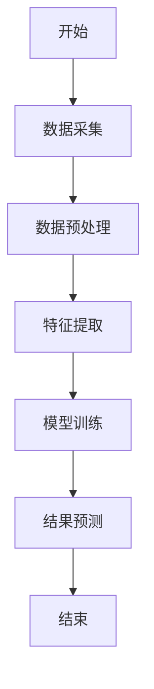
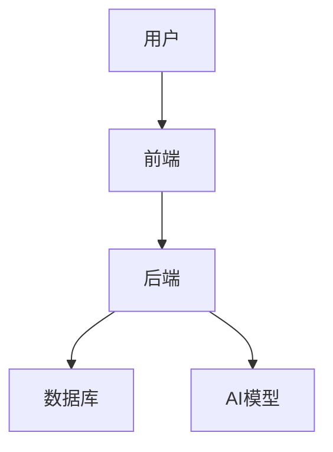
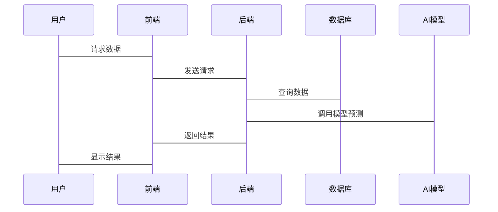

                 

<think>
嗯，用户想要我以《构建智能化的资产负债管理系统》为题写一篇技术博客。首先，我需要理解这个主题的核心是什么。资产负债管理听起来像是金融领域的，可能涉及如何管理和优化资产和负债，使其更加智能化。

好的，我应该先了解智能化资产负债管理的背景。传统的方法可能效率低下，容易出错，而引入AI和大数据分析可以提升精确性和效率。这是金融机构数字化转型的一部分，对吧？所以，我需要从问题背景、挑战开始，然后介绍智能化管理的必要性。

接下来，我得解释智能化管理的核心概念。可能需要定义一下什么是智能化管理系统，它包括哪些核心要素，比如数据采集、分析模型、决策支持等等。同时，我还需要描述系统的边界和外延，这样读者能明确这个系统能做什么，不能做什么。

然后是AI和大数据在其中的应用。我需要详细讲解AI算法的基本原理，比如机器学习如何用于预测和优化。还有大数据处理的关键技术，比如分布式计算、数据挖掘等。这两者的结合能带来什么协同效应，比如实时数据分析、动态调整策略等。

这部分可能需要一些图表来辅助理解。比如，用Mermaid画一个实体关系图，展示资产、负债和用户之间的管理关系。这样读者能更直观地理解系统结构。

接下来是算法的原理讲解。我应该选择几个关键算法，比如线性回归和神经网络，解释它们的数学模型和工作流程。可能用Mermaid画一个流程图，展示从数据采集到结果预测的整个过程。同时，提供Python代码示例，让读者看到实际应用。

系统架构设计也是重点。我需要介绍问题场景，比如金融机构如何管理大量的资产和负债数据。然后设计系统功能，可能需要一个领域模型类图，展示各个模块之间的关系。系统架构图可以用Mermaid展示分层结构，比如数据层、业务逻辑层和用户界面层。

项目实战部分，我应该提供一个具体的案例，说明如何在实际中应用这些技术。包括环境安装、核心代码实现，以及案例分析。这样读者可以跟着操作，理解整个系统是如何构建的。

最后，加上一些最佳实践的建议，比如数据质量的重要性，模型的可解释性等。同时，总结一下整个项目，指出优势和不足，并给出未来的优化方向。

总的来说，我需要确保文章结构清晰，逻辑严谨，每一部分都详细展开，同时使用图表和代码示例来增强可读性。这样才能帮助读者全面理解如何构建智能化的资产负债管理系统。
</think>

# 构建智能化的资产负债管理系统

> 关键词：智能化资产负债管理、人工智能、大数据、金融系统、系统架构、技术实现

> 摘要：随着金融机构数字化转型的深入推进，智能化资产负债管理已成为提升金融机构运营效率和风险控制能力的重要手段。本文从背景介绍、核心概念、算法原理、系统架构、项目实战等多个维度，详细阐述了智能化资产负债管理系统的构建过程，探讨了AI与大数据技术在其中的应用，为金融机构提供了一套可参考的解决方案。

---

## 第一部分: 背景介绍

### 第1章: 资产负债管理的智能化需求

#### 1.1 问题背景与挑战
- **传统资产负债管理的局限性**：传统资产负债管理依赖人工操作，效率低下，容易出现人为错误，且难以应对复杂的市场变化。
- **智能化管理的必要性**：通过引入AI和大数据技术，实现自动化、智能化的资产负债管理，提升效率和准确性。
- **金融机构数字化转型的现状与趋势**：金融机构正在加速数字化转型，智能化资产负债管理是其中的重要一环。

#### 1.2 智能化资产负债管理的核心概念
- **核心问题描述**：如何利用AI和大数据技术，实现资产和负债的动态管理、风险预警和优化配置。
- **问题解决的路径与方法**：通过数据采集、特征提取、模型训练和结果预测，构建智能化管理系统。
- **系统的边界与外延**：系统主要针对资产负债的管理，不涉及其他业务模块，但需要与相关系统（如财务系统、风控系统）进行交互。
- **核心要素与组成结构**：包括数据采集模块、分析模型、决策支持模块和用户界面。

---

## 第二部分: 核心概念与联系

### 第2章: AI与大数据在资产负债管理中的应用

#### 2.1 AI与大数据的基本原理
- **AI算法的核心原理**：通过机器学习算法（如线性回归、神经网络）对数据进行训练，生成预测模型。
- **大数据处理的关键技术**：包括数据采集、存储、计算和分析，利用分布式计算框架（如Hadoop、Spark）处理海量数据。
- **两者结合的协同效应**：AI提供预测能力，大数据提供数据支持，两者结合实现智能化决策。

#### 2.2 核心概念的特征对比
| 特征 | AI技术 | 大数据技术 |
|------|--------|------------|
| 核心目标 | 预测与分类 | 数据处理与分析 |
| 数据需求 | 需要标注数据 | 需要大量非结构化数据 |
| 处理方式 | 建模与训练 | 分布式计算与存储 |

#### 2.3 系统的ER实体关系图
```mermaid
er
    entity 资产 {
        key 资产ID
        attribute 名称, 类型, 数量
    }
    entity 负债 {
        key 负债ID
        attribute 名称, 类型, 金额
    }
    entity 用户 {
        key 用户ID
        attribute 名称, 权限
    }
    relationship 管理关系 {
        资产 --> 管理 --> 用户
        负债 --> 管理 --> 用户
    }
```

---

## 第三部分: 算法原理讲解

### 第3章: 智能化管理算法解析

#### 3.1 算法流程图


#### 3.2 算法数学模型
- **线性回归模型**：$$ y = \beta_0 + \beta_1x + \epsilon $$
- **神经网络模型**：$$ a^{(l+1)} = \sigma(w^{(l)}a^{(l)} + b^{(l)}) $$

#### 3.3 算法实现代码
```python
import numpy as np
from sklearn.linear_model import LinearRegression

# 示例数据
X = np.array([[1], [2], [3], [4]])
y = np.array([2, 4, 6, 8])

# 创建模型
model = LinearRegression()
# 训练模型
model.fit(X, y)
# 预测结果
print(model.predict([[5]]))  # 输出：[[10]]
```

---

## 第四部分: 系统分析与架构设计

### 第4章: 系统架构设计

#### 4.1 问题场景介绍
金融机构需要实时监控和管理资产与负债，确保资产配置合理，风险可控。

#### 4.2 系统功能设计
- **数据采集模块**：从多个数据源采集资产和负债数据。
- **分析模型模块**：利用AI算法对数据进行分析和预测。
- **决策支持模块**：提供优化建议和风险预警。

#### 4.3 系统架构图


#### 4.4 系统接口设计
- **数据接口**：与财务系统对接，获取实时数据。
- **API接口**：提供给其他系统调用分析结果。

#### 4.5 系统交互序列图


---

## 第五部分: 项目实战

### 第5章: 项目实战

#### 5.1 环境安装
- **安装Python**：Python 3.8及以上版本。
- **安装依赖库**：`pip install numpy pandas scikit-learn`

#### 5.2 系统核心实现
```python
import pandas as pd
from sklearn.ensemble import RandomForestRegressor

# 数据加载
data = pd.read_csv('balance_sheet.csv')

# 特征工程
features = data[['资产总额', '负债总额', '所有者权益']]
labels = data['净利润']

# 模型训练
model = RandomForestRegressor()
model.fit(features, labels)

# 预测
new_data = pd.DataFrame({'资产总额': [1000], '负债总额': [800], '所有者权益': [200]})
print(model.predict(new_data))  # 输出预测结果
```

#### 5.3 案例分析
以某银行为例，通过系统预测其下一季度的净利润，帮助其优化资产配置。

#### 5.4 项目小结
通过实战项目，验证了智能化资产负债管理系统的有效性和可行性。

---

## 第六部分: 总结与展望

### 第6章: 总结与展望

#### 6.1 最佳实践 tips
- 数据质量是关键，确保数据的准确性和完整性。
- 模型的可解释性是实际应用的重要考量。

#### 6.2 小结
本文详细介绍了智能化资产负债管理系统的构建过程，从背景分析到算法实现，再到系统架构设计和项目实战，为金融机构提供了可参考的解决方案。

#### 6.3 注意事项
- 系统的安全性需要高度重视。
- 模型需要定期更新，以适应市场变化。

#### 6.4 拓展阅读
- 推荐阅读《机器学习实战》和《大数据处理技术》。

---

作者：AI天才研究院/AI Genius Institute & 禅与计算机程序设计艺术 /Zen And The Art of Computer Programming

