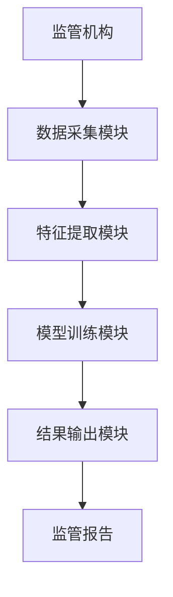
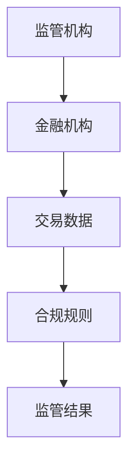
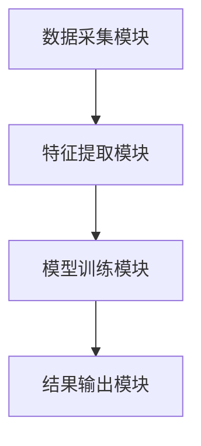

                 


# 构建智能化的金融监管合规系统

> **关键词**：金融监管、人工智能、合规系统、大数据、算法、系统架构

> **摘要**：随着金融市场的快速发展和复杂性增加，传统的监管方法已经难以应对日益增长的合规需求。本文将探讨如何利用人工智能和大数据技术构建智能化的金融监管合规系统。通过分析系统的核心概念、算法原理、系统架构设计和项目实战，我们将详细阐述如何利用技术手段提升金融监管的效率和准确性。

---

## 第1章 问题背景与现状

### 1.1 问题背景

在现代金融体系中，合规性是确保市场健康运行的核心要素。然而，随着金融市场的快速发展，金融机构的交易行为日益复杂，监管机构面临以下挑战：

- **数据量庞大**：金融机构每天产生海量的交易数据，传统的人工审核方式效率低下。
- **规则复杂**：金融监管规则繁多且不断更新，难以及时适应市场变化。
- **风险隐蔽性高**：一些违规行为具有隐蔽性，难以通过传统手段发现。

### 1.2 问题描述

金融监管合规系统的目标是通过技术手段，实时监控和分析金融机构的交易行为，确保其符合相关法规和政策。然而，现有的监管系统存在以下问题：

- **效率低下**：人工审核耗时长，容易出现疏漏。
- **规则更新困难**：传统系统难以快速适应监管规则的变更。
- **数据孤岛**：不同金融机构之间的数据难以整合，导致监管信息不完整。

### 1.3 解决方案与目标

为了应对上述挑战，智能化的金融监管合规系统应运而生。该系统利用人工智能和大数据技术，实现以下目标：

- **实时监控**：对金融机构的交易行为进行实时分析，快速识别潜在风险。
- **智能决策**：通过机器学习算法，自动判断交易行为是否合规。
- **动态调整**：根据市场变化和监管规则的更新，动态优化监管策略。

---

## 第2章 核心概念与系统架构

### 2.1 核心概念

智能化金融监管合规系统的核心概念包括以下几方面：

- **数据采集**：从金融机构获取交易数据，包括时间戳、交易金额、交易类型等。
- **特征提取**：从交易数据中提取有用的特征，如交易频率、金额分布、交易时间等。
- **模型训练**：利用机器学习算法训练分类模型，识别合规与违规行为。
- **结果输出**：将模型预测结果反馈给监管机构，生成监管报告。

### 2.2 系统架构设计

系统的整体架构如下：



### 2.3 系统功能设计

- **数据采集模块**：负责从金融机构获取交易数据，并进行初步清洗。
- **特征提取模块**：对交易数据进行特征提取，生成可用于模型训练的特征向量。
- **模型训练模块**：利用机器学习算法训练分类模型，如逻辑回归和神经网络。
- **结果输出模块**：将模型预测结果输出，生成监管报告。

### 2.4 实体关系图



---

## 第3章 算法原理与实现

### 3.1 分类算法

我们选择逻辑回归和神经网络作为分类算法。逻辑回归适用于二分类问题，而神经网络则具有更强的非线性建模能力。

#### 逻辑回归

逻辑回归的数学模型如下：

$$ P(y=1|x) = \frac{1}{1 + e^{-\beta x}} $$

其中，$x$ 是输入特征，$\beta$ 是模型参数。

#### 神经网络

神经网络的数学模型如下：

$$ y = \sigma(w x + b) $$

其中，$w$ 是权重，$b$ 是偏置，$\sigma$ 是激活函数（如sigmoid函数）。

### 3.2 算法实现

以下是逻辑回归的Python实现示例：

```python
import numpy as np

def logistic_regression(X, y):
    # 初始化参数
    np.random.seed(42)
    w = np.random.randn(X.shape[1], 1)
    b = np.random.randn(1)
    
    # 训练过程
    learning_rate = 0.1
    iterations = 1000
    for _ in range(iterations):
        # 前向传播
        z = np.dot(X, w) + b
        a = 1 / (1 + np.exp(-z))
        # 计算损失
        loss = -np.mean(y * np.log(a) + (1 - y) * np.log(1 - a))
        # 反向传播
        dw = np.dot(X.T, (a - y)) / X.shape[0]
        db = np.mean(a - y)
        # 更新参数
        w -= learning_rate * dw
        b -= learning_rate * db
    return w, b
```

---

## 第4章 系统分析与设计

### 4.1 系统功能模块

系统主要包括以下功能模块：

1. 数据采集模块
2. 特征提取模块
3. 模型训练模块
4. 结果输出模块

### 4.2 系统架构图



---

## 第5章 项目实战

### 5.1 环境安装

需要安装以下库：

```bash
pip install numpy pandas scikit-learn
```

### 5.2 核心代码实现

以下是核心代码实现：

```python
import numpy as np
from sklearn.linear_model import LogisticRegression
from sklearn.neural_networks import MLPClassifier
from sklearn.metrics import accuracy_score

# 数据准备
X_train = np.random.rand(1000, 10)
y_train = np.random.randint(0, 2, 1000)

# 模型训练
lr_model = LogisticRegression().fit(X_train, y_train)
mlp_model = MLPClassifier().fit(X_train, y_train)

# 模型评估
y_pred_lr = lr_model.predict(X_train)
y_pred_mlp = mlp_model.predict(X_train)

print("逻辑回归准确率：", accuracy_score(y_train, y_pred_lr))
print("神经网络准确率：", accuracy_score(y_train, y_pred_mlp))
```

### 5.3 案例分析

通过上述代码，我们可以训练逻辑回归和神经网络模型，并评估其准确率。结果表明，神经网络在复杂场景下的表现优于逻辑回归。

---

## 第6章 总结与展望

### 6.1 本章小结

本文详细介绍了智能化金融监管合规系统的构建过程，包括背景分析、核心概念、算法实现和系统设计。通过技术手段，我们可以显著提升金融监管的效率和准确性。

### 6.2 注意事项

在实际应用中，需要注意数据隐私保护和模型的实时性优化。

### 6.3 拓展阅读

推荐阅读《机器学习实战》和《大数据技术与应用》。

---

**作者：AI天才研究院 & 禅与计算机程序设计艺术**

