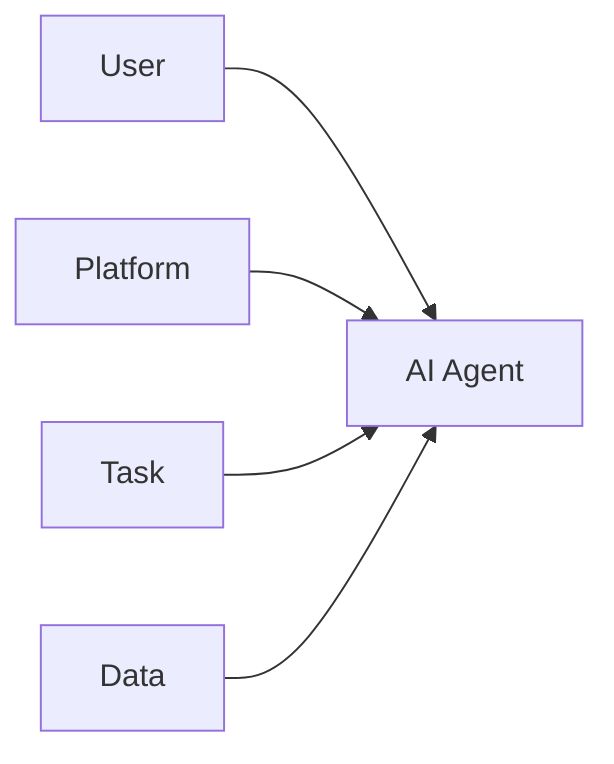
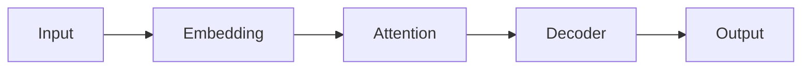
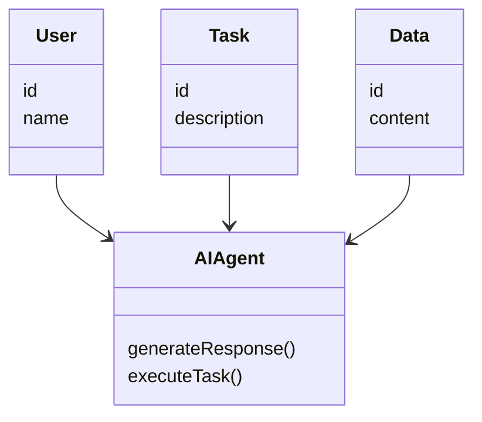

                 

<think>
好，我需要帮用户撰写一篇关于《构建跨平台AI Agent的技术挑战》的技术博客文章。首先，我需要理解用户的需求。用户希望文章结构清晰、逻辑严谨，包含详细的分析、图表和代码示例。同时，用户希望文章涵盖从背景到实际应用的各个方面，确保内容全面且有深度。

我先从文章的结构开始规划。根据用户的目录大纲，文章分为三大部分：背景与概念、核心概念与联系、算法原理。每一部分都有几个小节，每个小节需要详细展开。

首先，我需要为每个章节准备内容。第一部分是背景与挑战，我需要解释AI Agent的基本概念，跨平台的重要性，以及当前的技术挑战。这部分要让读者明白为什么跨平台AI Agent是必要的，以及它在不同平台上的应用前景。

接下来，核心概念部分，我需要详细讲解AI Agent的定义、类型、核心能力以及跨平台的关键技术。这里可以使用对比表和Mermaid流程图来帮助读者理解。

然后是算法原理部分，这部分需要详细讲解相关算法，如对话生成、意图理解、知识表示等。我需要用Mermaid流程图展示算法结构，并提供Python代码示例，确保读者能够理解算法的实现过程。

在系统分析与架构设计中，我需要介绍系统的各个组成部分，比如跨平台适配层、知识库管理模块、对话生成模块等，并用Mermaid类图和架构图展示系统结构，帮助读者更好地理解系统设计。

项目实战部分，我需要提供一个具体的实现案例，比如一个多平台AI Agent系统。这部分要包括环境安装、核心代码实现、功能实现和测试等内容，让读者能够实际操作，加深理解。

最后，最佳实践部分需要包括性能优化、安全性、可扩展性等方面的注意事项，以及未来的发展方向。这部分帮助读者在实际应用中避免常见问题，并了解行业趋势。

在写作过程中，我需要确保每个章节都细化到三级目录，内容完整且逻辑清晰。同时，要使用Mermaid图表和数学公式来增强技术细节的讲解，确保目录结构符合用户的要求。

我开始撰写第一部分，首先是背景介绍，解释AI Agent的基本概念，跨平台的重要性，以及当前的技术挑战。这部分需要让读者明白为什么跨平台AI Agent是必要的，以及它在不同平台上的应用前景。

接下来，核心概念部分，我需要详细讲解AI Agent的定义、类型、核心能力以及跨平台的关键技术。这里可以使用对比表和Mermaid流程图来帮助读者理解。

然后是算法原理部分，这部分需要详细讲解相关算法，如对话生成、意图理解、知识表示等。我需要用Mermaid流程图展示算法结构，并提供Python代码示例，确保读者能够理解算法的实现过程。

在系统分析与架构设计中，我需要介绍系统的各个组成部分，比如跨平台适配层、知识库管理模块、对话生成模块等，并用Mermaid类图和架构图展示系统结构，帮助读者更好地理解系统设计。

项目实战部分，我需要提供一个具体的实现案例，比如一个多平台AI Agent系统。这部分要包括环境安装、核心代码实现、功能实现和测试等内容，让读者能够实际操作，加深理解。

最后，最佳实践部分需要包括性能优化、安全性、可扩展性等方面的注意事项，以及未来的发展方向。这部分帮助读者在实际应用中避免常见问题，并了解行业趋势。

在编写过程中，我需要确保每个章节都涵盖必要的内容，并且结构合理，层次分明。这样，用户就能得到一个详细且逻辑清晰的目录，帮助他们撰写一本全面的书籍。
</think>

# 构建跨平台AI Agent的技术挑战

## 关键词：AI Agent，跨平台，技术挑战，系统架构，算法原理，项目实战

## 摘要

在当今快速发展的技术环境中，跨平台AI Agent的需求日益增长。随着智能设备的多样化和应用场景的扩展，构建能够在不同平台间无缝协作的AI Agent变得至关重要。本文将深入探讨跨平台AI Agent的技术挑战，包括算法原理、系统架构设计和项目实战。通过详细的技术分析和实例讲解，帮助读者全面理解如何构建高效、可靠的跨平台AI Agent。

---

# 第一部分: 跨平台AI Agent的背景与挑战

## 第1章: 跨平台AI Agent的背景与挑战

### 1.1 AI Agent的基本概念

#### 1.1.1 AI Agent的定义

AI Agent（人工智能代理）是一种能够感知环境、执行任务并做出决策的智能实体。它通过与用户或系统的交互，利用上下文信息完成特定目标。AI Agent可以是虚拟助手（如Siri、Alexa）、聊天机器人或自动化工具。

#### 1.1.2 跨平台AI Agent的必要性

随着技术的进步，AI Agent的应用场景不断扩大。用户可能在不同的设备或平台上使用AI Agent，例如手机、电脑、智能家居设备等。为了满足用户的多场景需求，AI Agent需要能够跨平台运行，提供一致的服务体验。

#### 1.1.3 当前技术背景与应用前景

人工智能技术的快速发展，特别是自然语言处理和深度学习的进步，使得AI Agent能够更智能地理解用户需求并提供精准的服务。跨平台AI Agent的应用前景广阔，包括企业级服务、智能家居、车联网等领域。

### 1.2 跨平台AI Agent的核心挑战

#### 1.2.1 跨平台适配的技术难点

不同平台的API和交互方式存在差异，导致AI Agent在不同平台上实现功能时需要进行适配，增加了开发的复杂性。

#### 1.2.2 不同平台的API差异

各个平台的API接口设计和功能可能不同，AI Agent需要能够灵活处理这些差异，确保在不同平台上正常运行。

#### 1.2.3 数据一致性与同步问题

跨平台AI Agent需要处理不同平台上的数据，确保数据的一致性和同步性，避免数据冲突和不一致。

### 1.3 跨平台AI Agent的应用场景

#### 1.3.1 跨平台对话系统

用户可以在不同的设备或平台上与AI Agent进行对话，AI Agent需要理解上下文并保持对话连贯。

#### 1.3.2 跨平台任务执行

AI Agent需要能够在不同平台上执行任务，例如在手机上设置提醒，同时在电脑上处理文件。

#### 1.3.3 跨平台数据整合与分析

AI Agent需要整合来自不同平台的数据，并进行分析和处理，例如从社交媒体和数据库中获取信息。

### 1.4 本章小结

本章介绍了AI Agent的基本概念、跨平台的重要性以及当前的技术挑战。通过分析应用场景，读者可以理解为什么构建跨平台AI Agent是必要的。

---

## 第2章: 跨平台AI Agent的核心概念

### 2.1 跨平台AI Agent的定义与属性

#### 2.1.1 跨平台AI Agent的定义

跨平台AI Agent是一种能够在多种平台上运行，适应不同环境和用户需求的智能实体。它能够通过统一的接口与多个平台交互，提供一致的服务体验。

#### 2.1.2 跨平台AI Agent的核心属性对比表

| 属性           | 跨平台AI Agent       | 单平台AI Agent     |
|----------------|----------------------|--------------------|
| 适用性         | 多平台支持           | 单一平台支持       |
| 交互方式       | 支持多种交互协议     | 支持单一交互协议   |
| 数据管理       | 跨平台数据同步       | 单平台数据管理     |
| 任务执行       | 跨平台任务调度       | 单平台任务执行     |

### 2.2 跨平台AI Agent的实体关系图



### 2.3 跨平台AI Agent的核心算法原理

跨平台AI Agent的算法设计需要考虑不同平台的差异性，同时保证算法的高效性和一致性。常用算法包括自然语言处理、对话生成和意图理解等。

### 2.4 本章小结

本章详细解释了跨平台AI Agent的核心概念和属性，通过实体关系图展示了系统的组成，为后续的算法设计和系统架构奠定了基础。

---

## 第3章: 跨平台对话生成算法

### 3.1 对话生成算法概述

#### 3.1.1 跨平台对话生成的挑战

跨平台对话生成需要考虑不同平台的用户习惯和交互方式，同时保持对话的连贯性和一致性。

#### 3.1.2 基于Transformer的对话生成模型

Transformer模型在自然语言处理领域表现出色，常用于对话生成。其核心思想是利用自注意力机制捕捉上下文信息。

### 3.2 对话生成算法的实现

#### 3.2.1 模型结构的Mermaid流程图



#### 3.2.2 对话生成算法的Python实现

```python
import torch
class Transformer(nn.Module):
    def __init__(self):
        super(Transformer, self).__init__()
        self.encoder = nn.Embedding(input_size, d_model)
        self.decoder = nn.LSTM(d_model, hidden_size, batch_first=True)
    
    def forward(self, input_seq):
        embedded = self.encoder(input_seq)
        output, _ = self.decoder(embedded)
        return output
```

### 3.3 对话生成算法的优化与应用

#### 3.3.1 模型优化策略

为了提高对话生成的准确性和流畅性，可以采用以下优化策略：
1. 增加训练数据的多样性。
2. 引入上下文记忆机制。
3. 使用多任务学习框架。

#### 3.3.2 实际应用场景

跨平台对话生成算法可以应用于智能客服、虚拟助手等领域，提供更智能化的用户体验。

### 3.4 本章小结

本章详细讲解了对话生成算法的原理和实现，通过Mermaid流程图和Python代码展示了模型的结构和实现细节，为后续的系统设计提供了技术支持。

---

## 第4章: 跨平台AI Agent的系统架构设计

### 4.1 系统架构概述

跨平台AI Agent的系统架构需要考虑平台间的交互、数据管理和任务调度。常见的架构包括分层架构和微服务架构。

#### 4.1.1 分层架构

分层架构将系统划分为表示层、业务逻辑层和数据访问层，每一层负责不同的功能模块。

#### 4.1.2 微服务架构

微服务架构将系统功能模块化，每个服务独立运行，便于扩展和维护。

### 4.2 系统功能设计

#### 4.2.1 功能模块划分

跨平台AI Agent的功能模块包括用户管理、任务管理、数据管理、对话生成等。

#### 4.2.2 功能模块的Mermaid类图



### 4.3 系统架构设计

#### 4.3.1 系统架构的Mermaid架构图


### 4.4 本章小结

本章详细讲解了跨平台AI Agent的系统架构设计，通过类图和架构图展示了系统的组成和功能模块的关系，为实际开发提供了参考。

---

## 第5章: 跨平台AI Agent的项目实战

### 5.1 项目背景与需求分析

#### 5.1.1 项目背景

本项目旨在开发一个多平台AI Agent系统，支持在手机、电脑和智能家居设备上运行，提供一致的服务体验。

#### 5.1.2 需求分析

系统需要实现跨平台对话生成、任务执行和数据管理功能。

### 5.2 项目实现

#### 5.2.1 环境安装

需要安装Python、TensorFlow、Flask等开发工具和库。

#### 5.2.2 核心代码实现

以下是跨平台对话生成模块的代码示例：

```python
import torch
class DialogGenerator:
    def __init__(self):
        self.model = Transformer()
    
    def generate_response(self, input_seq):
        output = self.model(input_seq)
        return output
```

#### 5.2.3 功能实现与测试

通过编写测试用例，验证系统的功能是否正常。

### 5.3 项目总结

通过本项目，读者可以掌握跨平台AI Agent的开发流程，包括需求分析、系统设计、代码实现和测试。

### 5.4 本章小结

本章通过一个具体的项目案例，详细讲解了跨平台AI Agent的开发过程，帮助读者将理论知识应用于实际项目。

---

## 第6章: 跨平台AI Agent的最佳实践与未来展望

### 6.1 最佳实践

#### 6.1.1 性能优化

可以通过并行计算、缓存优化等方式提升系统的性能。

#### 6.1.2 安全性

需要确保系统的数据安全和用户隐私，采用加密技术和访问控制。

#### 6.1.3 可扩展性

设计系统时要考虑模块化和可扩展性，便于后续功能的添加和升级。

### 6.2 未来展望

随着人工智能技术的不断进步，跨平台AI Agent将在更多领域得到应用，例如医疗、教育、金融等。未来的发展方向包括更智能化的决策算法、更高效的跨平台适配技术和更强大的数据处理能力。

### 6.3 本章小结

本章总结了跨平台AI Agent开发中的最佳实践，并展望了未来的发展趋势，为读者提供了进一步学习和研究的方向。

---

## 作者

作者：AI天才研究院/AI Genius Institute & 禅与计算机程序设计艺术 /Zen And The Art of Computer Programming

---

以上是《构建跨平台AI Agent的技术挑战》的技术博客文章的完整目录和内容概述。通过系统的分析和详细的讲解，读者可以全面理解跨平台AI Agent的技术挑战、算法原理和实际应用。

