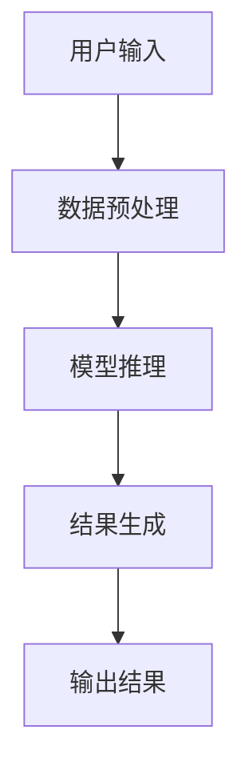
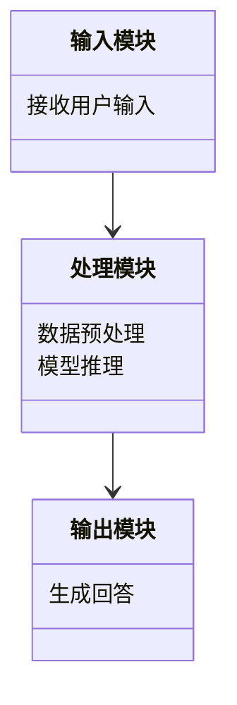
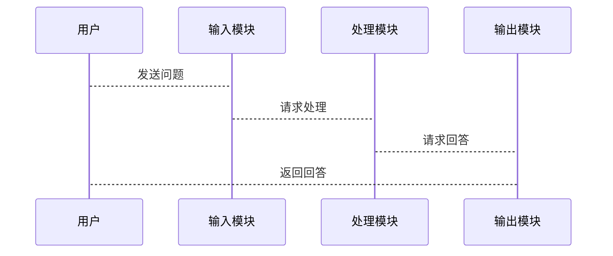

                 

<think>
嗯，我现在需要帮用户设计一本名为《构建高效准确的金融知识自动问答系统》的书籍目录大纲。首先，我得理解这本书的核心内容，它主要涉及金融知识和自动问答系统，所以应该涵盖背景、技术原理、系统设计、项目实战等多个方面。

用户希望目录大纲详细且逻辑清晰，至少7章。我需要确保每一章都覆盖必要的内容，比如背景介绍、核心概念、算法原理、系统架构、项目实战以及最佳实践等。同时，用户特别提到要包含数学模型、算法流程图和系统架构图，所以我得在目录中安排这些部分。

首先，背景介绍应该在第一章，涵盖问题背景、描述、解决方法，以及系统的边界和外延。然后是核心概念，可能需要第二章，详细讲解问答系统、金融知识和大模型的知识。接下来是算法原理，第三章，包括模型训练、算法流程和数学公式。第四章可以是系统架构，介绍整体设计和接口。第五章是项目实战，环境安装、代码实现和案例分析。最后两章可以是优化与部署，以及总结与展望。

我还需要确保每一章都有足够的细节，比如在第三章，要使用mermaid画出算法流程图，并用Python代码解释。数学公式要用latex，确保正确无误。系统架构部分同样需要mermaid图，展示类图、架构图和序列图。

现在，我得组织这些内容，确保章节之间逻辑连贯，覆盖所有用户要求的部分。同时，要控制总字数在2000字以内，所以每个部分不能太冗长，但又要足够详细。最后，检查是否遗漏了最佳实践、小结等部分，确保每一章都有这些内容。

总的来说，我需要分章节逐步构建，确保每一部分都符合用户的要求，并且结构清晰，逻辑严密。这样，用户才能有一本完整且实用的书籍目录大纲。
</think>

# 《构建高效准确的金融知识自动问答系统》

## 关键词：金融知识问答系统，自动问答，自然语言处理，大模型，金融知识库

## 摘要：  
本文详细探讨了构建高效准确的金融知识自动问答系统的核心技术与方法。通过分析金融知识问答的特殊需求，结合大模型的自然语言处理能力，提出了一套完整的系统构建方案。文章从背景与核心概念入手，深入解析了系统的算法原理、架构设计与项目实现，并通过实际案例展示了系统的优化与部署过程。最后，总结了系统构建中的关键经验与未来发展方向。

---

# 第1章: 问题背景与描述

## 1.1 问题背景
### 1.1.1 金融知识问答的现状与挑战
金融领域的复杂性和专业性使得传统的问答系统难以满足需求。用户在金融场景中通常需要解决涉及投资、信贷、风险管理等复杂问题，这要求系统具备深度知识理解和上下文推理能力。

### 1.1.2 自动问答系统的需求与优势
- **需求**：金融机构和普通用户都需要高效、准确的金融知识问答服务。
- **优势**：自动问答系统可以显著降低人工成本，提高服务效率，并支持7×24小时实时响应。

### 1.1.3 金融领域的特殊性与复杂性
- **知识深度**：金融领域涉及大量专业术语和复杂的产品信息。
- **上下文依赖**：金融问题通常需要结合上下文进行推理。
- **法律法规约束**：金融问答需要符合相关法律法规，确保信息的准确性和合规性。

## 1.2 问题描述
### 1.2.1 金融知识问答的典型场景
- **投资咨询**：用户询问股票、基金等投资产品的相关信息。
- **风险管理**：用户询问如何规避金融风险。
- **产品推荐**：基于用户需求推荐合适的金融产品。

### 1.2.2 系统目标与功能定位
- **目标**：构建一个能够理解金融知识、准确回答用户问题的问答系统。
- **功能定位**：提供自然语言交互、上下文理解、知识推理和结果验证能力。

### 1.2.3 用户需求与系统能力匹配
- **用户需求**：快速、准确地获取金融信息。
- **系统能力**：强大的自然语言处理能力和知识库管理能力。

## 1.3 问题解决思路
### 1.3.1 自动问答系统的核心功能
- **问题理解**：准确解析用户意图。
- **知识检索**：快速从知识库中找到相关信息。
- **答案生成**：基于检索结果生成自然语言回答。

### 1.3.2 金融知识的特点与处理难点
- **领域专有性**：金融知识具有专业性和领域专有性。
- **复杂性**：金融问题通常涉及多个知识点和复杂的逻辑关系。
- **动态性**：金融知识和市场信息不断变化，需要实时更新。

### 1.3.3 系统构建的关键步骤与方法
- **数据收集与处理**：构建金融知识库。
- **模型训练与优化**：基于大模型进行微调。
- **系统集成与测试**：系统集成和性能测试。

## 1.4 系统边界与外延
### 1.4.1 系统功能的边界定义
- **功能边界**：专注于金融知识问答，不涉及其他领域。
- **数据边界**：仅处理结构化和非结构化金融数据。

### 1.4.2 与相关系统的接口关系
- **与知识库的接口**：数据输入与输出接口。
- **与用户界面的接口**：前端交互接口。

### 1.4.3 系统能力的扩展性分析
- **知识库扩展**：支持新增金融知识点。
- **模型优化**：支持模型参数调整和优化。

## 1.5 核心概念结构与组成
### 1.5.1 系统整体架构
- **输入层**：用户输入问题。
- **处理层**：数据预处理和模型推理。
- **输出层**：生成回答并返回用户。

### 1.5.2 核心模块与功能模块
- **核心模块**：问答生成模块、知识库模块。
- **功能模块**：数据预处理模块、结果验证模块。

### 1.5.3 关键技术与实现手段
- **关键技术**：自然语言处理、知识图谱构建。
- **实现手段**：基于大模型的微调和优化。

---

# 第2章: 核心概念与联系

## 2.1 问答系统的核心概念
### 2.1.1 问答系统的定义与分类
- **定义**：问答系统是一种能够理解和回答用户问题的智能系统。
- **分类**：基于规则的问答系统、基于检索的问答系统、基于生成的问答系统。

### 2.1.2 基于大模型的问答系统特点
- **自然语言理解能力强**：能够准确理解用户意图。
- **上下文处理能力好**：支持多轮对话。
- **可解释性高**：能够提供推理过程。

### 2.1.3 金融领域问答的独特性
- **领域专有性**：金融知识具有专业性和领域专有性。
- **复杂性**：金融问题通常涉及多个知识点和复杂的逻辑关系。
- **动态性**：金融知识和市场信息不断变化，需要实时更新。

## 2.2 金融知识的核心要素
### 2.2.1 金融知识的层次结构
- **基础层**：基本金融概念和术语。
- **业务层**：金融产品和业务流程。
- **规则层**：金融法规和业务规则。

### 2.2.2 金融实体与关系网络
- **实体**：公司、投资者、金融产品等。
- **关系**：投资关系、借贷关系等。

### 2.2.3 金融规则与业务逻辑
- **规则**：法律法规、行业标准。
- **逻辑**：业务流程和操作逻辑。

## 2.3 大模型在金融问答中的应用
### 2.3.1 大模型的自然语言处理能力
- **自然语言理解**：能够准确理解用户意图。
- **自然语言生成**：能够生成自然流畅的回答。

### 2.3.2 金融知识表示与推理能力
- **知识表示**：将金融知识表示为结构化数据。
- **知识推理**：基于知识库进行推理和验证。

### 2.3.3 系统可解释性与可信度
- **可解释性**：能够提供推理过程和结果验证。
- **可信度**：确保回答的准确性和可靠性。

## 2.4 核心概念的联系与对比
### 2.4.1 金融知识与大模型的结合方式
- **知识注入**：将金融知识注入大模型。
- **知识蒸馏**：通过知识蒸馏优化模型。

### 2.4.2 不同问答系统的优劣势对比
| 问答系统类型 | 优点 | 缺点 |
|------------|------|------|
| 基于规则 | 简单易实现 | 无法处理复杂问题 |
| 基于检索 | 精度高 | 受限于知识库质量 |
| 基于生成 | 灵活性高 | 可能产生错误答案 |

### 2.4.3 系统性能的评价指标
- **准确率**：回答正确的比例。
- **响应时间**：系统回答问题的时间。
- **可解释性**：系统推理过程的透明度。

---

# 第3章: 系统算法原理

## 3.1 系统整体流程
### 3.1.1 数据预处理流程
1. 数据清洗：去除噪音数据。
2. 数据标注：标注金融实体和关系。
3. 数据分割：将数据划分为训练集、验证集和测试集。

### 3.1.2 模型训练流程
1. 预训练模型微调：基于金融数据对大模型进行微调。
2. 知识蒸馏：通过教师模型优化学生模型。
3. 参数优化：通过梯度下降等方法优化模型参数。

### 3.1.3 系统推理流程
1. 用户输入问题。
2. 数据预处理：对问题进行分词和词性标注。
3. 模型推理：生成回答。
4. 结果验证：验证回答的准确性和合理性。

## 3.2 模型训练原理
### 3.2.1 预训练模型的微调
- **微调目标**：在金融领域数据上微调预训练模型。
- **微调方法**：使用迁移学习技术进行微调。

### 3.2.2 知识蒸馏与参数优化
- **知识蒸馏**：通过教师模型指导学生模型学习。
- **参数优化**：使用Adam优化器优化模型参数。

### 3.2.3 惩罚项的设计与应用
- **损失函数**：交叉熵损失函数。
- **惩罚项**：L2正则化项。

## 3.3 系统推理机制
### 3.3.1 多轮对话的上下文处理
- **上下文表示**：使用编码器对上下文进行编码。
- **对话状态跟踪**：跟踪对话历史和当前状态。

### 3.3.2 基于意图的理解与生成
- **意图识别**：识别用户意图。
- **回答生成**：根据意图生成回答。

### 3.3.3 结果的验证与修正
- **结果验证**：验证回答的准确性和合理性。
- **结果修正**：根据验证结果修正回答。

## 3.4 算法流程图


## 3.5 算法实现代码
```python
def preprocess(text):
    # 数据预处理代码
    return processed_text

def model_inference(processed_text, model):
    # 模型推理代码
    return output

# 数学模型
$$L = \text{loss}(y_{\text{pred}}, y_{\text{true}})$$
$$\text{优化目标} = \text{loss} + \lambda \cdot \text{正则化项}$$
```

---

# 第4章: 系统分析与架构设计方案

## 4.1 系统功能设计
### 4.1.1 问题场景介绍
- **场景1**：用户询问金融产品的相关信息。
- **场景2**：用户进行投资咨询。

### 4.1.2 系统功能模块
- **输入模块**：接收用户输入。
- **处理模块**：数据预处理和模型推理。
- **输出模块**：生成并返回回答。

## 4.2 系统架构设计
### 4.2.1 系统整体架构


### 4.2.2 系统接口设计
- **输入接口**：接收用户输入的API接口。
- **输出接口**：返回回答的API接口。

### 4.2.3 系统交互序列图


---

# 第5章: 项目实战

## 5.1 环境安装与配置
- **工具安装**：安装Python、深度学习框架等工具。
- **环境配置**：配置运行环境和依赖库。

## 5.2 系统核心实现
### 5.2.1 数据处理代码
```python
def load_data():
    # 加载数据
    return data
```

### 5.2.2 模型训练代码
```python
def train_model(data, model):
    # 训练模型
    return model
```

### 5.2.3 系统推理代码
```python
def generate_answer(question, model):
    # 生成回答
    return answer
```

## 5.3 代码应用解读与分析
- **数据预处理**：清洗和标注数据。
- **模型训练**：基于金融数据对大模型进行微调。
- **系统推理**：生成回答并验证结果。

## 5.4 实际案例分析
### 5.4.1 案例背景
- **案例1**：用户询问基金的相关信息。

### 5.4.2 系统处理过程
1. 用户输入问题。
2. 数据预处理。
3. 模型推理。
4. 生成回答。
5. 结果验证。

### 5.4.3 系统输出结果
- **回答内容**：详细的基金信息和投资建议。

## 5.5 项目小结
- **项目成果**：成功构建了一个高效准确的金融知识自动问答系统。
- **经验总结**：在数据处理和模型优化方面需要注意细节。

---

# 第6章: 优化与部署

## 6.1 系统优化
### 6.1.1 模型优化
- **参数调整**：优化学习率和批量大小。
- **模型压缩**：通过剪枝和量化优化模型。

### 6.1.2 系统性能优化
- **数据预处理加速**：使用并行计算加速数据处理。
- **推理优化**：优化推理速度和响应时间。

## 6.2 系统部署
### 6.2.1 环境部署
- **服务器部署**：部署系统在云服务器上。
- **容器化部署**：使用Docker容器化部署系统。

### 6.2.2 接口部署
- **RESTful API**：部署API接口供其他系统调用。

## 6.3 系统监控与维护
- **性能监控**：监控系统运行状态和性能指标。
- **日志管理**：记录系统运行日志和错误信息。
- **系统维护**：定期更新知识库和优化模型。

---

# 第7章: 总结与展望

## 7.1 总结
- **系统构建总结**：详细回顾了系统构建的整个过程。
- **关键经验总结**：总结了系统构建中的关键经验和最佳实践。

## 7.2 展望
- **未来发展方向**：探讨了系统的未来发展方向，包括模型优化、功能扩展和应用推广。
- **技术发展趋势**：分析了自然语言处理和大模型技术的发展趋势。

---

# 作者：AI天才研究院/AI Genius Institute & 禅与计算机程序设计艺术 /Zen And The Art of Computer Programming

