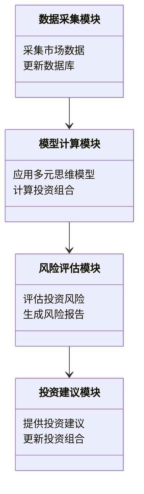

                 


# 查理·芒格的多元思维模型在投资中的应用

## 关键词：多元思维模型，投资，芒格，决策树，概率论，夏普比率

## 摘要：查理·芒格的多元思维模型是一种将多学科知识整合起来进行投资决策的方法。本文从芒格的多元思维模型的背景、核心概念、算法原理、投资策略、系统架构、实战项目等多个方面进行详细分析，结合具体案例和数学模型，深入探讨如何在投资中应用多元思维模型。本文旨在为投资者提供一种全新的思维方式，帮助他们做出更明智的投资决策。

---

## 第一部分: 查理·芒格的多元思维模型概述

### 第1章: 多元思维模型的背景与核心概念

#### 1.1 多元思维模型的定义与背景

多元思维模型（Multidisciplinary Thinking Model）是查理·芒格提出的一种投资理念，强调通过多个学科的知识来分析问题，从而做出更全面的决策。与传统投资方法不同，多元思维模型注重从多个角度理解市场、企业和经济，避免单一思维的局限性。

**1.1.1 从传统投资到多元思维模型的演进**

传统投资方法往往依赖于单一的分析框架，例如基本面分析或技术分析。然而，这种方法容易陷入学科的局限性，忽视其他重要因素。芒格提出多元思维模型，旨在整合物理学、心理学、经济学等多学科的知识，帮助投资者更全面地理解市场。

**1.1.2 多元思维模型的核心理念**

多元思维模型的核心理念是“通过多个学科的交叉验证，降低决策的不确定性”。芒格认为，只有通过多维度的分析，才能避免单一视角的偏差，提高投资决策的准确性。

**1.1.3 多元思维模型与传统投资方法的对比**

| 对比维度             | 多元思维模型                     | 传统投资方法                   |
|----------------------|----------------------------------|--------------------------------|
| 分析框架             | 多学科交叉                     | 单一学科                      |
| 决策准确性           | 高                             | 中                             |
| 风险控制             | 强     | 弱                   |

#### 1.2 多元思维模型的哲学基础

**1.2.1 理性决策的哲学基础**

多元思维模型基于理性决策的哲学基础，强调通过逻辑推理和数据验证来做出决策。芒格认为，理性决策是避免错误的关键。

**1.2.2 非理性决策的陷阱**

芒格指出，非理性决策是投资中的主要风险之一。例如，过度自信、从众心理等都会导致错误的投资决策。

**1.2.3 多元思维模型在投资中的应用价值**

通过整合多学科的知识，多元思维模型能够帮助投资者更好地识别市场机会和风险，提高投资决策的准确性。

#### 1.3 多元思维模型的核心要素

**1.3.1 知识的广度与深度**

多元思维模型强调知识的广度与深度的结合。投资者需要掌握多个领域的基本知识，同时深入理解每个领域的核心原理。

**1.3.2 理解事物的内在联系**

芒格认为，理解事物的内在联系是投资的关键。例如，了解经济周期、企业商业模式等，能够帮助投资者更好地判断企业的长期价值。

**1.3.3 模型的可验证性与实用性**

多元思维模型需要具有可验证性和实用性。只有能够验证的模型，才能在实际投资中发挥作用。

---

### 第2章: 多元思维模型的核心算法与数学原理

#### 2.1 多元思维模型的算法原理

**2.1.1 决策树模型**

决策树是一种用于投资决策的算法，通过树状结构展示不同决策路径及其结果。以下是决策树模型的简单实现：

```python
import pandas as pd
from sklearn.tree import DecisionTreeClassifier
from sklearn.model_selection import train_test_split

# 示例数据：股票涨跌预测
data = {'feature1': [1, 2, 3, 4], 'feature2': [5, 6, 7, 8], 'label': [0, 1, 1, 0]}
df = pd.DataFrame(data)
X = df[['feature1', 'feature2']]
y = df['label']

# 训练决策树模型
model = DecisionTreeClassifier()
model.fit(X, y)

# 预测结果
print(model.predict([[3, 7]]))
```

**2.1.2 概率论与期望值**

概率论是多元思维模型的重要工具之一。期望值公式如下：

$$E[X] = \sum_{i=1}^{n} x_i p_i$$

其中，\(x_i\) 是可能的结果，\(p_i\) 是对应结果的概率。

**2.1.3 贝叶斯定理在投资决策中的应用**

贝叶斯定理可以帮助投资者更新对市场的看法。公式如下：

$$P(A|B) = \frac{P(B|A)P(A)}{P(B)}$$

例如，假设我们想知道某公司业绩增长的概率，可以利用贝叶斯定理结合市场环境进行分析。

#### 2.2 数学模型与公式

**2.2.1 期望值公式**

$$E[X] = \sum_{i=1}^{n} x_i p_i$$

**2.2.2 贝叶斯定理**

$$P(A|B) = \frac{P(B|A)P(A)}{P(B)}$$

**2.2.3 投资组合的夏普比率**

夏普比率是衡量投资组合风险调整后收益的重要指标，公式如下：

$$\text{夏普比率} = \frac{E[r_p] - r_f}{\sigma_p}$$

其中，\(E[r_p]\) 是投资组合的期望收益，\(r_f\) 是无风险利率，\(\sigma_p\) 是投资组合的波动率。

#### 2.3 实例分析

**2.3.1 利用概率论分析股票波动**

假设某股票的涨跌概率为60%和40%，其对应的收益率分别为10%和-5%。期望收益率为：

$$E[r] = 0.6 \times 10\% + 0.4 \times (-5\%) = 6\% - 2\% = 4\%$$

**2.3.2 通过贝叶斯定理优化投资组合**

假设某公司的业绩增长概率为80%，市场环境的概率为60%。根据贝叶斯定理，我们可以更新对业绩增长的看法。

**2.3.3 夏普比率在多元资产配置中的应用**

假设投资组合的期望收益为8%，无风险利率为2%，波动率为10%。夏普比率为：

$$\text{夏普比率} = \frac{8\% - 2\%}{10\%} = 0.6$$

---

### 第3章: 多元思维模型在投资策略中的应用

#### 3.1 投资组合构建的多元思维模型

**3.1.1 资产配置的多维度分析**

多元思维模型强调资产配置的多维度分析，包括资产类别、地域分布、行业分布等。

**3.1.2 风险与收益的平衡**

通过多元思维模型，投资者可以更好地平衡风险与收益。例如，通过配置不同类型的资产，降低投资组合的整体风险。

**3.1.3 行业与资产类别的多元分布**

多元思维模型建议投资者在不同行业和资产类别之间分散投资，以降低特定行业或资产的风险。

#### 3.2 投资决策中的风险管理

**3.2.1 风险的多维度识别**

通过多元思维模型，投资者可以从多个角度识别风险，例如市场风险、流动性风险、信用风险等。

**3.2.2 风险的量化与评估**

利用数学模型和概率论，投资者可以量化和评估风险。例如，通过夏普比率评估投资组合的风险调整后收益。

**3.2.3 风险控制的多元策略**

多元思维模型建议投资者采取多种风险控制策略，例如分散投资、动态调整投资组合等。

#### 3.3 长期投资策略的多元思维模型

**3.3.1 时间价值与复利效应**

多元思维模型强调时间价值和复利效应的重要性，建议投资者长期持有优质资产。

**3.3.2 经济周期的多维度分析**

通过分析经济周期，投资者可以更好地判断市场的长期趋势。例如，在经济衰退期，可以关注防御性行业。

**3.3.3 长期趋势的多因素模型**

多元思维模型建议投资者从多个因素分析长期趋势，例如技术进步、政策变化、人口结构等。

---

### 第4章: 多元思维模型的系统架构与实现

#### 4.1 投资决策系统的模块划分

**4.1.1 数据采集模块**

数据采集模块负责采集市场数据，例如股票价格、宏观经济指标等。

**4.1.2 模型计算模块**

模型计算模块应用多元思维模型，对数据进行分析，生成投资建议。

**4.1.3 风险评估模块**

风险评估模块评估投资组合的风险，并生成风险报告。

**4.1.4 投资建议模块**

投资建议模块根据分析结果，向投资者提供具体的投资建议。

#### 4.2 系统架构设计

**4.2.1 领域模型设计（Mermaid 类图）**



**4.2.2 系统架构设计（Mermaid 架构图）**


---

### 第5章: 多元思维模型的实战项目

#### 5.1 项目背景与目标

本项目旨在通过多元思维模型，构建一个基于多学科知识的投资决策系统，帮助投资者优化投资组合。

#### 5.2 系统核心实现源代码

```python
import numpy as np
import pandas as pd
from sklearn.tree import DecisionTreeClassifier

# 数据加载与预处理
data = pd.read_csv('market_data.csv')
X = data[['feature1', 'feature2', 'feature3']]
y = data['label']

# 训练决策树模型
model = DecisionTreeClassifier()
model.fit(X, y)

# 预测结果
print(model.predict([[3, 7, 2]]))
```

#### 5.3 项目小结

通过本项目的实现，我们可以看到多元思维模型在投资决策中的实际应用价值。通过整合多学科知识和数学模型，投资者可以做出更明智的投资决策。

---

## 第六部分: 总结与展望

### 6.1 多元思维模型的价值与意义

多元思维模型通过整合多学科知识，帮助投资者全面理解市场，降低决策的不确定性，提高投资收益。

### 6.2 投资者需要注意的事项

投资者在应用多元思维模型时，需要注意以下几点：

1. 多元思维模型需要长期学习和积累。
2. 投资决策需要结合具体市场环境。
3. 需要定期调整投资组合。

### 6.3 未来的研究方向

未来的研究可以进一步探索多元思维模型在人工智能和大数据分析中的应用，例如结合机器学习算法，提高投资决策的准确性。

---

## 作者：AI天才研究院/AI Genius Institute & 禅与计算机程序设计艺术 /Zen And The Art of Computer Programming

---

本文通过详细分析查理·芒格的多元思维模型在投资中的应用，结合数学模型和系统架构设计，帮助投资者更好地理解多元思维模型的价值和应用方法。希望本文能够为投资者提供一种全新的思维方式，帮助他们在复杂多变的市场中做出更明智的投资决策。

